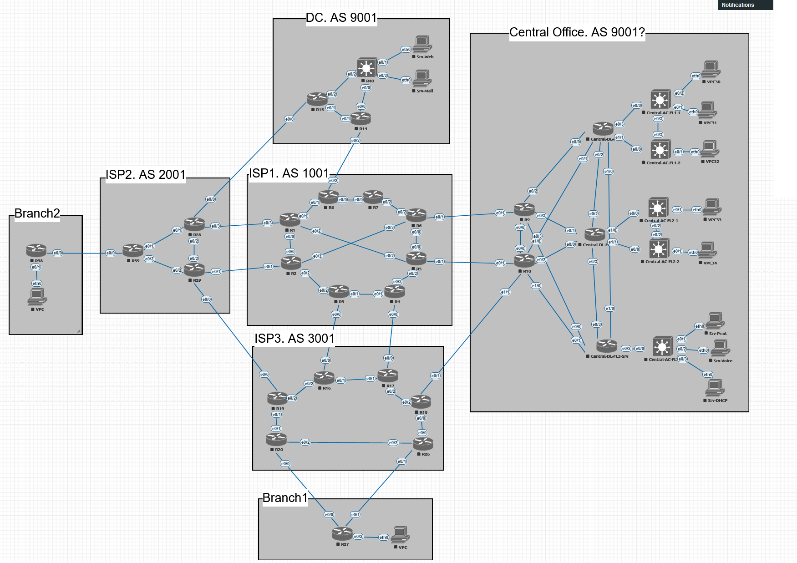
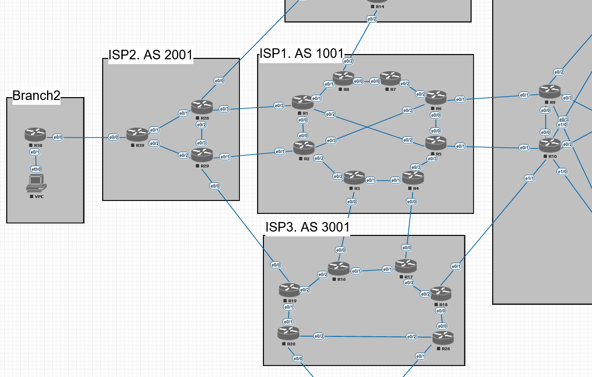
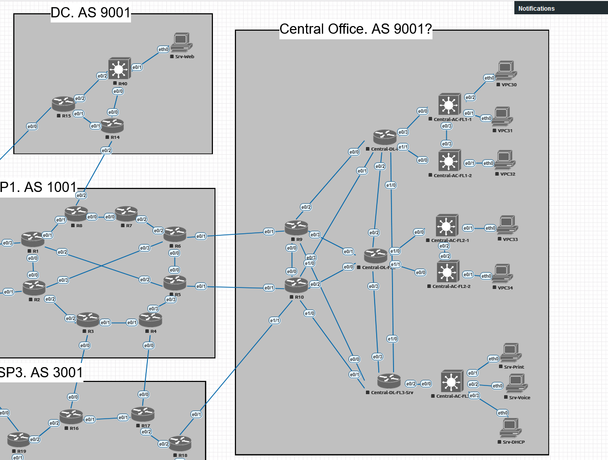
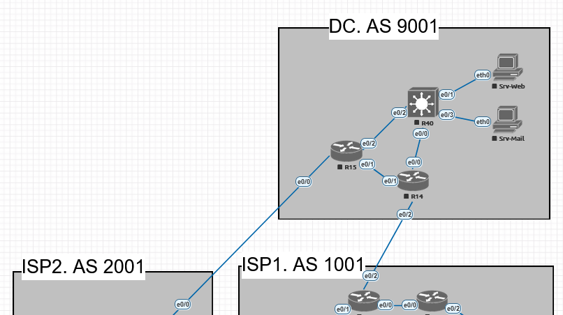
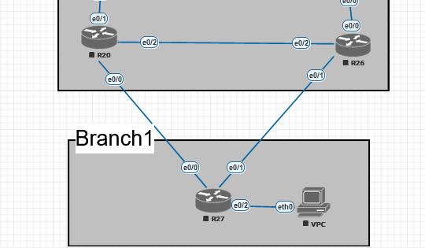
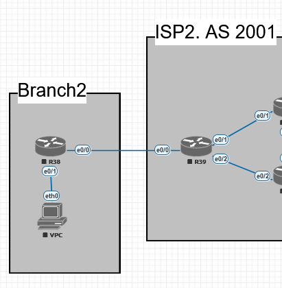

# Проектная работа

## Структура

1. Общая схема:
   

   
   Можем ли мы разделить автономную систему 9001 на 2 географические области?

2. Сеть из 3 провайдеров.
   

   
   1. Каждый провайдер имеет свою автономную систему.
   
   2. Внутри автономных систем находятся маршутизаторы, которые обеспечивают отказоустойчивость.
   
   3. Для внутренней связи используется протокол динамической маршрутизации IS-IS.

3. Сеть центрального офиса компании GrowWide.
   

   
   1. Компания владеет своей автономной системой.
   
   2. Ядро сети подключено к провайдерам. Реализована отказоустойчивость.
   
   3. К ядру сети подключены маршутизаторы распределения.
   
   4. К маршрутизаторам распределения подключены L3-коммутаторы доступа.
   
   5. В рамках сети действует протокол OSPF.
   
   6. Site-to-site VPN.
   
   7. VPN-шлюз Remote-Access VPN.

4. Сеть в дата-центре 
   

   
   1. Подключение через двух провайдеров.
   
   2. DMZ-сеть для серверов.
   
   3. Site-to-Site VPN.

5. Сеть необольшого регионального офиса без автономной системы.
   

   
   1. Выход через два линка. 
   2. Site-to-Site VPN.

6. Сеть еще одного небольшого офиса с уже использующейся в остальной сети адресацией.
   

   
   1. Реализация случая, когда нужно объединить в подсети с одинаковой адресацией.
   
   2. Лучший вариант - адресацию поменять, но для работы реализуем такой экстренный сценарий.
   
   3. Site-to-Site VPN. 

8. DHCP
   
   1. Вариант 1. Сделать централизованный DHCP-сервер.
      
      1. При потере связи с центральным офисом клиенты в регионах не получат адресов.
      
      2. Если в регионах использовать резервные DHCP на период недоступности центрального офиса - возможны конфликты адресов. Часть адресов будет получена из центра, часть от сервера.
      
      3. Выход - выдавать из разных диапазонов. Например диапазоны 1-126/24; 129-254/24.
      
      4. В этом случае в регионах по умолчанию DHCP отключен. Отслеживается основной DHCP и при его недоступности включается резервный.
      
      5. Вариант для курсовой интересный.
   
   2. Альтернативынй вариант 2. В каждом офисе свой DHCP-сервер.
      
      1. Нет зависимости от внешних каналов.
      
      2. Нет центральной точки со всей информацией.
      
      3. Но можно реализовать сбор через центральный SYSLOG-сервер.
   
   

## Этапы выполнения

1. Формирование схемы всей сети.

2. Адресация устройств, сегментов.

3. Назначение сетевым устройставам адресов управления.

4. Настройка устройств провайдеров.

5. Настройка устройств центрального офиса.

6. Настройка устройств дата-центра.

7. Разрешение для управления только через определенные интерфейсы и с определенных устройств.
