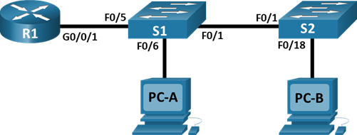

# Лабораторная работа "VLAN и маршрутизация между VLAN"

---

[Исходные данные](readme.md#%D0%B8%D1%81%D1%85%D0%BE%D0%B4%D0%BD%D1%8B%D0%B5-%D0%B4%D0%B0%D0%BD%D0%BD%D1%8B%D0%B5)

[Задачи](readme.md#objectives)

[Результирующие конфигурации устройств](configs)

---

## Исходные данные

### Топология



### Адресация

| Device | Interface | IP Address   | Subnet Mask   | Default Gateway |
| ------ | --------- | ------------ | ------------- | --------------- |
| R1     | G0/0/1.3  | 192.168.3.1  | 255.255.255.0 | N/A             |
| R1     | G0/0/1.4  | 192.168.4.1  | 255.255.255.0 | N/A             |
| R1     | G0/0/1.8  | N/A          | N/A           | N/A             |
| S1     | VLAN 3    | 192.168.3.11 | 255.255.255.0 | 192.168.3.1     |
| S2     | VLAN 3    | 192.168.3.12 | 255.255.255.0 | 192.168.3.1     |
| PC-A   | NIC       | 192.168.3.3  | 255.255.255.0 | 192.168.3.1     |
| PC-B   | NIC       | 192.168.4.3  | 255.255.255.0 | 192.168.4.1     |

### VLAN

| VLAN | Name       | Interface Assigned                                        |
| ---- | ---------- | --------------------------------------------------------- |
| 3    | Management | S1: VLAN 3 S2: VLAN 3 S1: F0/6                            |
| 4    | Operations | S2: F0/18                                                 |
| 7    | ParkingLot | S1: F0/2-4, F0/7-24, G0/1-2 S2: F0/2-17, F0/19-24, G0/1-2 |
| 8    | Native     | N/A                                                       |

## Objectives

[Part 1: Build the Network and Configure Basic Device Settings](readme.md#part-1-build-the-network-and-configure-basic-device-settings)

[Part 2: Create VLANs and Assign Switch Ports](readme.md#part-2-create-vlans-and-assign-switch-ports)

[Part 3: Configure an 802.1Q Trunk between the Switches](readme.md#part-3-configure-an-8021q-trunk-between-the-switches)

[Part 4: Configure Inter-VLAN Routing on the Router](readme.md#part-4-configure-inter-vlan-routing-on-the-router)

[Part 5: Verify Inter-VLAN Routing is working](readme.md#part-5-verify-inter-vlan-routing-is-working)

---

### Part 1: Build the Network and Configure Basic Device Settings

#### Step 1: Cable the network as shown in the topology.

Attach the devices as shown in the topology diagram, and cable as necessary.

#### Step 2: Configure basic settings for the router.

Open configuration window

a. Console into the router and enable privileged EXEC mode.

```
enable
```

b. Enter configuration mode.

```
configure terminal
```

c. Assign a device name to the router.

```
hostname R1
```

d. Disable DNS lookup to prevent the router from attempting to translate incorrectly
entered commands as though they were host names.

```
no ip domain-lookup
```

e. Assign **class** as the privileged EXEC encrypted password.

```
enable secret class
```

f. Assign **cisco** as the console password and enable login.

```
line con 0
password cisco
login
```

g. Assign **cisco** as the VTY password and enable login.

```
line vty 0 15
password cisco
login
```

h. Encrypt the plaintext passwords.

```
service password-encryption
```

i. Create a banner that warns anyone accessing the device that unauthorized access is prohibited.

```
banner motd "Unauthorized access is prohibited"
```

j. Save the running configuration to the startup configuration file.

```
do copy running-config startup-config
```

k. Set the clock on the router.

```
do clock set 20:00:00 05 mar 2021
```

**Note**: Use the question mark (**?**) to help with the correct sequence of parameters needed to execute this command.

Summary:

```
enable
configure terminal
hostname R1
no ip domain-lookup
enable secret class
line con 0
password cisco
login
line vty 0 15
password cisco
login
service password-encryption
banner motd "Unauthorized access is prohibited"
do copy running-config startup-config
do clock set 20:00:00 05 mar 2021
```

Close configuration window

#### Step 3: Configure basic settings for each switch.

Open configuration window

a. Console into the switch and enable privileged EXEC mode.

b. Enter configuration mode.

c. Assign a device name to the switch.

d. Disable DNS lookup to prevent the router from attempting to translate incorrectly
entered commands as though they were host names.

e. Assign **class** as the privileged EXEC encrypted password.

f. Assign **cisco** as the console password and enable login.

g. Assign **cisco** as the vty password and enable login.

h. Encrypt the plaintext passwords.

i. Create a banner that warns anyone accessing the device that unauthorized access is prohibited.

j. Set the clock on the switch.

**Note**: Use the question mark (**?**) to help with the correct sequence of parameters needed to execute this command.

k. Copy the running configuration to the startup configuration.

Close configuration window

Summary:

```
enable
configure terminal
hostname S2
no ip domain-lookup
enable secret class
line con 0
password cisco
login
line vty 0 15
password cisco
login
service password-encryption
banner motd "Unauthorized access is prohibited"
do copy running-config startup-config
do clock set 20:00:00 05 mar 2021
```

#### Step 4: Configure PC hosts.

Refer to the Addressing Table for PC host address information.

### Part 2: Create VLANs and Assign Switch Ports

In Part 2, you will create VLANs, as specified in the
table above, on both switches. You will then assign the VLANs to the
appropriate interface. The **show vlan** command is used to verify your configuration settings. Complete the following
tasks on each switch.

#### Step 1: Create VLANs on both switches.

Open configuration window

a. Create and name the required VLANs on each switch from the table above.

b. Configure the management interface and default gateway on each switch using the IP address information in the Addressing Table.

c. Assign all unused ports on both switches to the ParkingLot VLAN, configure them for
static access mode, and administratively deactivate them.

**Note**:
The interface range command is helpful to accomplish this task with as few
commands as necessary.

Summary S1:

```
vlan 3
name Management
vlan 4
name Operations
vlan 7
name ParkingLot
vlan 8
name Native
exit
interface vlan 3
ip address 192.168.3.11 255.255.255.0
exit
ip default-gateway 192.168.3.1


interface range fastEthernet 0/1-24
switchport mode access
switchport access vlan 7
shutdown

interface range gigabitEthernet 0/1-2
switchport mode access
switchport access vlan 7
shutdown
```

Summary S2:

```
vlan 3
name Management
vlan 4
name Operations
vlan 7
name ParkingLot
vlan 8
name Native
exit
interface vlan 3
ip address 192.168.3.12 255.255.255.0
exit
ip default-gateway 192.168.3.1


interface range fastEthernet 0/1-24
switchport mode access
switchport access vlan 7
shutdown

interface range gigabitEthernet 0/1-2
switchport mode access
switchport access vlan 7
shutdown
```

#### Step 2: Assign VLANs to the correct switch interfaces.

a. Assign used ports to the appropriate VLAN (specified in the VLAN table above) and
configure them for static access mode. Be sure to do this on both switches

Summary S1:

```
interface fastEthernet 0/6
switchport access vlan 3
no shutdown
```

Summary S2:

```
interface fastEthernet 0/18
switchport access vlan 4
no shutdown
```

b. Issue the **show vlan** **brief** command and verify that the VLANs are assigned to the correct interfaces.

### Part 3: Configure an 802.1Q Trunk between the Switches

In Part 3, you will manually configure interface F0/1 as a trunk.

#### Step 1: Manually configure trunk interface F0/1.

Open configuration window

a. Change the switchport mode on interface F0/1 to force trunking. Make sure to do this on both switches.

b. As a part of the trunk configuration, set the native VLAN to 8 on both switches.
You may see error messages temporarily while the two interfaces are configured
for different native VLANs.

c. As another part of trunk configuration, specify that VLANs 3, 4, and 8 are only
allowed to cross the trunk.

d. Issue the **show interfaces trunk** command to
verify trunking ports, the Native VLAN and allowed VLANs across the trunk.

Summary S1 and S2:

```
interface f0/1
switchport mode trunk
switchport trunk native vlan 8
switchport trunk allowed vlan 3,4,8
no shutdown
```

#### Step 2: Manually configure S1’s trunk interface F0/5

a. Configure the F0/5 on S1 with the same trunk parameters as F0/1. This is the trunk to the router.

b. Save the running configuration to the startup configuration file on S1 and S2.

c. Issue the **show interfaces trunk** command to verify trunking.

Summary S1:

```
interface f0/5
switchport mode trunk
switchport trunk native vlan 8
switchport trunk allowed vlan 3,4,8
no shutdown
```

#### Question:

Why does F0/5 not appear in the list of trunks? - Потому что с другой стороны порт погашен.

### Part 4: Configure Inter-VLAN Routing on the Router

a. Activate interface G0/0/1 on the router.

b. Configure sub-interfaces for each VLAN as specified in the IP addressing table. All sub-interfaces use 802.1Q encapsulation. Ensure the sub-interface for the native VLAN does not have an IP address assigned. Include a description for each sub-interface.

c. Use the **show ip interface brief** command to verify the sub-interfaces are operational.

Summary R1:

```
interface g0/0/1
no shutdown
interface g0/0/1.3
encapsulation dot1q 3
ip address 192.168.3.1 255.255.255.0
interface g0/0/1.4
encapsulation dot1q 4
ip address 192.168.4.1 255.255.255.0
interface g0/0/1.8
encapsulation dot1q 8 native
```

### Part 5: Verify Inter-VLAN Routing is working

#### Step 1: Complete the following tests from PC-A. All should be successful.

**Note**: You may have to disable the PC firewall for pings to be successful.

a. Ping from PC-A to its default gateway.

b. Ping from PC-A to PC-B

c. Ping from PC-A to S2

#### Step 2: Complete the following test from PC-B.

From the command prompt on PC-B, issue the tracert command
to the address of PC-A.

#### Question:

What intermediate IP addresses are shown in the results?

```
C:\>tracert 192.168.3.3

Tracing route to 192.168.3.3 over a maximum of 30 hops: 

  1   0 ms      1 ms      1 ms      192.168.4.1
  2   0 ms      0 ms      0 ms      192.168.3.3

Trace complete.
```
