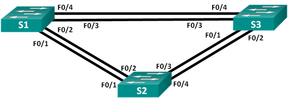
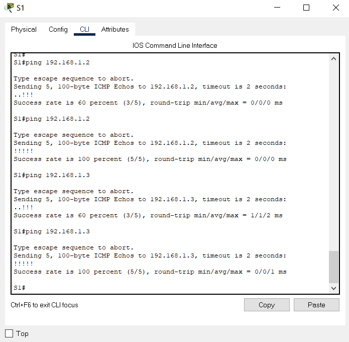
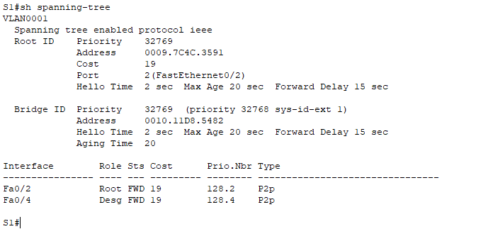
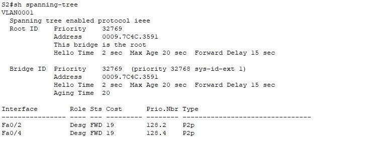
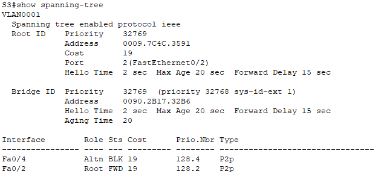
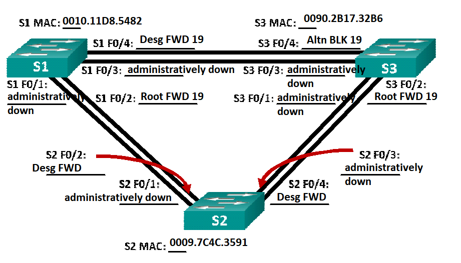

# Развертывание коммутируемой сети с резервными каналами

Исходные данные

Задачи

Результирующие конфигурации устройств

## Исходные данные

### Топология



### Таблица адресации

| Устройство | Интерфейс | IP-адрес    | Маска подсети |
| ---------- | --------- | ----------- | ------------- |
| S1         | VLAN 1    | 192.168.1.1 | 255.255.255.0 |
| S2         | VLAN 1    | 192.168.1.2 | 255.255.255.0 |
| S3         | VLAN 1    | 192.168.1.3 | 255.255.255.0 |

## Задачи

### Часть 1: Создание сети и настройка основных параметров устройства

В части 1 вам предстоит настроить топологию
сети и основные параметры маршрутизаторов.

**Шаг 1: Создайте сеть согласно топологии.**

Подключите устройства, как показано в топологии,
и подсоедините необходимые кабели.

**Шаг 2: Выполните инициализацию и перезагрузку
коммутаторов.**

Шаг 3: Настройте базовые параметры
каждого коммутатора.

a. Отключите поиск DNS.

b. Присвойте имена устройствам в соответствии
с топологией.

c. Назначьте **class** в качестве зашифрованного пароля доступа к привилегированному
режиму.

d. Назначьте **cisco** в качестве паролей консоли и VTY и активируйте
вход для консоли и VTY каналов.

e. Настройте logging synchronous для
консольного канала.

f. Настройте баннерное сообщение дня
(MOTD) для предупреждения пользователей о запрете несанкционированного
доступа.

g. Задайте IP-адрес, указанный в таблице
адресации для VLAN 1 на всех коммутаторах.

h. Скопируйте текущую конфигурацию в файл
загрузочной конфигурации.

Summary:

```
enable
configure terminal
no ip domain-lookup
hostname S1
enable secret class
line console 0
logging synchronous
password cisco
login
line vty 0 15
password cisco
login
banner motd #Authorized access only!#
interface vlan 1
ip address 192.168.1.1 255.255.255.0
no shutdown
```

```
enable
configure terminal
no ip domain-lookup
hostname S2
enable secret class
line console 0
logging synchronous
password cisco
login
line vty 0 15
password cisco
login
banner motd #Authorized access only!#
interface vlan 1
ip address 192.168.1.2 255.255.255.0
no shutdown
```

```
enable
configure terminal
no ip domain-lookup
hostname S3
enable secret class
line console 0
logging synchronous
password cisco
login
line vty 0 15
password cisco
login
banner motd #Authorized access only!#
interface vlan 1
ip address 192.168.1.3 255.255.255.0
no shutdown
```

**Шаг 4: Проверьте связь.**

Проверьте способность компьютеров
обмениваться эхо-запросами.




### Часть 2:    Определение корневого моста

**Шаг 1: Отключите все порты на
коммутаторах.**

```
interface range fa0/1-24
shutdown

interface range gi0/1-2
shutdown
```

**Шаг 2: Настройте подключенные порты в качестве
транковых.**

```
interface range fa0/1-4
switchport mode trunk
```

**Шаг 3: Включите порты F0/2 и F0/4 на
всех коммутаторах.**

```
interface fa0/2
no shutdown
interface fa0/4
no shutdown
```

**Шаг 4: Отобразите данные протокола spanning-tree.**








В схему ниже запишите роль и состояние
(Sts) активных портов на каждом коммутаторе в топологии.



Какой коммутатор является корневым мостом?

*S2*

Почему этот коммутатор был выбран протоколом
spanning-tree в качестве корневого моста?

*Priority мостов одинаков*

*Выбирается коммутатор с наименьшим MAC - S2*

Какие порты на коммутаторе являются
корневыми портами?

*S1 - F0/2; S3 - F0/2*

Какие порты на коммутаторе являются
назначенными портами?

*S1 - F0/4; S2 - F0/2,4*

Какой порт отображается в качестве
альтернативного и в настоящее время заблокирован?

*S3 - F0/4*

Почему протокол spanning-tree выбрал этот
порт в качестве невыделенного (заблокированного) порта?

*Поскольку Bridge ID у S1 меньше Bridge ID у S3, порт S1 назначается выделенным, а порт S3 переходит в заблокированное состояние*


### Часть 3:    Наблюдение за процессом выбора протоколом STP порта, исходя из стоимости портов
