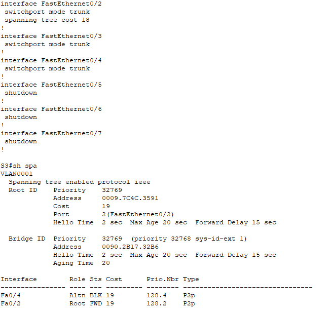
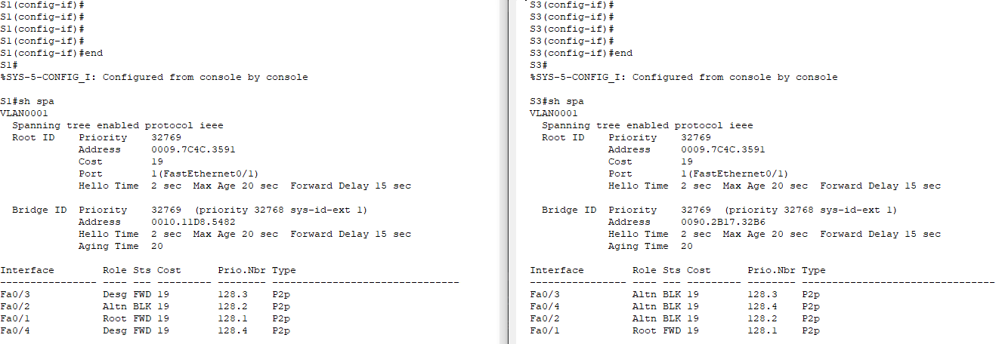

# Развертывание коммутируемой сети с резервными каналами

Исходные данные

Задачи

Результирующие конфигурации устройств

## Исходные данные

### Топология


### Таблица адресации

| Устройство | Интерфейс | IP-адрес    | Маска подсети |
| ---------- | --------- | ----------- | ------------- |
| S1         | VLAN 1    | 192.168.1.1 | 255.255.255.0 |
| S2         | VLAN 1    | 192.168.1.2 | 255.255.255.0 |
| S3         | VLAN 1    | 192.168.1.3 | 255.255.255.0 |

## Задачи

### Часть 1: Создание сети и настройка основных параметров устройства

В части 1 вам предстоит настроить топологию
сети и основные параметры маршрутизаторов.

**Шаг 1: Создайте сеть согласно топологии.**

Подключите устройства, как показано в топологии,
и подсоедините необходимые кабели.

**Шаг 2: Выполните инициализацию и перезагрузку
коммутаторов.**

Шаг 3: Настройте базовые параметры
каждого коммутатора.

a. Отключите поиск DNS.

b. Присвойте имена устройствам в соответствии
с топологией.

c. Назначьте **class** в качестве зашифрованного пароля доступа к привилегированному
режиму.

d. Назначьте **cisco** в качестве паролей консоли и VTY и активируйте
вход для консоли и VTY каналов.

e. Настройте logging synchronous для
консольного канала.

f. Настройте баннерное сообщение дня
(MOTD) для предупреждения пользователей о запрете несанкционированного
доступа.

g. Задайте IP-адрес, указанный в таблице
адресации для VLAN 1 на всех коммутаторах.

h. Скопируйте текущую конфигурацию в файл
загрузочной конфигурации.

Summary:

```
enable
configure terminal
no ip domain-lookup
hostname S1
enable secret class
line console 0
logging synchronous
password cisco
login
line vty 0 15
password cisco
login
banner motd #Authorized access only!#
interface vlan 1
ip address 192.168.1.1 255.255.255.0
no shutdown
```

```
enable
configure terminal
no ip domain-lookup
hostname S2
enable secret class
line console 0
logging synchronous
password cisco
login
line vty 0 15
password cisco
login
banner motd #Authorized access only!#
interface vlan 1
ip address 192.168.1.2 255.255.255.0
no shutdown
```

```
enable
configure terminal
no ip domain-lookup
hostname S3
enable secret class
line console 0
logging synchronous
password cisco
login
line vty 0 15
password cisco
login
banner motd #Authorized access only!#
interface vlan 1
ip address 192.168.1.3 255.255.255.0
no shutdown
```

**Шаг 4: Проверьте связь.**

Проверьте способность компьютеров
обмениваться эхо-запросами.


### Часть 2:    Определение корневого моста

**Шаг 1: Отключите все порты на
коммутаторах.**

```
interface range fa0/1-24
shutdown

interface range gi0/1-2
shutdown
```

**Шаг 2: Настройте подключенные порты в качестве
транковых.**

```
interface range fa0/1-4
switchport mode trunk
```

**Шаг 3: Включите порты F0/2 и F0/4 на
всех коммутаторах.**

```
interface fa0/2
no shutdown
interface fa0/4
no shutdown
```

**Шаг 4: Отобразите данные протокола spanning-tree.**


В схему ниже запишите роль и состояние
(Sts) активных портов на каждом коммутаторе в топологии.


Какой коммутатор является корневым мостом?

*S2*

Почему этот коммутатор был выбран протоколом
spanning-tree в качестве корневого моста?

*Priority мостов одинаков*

*Выбирается коммутатор с наименьшим MAC - S2*

Какие порты на коммутаторе являются
корневыми портами?

*S1 - F0/2; S3 - F0/2*

Какие порты на коммутаторе являются
назначенными портами?

*S1 - F0/4; S2 - F0/2,4*

Какой порт отображается в качестве
альтернативного и в настоящее время заблокирован?

*S3 - F0/4*

Почему протокол spanning-tree выбрал этот
порт в качестве невыделенного (заблокированного) порта?

1. *Стоимость до рута из этих конкурирующих портов одинакова и равна 38.* 

2. *Приоритеты мостов одинаковы.*

3. *Поэтому смотрим на MAC - побеждает S1 с наименьшим MAC, порт S3 блокируется.*

### Часть 3:    Наблюдение за процессом выбора протоколом STP порта, исходя из стоимости портов

**Шаг 1: Определите коммутатор с заблокированным
портом.**

При текущей конфигурации только один
коммутатор может содержать заблокированный протоколом STP порт. Выполните
команду **show spanning-tree** на обоих
коммутаторах некорневого моста.


**Шаг 2: Измените стоимость порта.**

Помимо заблокированного порта, единственным
активным портом на коммутаторе S3 является порт, выделенный в качестве
порта корневого моста. Уменьшите стоимость этого порта корневого моста до 18,
выполнив команду **spanning-tree cost 18** режима конфигурации интерфейса.

```
S3(config)#interface fa0/2
S3(config-if)#spanning-tree cost 18
```

**Шаг 3: Просмотрите изменения протокола
spanning-tree.**

*<u>**Packet Tracer 8.0.0.0212**</u>* - стоимость порта не изменилась (в т.ч. после перезагрузки, ожидания минуты):


Повторно выполните команду **show spanning-tree** на обоих
коммутаторах некорневого моста. Обратите внимание, что ранее заблокированный
порт (S1 – F0/4) теперь является назначенным портом, и протокол
spanning-tree теперь блокирует порт на другом коммутаторе некорневого моста (S3 –
F0/4).

Почему протокол spanning-tree заменяет ранее
заблокированный порт на назначенный порт и блокирует порт, который был
назначенным портом на другом коммутаторе?

<u>Вопрос остается открытым и требует проверки =)</u>

*Теоретическое объяснение*

1. *Стоимость пути из порта S3 Fa0/4 осталась прежней - 38.*

2. *Стоимость пути из порта S1 Fa0/4 стала 37.*

3. <u>Поэтому путь из S1 через S3 до рута короче, чем чем из S3 через S1. Путь лежит через порт S3 Fa0/4, поэтому он становится назначенным.</u>

**Шаг 4: Удалите изменения стоимости порта.**

S3(config)#interface fa0/2
S3(config-if)#no spanning-tree cost 

### Часть 4: Наблюдение за процессом выбора протоколом STP порта, исходя из приоритета портов

**a. Включите порты F0/1 и F0/3 на
всех коммутаторах.**

```
interface fa0/1
no shutdown
interface fa0/3
no shutdown
```

**b. Подождите 30 секунд, чтобы
протокол STP завершил процесс перевода порта, после чего выполните команду show spanning-tree на коммутаторах
некорневого моста.** 

Обратите внимание, что порт корневого моста переместился на
порт с меньшим номером, связанный с коммутатором корневого моста, и заблокировал
предыдущий порт корневого моста.



Какой порт выбран протоколом STP в качестве
порта корневого моста на каждом коммутаторе некорневого моста?

*Fa0/1*

Почему протокол STP выбрал эти порты в качестве
портов корневого моста на этих коммутаторах?

*Выбран порт с наименьшей комбинацией приоритета порта и номера порта*

### Вопросы для повторения

1. **Какое значение протокол STP
   использует первым после выбора корневого моста, чтобы определить выбор порта?**

*Приоритет порта*

2. **Если первое значение на двух портах
   одинаково, какое следующее значение будет использовать протокол STP при выборе
   порта?**

*Номер порта*

3. **Если оба значения на двух портах
   равны, каким будет следующее значение, которое использует протокол STP при
   выборе порта?**

**Нужна практическая проверка. Теоретически - стоимость. Выбирается наименьшая**
