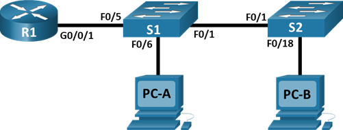

# Лабораторная работа "VLAN и маршрутизация между VLAN"

## Исходные данные

### Топология



### Адресация

| Device | Interface | IP Address   | Subnet Mask   | Default Gateway |
| ------ | --------- | ------------ | ------------- | --------------- |
| R1     | G0/0/1.3  | 192.168.3.1  | 255.255.255.0 | N/A             |
| R1     | G0/0/1.4  | 192.168.4.1  | 255.255.255.0 | N/A             |
| R1     | G0/0/1.8  | N/A          | N/A           | N/A             |
| S1     | VLAN 3    | 192.168.3.11 | 255.255.255.0 | 192.168.3.1     |
| S2     | VLAN 3    | 192.168.3.12 | 255.255.255.0 | 192.168.3.1     |
| PC-A   | NIC       | 192.168.3.3  | 255.255.255.0 | 192.168.3.1     |
| PC-B   | NIC       | 192.168.4.3  | 255.255.255.0 | 192.168.4.1     |

### VLAN

| VLAN | Name       | Interface Assigned                                        |
| ---- | ---------- | --------------------------------------------------------- |
| 3    | Management | S1: VLAN 3 S2: VLAN 3 S1: F0/6                            |
| 4    | Operations | S2: F0/18                                                 |
| 7    | ParkingLot | S1: F0/2-4, F0/7-24, G0/1-2 S2: F0/2-17, F0/19-24, G0/1-2 |
| 8    | Native     | N/A                                                       |

## Objectives

[Part 1: Build the Network and Configure Basic Device Settings](readme.md#part-1-build-the-network-and-configure-basic-device-settings)

[Part 2: Create VLANs and Assign Switch Ports](readme.md#part-2-create-vlans-and-assign-switch-ports)

[Part 3: Configure an 802.1Q Trunk between the Switches](/readme.md#part-3-configure-an-8021q-trunk-between-the-switches)

[Part 4: Configure Inter-VLAN Routing on the Router](https://github.com/eet1bfwn/OTUS-practice/blob/main/labs/lab02/readme.md#part-4-configure-inter-vlan-routing-on-the-router)

[Part 5: Verify Inter-VLAN Routing is working](https://github.com/eet1bfwn/OTUS-practice/blob/main/labs/lab02/readme.md#part-5-verify-inter-vlan-routing-is-working)

---


### Part 1: Build the Network and Configure Basic Device Settings


#### Step 1: Cable the network as shown in the topology.

Attach the devices as shown in the topology diagram, and cable as necessary.

#### Step 2: Configure basic settings for the router.

Open configuration window

a. Console into the router and enable privileged EXEC mode.

```
enable
```

b. Enter configuration mode.

```
configure terminal
```

c. Assign a device name to the router.

```
hostname R1
```

d. Disable DNS lookup to prevent the router from attempting to translate incorrectly
entered commands as though they were host names.

```
no ip domain-lookup
```

e. Assign **class** as the privileged EXEC encrypted password.

```
enable secret class
```

f. Assign **cisco** as the console password and enable login.

```
line con 0
password cisco
login
```

g. Assign **cisco** as the VTY password and enable login.

```
line vty 0 15
password cisco
login
```

h. Encrypt the plaintext passwords.

```
service password encryption
```

i. Create a banner that warns anyone accessing the device that unauthorized access is prohibited.

```
banner motd "Unauthorized access is prohibited"
```

j. Save the running configuration to the startup configuration file.

```
do copy running-config startup-config
```

k. Set the clock on the router.

```
clock set 20:00:00 05 mar 2021
```

**Note**: Use the question mark (**?**) to help with the correct sequence of parameters needed to execute this command.

Close configuration window

### Step 3: Configure basic

settings for each switch.

Open configuration window

a. Console
into the switch and enable privileged EXEC mode.

b. Enter
configuration mode.

c. Assign
a device name to the switch.

d. Disable
DNS lookup to prevent the router from attempting to translate incorrectly
entered commands as though they were host names.

e. Assign **class** as the privileged EXEC
encrypted password.

f. Assign **cisco** as the console password and
enable login.

g. Assign **cisco** as the vty password and enable
login.

h. Encrypt
the plaintext passwords.

i. Create a banner that warns anyone accessing the
device that unauthorized access is prohibited.

j. Set the clock on the switch.

**Note**: Use the
question mark (**?**) to help with the
correct sequence of parameters needed to execute this command.

k. Copy
the running configuration to the startup configuration.

Close configuration window

### Step 4: Configure PC hosts.

### Part 2: Create VLANs and Assign Switch Ports

### Part 3: Configure an 802.1Q Trunk between the Switches

### Part 4: Configure Inter-VLAN Routing on the Router

### Part 5: Verify Inter-VLAN Routing is working
