# DHCP and DHCPv6


[Implement DHCPv4](#Implement-DHCPv4)

[Configure DHCPv6](#Configure-DHCPv6)

# Implement DHCPv4

[Исходные данные](#%D0%B8%D1%81%D1%85%D0%BE%D0%B4%D0%BD%D1%8B%D0%B5-%D0%B4%D0%B0%D0%BD%D0%BD%D1%8B%D0%B5)

[Задачи](#задачи)

[Результирующие конфигурации устройств](configs)

# Исходные данные

## Topology


## Addressing Table

| Device | Interface   | IP Address   | Subnet Mask     | Default Gateway |
| ------ | ----------- | ------------ | --------------- | --------------- |
| R1     | G0/0/0      | 10.0.0.1     | 255.255.255.252 | 10.0.0.2        |
| R1     | G0/0/1      |              |                 | N/A             |
| R1     | G0/0/1.100  | 192.168.1.1  | 255.255.255.192 | N/A             |
| R1     | G0/0/1.200  | 192.168.1.65 | 255.255.255.224 | N/A             |
| R1     | G0/0/1.1000 | N/A          | N/A             | N/A             |
| R2     | G0/0/0      | 10.0.0.2     | 255.255.255.252 | 10.0.0.1        |
| R2     | G0/0/1      | 192.168.1.97 | 255.255.255.240 | N/A             |
| S1     | VLAN 1      | -            | -               |                 |
| S1     | VLAN 200    | 192.168.1.66 | 255.255.255.224 | 192.168.1.65    |
| S2     | VLAN 1      | 192.168.1.98 | 255.255.255.240 | 192.168.1.97    |
| PC-A   | NIC         | DHCP         | DHCP            | DHCP            |
| PC-B   | NIC         | DHCP         | DHCP            | DHCP            |

## VLAN Table

| VLAN | Name        | Interface Assigned          |
| ---- | ----------- | --------------------------- |
| 1    | N/A         | S2: F0/18                   |
| 100  | Clients     | S1: F0/6                    |
| 200  | Management  | S1: VLAN 200                |
| 999  | Parking_Lot | S1: F0/1-4, F0/7-24, G0/1-2 |
| 1000 | Native      | N/A                         |

# Задачи

[Part 1: Build the Network and Configure Basic Device Settings](#part-1-build-the-network-and-configure-basic-device-settings)

[Part 2: Configure and verify two DHCPv4 Servers on R1](#part-2-configure-and-verify-two-dhcpv4-servers-on-r1)

[Part 3: Configure and verify a DHCP Relay on R2](#part-3-configure-and-verify-a-dhcp-relay-on-r2)

## Background

/ Scenario

The Dynamic Host Configuration Protocol (DHCP) is a
network protocol that lets network administrators manage and automate the
assignment of IP addresses. Without DHCP for IPv4, the administrator must
manually assign and configure IP addresses, preferred DNS servers, and default
gateways. As the network grows in size, this becomes an administrative problem
when devices are moved from one internal network to another.

In this scenario, the company has grown in size, and the
network administrators can no longer assign IP addresses to devices manually.
Your job is to configure the R1 router to assign IPv4 addresses on two
different subnets.

**Note**: The routers used with CCNA hands-on labs are Cisco 4221 with Cisco IOS
XE Release 16.9.4 (universalk9 image). The switches used in the labs are Cisco Catalyst
2960s with Cisco IOS Release 15.2(2) (lanbasek9 image). Other routers,
switches, and Cisco IOS versions can be used. Depending on the model and Cisco
IOS version, the commands available and the output produced might vary from
what is shown in the labs. Refer to the Router Interface Summary Table at the
end of the lab for the correct interface identifiers.

**Note**: Ensure
that the routers and switches have been erased and have no startup
configurations. If you are unsure contact your instructor.

## Required

Resources

· 2 Routers (Cisco 4221 with Cisco IOS XE Release
16.9.4 universal image or comparable)

· 2 Switches (Cisco 2960 with Cisco IOS Release
15.2(2) lanbasek9 image or comparable)

· 2 PCs (Windows with a terminal emulation
program, such as Tera Term)

· Console cables to configure the Cisco IOS
devices via the console ports

· Ethernet cables as shown in the topology

# Instructions

## Part 1: Build the Network and Configure Basic Device Settings

In Part 1, you will set up the network topology and
configure basic settings on the PC hosts and switches.

### Step 1: Establish an addressing scheme

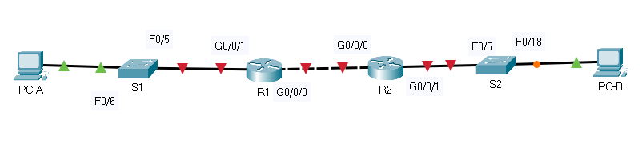

Subnet the network 192.168.1.0/24 to meet the following
requirements:

a. One subnet, “Subnet A”, supporting 58 hosts (the client VLAN at R1).

Subnet A:

```
192.168.1.0/26
192.168.1.0-192.168.1.63
```

Record the first IP address in the Addressing Table for R1
G0/0/1.100. Record the second IP address in the Address Table for S1 VLAN 200
and enter the associated default gateway.

```
VLAN 100 - клиенты. Поэтому делаем не так, как сказано - не назначаем 
S1 VLAN 200 адрес.
```

Subnet B:

```
192.168.1.64/27
192.168.1.64-192.168.1.95
```

Record the first IP address in the Addressing Table for R1
G0/0/1.200. Record the second IP address in the Address Table for S1 VLAN 1 and
enter the associated default gateway.

```
VLAN 200 - management. Поэтому делаем не так, как сказано - назначаем 
S1 VLAN 200 адрес, а не VLAN 1. 
```

c. One
subnet, “Subnet C”, supporting 12 hosts (the client network at R2).

Subnet C:

```
192.168.1.96/28
192.168.1.96-192.168.1.111
```

Record the first IP address in the Addressing Table for R2

### Step 2: Cable the network as shown in the topology.

Attach the devices as shown in the topology diagram, and
cable as necessary.

### Step 3: Configure basic settings for each router.

a. Assign a device name to the router.

b. Disable DNS lookup to prevent the router from attempting to translate incorrectly

c. Assign **class** as the privileged EXEC encrypted password.

d. Assign **cisco** as the console password and enable login.

e. Assign **cisco** as the VTY password and enable login.

f. Encrypt the plaintext passwords.

g. Create a banner that warns anyone accessing the device that unauthorized access is
prohibited.

h. Save the running configuration to the startup configuration file.

i. Set the clock on the router to today’s time and date.

**Note**: Use the question mark (**?**) to help with the correct sequence of parameters needed to execute this command.

Summary R1

```
hostname R1
no ip domain-lookup
enable secret class
line con 0
password cisco
login
line vty 0 15
password cisco
login
exit
service password-encryption
banner motd "Unauthorized access is prohibited"
end
copy running-config startup-config
clock set 23:25:00 mar 24 2021
```

Summary R2

```
hostname R2
no ip domain-lookup
enable secret class
line con 0
password cisco
login
line vty 0 15
password cisco
login
exit
service password-encryption
banner motd "Unauthorized access is prohibited"
end
copy running-config startup-config
clock set 23:25:00 mar 24 2021
```

### Step 4: Configure Inter-VLAN Routing on R1

a. Activate
interface G0/0/1 on the router.

b. Configure sub-interfaces for each VLAN as required by the IP addressing table. All
sub-interfaces use 802.1Q encapsulation and are assigned the first usable
address from the IP address pool you have calculated. Ensure the sub-interface
for the native VLAN does not have an IP address assigned. Include a description
for each sub-interface.

c. Verify the sub-interfaces are operational.

Summary R1:

```
int gi0/0/1.100
encapsulation dot1Q 100
description clients
ip addr 192.168.1.1 255.255.255.192

int gi0/0/1.200
encapsulation dot1Q 200
description clients
ip addr 192.168.1.65 255.255.255.224

int gi0/0/1.1000
encapsulation dot1Q 1000 native

int gi0/0/1
no shut
```

### Step 5: Configure G0/0/1 on R2, then G0/0/0 and static routing for both routers

a. Configure G0/0/1 on R2 with the first IP address of Subnet C you calculated earlier.

b. Configure interface G0/0/0 for each router based on the IP Addressing table above.

c. Configure a default route on each router pointed to the IP address of G0/0/0 on the other router.

d. Verify static routing is working by pinging R2’s G0/0/1 address from R1.

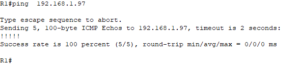

e. Save the running configuration to the startup configuration file.

Close configuration window

Summary R2:

```
int gi0/0/1
ip address 192.168.1.97 255.255.255.240
no shutdown

int gi0/0/0
ip address 10.0.0.2 255.255.255.252
no shut

exit 
ip route 0.0.0.0 0.0.0.0 10.0.0.1
copy running-config startup-config
```

Summary R1:

```
int gi0/0/0
ip address 10.0.0.1 255.255.255.252
no shut
exit 
ip route 0.0.0.0 0.0.0.0 10.0.0.2
copy running-config startup-config
```

### Step 6: Configure basic settings for each switch.

a. Assign a device name to the switch.

b. Disable DNS lookup to prevent the router from attempting to translate incorrectly entered commands as though they were host names.

c. Assign **class** as the privileged EXEC encrypted password.

d. Assign **cisco** as the console password and enable login.

e. Assign **cisco** as the VTY password and enable login.

f. Encrypt the plaintext passwords.

g. Create a banner that warns anyone accessing the device that unauthorized access is
prohibited.

h. Save the running configuration to the startup configuration file.

i. Set the clock on the switch to today’s time and date.

**Note**: Use the question mark (**?**) to help with the correct sequence of parameters needed to execute this command.

j. Copy the running configuration to the startup configuration.

Summary S1:

```
hostname S1
no ip domain-lookup
enable secret class
line con 0
password cisco
login
line vty 0 15
password cisco
login
exit
service password-encryption
banner motd "Unauthorized access is prohibited"
end
copy running-config startup-config
```

Summary S2:

```
hostname S2
no ip domain-lookup
enable secret class
line con 0
password cisco
login
line vty 0 15
password cisco
login
exit
service password-encryption
banner motd "Unauthorized access is prohibited"
end
copy running-config startup-config
```

### Step 7: Create VLANs on S1.

**Note**: S2 is only configured with basic settings.

a. Create and name the required VLANs on switch 1 from the table above.

b. Configure and activate the management interface on S1 (VLAN 200) using the second IP address from the subnet calculated earlier. Additionally, set the default
gateway on S1.

c. Configure and activate the management interface on S2 (VLAN 1) using the second IP
address from the subnet calculated earlier. Additionally, set the default
gateway on S2

d. Assign all unused ports on S1 to the Parking_Lot VLAN, configure them for static
access mode, and administratively deactivate them. On S2, administratively
deactivate all the unused ports.

**Note**: The interface range command is helpful to accomplish this task with as few commands as necessary.

```
Вопрос

Плохо ли, когда из access портов летят DTP кадры?
```

Summary S1:

```
vlan 100
name Clients
vlan 200
name Management
vlan 999
name Parking_Lot
vlan 1000
name Native
int vlan 200
no shutdown
ip address 192.168.1.66 255.255.255.224
exit
ip default-gateway 192.168.1.65
int range F0/1-4, F0/7-24, G0/1-2
switchport mode access
switchport access vlan 999
shutdown
```

Summary S2:

```
int vlan 1
no shutdown
ip addr 192.168.1.98 255.255.255.240
exit
ip default-gateway 192.168.1.97
```

### Step 8: Assign VLANs to the correct switch interfaces.

a. Assign used ports to the appropriate VLAN (specified in the VLAN table above) and
configure them for static access mode.

b. Verify that the VLANs are assigned to the correct interfaces.

Summary S1:

```
 int f0/6
 switchport mode access
 switchport access vlan 100
 end
 show vlan
```

#### Question:

Why is interface F0/5 listed under VLAN 1?

```
VLAN 1 - vlan по-умолчанию, в нем находятся все порты. Порт F0/5 мы не
переводили в другой vlan.
```

### Step 9: Manually configure S1’s interface F0/5 as an 802.1Q trunk.

a. Change the switchport mode on the interface to force trunking.

b. As a part of the trunk configuration, set the native VLAN to 1000.

c. As another part of trunk configuration, specify that VLANs 100, 200, and 1000 are
allowed to cross the trunk.

d. Save the running configuration to the startup configuration file.

e. Verify trunking status.

Summary S1:

```
int fa0/5
switchport mode trunk
switchport trunk native vlan 1000
switchport trunk allowed vlan 100,200,1000
end
copy running-config startup-config
show interfaces trunk
```

#### Question:

At this point, what IP address would the PC’s have if they were connected to the network using DHCP?

```
PC-A - находится в Vlan 100. Этот Vlan приходит на интерфейс R1 G0/0/1.
Для PC-A адресация должна быть в той же сети  - 192.168.1.0/26.
Аналогичная логика для PC-B - 192.168.1.96/28
```

## Part 2: Configure and verify two DHCPv4 Servers on R1

In Part 2, you will configure and verify a DHCPv4 Server on R1. The DHCPv4 server will service two subnets, Subnet A and Subnet C.

### Step 1: Configure R1 with DHCPv4 pools for the two supported subnets. Only the DHCP Pool for subnet A is given below

a. Exclude the first five useable addresses from each address pool.

b. Create the DHCP pool (Use a unique name for each pool).

c. Specify the network that this DHCP server is supporting.

d. Configure the domain name as ccna-lab.com

e. Configure the appropriate default gateway for each DHCP pool.

f. Configure the lease time for 2 days 12 hours and 30 minutes.

g. Next, configure the second DHCPv4 Pool using the pool name R2_Client_LAN and the
calculated network, default-router and use the same domain name and lease time
from the previous DHCP pool.

Summary R1:

```
ip dhcp excluded-address 192.168.1.1 192.168.1.5
ip dhcp excluded-address 192.168.1.65 192.168.1.69
ip dhcp excluded-address 192.168.1.97 192.168.1.101

ip dhcp pool Clients
network 192.168.1.0 255.255.255.192
domain-name ccna-lab.com
default-router 192.168.1.1
lease 2 12 30 

ip dhcp pool Management
network 192.168.1.64 255.255.255.224
domain-name ccna-lab.com
default-router 192.168.1.65
lease 2 12 30 

ip dhcp pool R2_Client_LAN
network 192.168.1.96 255.255.255.240
domain-name ccna-lab.com
default-router 192.168.1.97
lease 2 12 30
```

### Step 2: Save your configuration

Save the running configuration to the startup
configuration file.

### Step 3: Verify the DHCPv4 Server configuration

a. Issue the command **show ip dhcp pool** to examine the pool details.

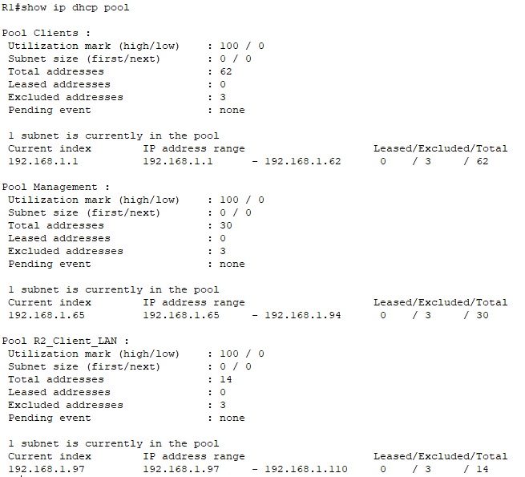

b. Issue the command **show ip dhcp bindings** to examine established DHCP address
assignments.

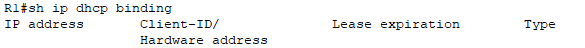

c. Issue the command **show ip dhcp server** **statistics** to examine DHCP messages.

```
PacketTracer не умеет задавать время аренды
```

# 

### Step 4: Attempt to acquire an IP address from DHCP on PC-A

a. Open a command prompt on PC-A and issue the command **ipconfig /renew**.

b. Once the renewal process is complete, issue the command **ipconfig** to view the
new IP information.

c. Test connectivity by pinging R1’s G0/0/1 interface IP address.

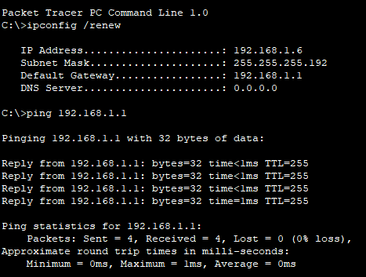

## Part 3: Configure and verify a DHCP Relay on R2

In Part 3, you will configure R2 to relay DHCP requests from the local area network on interface G0/0/1 to the DHCP server (R1).

### Step 1: Configure R2 as a DHCP relay agent for the LAN on G0/0/1

a. Configure the **ip helper-address** command on G0/0/1 specifying R1’s G0/0/0 IP address.

```
int gi0/0/1
ip helper-address 192.168.1.1
```

b. Save your configuration.

Close configuration window

### Step 2: Attempt to acquire an IP address from DHCP on PC-B

a. Open
a command prompt on PC-B and issue the command **ipconfig /renew**.

b. Once
the renewal process is complete, issue the command **ipconfig** to view the
new IP information.

c. Test
connectivity by pinging R1’s G0/0/1 interface IP address.

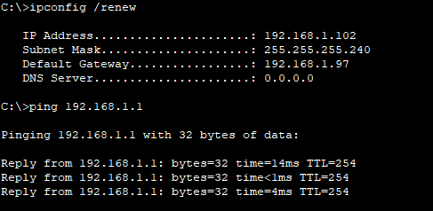

d. Issue
the **show ip dhcp binding** on R1 to
verify DHCP bindings.

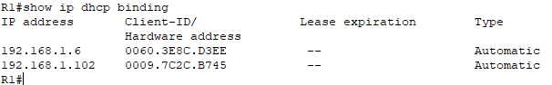

e. Issue the **show ip dhcp server statistics** on R1 and R2 to verify DHCP messages.

```
PacketTracer не знает таких команд
```

# Configure DHCPv6

[Исходные данные](#Topology)

[Задачи](#objectives)

[Результирующие конфигурации устройств](configs)

# Topology

Схема для PacketTracer:


Схема Termilab:

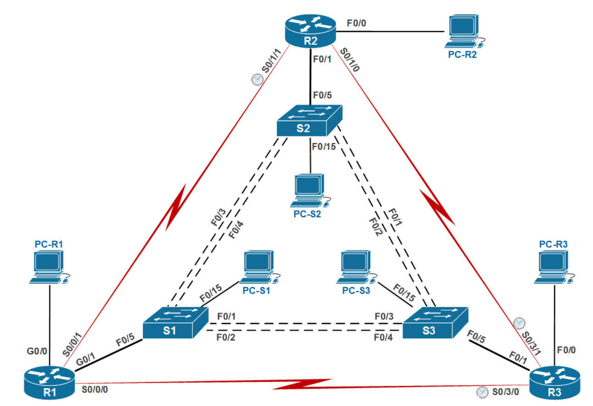

Схема Termilab с действительными именами интерфейсов:

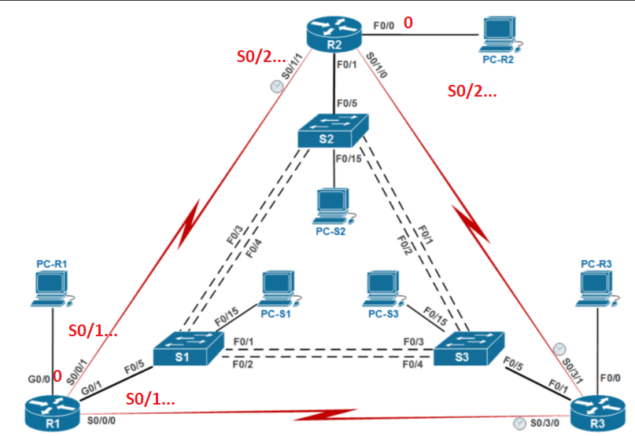

 Упрощенная топология для работы в PacketTracer:

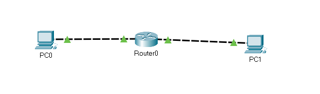

# Addressing Table

| Device | Interface (на стенде Termilab) | Interface | IPv6 Address           |
| ------ | ------------------------------ | --------- | ---------------------- |
| R1     | Serial 0/1/1                   | G0/0/0    | 2001:db8:acad:2::1 /64 |
| R1     | Serial 0/1/1                   | G0/0/0    | fe80::1                |
| R1     | G0/0                           | G0/0/1    | 2001:db8:acad:1::1/64  |
| R1     | G0/0                           | G0/0/1    | fe80::1                |
| R2     | Serial 0/2/1                   | G0/0/0    | 2001:db8:acad:2::2/64  |
| R2     | Serial 0/2/1                   | G0/0/0    | fe80::2                |
| R2     | F0/0                           | G0/0/1    | 2001:db8:acad:3::1 /64 |
| R2     | F0/0                           | G0/0/1    | fe80::1                |
| PC-A   | PC-R1                          | NIC       | DHCP                   |
| PC-B   | PC-R2                          | NIC       | DHCP                   |

# 

```
Забегая вперед, использовать полноценно не удалось ни один из инструментов:
1. PacketTracer не поддерживает DHCPv6 Relay
2. В Eve-NG в облаке Яндекс VPC не удалось заставить получать информацию от DHCPv6-сервера - доменное имя, адресацию. Работает чистый SLAAC.
3. Установить виртуальные машины с реальными ОС нельзя - облако Яндекс не поддерживает вложенную виртуализацию.
4. В Termilab схема с указанием интерфейсов подключения отличается от действительных портов, к которым подключены устройства.
5. В Termilab - Stateless не работает, Stateful нельзя настроить ввиду отсутсвия команд.
6. В результате для ознакомления с DHCPv6 использовался PacketTracer с двумя подключенными к одному маршрутизатору компьютерами. В связи с тем, что проведены неудачные попытки настройки в Termilab и Eve-ng - конфигурация не приложена. Приложена конфигурация Router0 по реализованной в самом конце упрощенной схеме.
```

Далее идет настройка по данной методичке, но результат отрицательный, конфиги не прилагаю.
Наиболее рабочий вариант получен в PacketTracer -  [Упрощенная схема](#Упрощенная-схема)

# Objectives

Part 1: Build the Network and Configure Basic Device Settings

Part 2: Verify SLAAC address assignment from R1

Part 3: Configure and verify a Stateless DHCPv6 Server on R1

Part 4: Configure and verify a Stateful DHCPv6 Server on R1

Part 5: Configure and verify a DHCPv6 Relay on R2

# Background

/ Scenario

The dynamic assignment of IPv6 global unicast addresses
(GUA) can be configured the following three ways:

· Stateless Address Auoconfiguration (SLACC)

· Stateless Dynamic Host Configuration Protocol for IPv6 (DHCPv6)

· Stateful DHCPv6

When using SLACC to assign IPv6 addresses to hosts a
DHCPv6 server is not used. Because a DHCPv6 server is not used when
implementing SLACC, hosts are unable to receive additional critical network
information, including a domain name server (DNS) address as well as a domain
name.

When using Stateless DHCPv6 to assign IPv6 addresses to
host, a DHCPv6 server is used to assign the additional critical network
information, however the IPv6 address is assigned using SLACC.

When implementing Stateful DHCPv6, a DHCPv6 server assigns
all network information, including the IPv6 address.

The determination of how hosts obtain they dynamic IPv6
addressing is dependent on flag setting contain within the router advertisement
(RA) messages.

In this scenario, the company has grown in size, and the
network administrators can no longer assign IP addresses to devices manually.
Your job is to configure the R2 router to assign IPv6 addresses on two
different subnets connected to router R1.

**Note**: The routers used with CCNA hands-on labs are Cisco 4221 with Cisco IOS
XE Release 16.9.4 (universalk9 image). The switches used in the labs are Cisco Catalyst
2960s with Cisco IOS Release 15.2(2) (lanbasek9 image). Other routers,
switches, and Cisco IOS versions can be used. Depending on the model and Cisco
IOS version, the commands available and the output produced might vary from
what is shown in the labs. Refer to the Router Interface Summary Table at the
end of the lab for the correct interface identifiers.

**Note**: Ensure
that the routers and switches have been erased and have no startup
configurations. If you are unsure contact your instructor.

# Required

Resources

· 2 Routers (Cisco 4221 with Cisco IOS XE Release
16.9.4 universal image or comparable)

· 2 Switches (Cisco 2960 with Cisco IOS Release
15.2(2) lanbasek9 image or comparable) - **Optional**

· 2 PCs (Windows with a terminal emulation
program, such as Tera Term)

· Console cables to configure the Cisco IOS
devices via the console ports

· Ethernet cables as shown in the topology

# Instructions

## Part 1: Build the Network and Configure Basic Device Settings

In Part 1, you will set up the network topology and
configure basic settings on the PC hosts and switches.

### Step 1: Cable the network as shown in the topology.

Attach the devices as shown in the topology diagram, and
cable as necessary.

### Step 2: Configure basic settings for each switch. (Optional)

```
Настройки выполнены при конфигурировании DHCPv4
```

Open configuration window

a. Assign
a device name to the switch.

b. Disable
DNS lookup to prevent the router from attempting to translate incorrectly
entered commands as though they were host names.

c. Assign **class** as the privileged EXEC
encrypted password.

d. Assign **cisco** as the console password and
enable login.

e. Assign **cisco** as the VTY password and enable
login.

f. Encrypt
the plaintext passwords.

g. Create
a banner that warns anyone accessing the device that unauthorized access is
prohibited.

h. Shutdown
all unused ports

i. Save the running configuration to the startup
configuration file.

Close configuration window

### Step 3: Configure basic

settings for each router.

```
Настройки выполнены при конфигурировании DHCPv4
```

Open configuration window

a. Assign
a device name to the router.

b. Disable
DNS lookup to prevent the router from attempting to translate incorrectly
entered commands as though they were host names.

c. Assign **class** as the privileged EXEC
encrypted password.

d. Assign **cisco** as the console password and
enable login.

e. Assign **cisco** as the VTY password and enable
login.

f. Encrypt
the plaintext passwords.

g. Create
a banner that warns anyone accessing the device that unauthorized access is
prohibited.

h. Enable
IPv6 Routing

```
ipv6 unicast-routing
```

i. Save the running configuration to the startup
configuration file.

### Step 4: Configure interfaces

and routing for both routers.

a. Configure
the G0/0/0 and G0/0/1 interfaces on R1 and R2 with the IPv6 addresses specified
in the table above.

```
Из работы по DHCPv4 на R1 были созданы сабинтерфейсы. Их пришлось удалить
и подключить PC-A напрямую, поскольку в PacketTracer PC-A не мог получить
ipv6 через SLAAC.
```

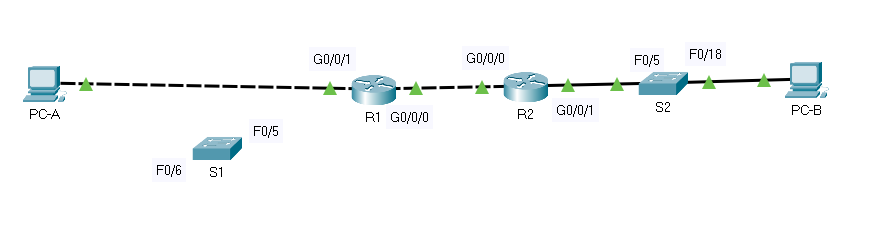

b. Configure
a default route on each router pointed to the IP address of G0/0/0 on the other
router.

c. Verify
routing is working by pinging R2’s G0/0/1 address from R1

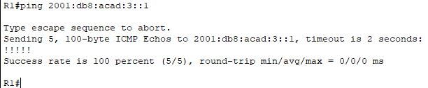

d. Save
the running configuration to the startup configuration file.

Summary R1:

```
interface g0/0/0
ipv6 address 2001:db8:acad:2::1/64
ipv6 address fe80::1 link-local
interface g0/0/1
ipv6 address 2001:db8:acad:1::1/64
ipv6 address fe80::1 link-local
exit
ipv6 route ::/0 gigabitEthernet 0/0/0 fe80::2
```

Summary R1 (для Termilab):

```
interface Serial 0/1/1
ipv6 address 2001:db8:acad:2::1/64
ipv6 address fe80::1 link-local
interface g0/0/0
ipv6 address 2001:db8:acad:1::1/64
ipv6 address fe80::1 link-local
exit
ipv6 route ::/0 Serial 0/1/1 fe80::2
```

Summary R2:

```
interface g0/0/0
ipv6 address 2001:db8:acad:2::2/64
ipv6 address fe80::2 link-local
interface g0/0/1
ipv6 address 2001:db8:acad:3::1/64
ipv6 address fe80::1 link-local
exit
ipv6 route ::/0 gigabitEthernet 0/0/0 fe80::1
```

## 

Summary R2 (Termilab):

```
interface s0/2/1
ipv6 address 2001:db8:acad:2::2/64
ipv6 address fe80::2 link-local
interface g0/0/0
ipv6 address 2001:db8:acad:3::1/64
ipv6 address fe80::1 link-local
exit
ipv6 route ::/0 Serial 0/2/1 fe80::1
```

## 

## Part 2: Verify SLAAC Address Assignment from R1

In Part 2, you will verify that Host PC-A receives an IPv6
address using the SLAAC method.

Power PC-A up and ensure that the NIC is configured for
IPv6 automatic configuration.

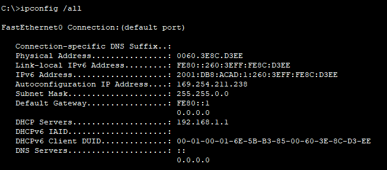

Termilab:

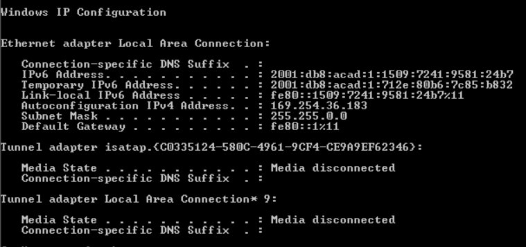

#### 

#### Question:

Where did the host-id portion of
the address come from?

```
host-id получен из MAC-адреса - между третьим и четвертым байтом добавлены
байты FFFE, в первом байте MAC седьмой бит инвертирован.
```

## Part 3: Configure and Verify a DHCPv6 server on R1

In Part 3, you will configure and verify a stateless DHCP
server on R1. The objective is to provide PC-A with DNS server and Domain
information.

### Step 1: Examine the

configuration of PC-A in more detail.

a. Issue
the command **ipconfig /all** on PC-A
and take a look at the output.

b. Notice
that there is no Primary DNS suffix. Also note that the DNS server addresses
provided are “site local anycast” addresses, and not unicast addresses, as
would be expected.

### Step 2: Configure R1 to provide stateless DHCPv6 for PC-A.

a. Create an IPv6 DHCP pool on R1 named R1-STATELESS. As a part of that pool, assign the
DNS server address as 2001:db8:acad::1 and the domain name as stateless.com.

```
ipv6 dhcp pool R1-STATELESS
dns-server 2001:db8:acad::254
domain-name STATELESS.com
```

b. Configure
the G0/0/1 interface on R1 to provide the OTHER config flag to the R1 LAN, and
specify the DHCP pool you just created as the DHCP resource for this interface.

```
int gi0/0/1
ipv6 nd other-config-flag
ipv6 dhcp server R1-STATELESS
```

Termilab:

```
int gi0/0/0
ipv6 nd other-config-flag
ipv6 dhcp server R1-STATELESS
```

c. Save
the running configuration to the startup configuration file.

Close configuration window

d. Restart
PC-A.

e. Examine
the output of **ipconfig /all** and
notice the changes.

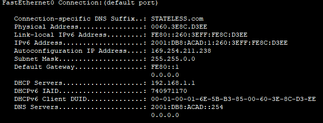

Termilab:

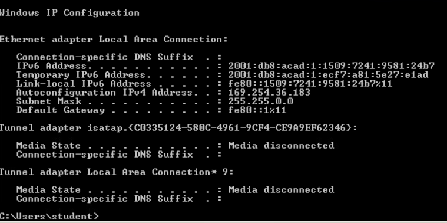

f. Test
connectivity by pinging R2’s G0/0/1 interface IP address.

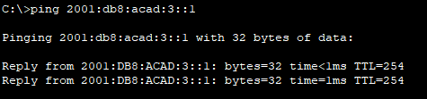

## Part 4: Configure a stateful DHCPv6 server on R1

In Part 4, you will configure R1 to respond to DHCPv6 requests from the LAN on R2.

a. Create a DHCPv6 pool on R1 for the 2001:db8:acad:3:aaaa::/80 network. This will
provide addresses to the LAN connected to interface G0/0/1 on R2. As a part of
the pool, set the DNS server to 2001:db8:acad::254, and set the domain name to
STATEFUL.com.

```
ipv6 dhcp pool R2-STATEFUL

address prefix 2001:db8:acad:3:aaa::/80

dns-server 2001:db8:acad::254

domain-name STATEFUL.com
```

b. Assign
the DHCPv6 pool you just created to interface g0/0/0 on R1.

```
interface g0/0/0
ipv6 dhcp server R2-STATEFUL
```

Close configuration window

## Part 5: Configure and verify DHCPv6 relay on R2.

In Part 5, you will configure and verify DHCPv6 relay on
R2, allowing PC-B to receive an IPv6 Address.

### Step 1: Power on PC-B and

examine the SLAAC address that it generates.

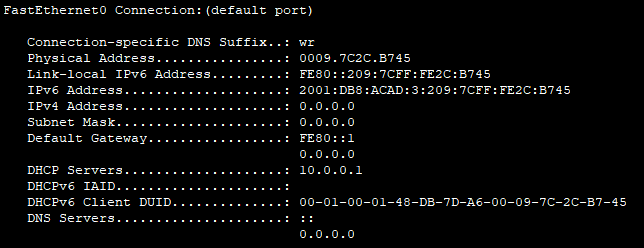

Notice in the output that the prefix used is
2001:db8:acad:3::

### Step 2: Configure R2 as a DHCP relay agent for the LAN on G0/0/1.

a. Configure
the **ipv6 dhcp relay** command on R2
interface G0/0/1, specifying the destination address of the G0/0/0 interface on
R1. Also configure the **managed-config-flag** command.

Open configuration window

R2(config)# **interface g0/0/1**

R2(config-if)# **ipv6 nd managed-config-flag**

R2(config-if)# **ipv6 dhcp relay destination 2001:db8:acad:2::1
g0/0/0**

b. Save
your configuration.

Close configuration window

```
В PacketTracer нет команды ipv6 dhcp relay ...
```

### Step 3: Attempt to acquire an IPv6 address from DHCPv6 on PC-B.

a. Restart
PC-B.

b. Open
a command prompt on PC-B and issue the command **ipconfig /all** and examine
the output to see the results of the DHCPv6 relay operation.

c. Test
connectivity by pinging R1’s G0/0/1 interface IP address.


# Упрощенная схема

С этого момента выполнен переход на упрощенную схему:


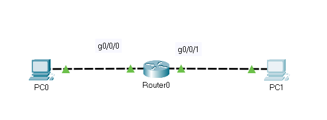

Конфигурация Router0:

```
ipv6 unicast-routing

ipv6 dhcp pool Stateful

address prefix 2001:db8:acad:3:aaa::/80

dns-server 2001:db8:acad::254

domain-name STATEFUL.com

exit

int gi0/0/1

ipv6 address 2001:db8:acad:3::1/64

ipv6 address fe80::1 link-local

ipv6 nd man

ipv6 dhcp server Stateful

no shut

exit

ipv6 dhcp pool Stateless

dns-server 2001:db8:acad::253

domain-name STATELESS.com

exit

int gi0/0/0

ipv6 address 2001:db8:acad:1::1/64

ipv6 address fe80::1 link-local

ipv6 nd other-

ipv6 dhcp server Stateless

no shut
```

Адресация на PC1:

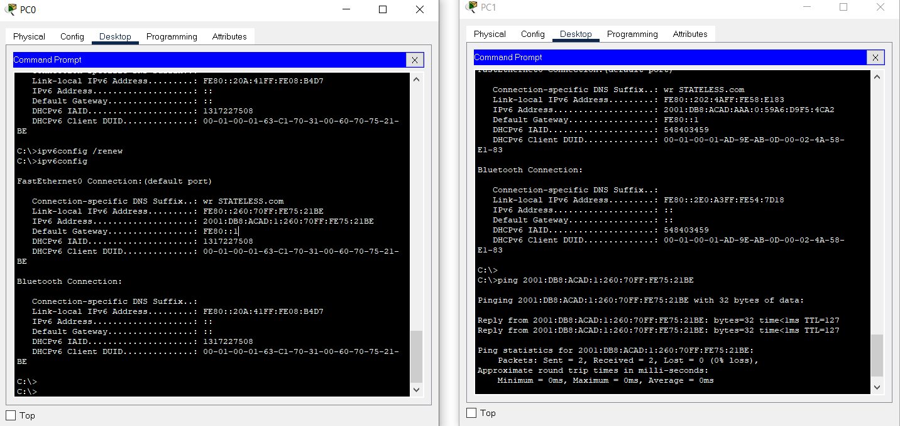

Адреса выдаются корректно, однако нет имени DNS-сервера и неправильное имя домена. Связность на L3 создана.
