# IPv4/6

## Цель:

1. В данной самостоятельной работе необходимо распланировать адресное пространство

2. Настроить IP на всех активных портах для дальнейшей работы над проектом

3. Адресное пространство должно быть задокументировано

## В этой самостоятельной работе мы ожидаем, что вы самостоятельно:

1. **разработаете и задокументируете адресное пространство для лабораторного стенда.**
   
   **Москва**
   
   Скриншот:
   
   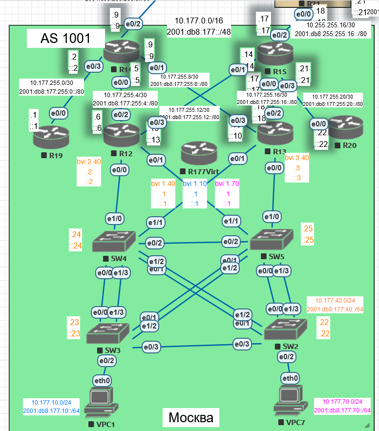   

| Device   | Interface | IP Address                                      | Default Gateway                          |
| -------- | --------- | ----------------------------------------------- | ---------------------------------------- |
| R12      | bvi 40    | 10.177.40.2/24<br/>2001:db8:177:40::2/64        |                                          |
| R12      | bvi 10    | 10.177.10.2/24<br/>2001:db8:177:10::2/64        |                                          |
| R12      | bvi 70    | 10.177.70.2/24<br/>2001:db8:177:70::2/64        |                                          |
| R12      | e0/2      | 10.177.255.6/30<br/>2001:db8:177:255:4::6/80    |                                          |
| R12      | e0/3      | 10.177.255.13/30<br/>2001:db8:177:255:12::13/80 |                                          |
| R13      | bvi 40    | 10.177.40.3/24<br/>2001:db8:177:40::3/64        |                                          |
| R13      | bvi 10    | 10.177.10.3/24<br/>2001:db8:177:10::3/64        |                                          |
| R13      | bvi 70    | 10.177.70.3/24<br/>2001:db8:177:70::3/64        |                                          |
| R13      | e0/2      | 10.177.255.18/30<br/>2001:db8:177:255:16::18/80 |                                          |
| R13      | e0/3      | 10.177.255.10/30<br/>2001:db8:177:255:8::10/80  |                                          |
| R177Virt | bvi 40    | 10.177.40.1/24<br/>2001:db8:177:40::1/64        |                                          |
| R177Virt | bvi 10    | 10.177.10.1/24<br/>2001:db8:177:10::1/64        |                                          |
| R177Virt | bvi 70    | 10.177.70.1/24<br/>2001:db8:177:70::1/64        |                                          |
| R14      | e0/0      | 10.177.255.5/30<br/>2001:db8:177:255:4::5/80    |                                          |
| R14      | e0/1      | 10.177.255.9/30<br/>2001:db8:177:255:8::9/80    |                                          |
| R14      | e0/2      | 10.255.255.9/30<br/>2001:db8:255:255:8::9/80    |                                          |
| R14      | e0/3      | 10.177.255.2/30<br/>2001:db8:177:255:0::2/80    |                                          |
| R15      | e0/0      | 10.177.255.17/30<br/>2001:db8:177:255:16::17/80 |                                          |
| R15      | e0/1      | 10.177.255.14/30<br/>2001:db8:177:255:12::14/80 |                                          |
| R15      | e0/2      | 10.255.255.17/30<br/>2001:db8:255:255:16::17/80 |                                          |
| R15      | e0/3      | 10.177.255.21/30<br/>2001:db8:177:255:20::21/80 |                                          |
| R19      | e0/0      | 10.177.255.1/30<br/>2001:db8:177:255:0::1/80    |                                          |
| R20      | e0/0      | 10.177.255.22/30<br/>2001:db8:177:255:20::22/80 |                                          |
| SW2      | VLAN 40   | 10.177.40.22/24<br/>2001:db8:177:40::22/64      | 10.177.40.1/24<br/>2001:db8:177:40::1/64 |
| SW3      | VLAN 40   | 10.177.40.23/24<br/>2001:db8:177:40::23/64      | 10.177.40.1/24<br/>2001:db8:177:40::1/64 |
| SW4      | VLAN 40   | 10.177.40.24/24<br/>2001:db8:177:40::24/64      | 10.177.40.1/24<br/>2001:db8:177:40::1/64 |
| SW5      | VLAN 40   | 10.177.40.25/24<br/>2001:db8:177:40::25/64      | 10.177.40.1/24<br/>2001:db8:177:40::1/64 |
| VPC1     | NIC       | 10.177.10.101/24<br/>2001:db8:177:10::101/64    | 10.177.10.1/24<br/>2001:db8:177:10::1/64 |
| VPC7     | NIC       | 10.177.70.102/24<br/>2001:db8:177:70::102/64    | 10.177.70.1/24<br/>2001:db8:177:70::1/64 |

| VLAN | Name       | Interface Assigned                                  |
| ---- | ---------- | --------------------------------------------------- |
| 40   | Management | SW2-5: VLAN 40                                      |
| 10   | Operations | SW3: e0/2                                           |
| 70   | Developers | SW2: e0/2                                           |
| 90   | ParkingLot | SW2: e1/0, e1/1 SW3: e1/0, e1/1 SW4: e0/3 SW5: e0/3 |
| 8    | Native     | N/A                                                 |

**Санкт-Петербург**

Скриншот:

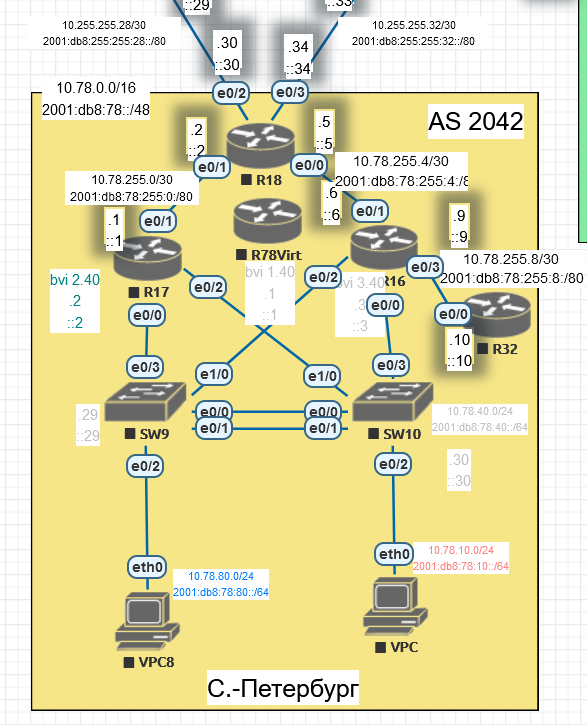

| Device  | Interface | IP Address                                      | Default Gateway                        |
| ------- | --------- | ----------------------------------------------- | -------------------------------------- |
| R17     | bvi 40    | 10.78.40.2/24<br/>2001:db8:78:40::2/64          |                                        |
| R17     | bvi 80    | 10.78.80.2/24<br/>2001:db8:78:80::2/64          |                                        |
| R17     | bvi 10    | 10.78.10.2/24<br/>2001:db8:78:10::2/64          |                                        |
| R17     | e0/1      | 10.78.255.1/30<br/>2001:db8:78:255:0::1/80      |                                        |
| R16     | bvi 40    | 10.78.40.3/24<br/>2001:db8:78:40::3/64          |                                        |
| R16     | bvi 80    | 10.78.80.3/24<br/>2001:db8:78:80::3/64          |                                        |
| R16     | bvi 10    | 10.78.10.3/24<br/>2001:db8:78:10::3/64          |                                        |
| R16     | e0/1      | 10.78.255.6/30<br/>2001:db8:78:255:4::6/80      |                                        |
| R16     | e0/3      | 10.78.255.9/30<br/>2001:db8:78:255:8::9/80      |                                        |
| R78Virt | bvi 40    | 10.78.40.1/24<br/>2001:db8:78:40::1/64          |                                        |
| R78Virt | bvi 80    | 10.78.80.1/24<br/>2001:db8:78:80::1/64          |                                        |
| R78Virt | bvi 10    | 10.78.10.1/24<br/>2001:db8:78:10::1/64          |                                        |
| R18     | e0/0      | 10.78.255.5/30<br/>2001:db8:78:255:4::5/80      |                                        |
| R18     | e0/1      | 10.78.255.2/30<br/>2001:db8:78:255:0::2/80      |                                        |
| R18     | e0/2      | 10.255.255.30/30<br/>2001:db8:255:255:28::30/80 |                                        |
| R18     | e0/3      | 10.255.255.34/30<br/>2001:db8:255:255:32::33/80 |                                        |
| R32     | e0/0      | 10.78.255.10/30<br/>2001:db8:78:255:8::10/80    |                                        |
| SW9     | VLAN 40   | 10.78.40.29/24<br/>2001:db8:78:40::29/64        | 10.78.40.1/24<br/>2001:db8:78:40::1/64 |
| SW10    | VLAN 40   | 10.78.40.30/24<br/>2001:db8:78:40::30/64        | 10.78.40.1/24<br/>2001:db8:78:40::1/64 |
| VPC8    | NIC       | 10.78.80.101/24<br/>2001:db8:78:80::101/64      | 10.78.80.1/24<br/>2001:db8:78:80::1/64 |
| VPC     | NIC       | 10.78.10.102/24<br/>2001:db8:78:10::102/64      | 10.78.10.1/24<br/>2001:db8:78:10::1/64 |

| VLAN | Name       | Interface Assigned       |
| ---- | ---------- | ------------------------ |
| 40   | Management | SW9-10: VLAN 40          |
| 10   | Operations | SW10: e0/2               |
| 80   | Developers | SW9: e0/2                |
| 90   | ParkingLot | SW9: e1/1-3 SW10: e1/1-3 |
| 8    | Native     | N/A                      |

**Чокурдах**

Скриншот:

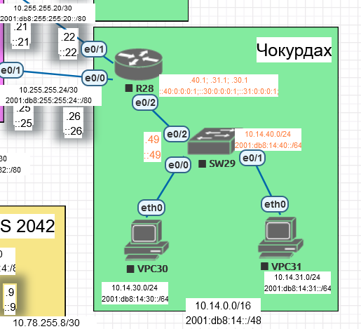

| Device | Interface | IP Address                                      | Default Gateway                        |
| ------ | --------- | ----------------------------------------------- | -------------------------------------- |
| R28    | e0/0      | 10.255.255.26/30<br/>2001:db8:255:255:24::26/80 |                                        |
| R28    | e0/1      | 10.255.255.22/30<br/>2001:db8:255:255:20::22/80 |                                        |
| R28    | e0/2.40   | 10.14.40.1/30<br/>2001:db8:14:40:0::1/64        |                                        |
| R28    | e0/2.30   | 10.14.30.1/30<br/>2001:db8:14:30:0::1/64        |                                        |
| R28    | e0/2.31   | 10.14.31.1/30<br/>2001:db8:14:31:0::1/64        |                                        |
| SW29   | VLAN 40   | 10.14.40.49/24<br/>2001:db8:14:40::49/64        | 10.14.40.1/24<br/>2001:db8:14:40::1/64 |
| VPC30  | NIC       | 10.14.30.101/24<br/>2001:db8:14:30::101/64      | 10.14.30.1/24<br/>2001:db8:14:30::1/64 |
| VPC31  | NIC       | 10.14.31.102/24<br/>2001:db8:14:31::102/64      | 10.14.31.1/24<br/>2001:db8:14:40::1/64 |

| VLAN | Name       | Interface Assigned |
| ---- | ---------- | ------------------ |
| 40   | Management | SW29: VLAN 40      |
| 30   | Operations | SW29: e0/0         |
| 31   | Developers | SW29: e0/1         |
| 90   | ParkingLot | SW29: e0/3, e1/0-3 |
| 8    | Native     | N/A                |

**Триада**

Скриншот:

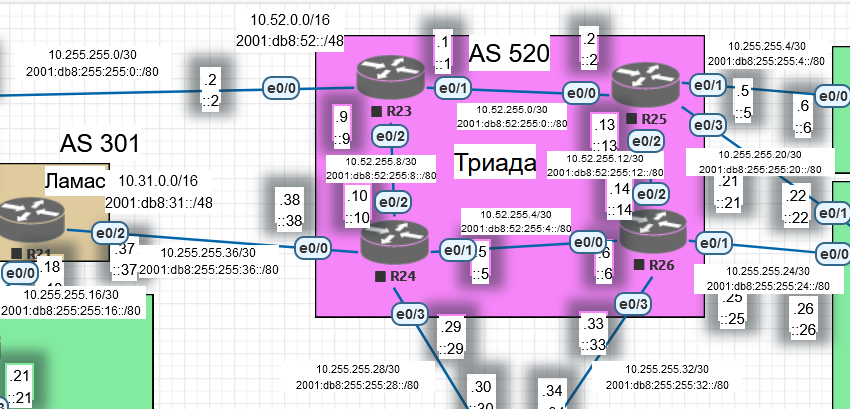

| Device | Interface | IP Address                                      | Default Gateway |
| ------ | --------- | ----------------------------------------------- | --------------- |
| R23    | e0/0      | 10.255.255.2/30<br/>2001:db8:255:255:0::2/80    |                 |
| R23    | e0/1      | 10.52.255.1/30<br/>2001:db8:52:255:0::1/80      |                 |
| R23    | e0/2      | 10.52.255.9/30<br/>2001:db8:52:255:8::9/80      |                 |
| R24    | e0/0      | 10.255.255.38/30<br/>2001:db8:255:255:36::38/80 |                 |
| R24    | e0/1      | 10.52.255.5/30<br/>2001:db8:52:255:4::5/80      |                 |
| R24    | e0/2      | 10.52.255.10/30<br/>2001:db8:52:255:8::10/80    |                 |
| R24    | e0/3      | 10.255.255.29/30<br/>2001:db8:255:255:29::29/80 |                 |
| R25    | e0/0      | 10.52.255.2/30<br/>2001:db8:52:255:0::2/80      |                 |
| R25    | e0/1      | 10.255.255.5/30<br/>2001:db8:255:255:4::5/80    |                 |
| R25    | e0/2      | 10.52.255.13/30<br/>2001:db8:52:255:12::13/80   |                 |
| R25    | e0/3      | 10.255.255.21/30<br/>2001:db8:255:255:20::21/80 |                 |
| R26    | e0/0      | 10.52.255.6/30<br/>2001:db8:52:255:4::6/80      |                 |
| R26    | e0/1      | 10.255.255.25/30<br/>2001:db8:255:255:24::25/80 |                 |
| R26    | e0/2      | 10.52.255.14/30<br/>2001:db8:52:255:12::14/80   |                 |
| R26    | e0/3      | 10.255.255.33/30<br/>2001:db8:255:255:32::33/80 |                 |

**Ламас**

Скриншот:

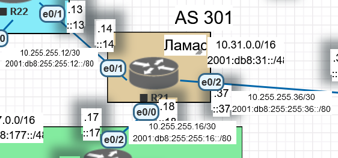

| Device | Interface | IP Address                                      | Default Gateway |
| ------ | --------- | ----------------------------------------------- | --------------- |
| R21    | e0/0      | 10.255.255.18/30<br/>2001:db8:255:255:16::18/80 |                 |
| R21    | e0/1      | 10.255.255.14/30<br/>2001:db8:255:255:12::14/80 |                 |
| R21    | e0/2      | 10.255.255.37/30<br/>2001:db8:255:255:36::37/80 |                 |

**Киторн**

Скриншот:

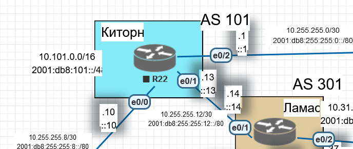

| Device | Interface | IP Address                                      | Default Gateway |
| ------ | --------- | ----------------------------------------------- | --------------- |
| R22    | e0/0      | 10.255.255.10/30<br/>2001:db8:255:255:8::10/80  |                 |
| R22    | e0/1      | 10.255.255.13/30<br/>2001:db8:255:255:12::13/80 |                 |
| R22    | e0/2      | 10.255.255.1/30<br/>2001:db8:255:255:0::1/80    |                 |

**Лабытнанги**

Скриншот:

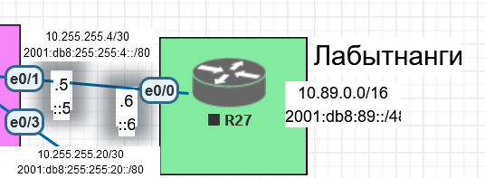

| Device | Interface | IP Address                                   | Default Gateway |
| ------ | --------- | -------------------------------------------- | --------------- |
| R27    | e0/0      | 10.255.255.6/30<br/>2001:db8:255:255:4::6/80 |                 |

Схема всей сети:

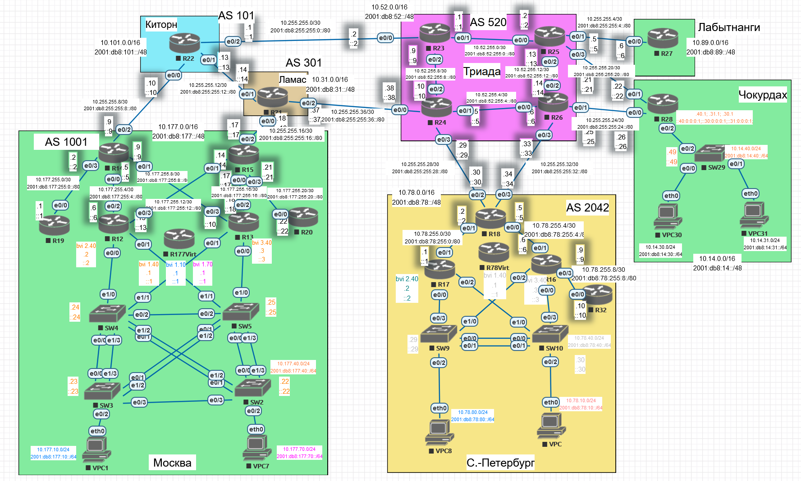

2. настроите ip адреса на каждом активном порту

3. настроите каждый VPC в каждом офисе в своем VLAN.

4. настроите VLAN управления для сетевых устройств.

5. **настроите сети офисов так, чтобы не возникало broadcast штормов, а использование линков было максимально оптимизировано**
   
   Избыточное оборудование есть в Москве и Санкт-Петербурге.
   
   **Москва**

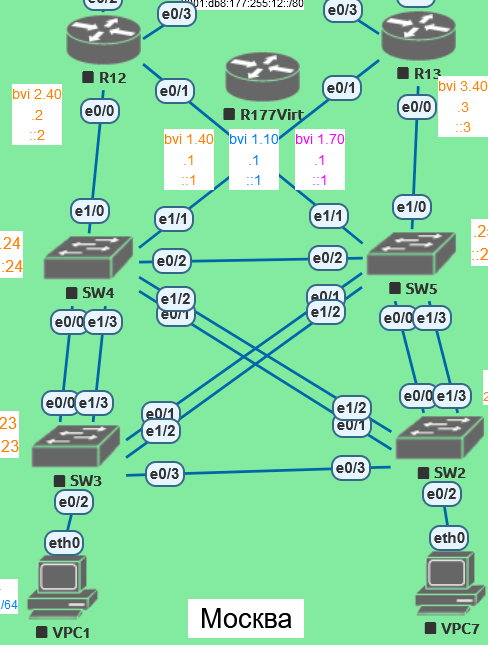

   R12 и R13 работают по протоколу HSPR.

   Интерфейсы e0/0-1 объединены в мост, которому назначен IP-адрес.

   Все оборудование в лабораторной работе имеет интерфейсы 10Мбит/сек. Коммутаторы L2. В таком случае агрегация каналов между коммутаторами требуется не с точки зрения увеличения пропускной способности, а с точки зрения избыточности - при падении линка не должно выполняться перестроение дерева STP.

   Агрегация с точки зрения увеличения пропускной способности будет полезна в случая одновременного трафика от большого количества разных хостов в одном VLAN. Но в пределах одного VLAN такого трафика будет мало, поэтому нет цели увеличения пропускной способности.

   Ввиду ограниченного количества портов агрегация не организована между SW2-3 и SW4-5. Причина, по которой связь между коммутаторами не критична - общение конечных устройств внутри подсети (т.е. без использования маршрутизатора) обычно невелико, связь между ними (а значит и коммутаторами) не критична.

   По пути до маршрутизаторов линки агрегированы - при выходе из строя линка по пути к маршрутизатору останется работать второй линк из агрегации.

**Санкт-Петербург**

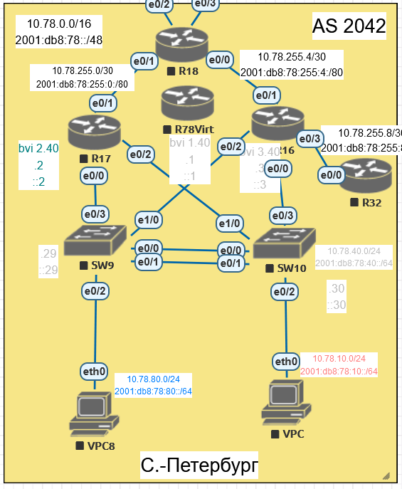

R16 и R17 работают по протоколу HSPR.

Интерфейсы e0/0 и e0/2 объединены в мост, которому назначен IP-адрес.

Между SW9-10 организована агрегация линков.

6. используете ipv4 и ipv6

Ниже расположено дополняющееся описание настройки оборудования.

## Настройка оборудования в Москве

Схема:

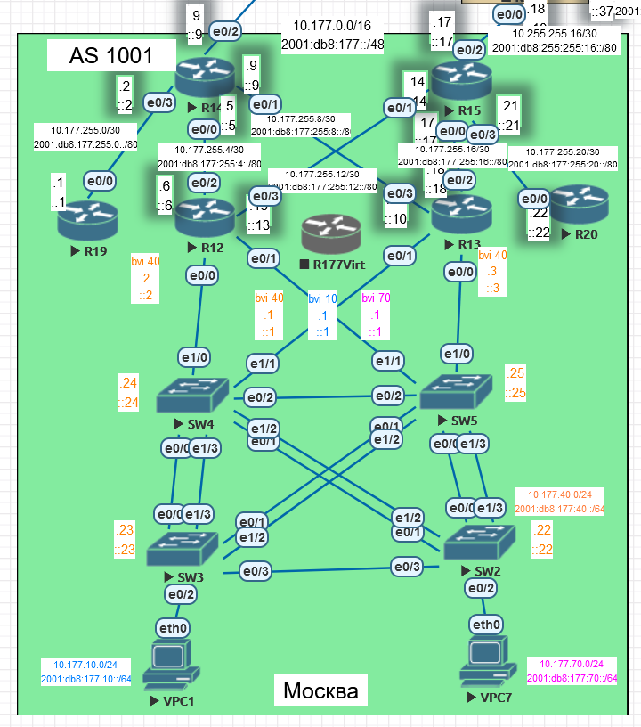

### Коммутаторы

Настроим коммутаторы - hostname, stp, vlan, interfaces, management vlan, lag

SW2:

```
enable
conf t
hostname SW2

spanning-tree mode rapid-pvst

vtp mode off
vlan 8
name Native
exit
vlan 10
name Operations
exit
vlan 40
name Management
exit
vlan 70
name Developers
exit
vlan 90
name ParkingLot
exit


int range e0/0-1,e0/3,e1/2-3
switchport trunk encapsulation dot1q
switchport mode trunk
switchport trunk native vlan 8
switchport trunk allowed vlan 10,40,70
no shutdown
exit


int e0/2
switchport mode access
switchport access vlan 70
switchport nonegotiate
no shutdown
exit


int range e1/0-1
switchport mode access
switchport access vlan 90
switchport nonegotiate
shutdown
exit


int range e0/1,e1/2
channel-group 3 mode active
exit

int range e0/0,e1/3
channel-group 4 mode active
exit


int vlan 40
ip address 10.177.40.22 255.255.255.0
ipv6 address 2001:db8:177:40::22/64
no shut
exit


ip default-gateway 10.177.40.1


end

wr
```

SW3:

```
enable
conf t
hostname SW3

spanning-tree mode rapid-pvst

vtp mode off
vlan 8
name Native
exit
vlan 10
name Operations
exit
vlan 40
name Management
exit
vlan 70
name Developers
exit
vlan 90
name ParkingLot
exit


int range e0/0-1,e0/3,e1/2-3
switchport trunk encapsulation dot1q
switchport mode trunk
switchport trunk native vlan 8
switchport trunk allowed vlan 10,40,70
no shutdown
exit


int e0/2
switchport mode access
switchport access vlan 10
switchport nonegotiate
no shutdown
exit


int range e1/0-1
switchport mode access
switchport access vlan 90
switchport nonegotiate
shutdown
exit


int range e0/1,e1/2
channel-group 2 mode active
exit

int range e0/0,e1/3
channel-group 1 mode active
exit


int vlan 40
ip address 10.177.40.23 255.255.255.0
ipv6 address 2001:db8:177:40::23/64
no shut
exit


ip default-gateway 10.177.40.1


end

wr
```

SW4:

```
enable
conf t
hostname SW4
no ip domain-lookup
spanning-tree mode rapid-pvst

vtp mode off
vlan 8
name Native
exit
vlan 10
name Operations
exit
vlan 40
name Management
exit
vlan 70
name Developers
exit
vlan 90
name ParkingLot
exit


int range e0/0-2,e1/0-3
switchport trunk encapsulation dot1q
switchport mode trunk
switchport trunk native vlan 8
switchport trunk allowed vlan 10,40,70
no shutdown
exit


int e0/3
switchport mode access
switchport access vlan 90
switchport nonegotiate
shutdown
exit


int range e0/1,e1/2
channel-group 3 mode active
exit

int range e0/0,e1/3
channel-group 1 mode active
exit


int vlan 40
ip address 10.177.40.24 255.255.255.0
ipv6 address 2001:db8:177:40::24/64
no shut
exit


ip default-gateway 10.177.40.1

! Set priority. It is greater than priority R12, R13
spanning-tree vlan 10 priority 20480
spanning-tree vlan 40 priority 20480
spanning-tree vlan 70 priority 20480


end

wr
```

SW5:

```
enable
conf t
hostname SW5
no ip domain-lookup
spanning-tree mode rapid-pvst

vtp mode off
vlan 8
name Native
exit
vlan 10
name Operations
exit
vlan 40
name Management
exit
vlan 70
name Developers
exit
vlan 90
name ParkingLot
exit


int range e0/0-2,e1/0-3
switchport trunk encapsulation dot1q
switchport mode trunk
switchport trunk native vlan 8
switchport trunk allowed vlan 10,40,70
no shutdown
exit


int e0/3
switchport mode access
switchport access vlan 90
switchport nonegotiate
shutdown
exit


int range e0/1,e1/2
channel-group 2 mode active
exit

int range e0/0,e1/3
channel-group 4 mode active
exit


int vlan 40
ip address 10.177.40.25 255.255.255.0
ipv6 address 2001:db8:177:40::25/64
no shut
exit


ip default-gateway 10.177.40.1


! Set priority. It is greater than priority of SW4, R12, R13
spanning-tree vlan 10 priority 24576
spanning-tree vlan 40 priority 24576
spanning-tree vlan 70 priority 24576

end

wr
```

После такой конфигурации (при условии, что R12 и R13 выключены), корневым коммутатором становится SW4. Поэтому линк SW5 e0/2 (не избыточный) будет в состоянии FWD.

### Настройка маршрутизаторов

Настроим маршрутизаторы - hostname, stp, bridge,, interfaces, dhcp pool, HSRP

R12

```
enable
conf t
hostname R12
no ip domain-lookup
ipv6 unicast-routing
bridge irb
bridge 10 priority 1
bridge 40 priority 1
bridge 70 priority 1

bridge 40 protocol ieee
bridge 40 route ip
bridge 10 protocol ieee
bridge 10 route ip
bridge 70 protocol ieee
bridge 70 route ip


int e0/2
ip addr 10.177.255.6 255.255.255.252
ipv6 addr 2001:db8:177:255:4::6/80
no shut

int e0/3
ip addr 10.177.255.13 255.255.255.252
ipv6 addr 2001:db8:177:255:12::13/80
no shut


int range e0/0,e0/1
no shutdown

int e0/0.8
encapsulation dot1Q 8 native
bridge-group 8

int e0/1.8
encapsulation dot1Q 8 native
bridge-group 8

int e0/0.10
encapsulation dot1Q 10
bridge-group 10

int e0/1.10
encapsulation dot1Q 10
bridge-group 10


int e0/0.40
encapsulation dot1Q 40
bridge-group 40

int e0/1.40
encapsulation dot1Q 40
bridge-group 40

int e0/0.70
encapsulation dot1Q 70
bridge-group 70

int e0/1.70
encapsulation dot1Q 70
bridge-group 70


interface BVI10
no shutdown
ip address 10.177.10.2 255.255.255.0
ipv6 address 2001:DB8:177:10::2/64
standby version 2
standby 0 ip 10.177.10.1
standby 1 ipv6 2001:DB8:177:10::1/64


interface BVI40
no shutdown
ip address 10.177.40.2 255.255.255.0
ipv6 address 2001:DB8:177:40::2/64
standby version 2
standby 0 ip 10.177.40.1
standby 1 ipv6 2001:DB8:177:40::1/64


interface BVI70
no shutdown
ip address 10.177.70.2 255.255.255.0
ipv6 address 2001:DB8:177:70::2/64
standby version 2
standby 0 ip 10.177.70.1
standby 1 ipv6 2001:DB8:177:70::1/64


exit


ip dhcp excluded-address 10.177.10.1 10.177.10.100
ip dhcp excluded-address 10.177.70.1 10.177.70.100

ip dhcp pool POOL-VLAN-10
network 10.177.10.0 255.255.255.0
default-router 10.177.10.1 

ip dhcp pool POOL-VLAN-70
etwork 10.177.70.0 255.255.255.0
default-router 10.177.70.1 

end

wr
```

R13

```
enable
conf t
hostname R13
no ip domain-lookup
ipv6 unicast-routing
bridge irb
bridge 10 priority 2
bridge 40 priority 2
bridge 70 priority 2

bridge 40 protocol ieee
bridge 40 route ip
bridge 10 protocol ieee
bridge 10 route ip
bridge 70 protocol ieee
bridge 70 route ip


int e0/2
ip addr 10.177.255.18 255.255.255.252
ipv6 addr 2001:db8:177:255:16::18/80
no shut

int e0/3
ip addr 10.177.255.10 255.255.255.252
ipv6 addr 2001:db8:177:255:8::10/80
no shut


int range e0/0,e0/1
no shutdown

int e0/0.8
encapsulation dot1Q 8 native
bridge-group 8

int e0/1.8
encapsulation dot1Q 8 native
bridge-group 8

int e0/0.10
encapsulation dot1Q 10
bridge-group 10

int e0/1.10
encapsulation dot1Q 10
bridge-group 10


int e0/0.40
encapsulation dot1Q 40
bridge-group 40

int e0/1.40
encapsulation dot1Q 40
bridge-group 40

int e0/0.70
encapsulation dot1Q 70
bridge-group 70

int e0/1.70
encapsulation dot1Q 70
bridge-group 70


interface BVI10
no shutdown
ip address 10.177.10.3 255.255.255.0
ipv6 address 2001:DB8:177:10::3/64
standby version 2
standby 0 ip 10.177.10.1
standby 1 ipv6 2001:DB8:177:10::1/64


interface BVI40
no shutdown
ip address 10.177.40.3 255.255.255.0
ipv6 address 2001:DB8:177:40::3/64
standby version 2
standby 0 ip 10.177.40.1
standby 1 ipv6 2001:DB8:177:40::1/64


interface BVI70
no shutdown
ip address 10.177.70.3 255.255.255.0
ipv6 address 2001:DB8:177:70::3/64
standby version 2
standby 0 ip 10.177.70.1
standby 1 ipv6 2001:DB8:177:70::1/64


exit


ip dhcp excluded-address 10.177.10.1 10.177.10.100
ip dhcp excluded-address 10.177.70.1 10.177.70.100

ip dhcp pool POOL-VLAN-10
network 10.177.10.0 255.255.255.0
default-router 10.177.10.1 

ip dhcp pool POOL-VLAN-70
network 10.177.70.0 255.255.255.0
default-router 10.177.70.1 


end
wr
```

Проверяем связь с  VPC1 и VPC7:
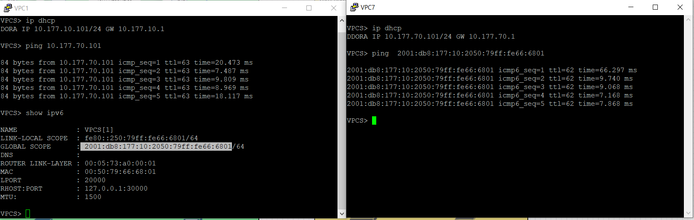

Далее запускаем ping на продолжительное время и выполняем отключение портов на R12:

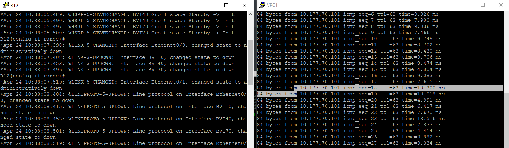

Связь не пропала, шла через R13. Включаем порты обратно и выключаем на R13:
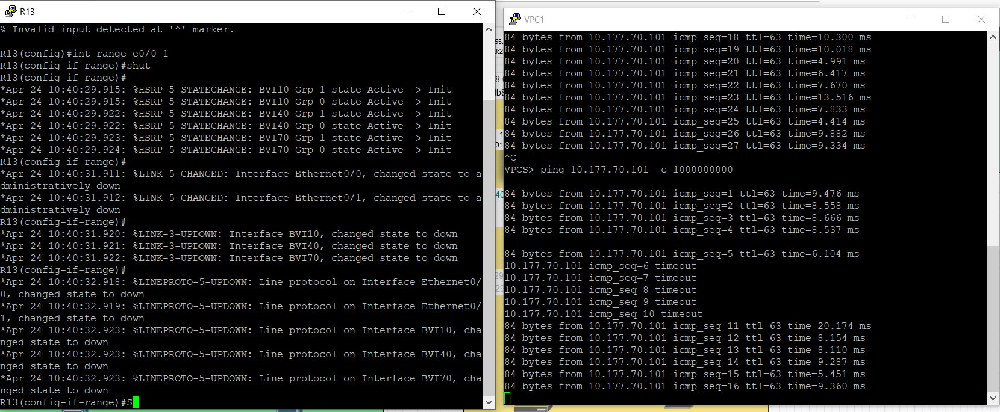

Пропало 5 пакетов, далее в активный режим перешел R12 и стал выполнять маршрутизацию.

Для остальных маршрутизаторов в Москве выполним минимальные настройки -  hostname, interfaces

R14

```
en
conf t
hostname R14
no ip domain-lookup
ipv6 unicast-routing


int e0/0
ip addr 10.177.255.5 255.255.255.252
ipv6 addr 2001:db8:177:255:4::5/80
no shut


int e0/1
ip addr 10.177.255.9 255.255.255.252
ipv6 addr 2001:db8:177:255:8::9/80
no shut

int e0/2
ip addr 10.255.255.9 255.255.255.252
ipv6 addr 2001:db8:255:255:8::9/80
no shut

int e0/3
ip addr 10.177.255.2 255.255.255.252
ipv6 addr 2001:db8:177:255:0::2/80
no shut

end
wr
```

R15

```
en
conf t
hostname R15
no ip domain-lookup
ipv6 unicast-routing


int e0/0
ip addr 10.177.255.17 255.255.255.252
ipv6 addr 2001:db8:177:255:16::17/80
no shut


int e0/1
ip addr 10.177.255.14 255.255.255.252
ipv6 addr 2001:db8:177:255:12::14/80
no shut

int e0/2
ip addr 10.255.255.17 255.255.255.252
ipv6 addr 2001:db8:255:255:16::17/80
no shut

int e0/3
ip addr 10.177.255.21 255.255.255.252
ipv6 addr 2001:db8:177:255:20::21/80
no shut

end
wr
```

R19

```
en
conf t
hostname R19
no ip domain-lookup
ipv6 unicast-routing


int e0/0
ip addr 10.177.255.1 255.255.255.252
ipv6 addr 2001:db8:177:255:0::1/80
no shut


end
wr
```

R20

```
en
conf t
hostname R20
no ip domain-lookup
ipv6 unicast-routing


int e0/0
ip addr 10.177.255.22 255.255.255.252
ipv6 addr 2001:db8:177:255:20::22/80
no shut


end
wr
```

## Настройка оборудования в Санкт-Петербурге

Схема:

### Коммутаторы

Настроим коммутаторы - hostname, stp, vlan, interfaces, management vlan, lag

SW9:

```
enable
conf t
hostname SW9

spanning-tree mode rapid-pvst

vtp mode off
vlan 8
name Native
exit
vlan 10
name Operations
exit
vlan 40
name Management
exit
vlan 80
name Developers
exit
vlan 90
name ParkingLot
exit


int range e0/0-1
switchport trunk encapsulation dot1q
switchport mode trunk
switchport trunk native vlan 8
switchport trunk allowed vlan 10,40,80
no shutdown
exit


int range e0/3,e1/0
switchport trunk encapsulation dot1q
switchport mode trunk
switchport trunk native vlan 8
switchport trunk allowed vlan 10,40,80
no shutdown
exit


int e0/2
switchport mode access
switchport access vlan 80
switchport nonegotiate
no shutdown
exit


int range e1/1-3
switchport mode access
switchport access vlan 90
switchport nonegotiate
shutdown
exit


int range e0/0-1
channel-group 1 mode active
exit


int vlan 40
ip address 10.78.40.29 255.255.255.0
ipv6 address 2001:db8:78:40::29/64
no shut
exit


ip default-gateway 10.78.40.1


end

wr
```

SW10:

```
enable
conf t
hostname SW10

spanning-tree mode rapid-pvst

vtp mode off
vlan 8
name Native
exit
vlan 10
name Operations
exit
vlan 40
name Management
exit
vlan 80
name Developers
exit
vlan 90
name ParkingLot
exit


int range e0/0-1
switchport trunk encapsulation dot1q
switchport mode trunk
switchport trunk native vlan 8
switchport trunk allowed vlan 10,40,80
no shutdown
exit


int range e0/3,e1/0
switchport trunk encapsulation dot1q
switchport mode trunk
switchport trunk native vlan 8
switchport trunk allowed vlan 10,40,80
no shutdown
exit


int e0/2
switchport mode access
switchport access vlan 10
switchport nonegotiate
no shutdown
exit


int range e1/1-3
switchport mode access
switchport access vlan 90
switchport nonegotiate
shutdown
exit


int range e0/0-1
channel-group 1 mode active
exit


int vlan 40
ip address 10.78.40.30 255.255.255.0
ipv6 address 2001:db8:78:40::30/64
no shut
exit


ip default-gateway 10.78.40.1


end

wr
```

### Настройка маршрутизаторов

Настроим маршрутизаторы - hostname, stp, bridge, interfaces, dhcp pool, HSRP

R17

```
enable
conf t
hostname R17
no ip domain-lookup
ipv6 unicast-routing
bridge irb
bridge 10 priority 1
bridge 40 priority 1
bridge 80 priority 1

bridge 40 protocol ieee
bridge 40 route ip
bridge 10 protocol ieee
bridge 10 route ip
bridge 80 protocol ieee
bridge 80 route ip


int e0/1
ip addr 10.78.255.1 255.255.255.252
ipv6 addr 2001:db8:78:255:0::1/80
no shut


int range e0/0,e0/2
no shutdown

int e0/0.8
encapsulation dot1Q 8 native
bridge-group 8

int e0/1.8
encapsulation dot1Q 8 native
bridge-group 8

int e0/0.10
encapsulation dot1Q 10
bridge-group 10

int e0/1.10
encapsulation dot1Q 10
bridge-group 10


int e0/0.40
encapsulation dot1Q 40
bridge-group 40

int e0/1.40
encapsulation dot1Q 40
bridge-group 40

int e0/0.80
encapsulation dot1Q 80
bridge-group 80

int e0/1.80
encapsulation dot1Q 80
bridge-group 80


interface BVI10
no shutdown
ip address 10.78.10.2 255.255.255.0
ipv6 address 2001:DB8:78:10::2/64
standby version 2
standby 0 ip 10.78.10.1
standby 1 ipv6 2001:DB8:78:10::1/64


interface BVI40
no shutdown
ip address 10.78.40.2 255.255.255.0
ipv6 address 2001:DB8:78:40::2/64
standby version 2
standby 0 ip 10.78.40.1
standby 1 ipv6 2001:DB8:78:40::1/64


interface BVI80
no shutdown
ip address 10.78.80.2 255.255.255.0
ipv6 address 2001:DB8:78:80::2/64
standby version 2
standby 0 ip 10.78.80.1
standby 1 ipv6 2001:DB8:78:80::1/64


exit


ip dhcp excluded-address 10.78.10.1 10.78.10.100
ip dhcp excluded-address 10.78.80.1 10.78.80.100

ip dhcp pool POOL-VLAN-10
network 10.78.10.0 255.255.255.0
default-router 10.78.10.1 

ip dhcp pool POOL-VLAN-80
network 10.78.80.0 255.255.255.0
default-router 10.78.80.1 

end

wr
```

R16

```
enable
conf t
hostname R16
no ip domain-lookup
ipv6 unicast-routing
bridge irb
bridge 10 priority 1
bridge 40 priority 1
bridge 80 priority 1

bridge 40 protocol ieee
bridge 40 route ip
bridge 10 protocol ieee
bridge 10 route ip
bridge 80 protocol ieee
bridge 80 route ip


int e0/1
ip addr 10.78.255.6 255.255.255.252
ipv6 addr 2001:db8:78:255:4::6/80
no shut


int range e0/0,e0/2
no shutdown

int e0/0.8
encapsulation dot1Q 8 native
bridge-group 8

int e0/1.8
encapsulation dot1Q 8 native
bridge-group 8

int e0/0.10
encapsulation dot1Q 10
bridge-group 10

int e0/1.10
encapsulation dot1Q 10
bridge-group 10


int e0/0.40
encapsulation dot1Q 40
bridge-group 40

int e0/1.40
encapsulation dot1Q 40
bridge-group 40

int e0/0.80
encapsulation dot1Q 80
bridge-group 80

int e0/1.80
encapsulation dot1Q 80
bridge-group 80


interface BVI10
no shutdown
ip address 10.78.10.3 255.255.255.0
ipv6 address 2001:DB8:78:10::3/64
standby version 2
standby 0 ip 10.78.10.1
standby 1 ipv6 2001:DB8:78:10::1/64


interface BVI40
no shutdown
ip address 10.78.40.3 255.255.255.0
ipv6 address 2001:DB8:78:40::3/64
standby version 2
standby 0 ip 10.78.40.1
standby 1 ipv6 2001:DB8:78:40::1/64


interface BVI80
no shutdown
ip address 10.78.80.3 255.255.255.0
ipv6 address 2001:DB8:78:80::3/64
standby version 2
standby 0 ip 10.78.80.1
standby 1 ipv6 2001:DB8:78:80::1/64


exit


ip dhcp excluded-address 10.78.10.1 10.78.10.100
ip dhcp excluded-address 10.78.80.1 10.78.80.100

ip dhcp pool POOL-VLAN-10
network 10.78.10.0 255.255.255.0
default-router 10.78.10.1 

ip dhcp pool POOL-VLAN-80
network 10.78.80.0 255.255.255.0
default-router 10.78.80.1 

end

wr
```

R32

```
enable
conf t
hostname R32
no ip domain-lookup
ipv6 unicast-routing


int  e0/0
ip addr 10.78.255.10 255.255.255.252
ipv6 addr 2001:db8:78:255:8::10/80
no shutdown

end
wr
```

R18

```
enable
conf t
hostname R18
no ip domain-lookup
ipv6 unicast-routing


int  e0/0
ip addr 10.78.255.5 255.255.255.252
ipv6 addr 2001:db8:78:255:5::5/80
no shutdown


int  e0/1
ip addr 10.78.255.2 255.255.255.252
ipv6 addr 2001:db8:78:255:0::2/80
no shutdown


int  e0/2
ip addr 10.255.255.30 255.255.255.252
ipv6 addr 2001:db8:255:255:28::30/80
no shutdown


int  e0/3
ip addr 10.255.255.34 255.255.255.252
ipv6 addr 2001:db8:255:255:32::34/80
no shutdown


end
wr
```

Проверяем связь с  VPC и VPC8:


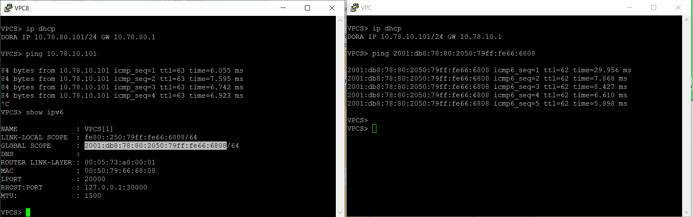


Далее запускаем ping на продолжительное время и выполняем отключение портов на R16:


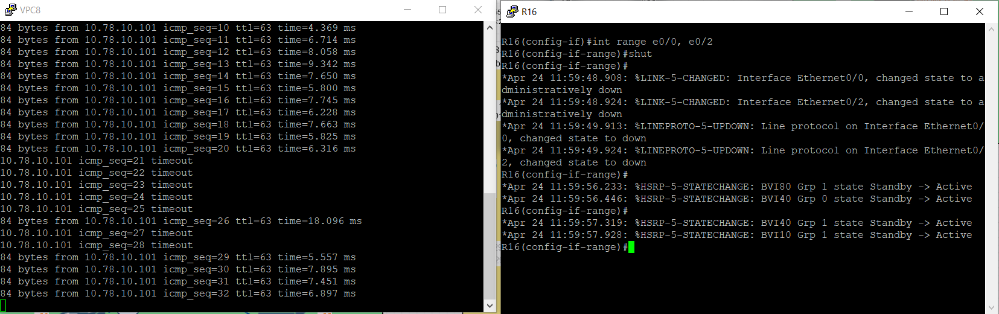

HSRP отработал.


