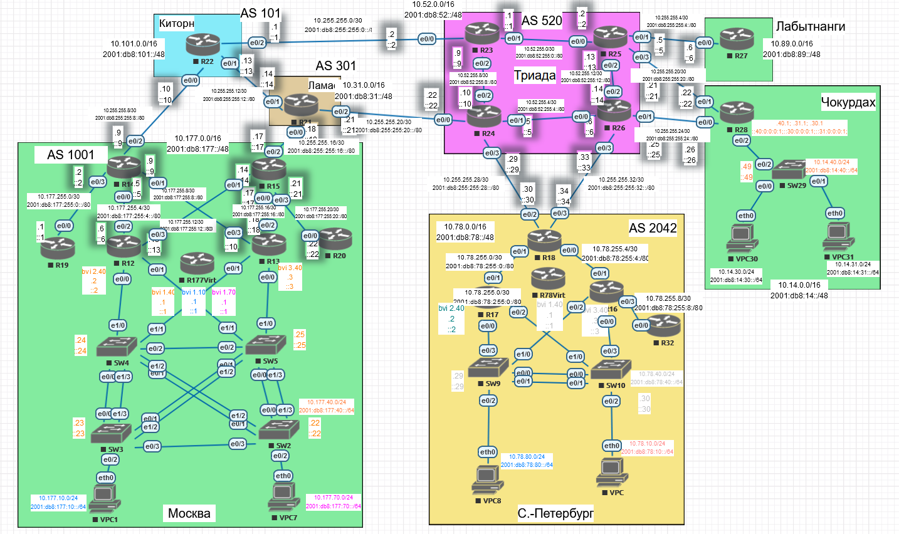

# IPv4/6

## Цель:

1. В данной самостоятельной работе необходимо распланировать адресное пространство

2. Настроить IP на всех активных портах для дальнейшей работы над проектом

3. Адресное пространство должно быть задокументировано

## В этой самостоятельной работе мы ожидаем, что вы самостоятельно:

1. **разработаете и задокументируете адресное пространство для лабораторного стенда.**
   
   ```
   Перед формированием таблицы адресация нанесена на логическую схему. После формирования адресации на схеме выполняется перенос в таблицу.
   ```
   
   Скриншот схемы для Москвы:
   
   
   **Москва**

| Device   | Interface | IP Address                                      | Default Gateway                          |
| -------- | --------- | ----------------------------------------------- | ---------------------------------------- |
| R12      | bvi2.40   | 10.177.40.2/24<br/>2001:db8:177:40::2/64        |                                          |
| R12      | bvi2.10   | 10.177.10.2/24<br/>2001:db8:177:10::2/64        |                                          |
| R12      | bvi2.70   | 10.177.70.2/24<br/>2001:db8:177:70::2/64        |                                          |
| R12      | e0/2      | 10.177.255.6/30<br/>2001:db8:177:255:4::6/80    |                                          |
| R12      | e0/3      | 10.177.255.13/30<br/>2001:db8:177:255:12::13/80 |                                          |
| R13      | bvi3.40   | 10.177.40.3/24<br/>2001:db8:177:40::3/64        |                                          |
| R13      | bvi3.10   | 10.177.10.3/24<br/>2001:db8:177:10::3/64        |                                          |
| R13      | bvi3.70   | 10.177.70.3/24<br/>2001:db8:177:70::3/64        |                                          |
| R13      | e0/2      | 10.177.255.18/30<br/>2001:db8:177:255:16::18/80 |                                          |
| R13      | e0/3      | 10.177.255.10/30<br/>2001:db8:177:255:8::10/80  |                                          |
| R177Virt | bvi1.40   | 10.177.40.1/24<br/>2001:db8:177:40::1/64        |                                          |
| R177Virt | bvi1.10   | 10.177.10.1/24<br/>2001:db8:177:10::1/64        |                                          |
| R177Virt | bvi1.70   | 10.177.70.1/24<br/>2001:db8:177:70::1/64        |                                          |
| R14      | e0/0      | 10.177.255.5/30<br/>2001:db8:177:255:4::5/80    |                                          |
| R14      | e0/1      | 10.177.255.9/30<br/>2001:db8:177:255:8::9/80    |                                          |
| R14      | e0/2      | 10.255.255.9/30<br/>2001:db8:255:255:8::9/80    |                                          |
| R14      | e0/3      | 10.177.255.2/30<br/>2001:db8:177:255:0::2/80    |                                          |
| R15      | e0/0      | 10.177.255.17/30<br/>2001:db8:177:255:16::17/80 |                                          |
| R15      | e0/1      | 10.177.255.14/30<br/>2001:db8:177:255:12::14/80 |                                          |
| R15      | e0/2      | 10.255.255.17/30<br/>2001:db8:255:255:16::17/80 |                                          |
| R15      | e0/3      | 10.177.255.21/30<br/>2001:db8:177:255:20::21/80 |                                          |
| R19      | e0/0      | 10.177.255.1/30<br/>2001:db8:177:255:0::1/80    |                                          |
| R20      | e0/0      | 10.177.255.22/30<br/>2001:db8:177:255:20::22/80 |                                          |
| SW2      | VLAN 40   | 10.177.40.22/24<br/>2001:db8:177:40::22/64      | 10.177.40.1/24<br/>2001:db8:177:40::1/64 |
| SW3      | VLAN 40   | 10.177.40.23/24<br/>2001:db8:177:40::23/64      | 10.177.40.1/24<br/>2001:db8:177:40::1/64 |
| SW4      | VLAN 40   | 10.177.40.24/24<br/>2001:db8:177:40::24/64      | 10.177.40.1/24<br/>2001:db8:177:40::1/64 |
| SW5      | VLAN 40   | 10.177.40.25/24<br/>2001:db8:177:40::25/64      | 10.177.40.1/24<br/>2001:db8:177:40::1/64 |
| VPC1     | NIC       | 10.177.10.101/24<br/>2001:db8:177:10::101/64    | 10.177.10.1/24<br/>2001:db8:177:10::1/64 |
| VPC7     | NIC       | 10.177.70.101/24<br/>2001:db8:177:70::101/64    | 10.177.10.1/24<br/>2001:db8:177:70::1/64 |

| VLAN | Name       | Interface Assigned                                  |
| ---- | ---------- | --------------------------------------------------- |
| 40   | Management | SW2-5: VLAN 40                                      |
| 10   | Operations | SW3: e0/2                                           |
| 70   | Developers | SW2: e0/2                                           |
| 90   | ParkingLot | SW2: e1/0, e1/1 SW3: e1/0, e1/1 SW4: e0/3 SW5: e0/3 |
| 8    | Native     | N/A                                                 |

   Схема всей сети:


```
В случае правильного распределения адресов они будут также перенесены со схемы в таблицы.
```

2. настроите ip адреса на каждом активном порту
   
   ```
   Адреса будут настроены после заполнения таблицы.
   ```

3. настроите каждый VPC в каждом офисе в своем VLAN.

4. настроите VLAN управления для сетевых устройств

5. **настроите сети офисов так, чтобы не возникало broadcast штормов, а использование линков было максимально оптимизировано**
   
   Избыточное оборудование есть в Москве и Санкт-Петербурге.
   
   **Москва**


   R12 и R13 работают по протоколу HSPR.

   Интерфейсы e0/0-1 объединены в мост, которому назначен IP-адрес.

   Все оборудование в лабораторной работе имеет интерфейсы 10Мбит/сек. Коммутаторы L2. В таком случае агрегация каналов между коммутаторами требуется не с точки зрения увеличения пропускной способности, а с точки зрения избыточности - при падении линка не должно выполняться перестроение дерева STP.

   Агрегация с точки зрения увеличения пропускной способности будет полезна в случая одновременного трафика от большого количества разных хостов в одном VLAN. Но в пределах одного VLAN такого трафика будет мало, поэтому нет цели увеличения пропускной способности.

   Ввиду ограниченного количества портов агрегация не организована между SW2-3 и SW4-5. Причина, по которой связь между коммутаторами не критична - общение конечных устройств внутри подсети (т.е. без использования маршрутизатора) обычно невелико, связь между ними (а значит и коммутаторами) не критична.

   По пути до маршрутизаторов линки агрегированы - при выходе из строя линка по пути к маршрутизатору останется работать второй линк из агрегации.

**Санкт-Петербург**


R16 и R17 работают по протоколу HSPR.

Интерфейсы e0/0 и e0/2 объединены в мост, которому назначен IP-адрес.

Между SW9-10 организована агрегация линков.

6. используете ipv4 и ipv6
