# Маршрутизация на основе политик (PBR)

PBR

Цель:

Настроить политику маршрутизации в офисе Чокурдах
Распределить трафик между 2 линками

В этой самостоятельной работе мы ожидаем, что вы самостоятельно:

1. Настроите политику маршрутизации для сетей офиса
2. Распределите трафик между двумя линками с провайдером
3. Настроите отслеживание линка через технологию IP SLA
4. Настройте для офиса Лабытнанги маршрут по-умолчанию
5. План работы и изменения зафиксированы в документации

Документация оформлена на github. (желательно использовать markdown)

Если нужна помощь - пишите через ЛК с помощью кнопки "чат с преподавателем" или в канал в Slack

Критерии оценки:

Статус "Принято" ставится при выполнении всех перечисленных требований к заданию.

# Базовая настройка сетевых устройств

Схема участка сети, необходимого для выполнения задания:
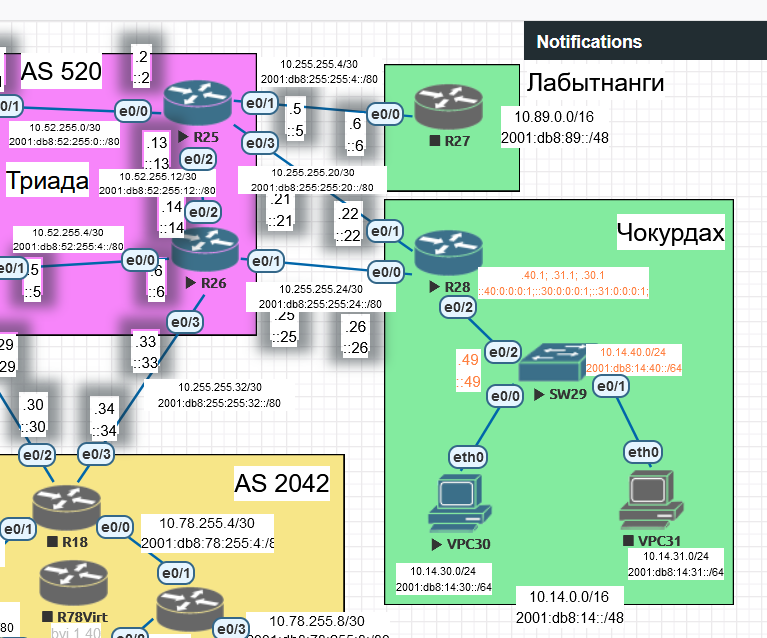

Настраиваем SW29 - адресация, VLAN, Trunking:

```
!
hostname SW29
!
vtp mode off
!
!
vlan 8
 name Native
!
vlan 30
 name VPC30
!
vlan 31
 name VPC31
!
vlan 40
 name Management
!
vlan 90
 name ParkingLot
!
interface Ethernet0/0
 switchport access vlan 30
 switchport trunk encapsulation dot1q
 switchport mode access
!
interface Ethernet0/1
 switchport access vlan 31
 switchport trunk encapsulation dot1q
 switchport mode access
!
interface Ethernet0/2
 switchport trunk allowed vlan 30,31,40
 switchport trunk encapsulation dot1q
 switchport trunk native vlan 8
 switchport mode trunk
!
interface Ethernet0/3
 switchport access vlan 90
 switchport trunk encapsulation dot1q
 switchport mode access
 shutdown
!
interface Vlan40
 ip address 10.14.40.49 255.255.255.0
 ipv6 address 2001:DB8:14:40::49/64
!
ip default-gateway 10.14.40.1
```

Настраиваем R28 - адресация, включение ipv6, dhcp, маршруты по умолчанию:

```
hostname R28
!
!
ip dhcp excluded-address 10.14.40.1
ip dhcp excluded-address 10.14.30.1
ip dhcp excluded-address 10.14.31.1
ip dhcp excluded-address 10.14.40.1 10.14.40.100
ip dhcp excluded-address 10.14.30.1 10.14.30.100
ip dhcp excluded-address 10.14.31.1 10.14.31.100
!
ip dhcp pool R28-VLAN30
 network 10.14.30.0 255.255.255.0
 default-router 10.14.30.1
!
ip dhcp pool R28-VLAN31
 network 10.14.31.0 255.255.255.0
 default-router 10.14.31.1
!
ipv6 unicast-routing
!
interface Ethernet0/0
 description ISP_0
 ip address 10.255.255.26 255.255.255.252
 ipv6 address FE80::2 link-local
 ipv6 address 2001:DB8:255:255:24::26/80
!
interface Ethernet0/1
 description ISP_1
 ip address 10.255.255.22 255.255.255.252
 ipv6 address FE80::2 link-local
 ipv6 address 2001:DB8:255:255:20::22/80
!
interface Ethernet0/2
 description LAN
 no ip address
!
interface Ethernet0/2.30
 description LAN_VLAN30
 encapsulation dot1Q 30
 ip address 10.14.30.1 255.255.255.0
 ipv6 address FE80::1 link-local
 ipv6 address 2001:DB8:14:30::1/64
!
interface Ethernet0/2.31
 description LAN_VLAN31
 encapsulation dot1Q 31
 ip address 10.14.31.1 255.255.255.0
 ipv6 address FE80::1 link-local
 ipv6 address 2001:DB8:14:31::1/64
!
interface Ethernet0/2.40
 description LAN_Management
 encapsulation dot1Q 40
 ip address 10.14.40.1 255.255.255.0
 ipv6 address FE80::1 link-local
 ipv6 address 2001:DB8:14:40::1/64
!
ip route 0.0.0.0 0.0.0.0 10.255.255.21
ip route 0.0.0.0 0.0.0.0 10.255.255.25
```

Настраиваем R25 - адресация, включение ipv6:

```
hostname R25
!
ipv6 unicast-routing
ipv6 cef
!
interface Ethernet0/0
 ip address 10.52.255.2 255.255.255.252
 ipv6 address FE80::2 link-local
 ipv6 address 2001:DB8:52:255::2/80
!
interface Ethernet0/1
 ip address 10.255.255.5 255.255.255.252
 ipv6 address FE80::1 link-local
 ipv6 address 2001:DB8:255:255:4::5/80
!
interface Ethernet0/2
 ip address 10.52.255.13 255.255.255.252
 ipv6 address FE80::1 link-local
 ipv6 address 2001:DB8:52:255:12::13/80
!
interface Ethernet0/3
 ip address 10.255.255.21 255.255.255.252
 ipv6 address FE80::1 link-local
 ipv6 address 2001:DB8:255:255:20::21/80
!
```

Настраиваем R26 - адресация, включение ipv6:

```
hostname R26
!
ipv6 unicast-routing
!
interface Ethernet0/0
 ip address 10.52.255.6 255.255.255.252
 ipv6 address FE80::2 link-local
 ipv6 address 2001:DB8:52:255:4::6/80
!
interface Ethernet0/1
 ip address 10.255.255.25 255.255.255.252
 ipv6 address FE80::1 link-local
 ipv6 address 2001:DB8:255:255:24::25/80
!
interface Ethernet0/2
 ip address 10.52.255.14 255.255.255.252
 ipv6 address FE80::2 link-local
 ipv6 address 2001:DB8:52:255:12::14/80
!
interface Ethernet0/3
 ip address 10.255.255.33 255.255.255.252
 ipv6 address FE80::1 link-local
 ipv6 address 2001:DB8:255:255:32::33/80
!
```

После данных настроек между маршрутизаторами R25, R26, R28 есть прямая связность. VPC30 связи с R25 и R26 не имеет, т.к. на них нет маршрута до подсети, в которой находится компьютер.

!!! Но при использовании ipv6 связь есть !!! Это глюк? 

## Настройка NAT на R28

**Создаем ACL для выделения нужного трафика** ???Правильная ли терминология???

```
ip access-list standard NAT
permit 10.14.0.0 0.0.255.255
exit
```

???Правильно ли, что создаем максимально широкий ACL??? Или стоит под каждую подсеть сделать свой???

При настройке NAT через двух провайдеров с помощью команды:

```
ip nat inside source list NAT interface e0/1
ip nat inside source list NAT interface e0/0 
```

в конфигурации остается только одна запись - последняя. Поэтому использование ACL для выхода в интернет через двух провайдеров не подходит. ???Это особенность виртуализации???

Убираем настройку:

```
no ip nat inside source list NAT interface e0/0
no ip nat inside source list NAT interface e0/1
```

Создаем route-map:

```
route-map NAT_ISP0 permit 10
match ip address NAT
exit

route-map NAT_ISP1 permit 10
match ip address NAT
exit
```

Задаем настройку трансляции:

```
ip nat inside source route-map NAT_ISP0 interface e0/0 overload
ip nat inside source route-map NAT_ISP1 interface e0/1 overload
```

Отмечаем интерфейсы как inside:

```
int range e0/2.30 - ethernet 0/2.40
ip nat inside
no int range e0/2.32 - ethernet 0/2.39
```

Отмечаем интерфейсы как outside:

```
int range e0/0 - 1
ip nat outside
```

Выполняем проверку связи с R25:
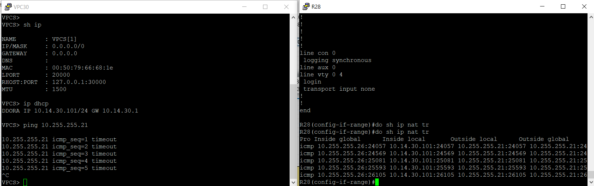

Таймаут. По таблице трансляции видим, что идет трансляция на адрес интерфейса маршрутизатора, который не подключен к цели. Соответственно, трансляция происходит неправильно.

---

Выполняем проверку связи с R26:
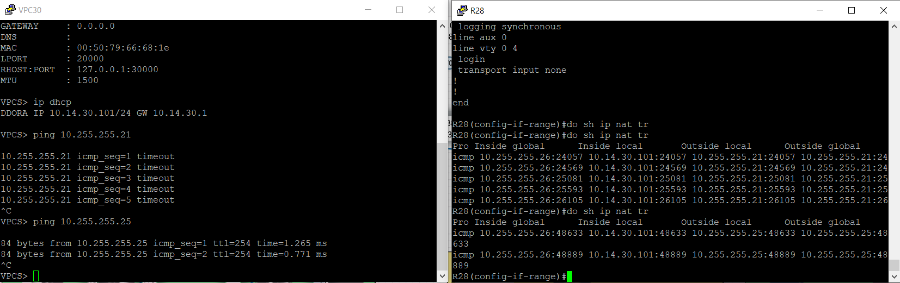

Связь есть, трансляция происходит правильно. Вывод - трансляция идет по первому правилу в конфиге - ip nat inside source route-map NAT_ISP0 interface Ethernet0/0 overload - через интерфейс E0/0.

Указываем в route-map дополнительную строку с выходным интерфейсом:

```
route-map NAT_ISP0 permit 10
match ip address NAT
match interface e0/0
exit

route-map NAT_ISP1 permit 10
match ip address NAT
match interface e0/1
exit
```

Работа через двух провайдеров минимально настроена. Связь есть:
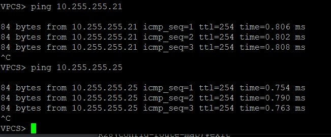

???В настройках route-map должен быть обязательно указан адрес выходного интерфейса, чтобы трансляция отрабатывала верно. Что значит эта строка? Route-map обычно в match interface рассматривает входной интерфейс, а для NAT подразумевается выходной и правило применяется после обычной маршрутизации???

## Распределение трафика между двумя провайдерами.

### Расширим список сетевых устройств. Добавим устройства R23 и R24

Нам нужен R23 для проверки пути до него при использовании двух провайдеров. Тестировать будем доступность обоих его интерфейсов. R24 будет являться промежуточным, поэтому настроим и его.

Настраиваем R23 - адресация, включение ipv6:

```
hostname R23
!
ipv6 unicast-routing
!
interface Ethernet0/0
 ip address 10.255.255.2 255.255.255.252
 ipv6 address FE80::2 link-local
 ipv6 address 2001:DB8:255:255::2/80
!
interface Ethernet0/1
 ip address 10.52.255.1 255.255.255.252
 ipv6 address FE80::1 link-local
 ipv6 address 2001:DB8:52:255::1/80
!
interface Ethernet0/2
 ip address 10.52.255.9 255.255.255.252
 ipv6 address FE80::1 link-local
 ipv6 address 2001:DB8:52:255:8::9/80
!
```

Настраиваем R24 - адресация, включение ipv6:

```
hostname R24
!
ipv6 unicast-routing
!
interface Ethernet0/0
 ip address 10.255.255.38 255.255.255.252
 ipv6 address FE80::2 link-local
 ipv6 address 2001:DB8:255:255:36::38/80
!
interface Ethernet0/1
 ip address 10.52.255.5 255.255.255.252
 ipv6 address FE80::1 link-local
 ipv6 address 2001:DB8:52:255:4::5/80
!
interface Ethernet0/2
 ip address 10.52.255.10 255.255.255.252
 ipv6 address FE80::2 link-local
 ipv6 address 2001:DB8:52:255:8::10/80
!
interface Ethernet0/3
 ip address 10.255.255.29 255.255.255.252
 ipv6 address FE80::1 link-local
 ipv6 address 2001:DB8:255:255:28::29/80
!
```

### Настроим статические маршруты на R25, R26 до R23

На R23 мы не можем добраться до R28:

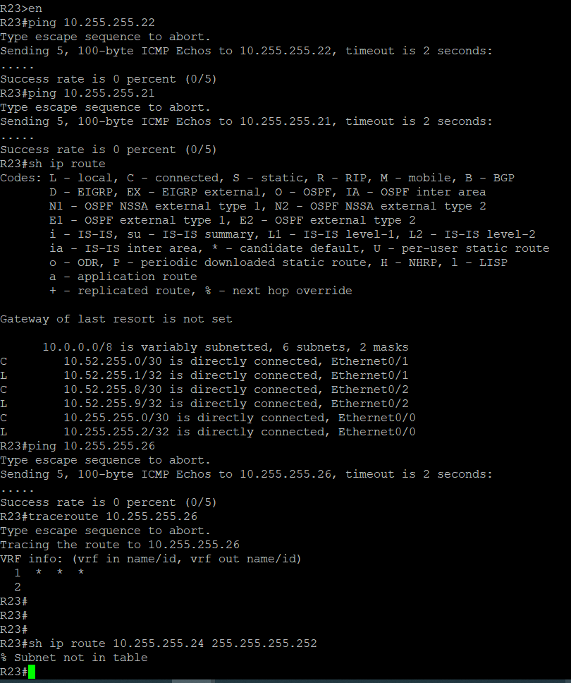

??? Почему не пишется, что нет маршрута??? Куда отправляются пакеты при ping и traceroute???

R25 - настроим маршрут до R23 e0/2 через R23:

```
ip route 10.52.255.8 255.255.255.252 10.52.255.1
```

На R23 укажем маршут до R28 e0/1 через R25 и маршрут до R28 e0/0 через R24; также маршрут до R26 e0/0:

```
ip route 10.255.255.20 255.255.255.252 10.52.255.2
ip route 10.255.255.24 255.255.255.252 10.52.255.10
ip route 10.255.255.4 255.255.255.252 10.52.255.10
```

На R24 укажем маршрут до R28 e0/0 через R26 и до R23 e0/1 через R23:

```
ip route 10.255.255.24 255.255.255.252 10.52.255.6
ip route 10.52.255.0 255.255.255.252 10.52.255.9
```

На R26 укажем маршрут до R23 0/1-2 через R24:

```
ip route 10.52.255.8 255.255.255.252 10.52.255.5
ip route 10.52.255.0 255.255.255.252 10.52.255.5
```

---

Проверяем связь:
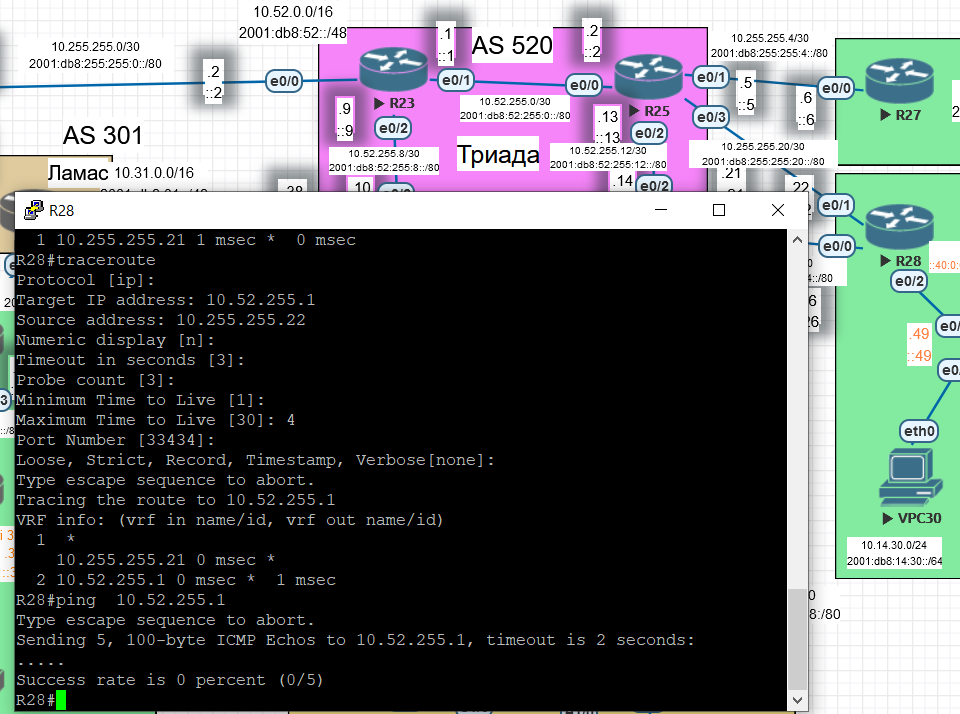

???Почему traceroute работает правильно, но ping нет???

---

После проверки с VPC30 все удивительным образом заработало:
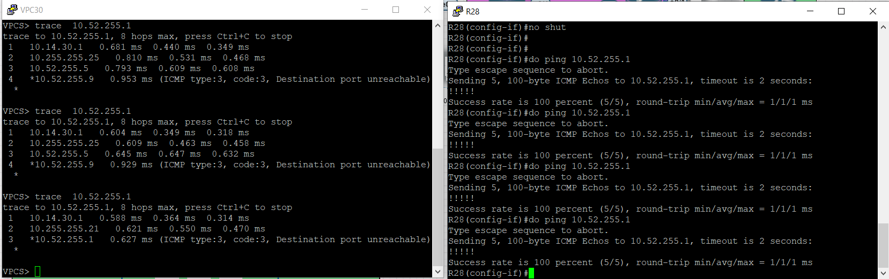

---

### Настройка распределения трафика между провайдерами

Распределение трафика между двумя провайдерами возможно несколькими путями:

1. Через статические маршруты по умолчанию. Будет работать балансировка, если у обоих маршрутов будет одинаковая AD.

2. Один провайдер основной, второй резервный и задействуется при аварии у первого.

3. Через PBR направляем часть трафика через одного провайдера, часть через другого. Однако при аварии у одного из них потребуется менять route-map, чтобы трафик шел через другого провайдера.
   
   Реализуем третий вариант.

До распределения трафика маршрут выбирался без нашего контроля:
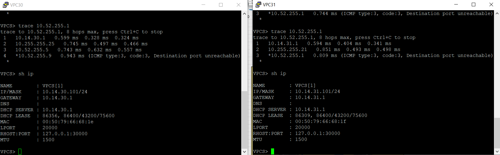

Настроим вариант, при котором трафик из четных подсетей пойдет через 10.255.255.21 - ISP1, а трафик из нечетных - через 10.255.255.25 - ISP0.

Создаем ACL:

```
no ip access-list standard SUBNET-EVEN

no ip access-list standard SUBNET-ODD

ip access-list standard SUBNET-EVEN

permit 10.14.0.0 0.0.254.255

exit

ip access-list standard SUBNET-ODD

permit 10.14.1.0 0.0.254.255

exit
```

Создаем route-map, которую будем навешивать на каждый интерфейс:

```
no route-map ISP-BALANCING
route-map ISP-BALANCING permit 10
match ip address SUBNET-ODD
set ip next-hop 10.255.255.25
route-map ISP-BALANCING permit 20
match ip address SUBNET-EVEN
set ip next-hop 10.255.255.21
exit
```

Навешиваем их на интерфейсы:

```
int range ethernet 0/2.30 - ethernet 0/2.40
no ip policy route-map ISP-BALANCING
ip policy route-map ISP-BALANCING
no int range ethernet 0/2.32 - ethernet 0/2.39
```

---

Если же в route-map добавить правило:

```
route-map ISP-BALANCING permit 30

set ip next-hop 10.255.255.21

exit
```

После этого клиентам не выдается dhcp:

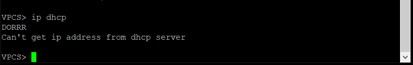

Почему??? Заключительный пакет от маршрутизатора не приходит???

---

Результат:

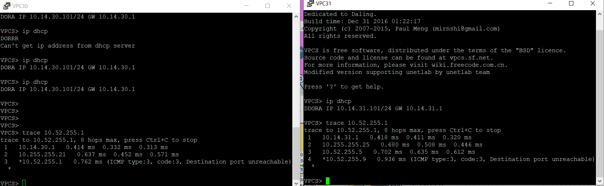

Из четной подсети трафик стал идти через 10.255.255.21 - ISP1, а трафик из нечетных  через 10.255.255.25 - ISP0.

Если мы будем гасить линки провайдеров, то next-hop, указанный в route-map, пропадет из доступности, и видимо в этом случае clause будет пропущен - трафик начнет автоматически идти через маршрут по умолчанию:

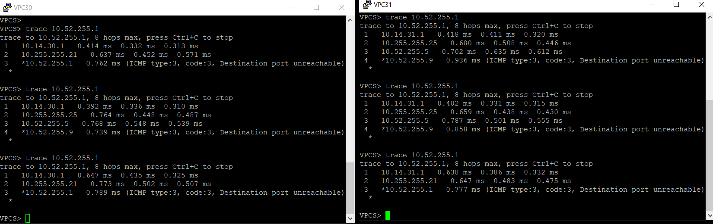

---

Если же линк будет поднят, но далее по пути будет отсутствовать связность (гасим на R25 линк e0/0):

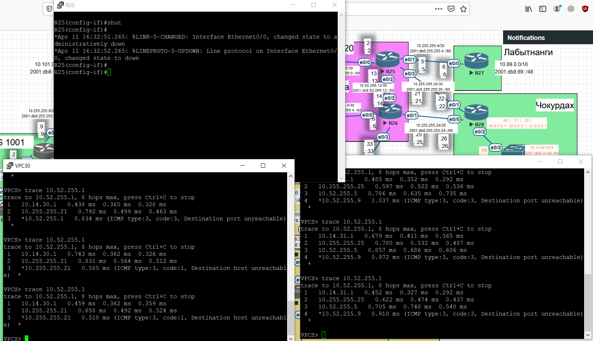

Пакеты с R28 будут уходить в сторону сбойного пути. Ответов не будет получено.

## Настройка отслеживания

Не забываем включить обратно на R25 интерфейс e0/0.

На R28 добавляем отслеживание работы провайдеров. 

SLA:

```
ip sla 1
icmp-echo 10.52.255.1 source-interface Ethernet0/0
frequency 10
ip sla schedule 1 life forever start-time now

exit

ip sla 2
icmp-echo 10.52.255.1 source-interface Ethernet0/1
frequency 10
ip sla schedule 2 life forever start-time now

exit

```

Создаем треки:

```
track 1 ip sla 1 reachability
track 2 ip sla 2 reachability
```

Удаляем старые маршруты и добавляем их повторно с треками:

```
no ip route 0.0.0.0 0.0.0.0 10.255.255.21
no ip route 0.0.0.0 0.0.0.0 10.255.255.25


ip route 0.0.0.0 0.0.0.0 10.255.255.25 name ISP0 track 1
ip route 0.0.0.0 0.0.0.0 10.255.255.21 name ISP1 track 2
```

Для проверки гасим линк R25 e0/0

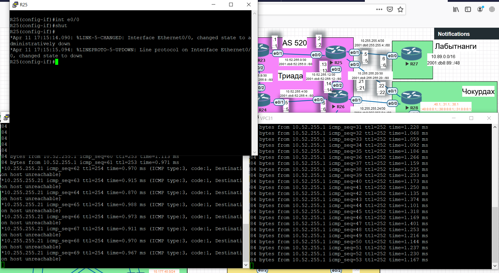

Связь пропадает; после удаления маршрута по трэку не восстанавливается. Причина - маршрут в R28 до следующего хопа по-прежнему доступен. Поэтому route-policy продолжает направлять пакеты в сторону этого хопа с неисправным провайдером.

Для выхода из сутации мы можем использовать Event manager - удалять из route-policy пункт, соответствующий этому провайдеру. После восстановления связи - возвращать пункт обратно:

```
event manager applet ISP0_DOWN
 event track 1 state down
 action 001 cli command "enable"
 action 002 cli command "conf t"
 action 003 cli command "no route-map ISP-BALANCING permit 10"
 action 004 cli command "end"
exit


event manager applet ISP1_DOWN
 event track 2 state down
 action 001 cli command "enable"
 action 002 cli command "conf t"
 action 003 cli command "no route-map ISP-BALANCING permit 20"
 action 004 cli command "end"
exit


event manager applet ISP0_UP
 event track 1 state up
 action 001 cli command "enable"
 action 002 cli command "conf t"
 action 003 cli command "route-map ISP-BALANCING permit 10"
 action 004 cli command "match ip address SUBNET-ODD"
 action 005 cli command "set ip next-hop 10.255.255.25"
 action 006 cli command "end"
exit


event manager applet ISP1_UP
 event track 2 state up
 action 001 cli command "enable"
 action 002 cli command "conf t"
 action 003 cli command "route-map ISP-BALANCING permit 20"
 action 004 cli command "match ip address SUBNET-EVEN"
 action 005 cli command "set ip next-hop 10.255.255.21"
 action 006 cli command "end"
exit
```

**Проверяем**

На маршруте провайдеров все в порядке:

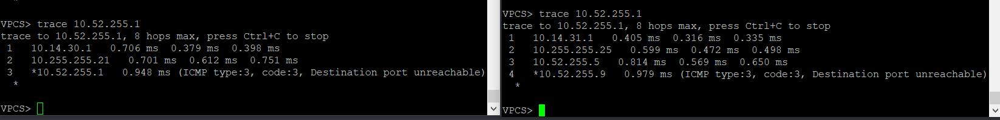

Гасим линк R24 e0/1 на пути у провайдера ISP0:

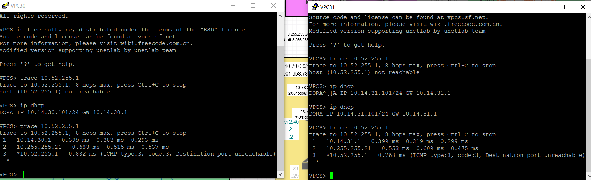

Включаем обратно:
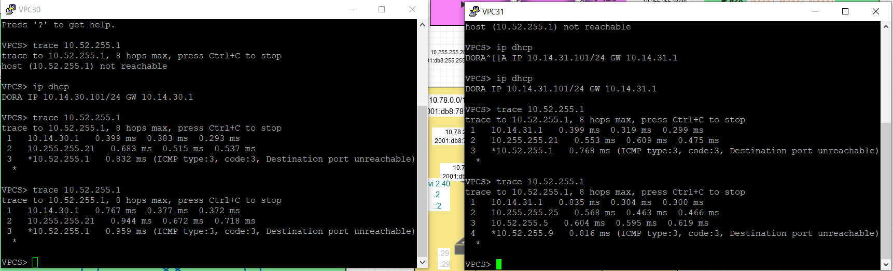

Гасим линк R25 e0/0:

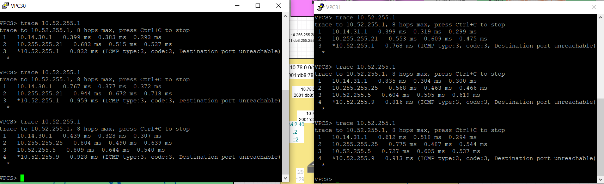

Включаем обратно:

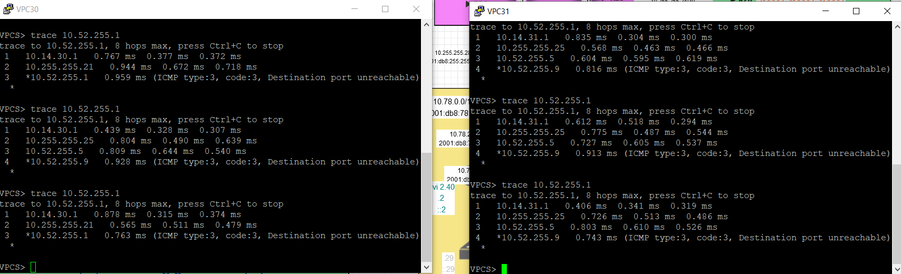

Переключение работает, как и было задумано.

???Однако была ситуация, когда даже при включенном линке на одном из путей провайдера пинг до целевого узла не доходил (не было маршрута, т.к. при погашенном по пути линке маршрут выбрасывается).  Пришлось руками прописать маршрут, дождаться поднятия трека и удалить маршрут, т.к. после трека нужный маршрут был восстановлен.

Вопрос - это сбой виртуализации? Или действительно проблема?

Вопрос - в качестве источинка запроса sla указываем интерфейс или ip?

Т.е. логика такая:

1. Есть маршрут до целевого узла через провайдера, с треком.

2. Маршут отслеживается через sla c указанием интерфейса, с которого отправляются пробы.

3. Если ответов нет, то маршрут удаляется.

4. Как дальше проверять связь до целевого узла, если маршрут до него через следующий хоп удален? Даже если проблемы у провайдера прошли, у нас все равно с этого интерфейса не может быть отправлен запрос, т.к. нет маршута.  
