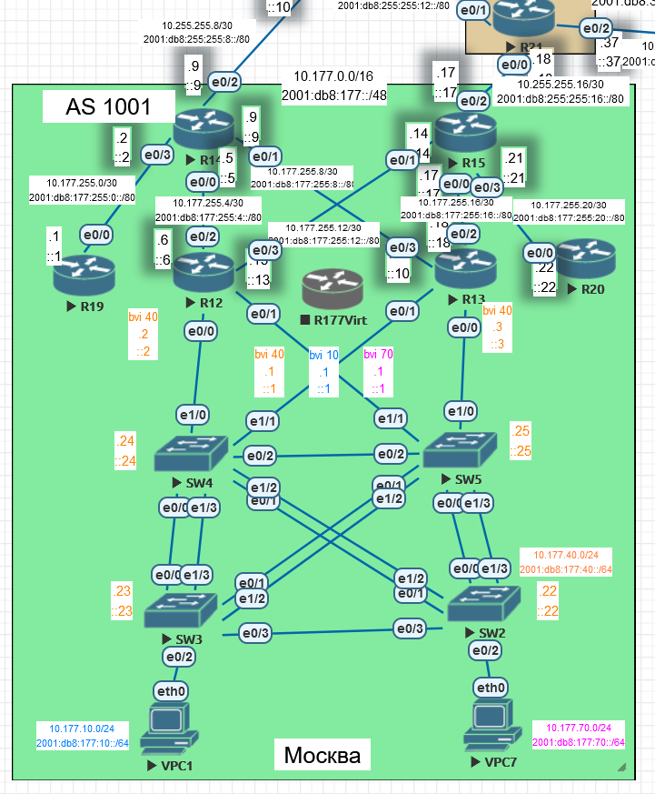
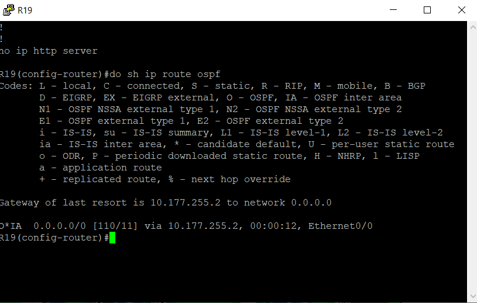
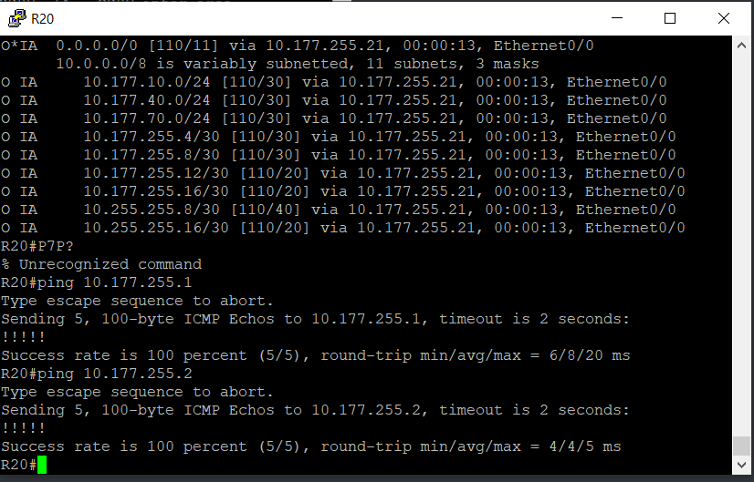

# OSPF. Фильтрация

Цель:

Настроить OSPF офисе Москва
Разделить сеть на зоны
Настроить фильтрацию между зонами

1. Маршрутизаторы R14-R15 находятся в зоне 0 - backbone
2. Маршрутизаторы R12-R13 находятся в зоне 10. Дополнительно к маршрутам должны получать маршрут по-умолчанию
3. Маршрутизатор R19 находится в зоне 101 и получает только маршрут по умолчанию
4. Маршрутизатор R20 находится в зоне 102 и получает все маршруты, кроме маршрутов до сетей зоны 101
5. Настройка для IPv6 повторяет логику IPv4
6. План работы и изменения зафиксированы в документации

Документация оформлена на github. (желательно использовать markdown)

Схема офиса в Москве:



[Настройка OSPF](#head1)

* [Настройка R12-13 на OSPF в зоне 10](#head3)
* [Настройка R14-15 на OSPF в зоне 0](#head4)
* [Настраиваем виртуальный линк между R14-15](#head5)
* [Настраиваем R12 и R13 на получения маршрута по умолчанию](#head6)
* [Маршрутизатор R19 находится в зоне 101 и получает только маршрут по умолчанию](#head7)
* [Маршрутизатор R20 находится в зоне 102 и получает все маршруты, кроме маршрутов до сетей зоны 101](#head8)

[Настройка OSPFv3](#head2)

* [Настройка R12-13 на OSPF в зоне 10](#head9)
* [Настройка R14-15 на OSPF в зоне 0](#head10)
* [Настраиваем виртуальный линк между R14-15](#head11)
* [Настраиваем R12 и R13 на получения маршрута по умолчанию](#head12)
* [Маршрутизатор R19 находится в зоне 101 и получает только маршрут по умолчанию](#head13)
* [Маршрутизатор R20 находится в зоне 102 и получает все маршруты, кроме маршрутов до сетей зоны 101](#head14)


[Изменение топологии](#head100)
* [Установка L3-коммутаторов](#head100)
* [Базовая настройка SW12-13](#head105)
* [Настраиваем SVI 10, 40, 70, 100](#head105)
* [Настраиваем SVI 10, 40, 70, 100](#head110)
* [Настраиваем вышестоящие маршрутизаторы R14-15](#head120)
* [Включаем OSPF на SW12-13](#head125)


[Конфигурации устройств](configs)

# <a name="head1"></a> Настройка OSPF

## <a name="head3"></a> Настройка R12-13 на OSPF в зоне 10

R12

```
en
conf t
router ospf 1
router-id 10.0.0.12
passive-interface default
no passive-interface Ethernet 0/2
no passive-interface Ethernet 0/3
no passive-interface BVI 40


int range e0/2-3
ip ospf 1 area 10


int BVI10
ip ospf 1 area 10

int BVI40
ip ospf 1 area 10

int BVI70
ip ospf 1 area 10


end
wr
```

R13

```
en
conf t
router ospf 1
router-id 10.0.0.13
passive-interface default
no passive-interface Ethernet 0/2
no passive-interface Ethernet 0/3
no passive-interface BVI 40


int range e0/2-3
ip ospf 1 area 10


int BVI10
ip ospf 1 area 10

int BVI40
ip ospf 1 area 10

int BVI70
ip ospf 1 area 10


end
wr
```

## <a name="head4"></a> Настройка R14-15 на OSPF в зоне 0

R14

```
en
conf t
router ospf 1
router-id 0.0.0.14
passive-interface default
no passive-interface Ethernet 0/0
no passive-interface Ethernet 0/1
no passive-interface Ethernet 0/2
no passive-interface Ethernet 0/3


int e0/2
ip ospf 1 area 0


int e0/0
ip ospf 1 area 10

int e0/1
ip ospf 1 area 10


end
wr
```

R15

```
en
conf t
router ospf 1
router-id 0.0.0.15
passive-interface default
no passive-interface Ethernet 0/0
no passive-interface Ethernet 0/1
no passive-interface Ethernet 0/2
no passive-interface Ethernet 0/3


int e0/2
ip ospf 1 area 0


int e0/0
ip ospf 1 area 10

int e0/1
ip ospf 1 area 10


end
wr
```

Смотрим соседей:


Соседства с маршутизатором 14 нет, т.к. нет прямого линка с ним. 

Смотрим маршруты:


Маршрутизатор 15 (мы настроили его интерфейс E0/2 на зону 0, E0/0-1на зону 10)  получает маршруты от зоны 10 (строки O), и маршут из зоны тоже 0, но маршрут считается маршрутом до сети в другой зоне, т.к. между маршрутизаторами 15 и 14, от которого пришел маршут, нет прямой связи. Нужно построить виртуальный линк, тогда маршрутизаторы 14 и 15 окажутся в одной зоне 0.

## <a name="head5"></a> Настраиваем виртуальный линк между R14-15

R14

```
en
conf t
router ospf 1
area 10 virtual-link 0.0.0.15
```

R15

```
en
conf t
router ospf 1
area 10 virtual-link 0.0.0.14
```

После настроек маршутизаторы стали соседями:


После настроек таблица маршутизации изменилась:


Маршрутизаторы R14-15 обмениваются маршрутной информацией в рамках одной зоны. 


## <a name="head6"></a> Настраиваем R12 и R13 на получения маршрута по умолчанию

Сейчас маршрута по умолчанию в зоне 10 нет:


Маршрутизаторы зоны 10 должны получать ко всем маршрутам еще и маршрут по умолчанию. Это можно сделать двумя способами:

1. На маршрутизаторах зоны 0 задать команду default-information originate. Но в этом случае потребуется задавать маршрут по-умолчанию на данных маршрутизаторах.

2. Зону 10 объявить STUB - пограничные маршрутизаторы станут транслировать в зону 10 себя в качестве шлюзов последней надежды. Однако поскольку виртуальные линки идут через зону, то ее мы не может настроить как STUB.
   
   Реализуем первый вариант, для этого на маршрутизаторах зоны 0 настроим марштуты по умолчанию и передачу маршрутов по умолчанию в зоны (причем во все, т.к. выборочно можно передавать только в зоны STUB и NSSA).
   
   R14:

```
en
conf t
ip route 0.0.0.0 0.0.0.0 10.255.255.10 
router ospf 1
default-information originate
end
wr
```

   R15:

```
en
conf t
ip route 0.0.0.0 0.0.0.0 10.255.255.18 
router ospf 1
default-information originate
end
wr
```

Смотрим, что получили маршутизаторы зоны 10:


Видим, что маршрутизаторы получают машруты из своей зоны (O), из соседних зон (O IA), и маршрут, изначально сформированный вне процесса OSPF, но затем переданный уже в рамках OSPF. Поскольку зона 10 нормальная, то ей сообщают, что маршрут по умолчанию изначально получен не из процесса OSPF, через LSA5. Если это зона STUB, то маршрут будет O*IA, получен через LSA3 - будто бы все маршруты находятся в пределах автономной системы, но в других зонах.

## <a name="head7"></a> Маршрутизатор R19 находится в зоне 101 и получает только маршрут по умолчанию

Данному условию удовлетворяет зона Totally Stubby.

R19:

```
en
conf t
router ospf 1
router-id 101.0.0.19
passive-interface default
no passive-interface e0/0
area 101 stub
exit
int e0/0
ip ospf 1 area 101
end
wr
```

R14:

```
en
conf t
router ospf 1
no passive-interface e0/3
area 101 stub no-summary
exit
int e0/3
ip ospf 1 area 101
end
wr
```

Смотрим маршрут на R19:



O*IA говорит о том, что маршрут получен по OSPF. Причем, он отображается не как E2, т.к. в зону запрещены LSA5. В зону приходит LSA3, что и отмечается в таблице как IA.

## <a name="head8"></a> Маршрутизатор R20 находится в зоне 102 и получает все маршруты, кроме маршрутов до сетей зоны 101

Задача разбивается на два этапа - определить тип зоны, а затем выполнить фильтрацию.

Тип зоны нам подойдет и Stubby, и Normal. Ограничимся Stubby.

R20:

```
en
conf t
router ospf 1
router-id 102.0.0.20
passive-interface default
no passive-interface e0/0
area 102 stub
exit
int e0/0
ip ospf 1 area 102
end
wr
```

R15:

```
en
conf t
router ospf 1
no passive-interface e0/3
area 102 stub
exit
int e0/3
ip ospf 1 area 102
end
wr
```

Результат:


Маршрутизатор видит сети внутри автономной системы и получает маршут по умолчанию.

Нам нужно исключить маршруты до сетей зоны 101 - 10.177.255.0, сейчас этот маршрут есть. И связь есть:


Будем осуществлять фильтрацию на ABR R15 в зону 102, соответственно это входящее направление. 

R15:

```
en
conf t
ip prefix-list FILTER_AREA_101 permit 10.177.255.0/30
router ospf 1
area 102 filter-list prefix FILTER_AREA_101 in
```

Выстрел в ногу:


Разрешили только 10.177.255.0.30 вместо запрещения, остальные префиксы не проходят.

Возвращаем, как было:

R15:

```
en
conf t
no ip prefix-list FILTER_AREA_101 permit 10.177.255.0/30
router ospf 1
no area 102 filter-list prefix FILTER_AREA_101 in
```


И делаем, как надо:

R15:

```
en
conf t
ip prefix-list FILTER_FROM_AREA_101 seq 10 deny 10.177.255.0/30
ip prefix-list FILTER_FROM_AREA_101 seq 20 permit 0.0.0.0/0 le 32

router ospf 1
area 102 filter-list prefix FILTER_FROM_AREA_101 in
```

Мы определили префикс-лист с запретом и обязательным разрешением остальных подсетей. Фильтр навешивается для зоны 102 в ее направлении.

Результат:


Префикса нет, но есть маршрут по умолчанию. Проверяем, будет ли связность с сетью, до который не прописан маршрут:



Есть, поскольку пакеты отправляются на шлюз последней надежды.

Вопрос???? Зачем фильтрвать префиксы??? Зачем в зоне stub вообще нужно отображать столько маршрутов, лучше все заменить на дефолт

# <a name="head2"></a> OSPFv3

Делаем все то же самое для ipv6.

## <a name="head9"></a> Настройка R12-13 на OSPFv3 в зоне 10

R12:

```
en
conf t
router ospfv3 1
router-id 10.0.0.12
passive-interface default
no passive-interface e0/2
no passive-interface e0/3
no passive-interface BVI 40


int range e0/2-3
ipv6 ospf 1 area 10


int BVI 10
ipv6 ospf 1 area 10

int BVI 40
ipv6 ospf 1 area 10

int BVI 70
ipv6 ospf 1 area 10

end

wr
```

R13:

```
en
conf t
router ospfv3 1
router-id 10.0.0.13
passive-interface default
no passive-interface e0/2
no passive-interface e0/3
no passive-interface BVI 40


int range e0/2-3
ipv6 ospf 1 area 10


int BVI 10
ipv6 ospf 1 area 10

int BVI 40
ipv6 ospf 1 area 10

int BVI 70
ipv6 ospf 1 area 10

end

wr
```

## <a name="head10"></a> Настройка R14-15 на OSPFv3 в зоне 0

R14:

```
en
conf t
router ospfv3 1
router-id 0.0.0.14
passive-interface default
no passive-interface e0/0
no passive-interface e0/1
no passive-interface e0/2
no passive-interface e0/3

int range e0/0-1
ipv6 ospf 1 area 10


int e0/2
ipv6 ospf 1 area 0


end

wr
```

R15:

```
en
conf t
router ospfv3 1
router-id 0.0.0.15
passive-interface default
no passive-interface e0/0
no passive-interface e0/1
no passive-interface e0/2
no passive-interface e0/3

int range e0/0-1
ipv6 ospf 1 area 10


int e0/2
ipv6 ospf 1 area 0


end

wr
```

Смотрим соседей R14-15:


Эти машрутизаторы не видят друг друга, т.к. прямого линка между ними нет.

## <a name="head11"></a> Настраиваем виртуальный линк между R14-15

Здесь появляется отличие в синтаксисе с ipv4 - необходимо проходить в address-family ipv6. ???Зачем???

R14:

```
en
conf t
router ospfv3 1
address-family ipv6
area 10 virtual-link 0.0.0.15
end
wr
```

R15:

```
en
conf t
router ospfv3 1
address-family ipv6
area 10 virtual-link 0.0.0.14
end
wr
```

Маршрутизаторы друг друга видят:


Маршрутами обмениваются:


## <a name="head12"></a> Настраиваем R12 и R13 на получения маршрута по умолчанию

Как было сказано в секции настройки OSPFv2, для передачи маршрута по умолчанию создадим его на маршрутизаторах зоны 0 и будем транслировать его во все зоны.

R14:

```
en
conf t
ipv6 route ::/0 2001:db8:255:255:8::10
router ospfv3 1
address-family ipv6
default-information originate

end
wr
```

R15:

```
en
conf t
ipv6 route ::/0 2001:db8:255:255:16::18
router ospfv3 1
address-family ipv6
default-information originate

end
wr
```

Проверяем, что пришло на R12-13:


Маршруты по умолчанию пришли, что и требовалось получить.

## <a name="head13"></a> Маршрутизатор R19 находится в зоне 101 и получает только маршрут по умолчанию

Настраиваем интферфейс R14 e0/3 как находящейся в зоне 101, саму зону - totally stub.

R14:

```
en
conf t
int e0/3
ipv6 ospf 1 area 101 
exit


router ospfv3 1
area 101 stub no-summary

end

wr
```

На R19 настраиваем интерфейс e0/0 как находящийся в зоне 101, зону 101 - stub. Плюс начальные настройки OSPFv3

R19:

```
en
conf t
router ospfv3 1
router-id 101.0.0.19
passive-interface default
no passive-interface e0/0
area 101 stub
exit

int e0/0
ipv6 ospf 1 area 101

end

wr
```

Результат:


Почему запись отличается от ip route ospf в плане кода??? Здесь указан маршут без символа *.

## <a name="head14"></a> Маршрутизатор R20 находится в зоне 102 и получает все маршруты, кроме маршрутов до сетей зоны 101

Зону маршрутизатора R20 настраиваем как stub, для этого потребуется настройка и R15.

R15:

```
en
conf t
router ospfv3 1
area 102 stub


exit

int e0/3
ipv6 ospf 1 area 102

end 

wr
```

R20:

```
en
conf t
router ospfv3 1
router-id 102.0.0.20
passive-interface default
no passive-interface e0/0
area 102 stub

exit


interface e0/0
ipv6 ospf 1 area 102

end
wr
```

Результат - получаем все маршруты, включая маршрут по умолчанию:


Чтобы отфильтрвать маршрут до 2001:db8:177:255:0::/80, настраиваем R15.

R15:

```
en
conf t
ipv6 prefix-list FILTER_FROM_AREA_101 seq 10 deny 2001:db8:177:255:0::/80
ipv6 prefix-list FILTER_FROM_AREA_101 seq 20 permit ::/0 le 128

router ospfv3 1
address-family ipv6
area 102 filter-list prefix FILTER_FROM_AREA_101 in

end
wr
```

Смотрим результат на R20:


Маршрут не пришел, фильтрация отработала.

#  <a name="head100"></a>  Изменение топологии


Виртуальные линки R14-15 являются временным решением. Пришла пора это исправить. В качестве альтернативы возможны варианты:

- Добавить прямое соединение между маршрутизаторами. Потребуется замена маршрутизаторов либо установка плат расширения для увеличения количества портов. Для виртуальной лаборатории абсолютно не сложно. Поэтому вариант отложим.

- Расширить нулевую зону до R12-15.  Если рассматривать R14-15 не как Core и R12-13 как Distribution, то получим Collapsed Core, применимый для не больших сетей. В нем допустимо суммировать, к нему допустимо подключать другие сегменты напрямую, без Distribution-прослойки. Вариант также простой, но в дальнейшем возможно придется все же вводить разделение на Core и Distribution. Так что для практики рассмотрим третий вариант.

- Заменить R12-13 на L3-коммутаторы. В реальности будет дороже 2го варианта (возможно и 1го тоже), в лабораторной будет сложнее 1го и 2го вариантов. Но позволит подготовить архитектуру к масшатабированию и отработать на практике нужные операции. Остановимся на нем. Измененная схема:
  
  


Комментарии к новой схеме:

- R12-13 заменены на SW12-13 уровня L3.

- От маршрутизаторов пропали0 прямые линки, для которых зарезервированы минимальные сети /30. Появились линки R14-SW12-R15 и R14-SW13-R15. Каждому узлу нужен свой адрес, т.к. на коммутаторах также  требуется адесация - они будут выполнять маршрутизацию и участвовать в процессе OSPF, для этого нужен L3-адрес. Поэтому для этих двух пар связей выбраны адреса из сетей /29. Изменения затронули линк R14-R19 10.177.255.0/30 - его тоже придется поменять, на линк 10.177.255.12/30.  

##  <a name="head105"></a> Базовая настройка SW12-13

Меняем R12-13 на SW12-13. Осуществляем базовую настройку - hostname, stp, vlan, interfaces, SVI. LAG настраивать не будем - у SW4-5 не хватит свободных портов (остался один, оставим для расширения), между собой SW12-13 не должны общаться.

SW12:

```
enable
conf t
hostname SW12

spanning-tree mode rapid-pvst

vtp mode off
vlan 8
name Native
exit
vlan 10
name Operations
exit
vlan 40
name Management
exit
vlan 70
name Developers
exit
vlan 90
name ParkingLot
exit

vlan 100
name InterRouterTrunk
exit


int range e0/0-1
switchport trunk encapsulation dot1q
switchport mode trunk
switchport trunk native vlan 8
switchport trunk allowed vlan 10,40,70
no shutdown
exit

int range e0/2-3
switchport trunk encapsulation dot1q
switchport mode trunk
switchport trunk native vlan 100
no shutdown
exit


int range e1/0-3
shutdown
exit

end
wr
```

SW13:

```
enable
conf t
hostname SW13

spanning-tree mode rapid-pvst

vtp mode off
vlan 8
name Native
exit
vlan 10
name Operations
exit
vlan 40
name Management
exit
vlan 70
name Developers
exit
vlan 90
name ParkingLot
exit

vlan 100
name InterRouterTrunk
exit


int range e0/0-1
switchport trunk encapsulation dot1q
switchport mode trunk
switchport trunk native vlan 8
switchport trunk allowed vlan 10,40,70
no shutdown
exit

int range e0/2-3
switchport trunk encapsulation dot1q
switchport mode trunk
switchport trunk native vlan 100
no shutdown
exit


int range e1/0-3
shutdown
exit

end
wr
```

##  <a name="head110"></a>  Настраиваем SVI 10, 40, 70, 100

Виртуальные интерфейсы нужны для межвлановой маршрутизации, включения dhcp и OSPF. Как и раньше - vlan 10,40,70 используются для маршрутизации во внутренние сети. Vlan 100 создан для изоляции трафика между R14-15. Попутно настраиваем HSRP.

SW12:

```
en

conf t

int vlan 40
ip address 10.177.40.2 255.255.255.0
ipv6 address 2001:db8:177:40::2/64

standby version 2
standby 0 ip 10.177.40.1
standby 1 ipv6 2001:DB8:177:40::1/64
no shut
exit

int vlan 10
ip address 10.177.10.2 255.255.255.0
ipv6 address 2001:db8:177:10::2/64


standby version 2
standby 0 ip 10.177.10.1
standby 1 ipv6 2001:DB8:177:10::1/64
no shut
exit

int vlan 70
ip address 10.177.70.2 255.255.255.0
ipv6 address 2001:db8:177:70::2/64
standby version 2
standby 0 ip 10.177.70.1
standby 1 ipv6 2001:DB8:177:70::1/64


no shut
exit


int vlan 100
ip address 10.177.255.2 255.255.255.248
ipv6 address 2001:db8:177:255:0::2/80
no shut
exit


ip routing

no ip domain-lookup

ipv6 unicast-routing


ip dhcp excluded-address 10.177.10.1 10.177.10.100
ip dhcp excluded-address 10.177.70.1 10.177.70.100

ip dhcp pool POOL-VLAN-10
network 10.177.10.0 255.255.255.0
default-router 10.177.10.1 

ip dhcp pool POOL-VLAN-70
network 10.177.70.0 255.255.255.0
default-router 10.177.70.1 


end


wr
```

SW13:

```
en

conf t

int vlan 40
ip address 10.177.40.3 255.255.255.0
ipv6 address 2001:db8:177:40::3/64
standby version 2
standby 0 ip 10.177.40.1
standby 1 ipv6 2001:DB8:177:40::1/64

no shut
exit

int vlan 10
ip address 10.177.10.3 255.255.255.0
ipv6 address 2001:db8:177:10::3/64
standby version 2
standby 0 ip 10.177.10.1
standby 1 ipv6 2001:DB8:177:10::1/64

no shut
exit

int vlan 70
ip address 10.177.70.3 255.255.255.0
ipv6 address 2001:db8:177:70::3/64
standby version 2
standby 0 ip 10.177.70.1
standby 1 ipv6 2001:DB8:177:70::1/64

no shut
exit


int vlan 100
ip address 10.177.255.10 255.255.255.248
ipv6 address 2001:db8:177:255:8::10/80
no shut
exit


ip routing

no ip domain-lookup

ipv6 unicast-routing


ip dhcp excluded-address 10.177.10.1 10.177.10.100
ip dhcp excluded-address 10.177.70.1 10.177.70.100

ip dhcp pool POOL-VLAN-10
network 10.177.10.0 255.255.255.0
default-router 10.177.10.1 

ip dhcp pool POOL-VLAN-70
network 10.177.70.0 255.255.255.0
default-router 10.177.70.1 


end


wr
```

Аналогично проверке работы маршрутизаторов, которые были ранее, выполняем проверку работы L3-коммутаторов - выдачу dhcp, автоматический переход на резервный в случае неработоспособности текущего шлюза:


##  <a name="head120"></a> Настраиваем вышестоящие маршрутизаторы R14-15

Поскольку интерфейсы каждого маршрутизатора подключены к SVI, то старого адресного пространства не хватает (4 адреса), поменяем адресацию. Также уберем виртуальные линки.

R14:

```
en
conf t

router ospf 1
no area 10 virtual-link 0.0.0.15


router ospfv3 1
address-family ipv6
no area 10 virtual-link 0.0.0.15


interface Ethernet0/3
 no ip address 10.177.255.2 255.255.255.252
 ip address 10.177.255.18 255.255.255.252
 ip ospf 1 area 101
 no ipv6 address 2001:DB8:177:255::2/8
 ipv6 address 2001:DB8:177:255:16::18/80
 ipv6 ospf 1 area 101


interface Ethernet0/0
 no ip address 10.177.255.5 255.255.255.252
 ip address 10.177.255.1 255.255.255.248
 ip ospf 1 area 0
 no ipv6 address 2001:DB8:177:255:4::5/80
 ipv6 address 2001:DB8:177:255:0::1/80
 ipv6 ospf 1 area 0


interface Ethernet0/1
 no ip address 10.177.255.9 255.255.255.252
 ip address 10.177.255.9 255.255.255.248
 ip ospf 1 area 0
 no ipv6 address 2001:DB8:177:255:8::9/80
 ipv6 address 2001:DB8:177:255:8::9/80
 ipv6 ospf 1 area 0


end

wr
clear ip ospf process
```

R15:

```
en
conf t

router ospf 1
area 10 virtual-link 0.0.0.14


router ospfv3 1
address-family ipv6
no area 10 virtual-link 0.0.0.14


interface Ethernet0/1
 no ip address 10.177.255.14 255.255.255.252
 ip address 10.177.255.3 255.255.255.248
 ip ospf 1 area 0
 no ipv6 address 2001:DB8:177:255:12::14/80
 ipv6 address 2001:DB8:177:255:0::3/80
 ipv6 ospf 1 area 0


interface Ethernet0/0
 no ip address 10.177.255.17 255.255.255.252
 ip address 10.177.255.11 255.255.255.248
 ip ospf 1 area 0
 no ipv6 address 2001:DB8:177:255:16::17/80
 ipv6 address 2001:DB8:177:255:8::11/80
 ipv6 ospf 1 area 0


end
wr
clear ip ospf process
```

##  <a name="head125"></a> Включаем OSPF на SW12-13

SW12:

```
en
conf t
router ospf 1
router-id 10.0.0.12
passive-interface default
no passive-interface VLAN 40
no passive-interface VLAN 100


int vlan 40
ip ospf 1 area 10
ipv6 ospf 1 area 10
int vlan 10
ip ospf 1 area 10
ipv6 ospf 1 area 10
int vlan 70
ip ospf 1 area 10
ipv6 ospf 1 area 10
int vlan 100
ip ospf 1 area 0
ipv6 ospf 1 area 0

end
wr
```

SW13:

```
en
conf t
router ospf 1
router-id 10.0.0.13
passive-interface default
no passive-interface VLAN 40
no passive-interface VLAN 100


int vlan 40
ip ospf 1 area 10
ipv6 ospf 1 area 10
int vlan 10
ip ospf 1 area 10
ipv6 ospf 1 area 10
int vlan 70
ip ospf 1 area 10
ipv6 ospf 1 area 10
int vlan 100
ip ospf 1 area 0
ipv6 ospf 1 area 0

end
wr
```

Смотрим результат на R14-15:


Соседство между маршрутизаторами зоны 0 установлено, виртуальные линки не потребовались. В таблице дважды присутствуют маршрутизаторы из зоны 0 R14-15, т.к. соседство между ними достигается через коммутаторы.


У R14 был сосед R19 из зоны 101. Он пропал, т.к. адрес интерфейса этого соседа остался прежним. Корректируем.

R19:

```
enable
conf t

interface Ethernet0/0
 no ip address 10.177.255.1 255.255.255.252
 ip address 10.177.255.17 255.255.255.252
 ip ospf 1 area 101
 no ipv6 address 2001:DB8:177:255::1/80
 ipv6 address 2001:DB8:177:255:16::18/80
 ipv6 ospf 1 area 101
end
wr


```


Теперь с соседством все правильно:


Но в списке соседей OSPFv3 подозрительные адреса вместо router-id:


Забыл прописать router-id для OSPFv3, и процесс взял адрес с физического интерфейса. Это не хорошо. Исправляем.

SW12:


```
en
conf t
router ospfv3 1
router-id 10.0.0.12
end
wr
clear ipv6 ospf process
```

SW13:

```
en
conf t
router ospfv3 1
router-id 10.0.0.13
end
wr
clear ipv6 ospf process
```

Теперь порядок:


