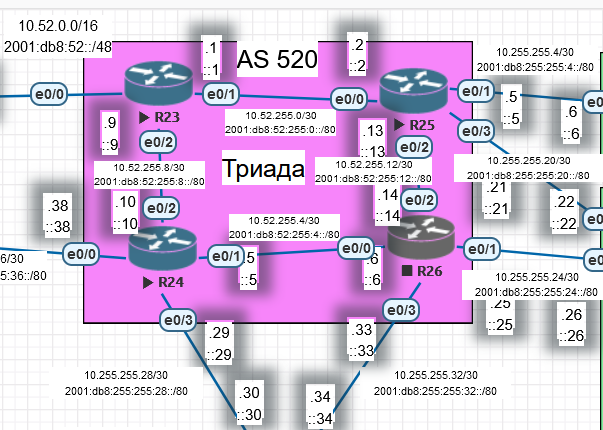
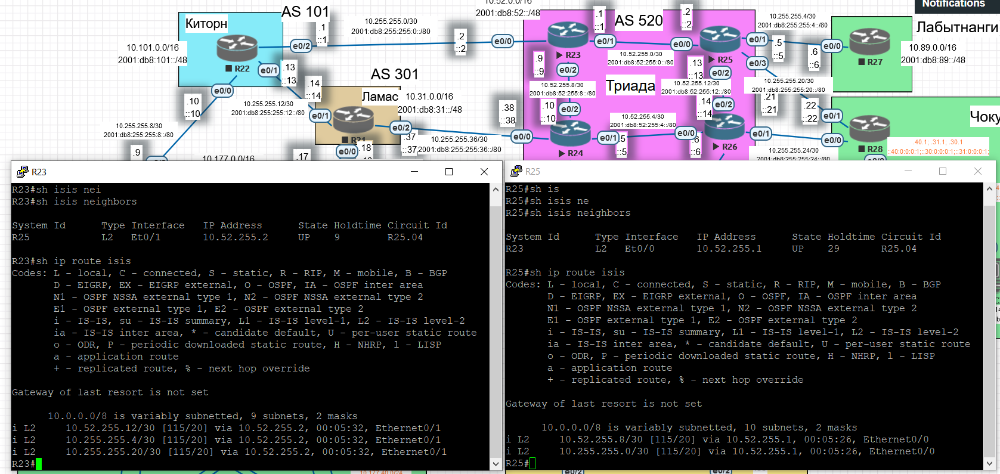
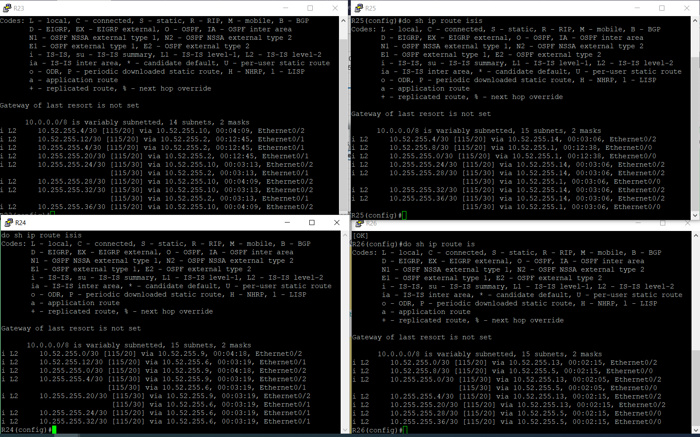

# IS-IS

Цель:

Настроить IS-IS офисе Триада

1. Настроите IS-IS в ISP Триада
2. R23 и R25 находятся в зоне 2222
3. R24 находится в зоне 24
4. R26 находится в зоне 26

Настройка осуществляется одновременно для IPv4 и IPv6

[Схема](#head0)

[Настройка IS-IS IPv4](#head1)

* [R23 и R25 находятся в зоне 2222](#head2222)
* [R24 находится в зоне 24](#head24)
* [R26 находится в зоне 26](#head26)

[Настройка IS-IS IPv6](#head2)

## <a name="head0"></a>  Схема



- Адреса ipv4 и ipv6 настроены в соостветсвии с распределением.

- Между маршрутизаторами разных зон необходимо взаимодействие L2 IS-IS.
  
  - В пределах одной зоны у нас находятся R23,25 - между ними для минимальной связности достаточно L1.
  
  - Однако на случай, если линк L1 окажется единственным, который соединяет маршутизаторы R23,25 (прочие перестанут работать), то L1 не позволит передавать маршруты до других зон. Поэтому его мы также сделаем L2.
  
  - Вывод - все линки между маршрутизаторами должны быть L2.
  
  - Нужен ли тип взаимодействия L1? Нет. L1 возможен только между R23,25. ???

# <a name="head1"></a>  IS-IS IPv4

## <a name="head2222"></a>  R23 и R25 находятся в зоне 2222

Задаем на каждом маршрутизаторе net, тип взаимодействия L2, на интерфейсах включаем IS-IS.

R23:

```
en

conf t

router isis

net 49.2222.0023.0023.0023.00

is-type level-2-only

exit

int range e0/0-2

ip router isis

end

wr 
```

R25:

```
en

conf t

router isis

net 49.2222.0025.0025.0025.00

is-type level-2-only

exit

int range e0/0-3

ip router isis

end

wr 
```

Соседи по зоне 2222 обнаружены, от них получены маршруты:



## <a name="head24"></a>  R24 находится в зоне 24

R24:

```
en

conf t

router isis

net 49.24.0024.0024.0024.00

is-type level-2-only

exit

int range e0/0-3

ip router isis

end

wr 
```

## <a name="head26"></a>  R26 находится в зоне 26

R24:

```
en

conf t

router isis

net 49.26.0026.0026.0026.00

is-type level-2-only

exit

int range e0/0-3

ip router isis

end

wr 
```

## Результат



Маршрутизаторы автономной системы получают всю информацию о маршрутах внутри автономной системы. Маршрутов по умолчанию нет.

# <a name="head2"></a>  IS-IS IPv6

Для включения достаточно на каждом интерфейсе задать команду включения:

```
ipv6 router isis
```
