# EIGRP

Цель:

Настроить EIGRP в С.-Петербург;
Использовать named EIGRP

1. В офисе С.-Петербург настроить EIGRP
2. R32 получает только маршрут по-умолчанию
3. R16-17 анонсируют только суммарные префиксы
4. Использовать EIGRP named-mode для настройки сети

Настройка осуществляется одновременно для IPv4 и IPv6

* [Схема](#head1)

* [Базовая настройка устройств](#head2)

* [Настраиваем EIGRP](#head3)

* [R32 получает только маршрут по-умолчанию](#head4)

* [R16-17 анонсируют только суммарные префиксы](#head5)

* [Конфигурации устройств](configs)

## <a name="head1"></a>   Схема

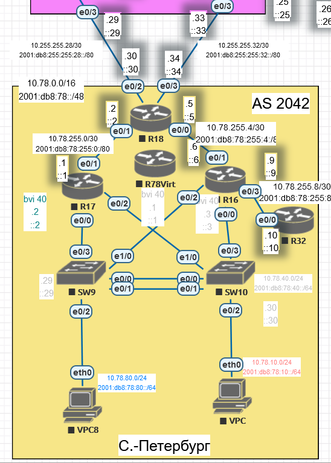

## <a name="head2"></a>  Базовая настройка устройств

Маршрутизаторы R16-17 резервируют друг друга, являясь шлюзом по умолчанию для клиентов, по протоколу HSPR.

Схема проще, чем в Москве, поэтому не используем L3-коммутаторы, оставляем маршрутизаторы с настройкой BVI.

Адресация и линки были настроены ранее. Поэтому исходные данные - минимально настроенные линки в соответствии со схемой, VLAN (10, 40, 80), HSRP.

Единственное, следует еще настроить HSRP-приоритет - ввиду более высокого адреса основным маршрутизатором будет R16. Сделаем основным R17, чтобы снизить нагрузку на R16, обеспечиающему связь до R32.

R17:

```
en
conf t
int bvi 40
standby priority 255
standby preempt
exit
int bvi 10
standby priority 255
standby preempt
exit

int bvi 80
standby priority 255
standby preempt
exit
end 
wr
```

## <a name="head3"></a>   Настраиваем EIGRP

Выполняем базовую настройку EIGRP на маршрутизаторах СПб. Используем named-mode. Заходим в конфигурацию протокола, задаем автономную систему, router-id, включаем процесс. ???unicast??? Для ipv4 указываем также интерфейсы, которые будут участвовать. На маршрутизаторах R16-17 настраиваем интерфейсы, смотрящие в сторону конечных клиентов (BVI10, BVI80)

R16:

```
en
conf t
router eigrp NG
address-family ipv4 unicast autonomous-system 1
network 10.78.40.0 0.0.0.255
network 10.78.10.0 0.0.0.255
network 10.78.80.0 0.0.0.255
network 10.78.255.8 0.0.0.3
network 10.78.255.4 0.0.0.3
eigrp router-id 1.0.0.16

af-interface BVI 10
passive-interface
exit
af-interface BVI 80
passive-interface
exit

no shutdown
exit 


address-family ipv6 unicast autonomous-system 1
eigrp router-id 1.0.0.16
af-interface BVI 10
passive-interface
exit
af-interface BVI 80
passive-interface
no shutdown


exit

end

wr
```

R17:

```
en
conf t
router eigrp NG
address-family ipv4 unicast autonomous-system 1
network 10.78.40.0 0.0.0.255
network 10.78.10.0 0.0.0.255
network 10.78.80.0 0.0.0.255
network 10.78.255.0 0.0.0.3
eigrp router-id 1.0.0.17

af-interface BVI 10
passive-interface
exit
af-interface BVI 80
passive-interface
exit
no shutdown
exit 


address-family ipv6 unicast autonomous-system 1
eigrp router-id 1.0.0.17
af-interface BVI 10
passive-interface
exit
af-interface BVI 80
passive-interface
no shutdown


exit

end

wr
```

R18:

```
en
conf t
router eigrp NG
address-family ipv4 unicast autonomous-system 1
network 10.78.255.0 0.0.0.3
network 10.78.255.4 0.0.0.3
network 10.255.255.28 0.0.0.3
network 10.255.255.32 0.0.0.3
eigrp router-id 1.0.0.18
no shutdown
exit 


address-family ipv6 unicast autonomous-system 1
eigrp router-id 1.0.0.18
no shutdown


exit

end

wr
```

R32:

```
en
conf t
router eigrp NG
address-family ipv4 unicast autonomous-system 1
network 10.78.255.8 0.0.0.3
eigrp router-id 1.0.0.32
no shutdown
exit 


address-family ipv6 unicast autonomous-system 1
eigrp router-id 1.0.0.32
no shutdown


exit

end

wr
```

Смотрим, какие маршруты получает R17:

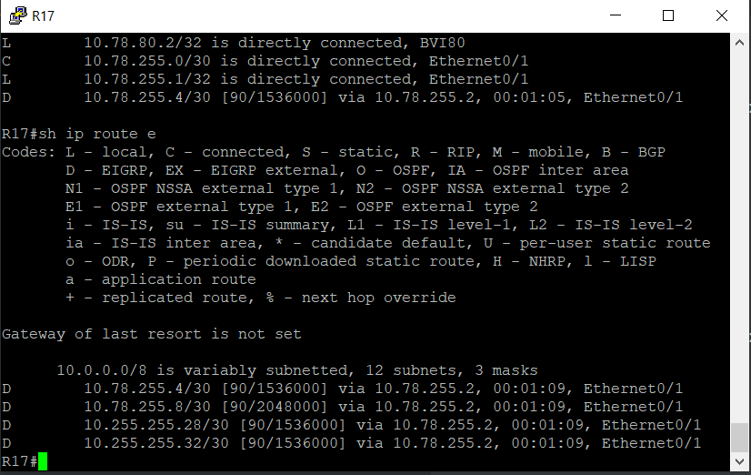

Перечислены все маршруты в автономной системе.

## <a name="head4"></a>  R32 получает только маршрут по-умолчанию

Сейчас R32 получает все маршруты:

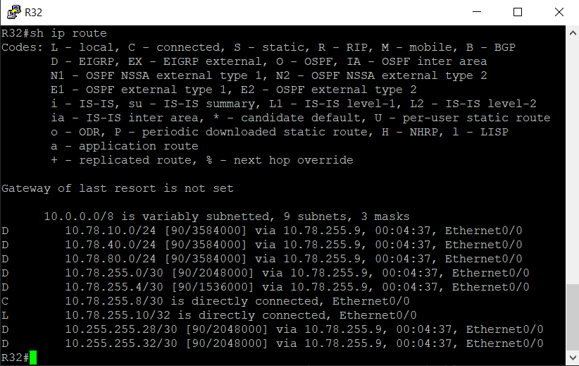

Перед настройкой настроим R18 для трансляции маршрута по умолчанию. Выполним это, задав статическую маршрутизацию (в дальнейшем возможно поменяем на динамический протокол маршрутизации). Без маршрута по умолчанию маршрутизатор не будет транслировать себя шлюзом последней надежды.

R18:

```
en
conf t
ip route 0.0.0.0 0.0.0.0 10.255.255.29
ip route 0.0.0.0 0.0.0.0 10.255.255.33


ipv6 route ::/0 2001:db8:255:255:28::29
ipv6 route ::/0 2001:db8:255:255:32::33


router eigrp NG
address-family ipv4 unicast autonomous-system 1
topology base
redistribute static


router eigrp NG
address-family ipv6 unicast autonomous-system 1
topology base
redistribute static


end
wr
```

На R32 стал приходить маршут ipv4 по умолчанию:
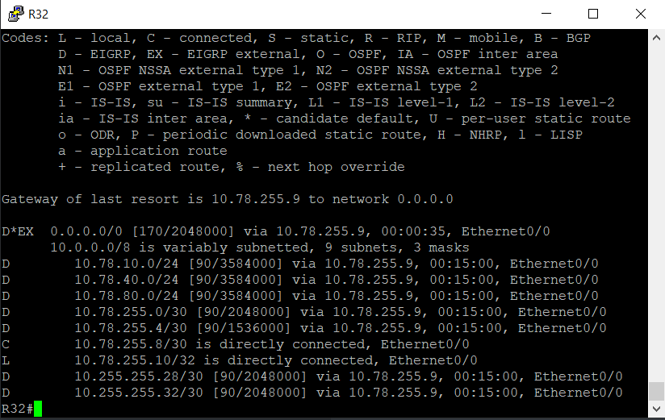

Для ipv6 - нет:

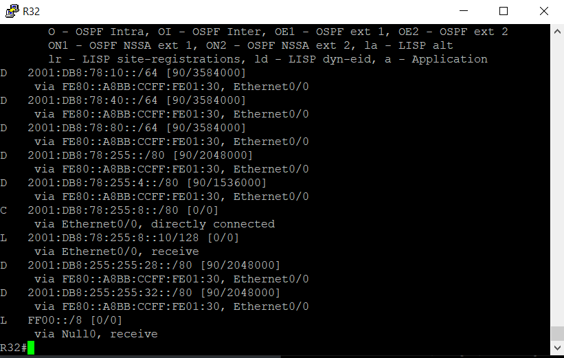

?

На маршрутизаторе R18 пробуем заново переписать маршруты по умолчанию, добавив указание интерфейса.

R18:

```
en
conf t
no ipv6 route ::/0 2001:DB8:255:255:28::29
no ipv6 route ::/0 2001:DB8:255:255:32::33


ipv6 route ::/0 E0/2 2001:DB8:255:255:28::29
ipv6 route ::/0 E0/3 2001:DB8:255:255:32::33

end

wr
```

Проверяем на R16:

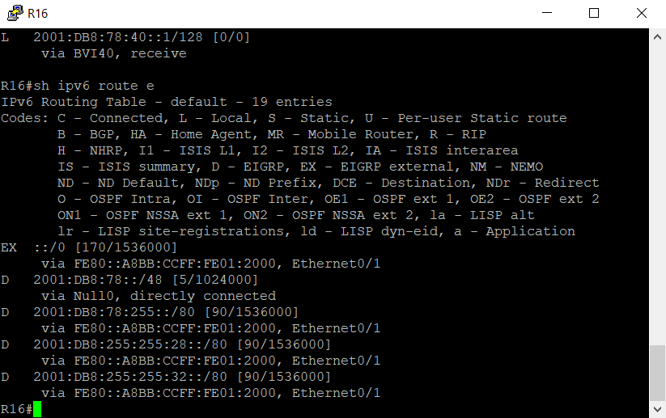

Маршрут наконец появился в таблице.

Остается выполнить фильтрацию маршутов. Она выполняется на R16. Задаем 

префикс-лист и используем его в исходящем направлении на интерфейсе для фильтрации. В ipv4 минимальная длина префикса 1 при использовании ge. 

R16:

```
en
conf t
ip prefix-list PL_ALL_DENY deny 0.0.0.0/1 ge 1 le 32
router eigrp NG
address-family ipv4 unicast autonomous-system 1
topology base
distribute-list prefix PL_ALL_DENY out E0/3
end
wr
```

В итоге вообще все маршруты мы зарезали:
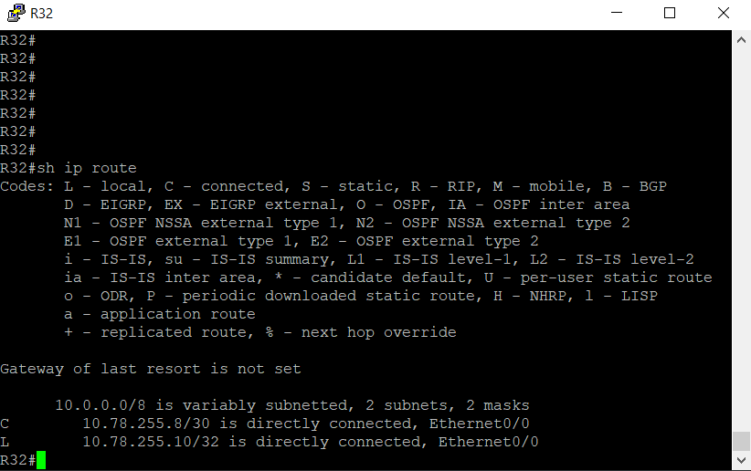

Исправляем - добавляем в префикс-лист разрешающее правило для маршрута 0.0.0.0/0.0.0.0.

R16:

```
en
conf t
ip prefix-list PL_ALL_DENY permit 0.0.0.0/0
end
wr
```

Проверяем:

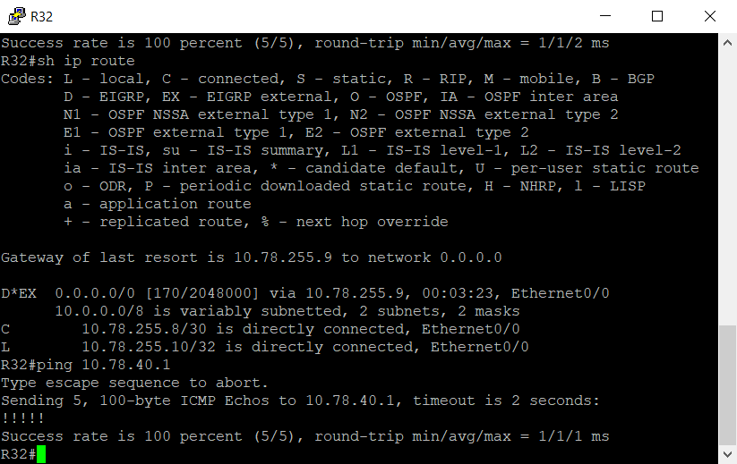

---

Неясно с prefix-list. 

```
ip prefix-list PL_ALL_DENY deny 0.0.0.0/1 ge 1 le 32
```

Команда запрещает префиксы 0.0.0.0/1 с маской от 1 до 32 бит. Надо ли здесь "разворачивать" запись и представлять ее в виде диапазонов адресов - 0.0.0.0-127.255.255.255? Или же запись читается  по-другому? 

Для проверки заведена подстеть 128.0.0.0/24 на интерфейсе Loopback0 R16 и анонсирована в EIGRP (???? командой network мы не только определяем интерфейсы, с которых будут браться сети для анонса, но и задаем подсесть, только при попадании в которую сеть начнет анонсироваться??? какая в связи с этим терминология???). Эта сеть при отключении фильтрации попадает на R32, при включении - пропадает.

---

Аналогично делаем для ipv6:

R16:

```
en
conf t
ipv6 prefix-list PL_ALL_DENY deny ::/0 ge 0 le 128
ipv6 prefix-list PL_ALL_DENY permit ::/0
router eigrp NG
address-family ipv6 unicast autonomous-system 1
topology base
distribute-list prefix PL_ALL_DENY out E0/3
end
wr
```

Результат:

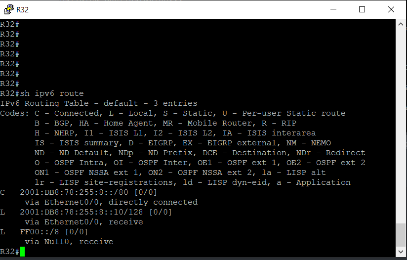

??? Попутно появился вопрос. Что значит в таблице маршрутизации слово "receive"???

Маршруты до всех подсетей пропали. Снова неправильно задан ipv6 prefix-list. Исправляем.

R16:

```
en
conf t
no ipv6 prefix-list PL_ALL_DENY 
ipv6 prefix-list PL_ALL_DENY permit ::/0
ipv6 prefix-list PL_ALL_DENY deny ::/0 ge 0 le 128
router eigrp NG
address-family ipv6 unicast autonomous-system 1
topology base
distribute-list prefix PL_ALL_DENY out E0/3
end
wr
```

Результат:

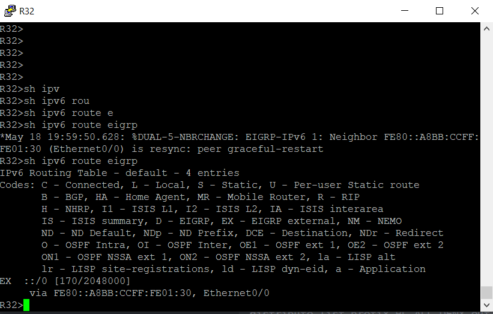

Фильтрация заработала так, как требовалось.

## <a name="head5"></a>  R16-17 анонсируют только суммарные префиксы

R16-17 анонсируют суммарные прификсы до тупиковых подсетей, расположенных за ними.

Сейчас маршрутизатор получает от них маршруты со всеми подсетями:

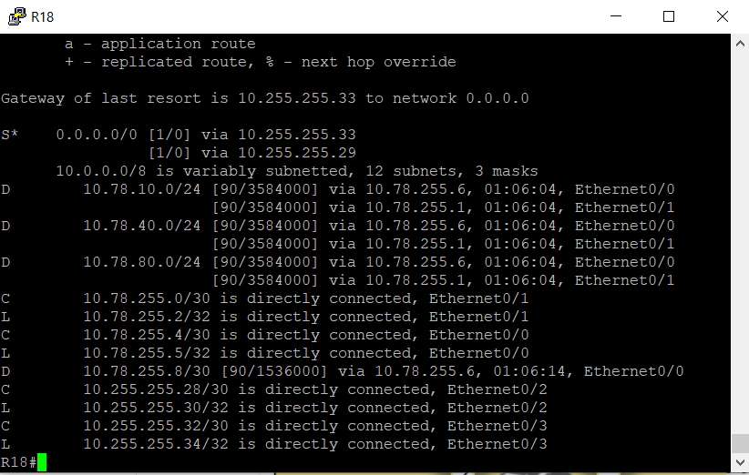

Эти подсети  - 10.78.10.0/24,10.78.40.0/24,10.78.80.0/24. Адресной пространство за маршрутизаторами запланировано так, что за R16-17 расположены сети 10.78.0.0/16. Поэтому будем отдавать именно такой саммарный адрес.

R16:

```
en
conf t
router eigrp NG
address-family ipv4 unicast autonomous-system 1
af-interface Ethernet0/1
summary-address 10.78.0.0 255.255.0.0

address-family ipv6 unicast autonomous-system 1
af-interface Ethernet0/1
summary-address 2001:db8:78::/48
```

R17:

```
en
conf t
router eigrp NG
address-family ipv4 unicast autonomous-system 1
af-interface Ethernet0/1
summary-address 10.78.0.0 255.255.0.0

address-family ipv6 unicast autonomous-system 1
af-interface Ethernet0/1
summary-address 2001:db8:78::/48
```

Смотрим результат на маршрутизаторе R18:

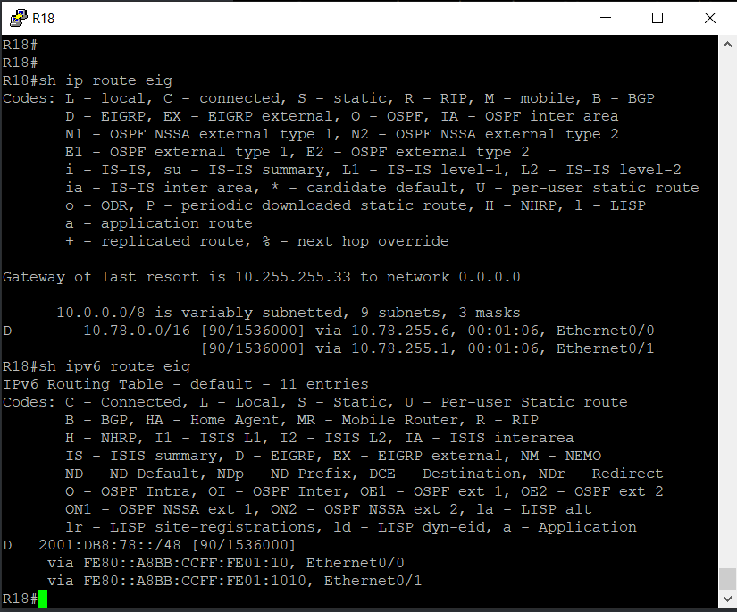

Маршруты суммаризированы. Что и требовалось сделать.
