# BGP. Основы

Цель:

Настроить BGP между автономными системами
Организовать доступность между офисами Москва и С.-Петербург

В этой самостоятельной работе мы ожидаем, что вы самостоятельно:

1. [eBGP между офисом Москва и двумя провайдерами - Киторн и Ламас](#head1)
2. [Настроите eBGP между провайдерами Киторн и Ламас](#head2)
3. [Настроите eBGP между Ламас и Триада](#head3)
4. [eBGP между офисом С.-Петербург и провайдером Триада](#head4)
5. [Организуете IP доступность между офисами Москва и С.-Петербург](#head5)
6. [Конфигурации устройств](configs)

Документация оформлена на github. (желательно использовать markdown)

## <a name="head1"></a>  eBGP между офисом Москва и двумя провайдерами - Киторн и Ламас

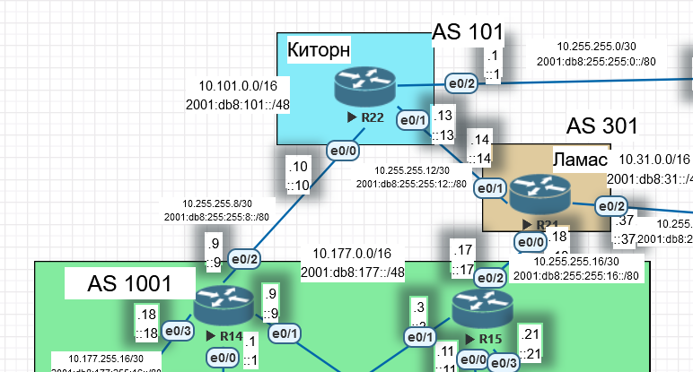

R21:

```
en
conf t
router bgp 301
neighbor 10.255.255.13 remote-as 101
neighbor 10.255.255.17 remote-as 1001
end
wr
```

R22:

```
en
conf t
router bgp 101
neighbor 10.255.255.14 remote-as 301
neighbor 10.255.255.9 remote-as 1001
end
wr
```

R14:

```
en
conf t
router bgp 1001
neighbor 10.255.255.10 remote-as 101
neighbor 10.255.255.11 remote-as 1001
neighbor 10.255.255.3 remote-as 1001
end
wr
```

R15:

```
en
conf t
router bgp 1001
neighbor 10.255.255.18 remote-as 301
neighbor 10.255.255.9 remote-as 1001
neighbor 10.255.255.1 remote-as 1001
end
wr
```

??? нужна ли настройка router-id???

Мы пока не анонсировали никакие сети, полной связности между маршрутизаторами нет:

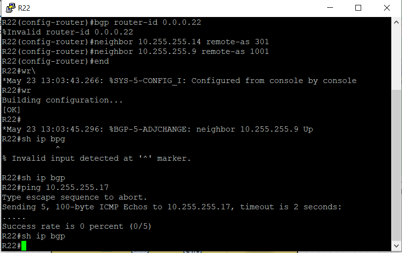

Анонсируем сети.

R21:

```
en
conf t
router bgp 301
network 10.255.255.36 mask 255.255.255.252
network 10.255.255.12 mask 255.255.255.252
network 10.255.255.16 mask 255.255.255.252
end
wr
```

Проверим на R22 - маршруты пришли не сразу, а один за другим:

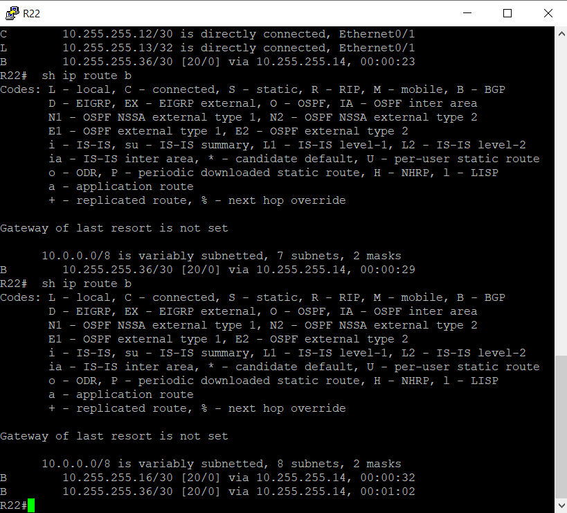

R22:

```
en
conf t
router bgp 101
network 10.255.255.8 mask 255.255.255.252
network 10.255.255.12 mask 255.255.255.252
network 10.255.255.0 mask 255.255.255.252
end
wr
```

R14:

```
en
conf t
router bgp 1001
network 10.255.255.8 mask 255.255.255.252
network 10.177.0.0 mask 255.255.0.0
end
wr
```

R15:

```
en
conf t
router bgp 1001
network 10.255.255.16 mask 255.255.255.252
network 10.177.0.0 mask 255.255.0.0
end
wr
```

Результат:

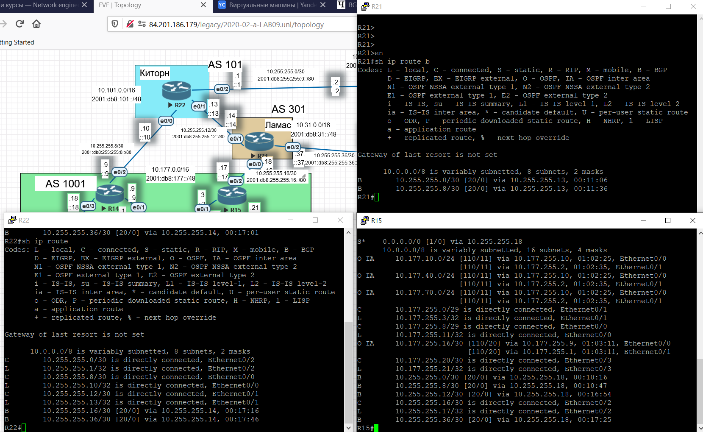

На маршрутизаторы в Киторне и Ламасе не приходит информация о маршрутах до сетей в Москве. Маршруты Москвы 10.177.0.0/16 анонсируются с R14 и R15, но напрямую к маршрутизаторам подключены сети 10.177.255.../30. Т.е. если с R14 и R15 мы будем анонсировать именно их, то соседи BGP получат эту информацию. Проверим на R14.
R14:

```
en
conf t
router bgp 1001
no network 10.177.0.0 mask 255.255.0.0
network 10.177.255.16 mask 255.255.255.248
network 10.177.255.0 mask 255.255.255.248
network 10.177.255.8 mask 255.255.255.248
end
wr
```

Результат:
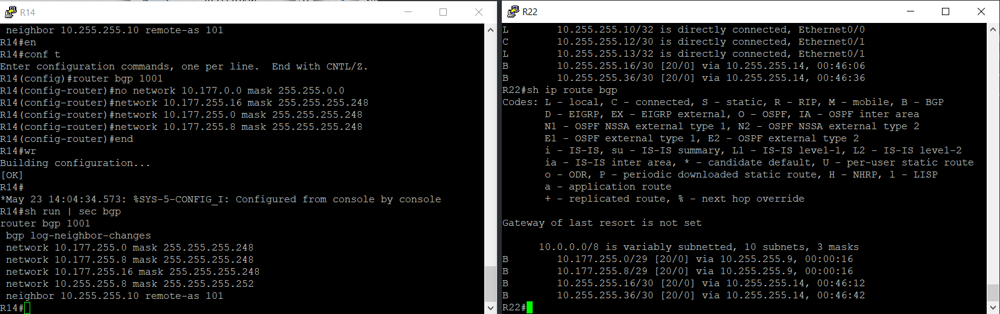

Вывод - в BGP анонсируются только те сети, которые подключены напрямую и которые  совпадают с анонсом командой network.

 Убираем тестовую настройку на R14:

```
en
conf t
router bgp 1001
no network 10.177.255.16 mask 255.255.255.248
no network 10.177.255.0 mask 255.255.255.248
no network 10.177.255.8 mask 255.255.255.248
end
wr
```

Настраиваем редистрибуцию.

R14:

```
en
conf t
router bgp 1001
redistribute ospf 1
end
wr
```

Результат:

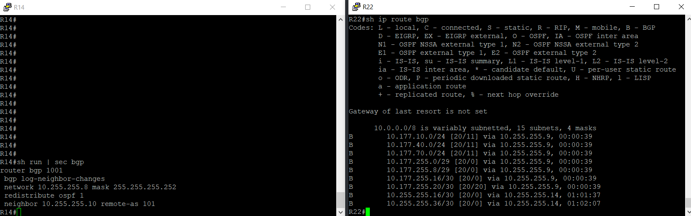

Маршруты появились, но незачем передавать подробности в другие автономные системы. Нужно настроить суммаризацию.

R14:

```
en
conf t
router bgp 1001
aggregate-address 10.177.0.0 255.255.0.0 summary-only  
end
wr
```

Желаемый результат достигнут:

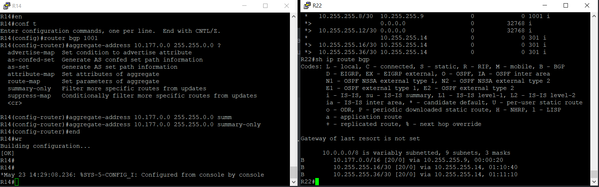

Настраиваем R15 схожим образом - редистрибуция и суммаризация:

R15:

```
en
conf t
router bgp 1001
redistribute ospf 1
aggregate-address 10.177.0.0 255.255.0.0 summary-only
end
wr
```

## <a name="head2"></a>  Настроите eBGP между провайдерами Киторн и Ламас

Настройка произведена ранее, одновременно с настройкой eBGP между провайдерами и Москвой.

## <a name="head3"></a> Настроите eBGP между Ламас и Триада

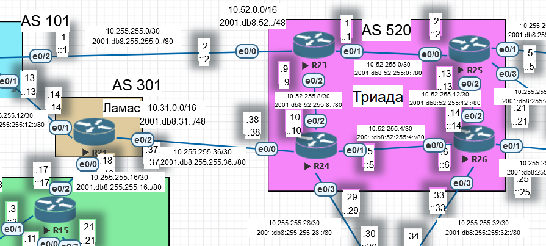

R21:

```
en
conf t
router bgp 301
neighbor 10.255.255.38 remote-as 520
end
wr
```

R24:

```
en
conf t
router bgp 520
neighbor 10.255.255.37 remote-as 301
network 10.255.255.36 mask 255.255.255.252
network 10.255.255.28 mask 255.255.255.252
aggregate-address 10.52.0.0 255.255.0.0 summary-only
end
wr
```

Смотрим, получили ли маршруты "крайние маршрутизаторы":


R15 в Москве получил анонсированные маршруты, кроме суммарного маршрута до сетей в Триаде. Причина - хотя маршрут на маршрутзаторе в Триаде суммаризирован, но на этом маршрутизаторе нет ни одного анонса сети из этого суммаризованного пространства. Добавляем анонсом.

R24:

```
en
conf t
router bgp 520
network 10.52.255.4 mask 255.255.255.252
network 10.52.255.8 mask 255.255.255.252
end
wr
```

Результат:

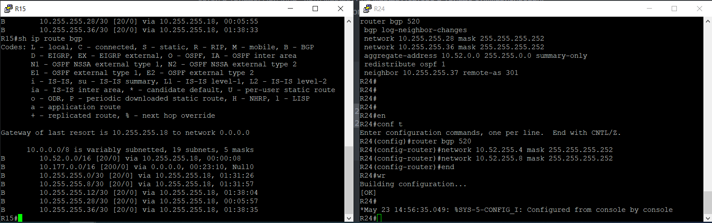

Другой вопрос, нужно ли Москве и другим провайдерам знать о маршруте в сети Триады.???

## <a name="head4"></a> eBGP между офисом С.-Петербург и провайдером Триада

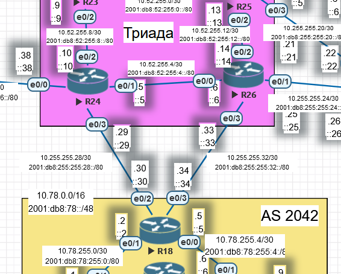

R24 был частично  настроен. Добавляем соседа R18.

R24:

```
en
conf t
router bgp 520
neighbor 10.255.255.30 remote-as 2042
end
wr
```

На R26 выполняем настройку BGP с самого начала:

```
en
conf t
router bgp 520
neighbor 10.255.255.34 remote-as 2042


network 10.52.255.12 mask 255.255.255.252
network 10.52.255.4 mask 255.255.255.252


network 10.255.255.24 mask 255.255.255.252
network 10.255.255.32 mask 255.255.255.252


aggregate-address 10.52.0.0 255.255.0.0 summary-only

end
wr
```

R18:

```
en
conf t
router bgp 2042


neighbor 10.255.255.29 remote-as 520
neighbor 10.255.255.33 remote-as 520


redistribute eigrp 1

aggregate-address 10.78.0.0 255.255.0.0 summary-only

end
wr
```

Проверяем, пришел ли маршрут до сетей СПб в Москву:

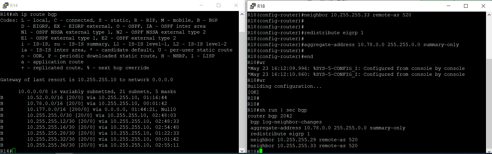

Маршрут пришел.

## <a name="head5"></a> Организуете IP доступность между офисами Москва и С.-Петербург

Проверяем доступность. Для этого выполняем icmp-запросы от компьютеров в Москве до компьютеров в СПб:

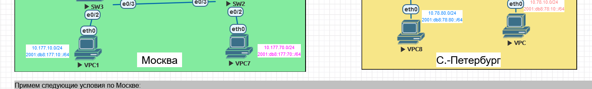

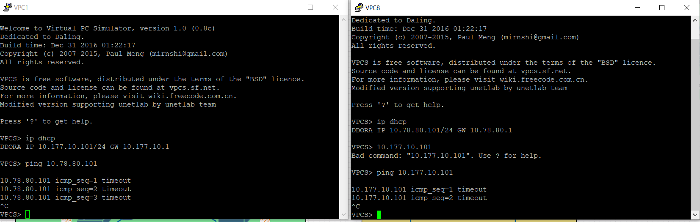

Не работает. Смотрим следующий хоп при трассировке из Москвы:

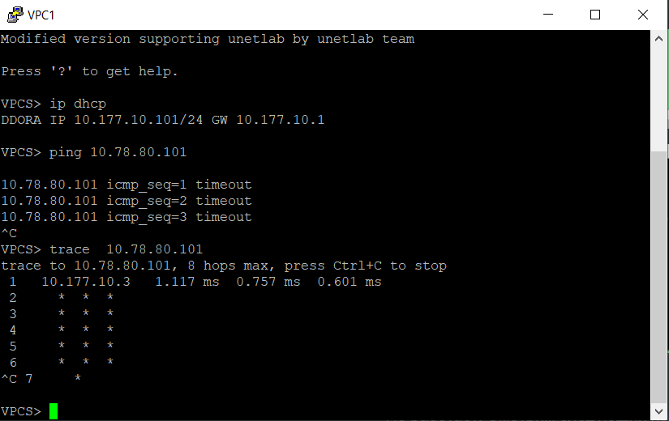

Идем на этот хоп и проверяем с него связь до компьютера в СПб:

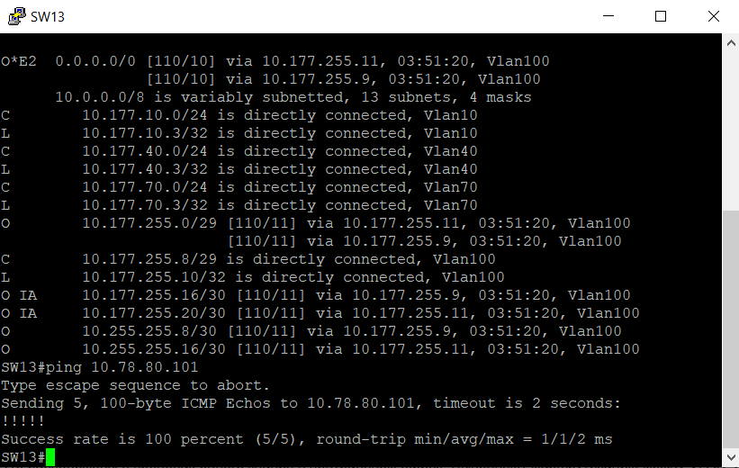

Связь есть.


Переходим в офис СПб и выполняем трассировку до подсети с компьютером в Москве:

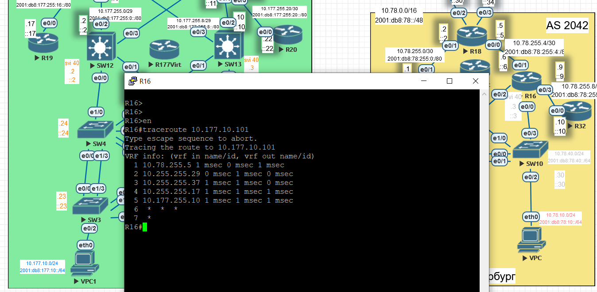

Видим, что пакеты доходят до SW13, к которому и подключена сеть 10.177.10.0/24. Т.е. офис  в СПб знает, как добраться до правильного маршрутизатора в СПб, к которому напрямую подключена целевая сеть.


Запускаем самый простой тест - icmp VPC1-VPC7:
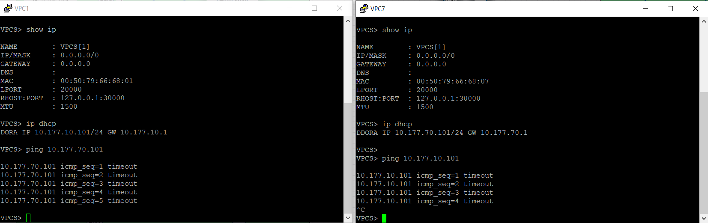

Нет связи. Вероятно, что-то с настройками SW12-13. Проверяем, включена ли маршрутизация:

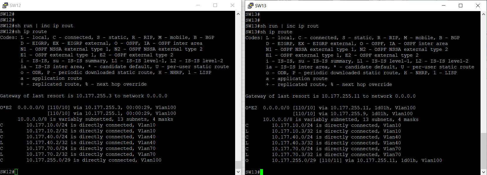

По умолчанию маршутизация включена (в конфиге нет no ip routing), есть маршруты, работает OSPF. Но маршрутизации даже между VLAN нет.

На разборе домашних заданий было упомянуто, что в ряде случаев помогает отключение ip cef. Попробуем.

SW12-13:

```
en
conf t
no ip cef
end
wr
```

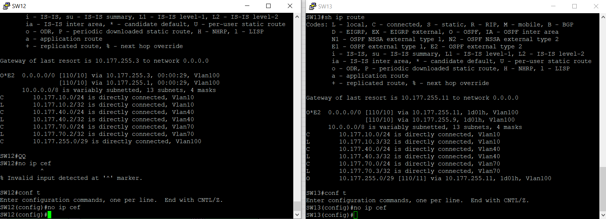

Проверяем связь между компьютерами Москвы и СПб:

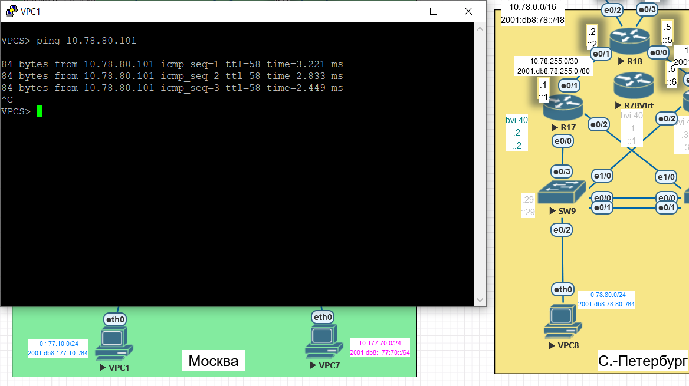

Желаемая цель достигнута - связность между офисами Москвы и СПб есть.

## Аналогично выполняем настройку ipv6

R21:

```
en
conf t
router bgp 301
no bgp default ipv4-unicast
neighbor 2001:db8:255.255:12::13 remote-as 101
neighbor 2001:db8:255.255:16::17 remote-as 1001
end
wr
```

R22:

```
en
conf t
router bgp 101
no bgp default ipv4-unicast
address-family ipv6 unicast
neighbor 2001:db8:255.255:12::14 remote-as 301
neighbor 2001:db8:255.255:8::9 remote-as 1001
end
wr
```

Но соседства между ними не поднялось. Настройка выполняется по-другому?
