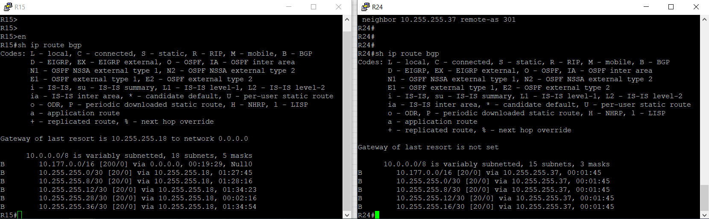
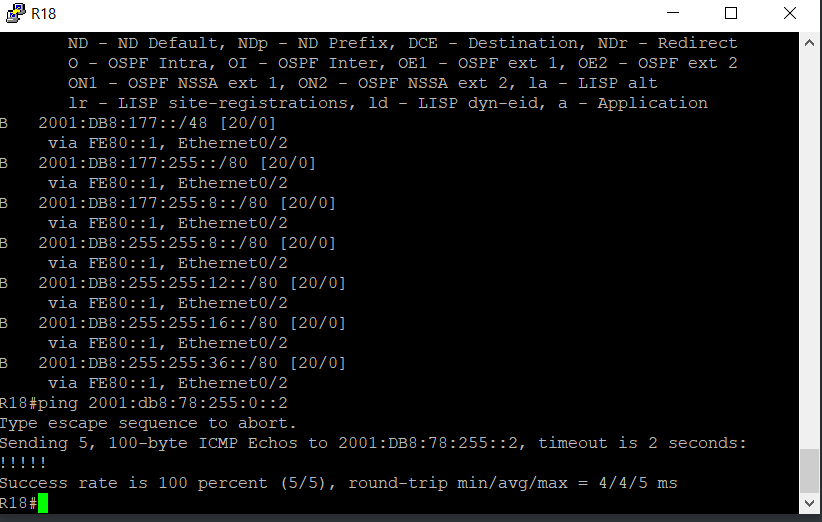
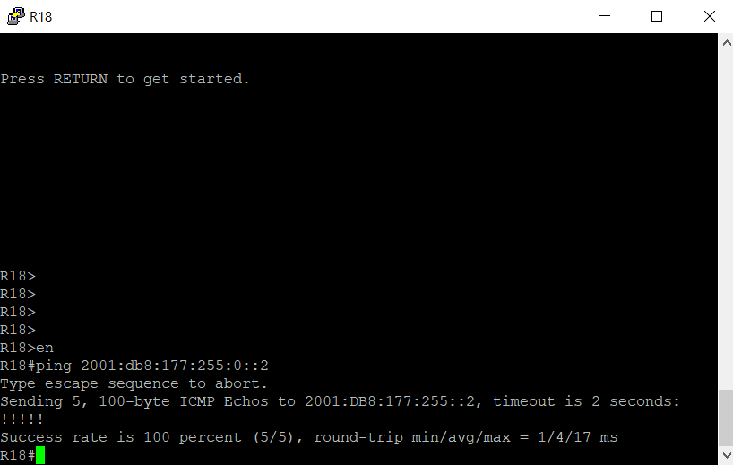
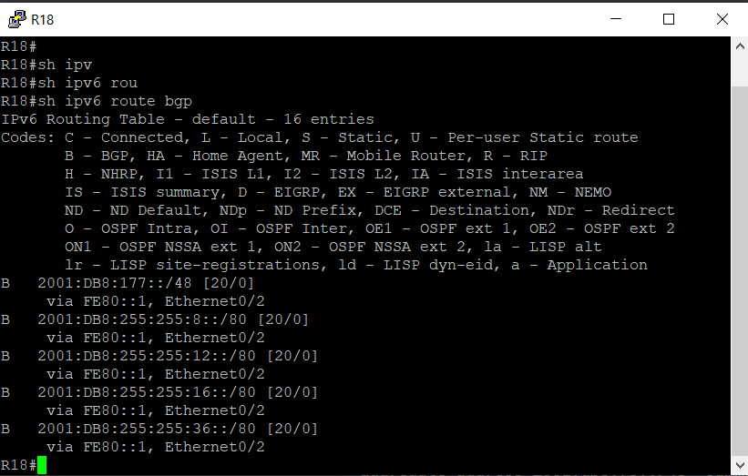

# BGP. Основы

Цель:

Настроить BGP между автономными системами
Организовать доступность между офисами Москва и С.-Петербург

В этой самостоятельной работе мы ожидаем, что вы самостоятельно:

1. [eBGP между офисом Москва и двумя провайдерами - Киторн и Ламас](#head1)
2. [Настроите eBGP между провайдерами Киторн и Ламас](#head2)
3. [Настроите eBGP между Ламас и Триада](#head3)
4. [eBGP между офисом С.-Петербург и провайдером Триада](#head4)
5. [Организуете IP доступность между офисами Москва и С.-Петербург](#head5)
6. [Настройка BGP в ipv6](#head6)
7. [Конфигурации устройств](configs)

Документация оформлена на github. (желательно использовать markdown)

## <a name="head1"></a>  eBGP между офисом Москва и двумя провайдерами - Киторн и Ламас


R21:

```
en
conf t
router bgp 301
neighbor 10.255.255.13 remote-as 101
neighbor 10.255.255.17 remote-as 1001
end
wr
```

R22:

```
en
conf t
router bgp 101
neighbor 10.255.255.14 remote-as 301
neighbor 10.255.255.9 remote-as 1001
end
wr
```

R14:

```
en
conf t
router bgp 1001
neighbor 10.255.255.10 remote-as 101
neighbor 10.177.255.11 remote-as 1001
neighbor 10.177.255.3 remote-as 1001
end
wr
```

R15:

```
en
conf t
router bgp 1001
neighbor 10.255.255.18 remote-as 301
neighbor 10.177.255.9 remote-as 1001
neighbor 10.177.255.1 remote-as 1001
end
wr
```

??? нужна ли настройка router-id???

Мы пока не анонсировали никакие сети, полной связности между маршрутизаторами нет:


Анонсируем сети.

R21:

```
en
conf t
router bgp 301
network 10.255.255.36 mask 255.255.255.252
network 10.255.255.12 mask 255.255.255.252
network 10.255.255.16 mask 255.255.255.252
end
wr
```

Проверим на R22 - маршруты пришли не сразу, а один за другим:


R22:

```
en
conf t
router bgp 101
network 10.255.255.8 mask 255.255.255.252
network 10.255.255.12 mask 255.255.255.252
network 10.255.255.0 mask 255.255.255.252
end
wr
```

R14:

```
en
conf t
router bgp 1001
network 10.255.255.8 mask 255.255.255.252
network 10.177.0.0 mask 255.255.0.0
end
wr
```

R15:

```
en
conf t
router bgp 1001
network 10.255.255.16 mask 255.255.255.252
network 10.177.0.0 mask 255.255.0.0
end
wr
```

Результат:


На маршрутизаторы в Киторне и Ламасе не приходит информация о маршрутах до сетей в Москве. Маршруты Москвы 10.177.0.0/16 анонсируются с R14 и R15, но в таблице маршрутизации расположены сети 10.177.255.../30. Т.е. если с R14 и R15 мы будем анонсировать именно их, то соседи BGP получат эту информацию. Проверим на R14.
R14:

```
en
conf t
router bgp 1001
no network 10.177.0.0 mask 255.255.0.0
network 10.177.255.16 mask 255.255.255.248
network 10.177.255.0 mask 255.255.255.248
network 10.177.255.8 mask 255.255.255.248
end
wr
```

Результат:


Вывод - в BGP анонсируются только те сети, которые есть в таблице маршрутизации и которые  совпадают с анонсом командой network.

Маршруты появились, но незачем передавать подробности в другие автономные системы. Нужно настроить суммаризацию.

R14:

```
en
conf t
router bgp 1001
aggregate-address 10.177.0.0 255.255.0.0 summary-only  
end
wr
```

Желаемый результат достигнут:


Настраиваем R15 схожим образом.

R15:

```
en
conf t
router bgp 1001
network 10.255.255.8 mask 255.255.255.248
aggregate-address 10.177.0.0 255.255.0.0 summary-only
end
wr
```

## <a name="head2"></a>  Настроите eBGP между провайдерами Киторн и Ламас

Настройка произведена ранее, одновременно с настройкой eBGP между провайдерами и Москвой.

## <a name="head3"></a> Настроите eBGP между Ламас и Триада


R21:

```
en
conf t
router bgp 301
neighbor 10.255.255.38 remote-as 520
end
wr
```

R24:

```
en
conf t
router bgp 520
neighbor 10.255.255.37 remote-as 301
network 10.255.255.36 mask 255.255.255.252
network 10.255.255.28 mask 255.255.255.252
aggregate-address 10.52.0.0 255.255.0.0 summary-only
end
wr
```

Смотрим, получили ли маршруты "крайние маршрутизаторы":



R15 в Москве получил анонсированные маршруты, кроме суммарного маршрута до сетей в Триаде. Причина - хотя маршрут на маршрутзаторе в Триаде суммаризирован, но на этом маршрутизаторе нет ни одного анонса сети из этого суммаризованного пространства. Добавляем анонсом.

R24:

```
en
conf t
router bgp 520
network 10.52.255.4 mask 255.255.255.252
network 10.52.255.8 mask 255.255.255.252
end
wr
```

Результат:


Другой вопрос, нужно ли Москве и другим провайдерам знать о маршруте в сети Триады.???

## <a name="head4"></a> eBGP между офисом С.-Петербург и провайдером Триада


R24 был частично  настроен. Добавляем соседа R18.

R24:

```
en
conf t
router bgp 520
neighbor 10.255.255.30 remote-as 2042
end
wr
```

На R26 выполняем настройку BGP с самого начала:

```
en
conf t
router bgp 520
neighbor 10.255.255.34 remote-as 2042


network 10.52.255.12 mask 255.255.255.252
network 10.52.255.4 mask 255.255.255.252


network 10.255.255.24 mask 255.255.255.252
network 10.255.255.32 mask 255.255.255.252


aggregate-address 10.52.0.0 255.255.0.0 summary-only

end
wr
```

R18:

```
en
conf t
router bgp 2042


neighbor 10.255.255.29 remote-as 520
neighbor 10.255.255.33 remote-as 520


redistribute eigrp 1

aggregate-address 10.78.0.0 255.255.0.0 summary-only

end
wr
```

Проверяем, пришел ли маршрут до сетей СПб в Москву:


Маршрут пришел.

## <a name="head5"></a> Организуете IP доступность между офисами Москва и С.-Петербург

Проверяем доступность. Для этого выполняем icmp-запросы от компьютеров в Москве до компьютеров в СПб:


Не работает. Смотрим следующий хоп при трассировке из Москвы:


Идем на этот хоп и проверяем с него связь до компьютера в СПб:


Связь есть.

Переходим в офис СПб и выполняем трассировку до подсети с компьютером в Москве:


Видим, что пакеты доходят до SW13, к которому и подключена сеть 10.177.10.0/24. Т.е. офис  в СПб знает, как добраться до правильного маршрутизатора в СПб, к которому напрямую подключена целевая сеть.

Запускаем самый простой тест - icmp VPC1-VPC7:


Нет связи. Вероятно, что-то с настройками SW12-13. Проверяем, включена ли маршрутизация:


По умолчанию маршутизация включена (в конфиге нет no ip routing), есть маршруты, работает OSPF. Но маршрутизации даже между VLAN нет.

На разборе домашних заданий было упомянуто, что в ряде случаев помогает отключение ip cef. Попробуем.

SW12-13:

```
en
conf t
no ip cef
end
wr
```


Проверяем связь между компьютерами Москвы и СПб:


Желаемая цель достигнута - связность между офисами Москвы и СПб есть.

## <a name="head6"></a> Настройка BGP в ipv6

При насройке выполняются те же действия - добавление соседей, анонс маршрутов, суммаризация.

R21:

```
en
conf t
router bgp 301
 address-family ipv6
  neighbor 2001:DB8:255:255:12::13 remote-as 101
  neighbor 2001:DB8:255:255:16::17 remote-as 1001
  neighbor 2001:DB8:255:255:36::38 remote-as 520
  network 2001:DB8:255:255:12::/80
  network 2001:DB8:255:255:16::/80
  network 2001:DB8:255:255:36::/80
 exit-address-family
end
wr
```

R22:

```
en
conf t
router bgp 101
address-family ipv6
  neighbor 2001:DB8:255:255:8::9 remote-as 1001
  neighbor 2001:DB8:255:255:12::14 remote-as 301
  network 2001:DB8:255:255:8::/80
  network 2001:DB8:255:255:12::/80
end
wr
```

R14:

```
en
conf t
router bgp 1001
 address-family ipv6
  neighbor 2001:DB8:255:255:8::10 remote-as 101
  neighbor 2001:DB8:177:255:8::11 remote-as 1001
  neighbor 2001:DB8:177:255:0::3 remote-as 1001
  network 2001:DB8:255:255:8::/80
  network 2001:DB8:177:255:8::/80
  network 2001:DB8:177:255:0::/80
  aggregate-address 2001:DB8:177::/48
 exit-address-family
end
wr
```

R15:

```
en
conf t
router bgp 1001
address-family ipv6 unicast
neighbor 2001:DB8:255:255:16::18 remote-as 301
neighbor 2001:DB8:177:255:8::9 remote-as 1001
neighbor 2001:DB8:177:255:0::1 remote-as 1001

network 2001:DB8:255:255:16::/80
network 2001:DB8:177:255:8::/80
network 2001:DB8:177:255:0::/80
aggregate-address 2001:DB8:177::/48
end
wr
```

R24:

```
en
conf t
router bgp 520
address-family ipv6 unicast
neighbor 2001:DB8:255:255:36::37 remote-as 301
neighbor 2001:DB8:255:255:28::30 remote-as 2042

network 2001:DB8:255:255:36::/80
network 2001:DB8:177:255:28::/80
end
wr
```

R26:

```
en
conf t
router bgp 520
address-family ipv6 unicast
neighbor 2001:DB8:255:255:32::34 remote-as 2042

network 2001:DB8:255:255:32::/80
end
wr
```

R18:

```
en
conf t
router bgp 2042
address-family ipv6 unicast
neighbor 2001:DB8:255:255:32::33 remote-as 520
neighbor 2001:DB8:255:255:28::29 remote-as 520

network 2001:DB8:255:255:32::/80
network 2001:DB8:255:255:28::/80
network 2001:db8:78:255:0::/80
network 2001:db8:78:255:4::/80
aggregate-address 2001:db8:78::/48 
end
wr
```

Смотрим таблицу маршрутизации в СПб и отправляем запрос в офис Москвы:





Связность есть. Однако в таблице маршрутизации находится неагрегированная сеть из офиса Москвы, хотя и агрегированная сеть тоже есть. Причина - была дана неполная команда на суммаризацию, без ключевого слова "summary-only"

Исправляем.

R14:

```
en
conf t
router bgp 1001
 address-family ipv6
aggregate-address 2001:DB8:177::/48 summary-only
end
wr
```

R15:

```
en
conf t
router bgp 1001
address-family ipv6 unicast

aggregate-address 2001:DB8:177::/48  summary-only
end
wr
```

R18:

```
en
conf t
router bgp 2042
address-family ipv6 unicast
aggregate-address 2001:db8:78::/48  summary-only
end
wr
```

Из апдейтов пропали более специфические префиксы, остался суммаризованный, как и требовалось:


