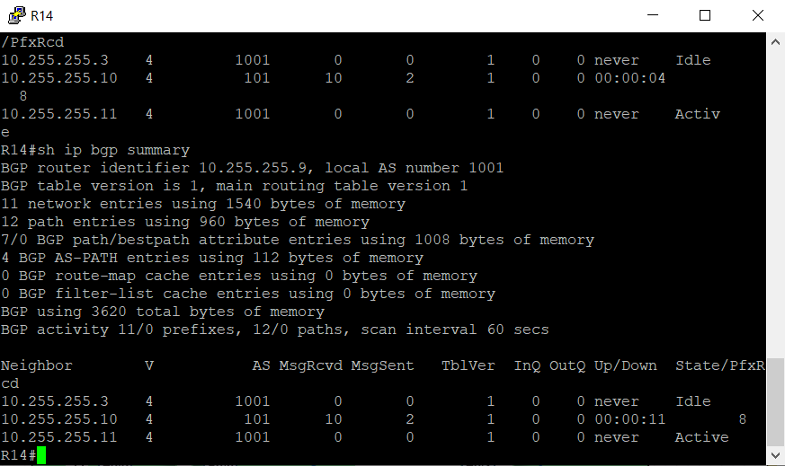
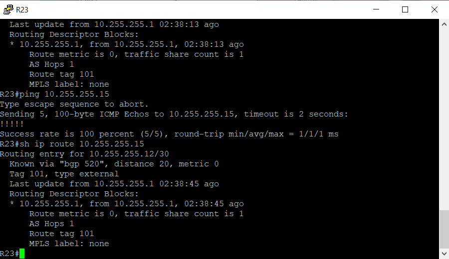
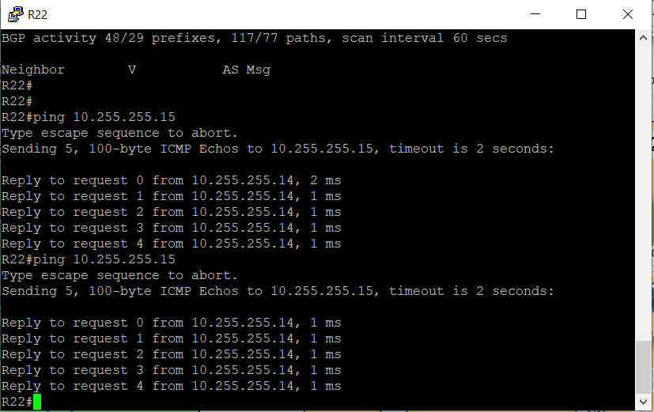

# IBGP

 Цель:

- Настроить iBGP в офисе Москва

- Настроить iBGP в сети провайдера Триада

- Организовать полную IP связанность всех сетей

В этой самостоятельной работе мы ожидаем, что вы самостоятельно:

- iBGP в офисом Москва между маршрутизаторами R14 и R15

- Настроите iBGP в провайдере Триада

- Настройте офиса Москва так, чтобы приоритетным провайдером стал Ламас.

- Настройте офиса С.-Петербург так, чтобы трафик до любого офиса распределялся по двум линкам одновременно

- Все сети в лабораторной работе должны иметь IP связность

## Перед выполнением задания корректируем настройки, выполненные ранее.

### Маршрутизаторы R14-15

Между маршрутизаторами зоны в Москве с прошлого задания не установилось соседство BGP:





На маршрутизатор приходят Reset от 10.255.255.11 - этот маршрутизатор вообще не должен быть нашим соседом, вероятно, мы неправильно внесли настройки, проверяем:


Действительно, мы указали в качестве соседа по зоне 1001 совсем не те маршутизаторы (на самом деле маршрутизатор один, но с разными линками). Исправляем - удаляем неправильные записи, создаем loopback интерфейсы для маршрутизатора, анонсируем их в OSPF и по ним настраиваем соседа. L0 работать должен в рамках одной автономной системы, поэтому адресация L0 берется из серой сети ipv4. Для ipv6 берем белые адреса, т.к. link-local не подходят для соседства ненапрямую подключенных маршрутизаторов. Но что будет, если провайдер поменяется? В случае с BGP ничего плохого, т.к. адресами владеем мы. 

Итак, для Loopback адресов выделена подсеть 10.177.254.0/24. В других автономных системах будет аналогично.

R14

```
n
conf t


router bgp 1001
 no neighbor 10.255.255.3 remote-as 1001
 no neighbor 10.255.255.11 remote-as 1001

end
wr


en
conf t
int l0
ip addr 10.177.254.14 255.255.255.255
ipv6 addr 2001:db8:177:254::14/128
no shut


int l0
ip ospf 1 area 0
ipv6 ospf 1 area 0


router bgp 1001
 neighbor 10.177.254.15 remote-as 1001
 neighbor 10.177.254.15 update-source Loopback 0


end
wr
```

R15

```
en
conf t


router bgp 1001
 no neighbor 10.255.255.1 remote-as 1001
 no neighbor 10.255.255.9 remote-as 1001

end
wr


en
conf t
int l0
ip addr 10.177.254.15 255.255.255.255
ipv6 addr 2001:db8:177:254::15/128
no shut


int l0
ip ospf 1 area 0
ipv6 ospf 1 area 0


router bgp 1001
 neighbor 10.177.254.14 remote-as 1001
 neighbor 10.177.254.14 update-source Loopback 0


end
wr
```

Соседство установлено, маршруты получены от соседа по iBGP:


Что мы видим из Local RIB? 

1. Что маршруты во внешние сети идут через маршрутизаторы других автономных систем. Маршруты получены и от соседа по зоне, но следующий хоп сосед не менял при передаче маршрута:
   
   ```
    *>i 10.52.0.0/16     10.255.255.18            0    100      0 301 520 i
    *                    10.255.255.10                          0 101 301 520 i
    *>i 10.78.0.0/16     10.255.255.18            0    100      0 301 520 2042 ?
    *                    10.255.255.10                          0 101 301 520 2042 ?
   ```

2. Есть suppressed маршруты. Вероятно, то маршруты, которые появились в bgp из инжектирования ospf. ??? О них можно подробнее???

Исправляем эти два пункта - задаем next-hop-self и убираем редистрибуцию из ospf - это не требуется, т.к. маршрутизатор анонсирует известные сети, находящиеся в таблице маршутизации. Заодно выключаем ospf на интерфейсах, которые смотрят к провайдерам.

??? Зачем тогда может применяться редистрибуция???

Исправим эти 2 пункта:

R14:

```
en
conf t
router bgp 1001
 neighbor 10.177.254.15 next-hop-self
 no redistribute ospf 1

end
wr

en
conf t
int e0/2
no ip ospf 1 area 0
no ipv6 ospf 1 area 0


router ospf 1
passive-interface E0/2


router ospfv3 1 
address-family ipv6 unicast
passive-interface Ethernet0/2


end wr
```

R15:

```
en
conf t
router bgp 1001
 neighbor 10.177.254.14 next-hop-self
 no redistribute ospf 1
end
wr


en
conf t
int e0/2
no ip ospf 1 area 0
no ipv6 ospf 1 area 0


router ospf 1
passive-interface E0/2


router ospfv3 1 
address-family ipv6 unicast
passive-interface Ethernet0/2


end
wr
```

Теперь таблица Local RIB изменилась:


Выход в другие автономные системы стал возможен и через соседа по зоне - он стал следующим хопом. При этом в таблице нет маршрута до сети Москвы 10.177.0.0/16, которая анонсируется соседом - причина в том, что сосед находится в том же VLAN????

настройка iBGP в Москве завершена.

Также завершим настройку соседства Киторн-Триада. В прошлой лабораторной работе этого не было в задании.


R22:

```
en
conf t
router bgp 101
 neighbor 10.255.255.2 remote-as 520

end
wr
```

R23:

```
en
conf t
router bgp 520
 neighbor 10.255.255.1 remote-as 101

end
wr
```

### Настроите iBGP в провайдере Триада

На маршрутизаторах ранее были настроены адреса на физических интерфейсах и протокол ISIS.


Для начала отключим на внешних интерфейсах IS-IS.

R23:

```
en 
conf t
int e0/0
no ip router isis
no ipv6 router isis
end
wr
```

R24:

```
en 
conf t
int range e0/0, e0/3
no ip router isis
no ipv6 router isis
end
wr
```

R25-26:

```
en 
conf t
int range e0/1, e0/3
no ip router isis
no ipv6 router isis
end
wr
```

Далее настроим на каждом маршутизаторе Loopback 0:

R23:

```
en
conf t
int loopback 0
ip addr 10.52.254.23 255.255.255.255
ipv6 addr 2001:db8:52:254::23/128
ip router isis
ipv6 router isis
end
wr
```

R24:

```
en
conf t
int loopback 0
ip addr 10.52.254.24 255.255.255.255
ipv6 addr 2001:db8:52:254::24/128
ip router isis
ipv6 router isis
end
wr
```

R25:

```
en
conf t
int loopback 0
ip addr 10.52.254.25 255.255.255.255
ipv6 addr 2001:db8:52:254::25/128
ip router isis
ipv6 router isis
end
wr
```

R26:

```
en
conf t
int loopback 0
ip addr 10.52.254.26 255.255.255.255
ipv6 addr 2001:db8:52:254::26/128
ip router isis
ipv6 router isis
end
wr
```

Проверим, что маршруты появились и проходят запросы icmp:


Теперь мы можем строить соседство BGP. Для этого выберем маршрутизаторы на роль Route Reflector, к примеру R25 и R26. ??? Надо ли на каждом пограничном маршрутизаторе указывать next-hop-self??? Между ними настроим обычное соседство:

R25:

```
en
conf t
router bgp 520
bgp router-id 10.52.254.25
neighbor 10.52.254.26 remote-as 520
neighbor 10.52.254.26 update-source loopback 0
neighbor 10.52.254.26 next-hop-self
end
wr
```

R26:

```
en
conf t
router bgp 520
bgp router-id 10.52.254.26
neighbor 10.52.254.25 remote-as 520
neighbor 10.52.254.25 update-source loopback 0
neighbor 10.52.254.25 next-hop-self
end
wr
```

Смотрим соседство:


Соседство установлено.

Теперь настроим на RR peer-group:

R25-26:

```
en
conf t
router bgp 520
neighbor RRCLIENT peer-group
neighbor RRCLIENT remote-as 520

neighbor RRCLIENT update-source loopback 0
neighbor RRCLIENT next-hop-self
neighbor RRCLIENT route-reflector-client

neighbor 10.52.254.23 peer-group RRCLIENT
neighbor 10.52.254.24 peer-group RRCLIENT

end
wr
```

Настраиваем RR Client - R23 и R24:

R23-24:

```
en
conf t
router bgp 520
neighbor RRSERVER peer-group
neighbor RRSERVER remote-as 520
neighbor RRSERVER update-source loopback 0
neighbor RRSERVER next-hop-self
neighbor 10.52.254.25 peer-group RRSERVER
neighbor 10.52.254.26 peer-group RRSERVER
end
wr
```

Смотрим соседство:


Соседство поднялось.

Также просмотрим маршруты:


Мы видим, что мы получаем анонсы о своей же сети - 10.52.0.0/16.  Плохого в этом нет ничего, т.к. маршрут является суммированным, и в таблице маршутизации есть более конкретные подсети, полученные по IGP.???

Теперь нужно проверить, какие сети анонсирует через BGP провайдер Триада. Причем запустить анонс сети мы можем только на одном маршрутизаторе - сеть попадет в процесс BGP, будет анонсирована всем соседям. За счет суммаризации этот анонс может быть расширен до всего адресного пространства Триады. Так делать не стоит, и лучше выполнить анонс на каждом маршрутизаторе???

Сделаем так - на каждом маршрутизаторе начнем анонсировать сеть 10.52.0.0 с суммаризацией, а также сети своих внешних интерфейсов.

R23:

```
en
conf t
router bgp 520
network 10.52.255.0 mask 255.255.255.252
network 10.52.255.8 mask 255.255.255.252
network 10.255.255.0 mask 255.255.255.252
aggregate-address 10.52.0.0 255.255.0.0
end
wr
```

R24:

```
en
conf t
router bgp 520
network 10.52.255.4 mask 255.255.255.252
network 10.52.255.8 mask 255.255.255.252
network 10.255.255.36 mask 255.255.255.252
network 10.255.255.28 mask 255.255.255.252
aggregate-address 10.52.0.0 255.255.0.0
end
wr
```

R25:

```
en
conf t
router bgp 520
network 10.52.255.0 mask 255.255.255.252
network 10.52.255.12 mask 255.255.255.252
network 10.255.255.4 mask 255.255.255.252
network 10.255.255.20 mask 255.255.255.252
aggregate-address 10.52.0.0 255.255.0.0
end
wr
```

R26:

```
en
conf t
router bgp 520
network 10.52.255.4 mask 255.255.255.252
network 10.52.255.12 mask 255.255.255.252
network 10.255.255.24 mask 255.255.255.252
network 10.255.255.32 mask 255.255.255.252
aggregate-address 10.52.0.0 255.255.0.0
end
wr
```

Посмотрим в СПб, какие приходят ему маршуты:


Мы видим, что сеть Триады приходит как агрегированной с длиной префикса 16, так и более конкретными префиксами - лупбэками. Эти адреса светить не стоит??? Как лучше поступить - фильтровать, или выделить такую сеть, которая не будет попадать под команду network???

Мы видим, что маршрут из Москвы не приходит. Разбираемся.

Смотрим в Москве, есть ли маршруты из СПб:


Маршруты есть.

Смотрим в Триаде:


Маршруты из СПб есть, из Москвы нет.

??? Есть такое наблюдение:



Адрес 10.255.255.15 отвечает, маршут получен от соседа 10.255.255.1. Но с самого 10.255.255.1 ответов нет, есть от адресов, входящих в широковещательный домен:



Просто заметка. ??? это направленный броадкаст???

Заметим, что до Москвы маршрутов нет и в Ламасе, Киторне.

Проверяем настройки маршрутизаторов в Москве:


Анонс агреггированный сети Москвы 10.177.0.0/16 есть, но нет хотя бы одного анонсированного маршута. После выключения инжекта OSPF  маршрут перестал анонсироваться.

Почему? Ведь у нас есть прямо подключенные сети? Но у них другая длина префикса, нужно командой network анонсировать именно имеющиеся перфиксы.

Т.е. правильное поведение - анонс известного маршрута, команда суммаризации. Но не анонс уже суммаризованного маршрута.

R14:

```
en
conf t
router bgp 1001
network 10.177.255.16 mask 255.255.255.252
network 10.177.255.0 mask 255.255.255.248
network 10.177.255.8 mask 255.255.255.248
end
wr
```

R15:

```
en
conf t
router bgp 1001
network 10.177.255.20 mask 255.255.255.252
network 10.177.255.0 mask 255.255.255.248
network 10.177.255.8 mask 255.255.255.248
end
wr
```

??? Лучше анонсировать все известные интерфейсы, даже если они входят в суммаризацию, или достаточно указать один??? как лучше

Проверяем, пришел ли маршрут в СПб:


Маршрут получаем, но откуда берутся маршруты 10.52.255.0/30????


### Настройте офиса Москва так, чтобы приоритетным провайдером стал Ламас.


Сейчас трафик может идти через Киторн, пример:


Для того, чтобы трафик шел черз Ламас, нужно задать атрибут local-preference

R15:


```
en
conf t
router bgp 1001
bgp default local-preference 200
end
wr


```


Результат:


Все маршруты проходят через R15 и далее в Ламас.


Здесь еще вопрос??? На R14-15 заданы дефолтные маршруты, чтобы передавать его по OSPF. Как можно избавиться от дефолта?


### Настройте офиса С.-Петербург так, чтобы трафик до любого офиса распределялся по двум линкам одновременно


!!! ктати, ранее мы забыли указать для ipv6 пассивные интерфейсы.

R15

en
conf t
interface Ethernet0/2
 no ip ospf 1 area 0
 no ipv6 ospf 1 area 0

router ospfv3 1
 passive-interface Ethernet0/2
!
router ospf 1
  passive-interface Ethernet0/2
end
wr

СПб R18

en
conf t
router eigrp NG
 !
 address-family ipv4 unicast autonomous-system 1
  !
  no network 10.255.255.28 0.0.0.3
  no network 10.255.255.32 0.0.0.3
end
wr

причем для ipv6 таких настроек с включением на интерфейсах не задавалось, соответственно и команды на отключение нужны ли другие? Нужно гасить прямо на интерфейсах. Неудобно как-то

en
conf t
int range e0/2-3
no ipv6 eigrp 1
end
wr

не помогло, команда в конфиг не провалилась.

en
conf t

router eigrp NG
 address-family ipv6 unicast autonomous-system 1
 af-interface E0/2
 shutdown
 af-interface E0/3
 shutdown
 end
 wr

 Вот так получилось
