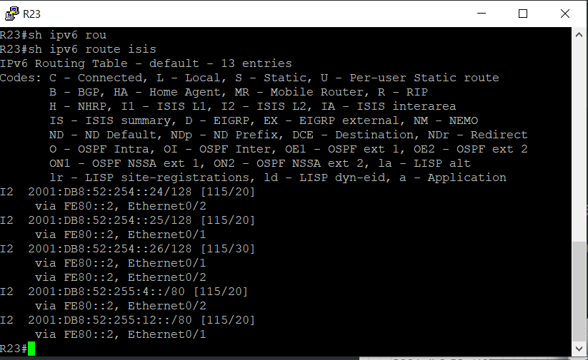
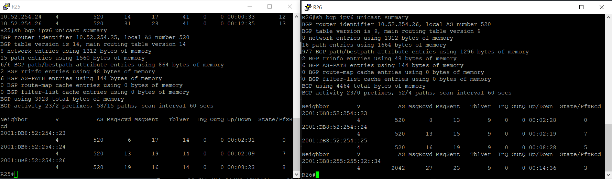

# IBGP

 Цель:

- Настроить iBGP в офисе Москва

- Настроить iBGP в сети провайдера Триада

- Организовать полную IP связанность всех сетей

В этой самостоятельной работе мы ожидаем, что вы самостоятельно:

1.[iBGP в офисом Москва между маршрутизаторами R14 и R15(head#1)
2.[Настроите iBGP в провайдере Триада(head#2)
3.[Настройте офиса Москва так, чтобы приоритетным провайдером стал Ламас.(head#3)
4.[Настройте офиса С.-Петербург так, чтобы трафик до любого офиса распределялся по двум линкам одновременно(head#4)
5.[Все сети в лабораторной работе должны иметь IP связность](head#4)

## <a name="head1"></a>  iBGP в офисом Москва между маршрутизаторами R14 и R15

Для настройки iBGP следует задать Loopback-адреса.

L0 работать должен в рамках одной автономной системы, поэтому адресация L0  может быть серой (в лабораторной работе все адреса серые, т.к. изначально были выбраны именно они). Для ipv6 берем белые адреса, т.к. link-local не подходят для соседства ненапрямую подключенных маршрутизаторов. Но что будет, если провайдер поменяется? В случае с BGP ничего плохого, т.к. адресами владеем мы. 

Или все же лучше для L0 выдавать белые маршрутизируемые в интернете адреса? Не стоит. Если нужна связь между офисами - то через VPN.???

Итак, для Loopback адресов выделена подсеть 10.177.254.0/24. В других автономных системах будет аналогично.

R14:

```
en
conf t


router bgp 1001
 no neighbor 10.255.255.3 remote-as 1001
 no neighbor 10.255.255.11 remote-as 1001
 address-family ipv6 unicast
 no neighbor 2001:DB8:177:255::3 remote-as 1001
 no neighbor 2001:DB8:177:255:8::11 remote-as 1001
end
wr


en
conf t
int l0
ip addr 10.177.254.14 255.255.255.255
ipv6 addr 2001:db8:177:254::14/128
no shut


int l0
ip ospf 1 area 0
ipv6 ospf 1 area 0


router bgp 1001
 neighbor 10.177.254.15 remote-as 1001
 neighbor 10.177.254.15 update-source Loopback 0
 address-family ipv6 unicast
 neighbor 2001:DB8:177:254::15 remote-as 1001
 neighbor 2001:DB8:177:254::15 update-source Loopback 0


end
wr
```

R15

```
en
conf t


router bgp 1001
 no neighbor 10.255.255.1 remote-as 1001
 no neighbor 10.255.255.9 remote-as 1001
 address-family ipv6 unicast
 no neighbor 2001:DB8:177:255::1 remote-as 1001
 no neighbor 2001:DB8:177:255:8::9 remote-as 1001
end
wr


en
conf t
int l0
ip addr 10.177.254.15 255.255.255.255
ipv6 addr 2001:db8:177:254::15/128
no shut


int l0
ip ospf 1 area 0
ipv6 ospf 1 area 0


router bgp 1001
 neighbor 10.177.254.14 remote-as 1001
 neighbor 10.177.254.14 update-source Loopback 0
 address-family ipv6 unicast
 neighbor 2001:DB8:177:254::14 remote-as 1001
 neighbor 2001:DB8:177:254::14 update-source Loopback 0


end
wr
```

Соседство установлено, маршруты получены от соседа по iBGP:


Что мы видим из Local RIB? 

1. Что маршруты во внешние сети идут через маршрутизаторы других автономных систем. Маршруты получены и от соседа по зоне, но следующий хоп сосед не менял при передаче маршрута:
   
   ```
    *>i 10.52.0.0/16     10.255.255.18            0    100      0 301 520 i
    *                    10.255.255.10                          0 101 301 520 i
    *>i 10.78.0.0/16     10.255.255.18            0    100      0 301 520 2042 ?
    *                    10.255.255.10                          0 101 301 520 2042 ?
   ```

2. В другом варианте кофигов (не приведен здесь) есть suppressed маршруты. Вероятно, то маршруты, которые появились в bgp из инжектирования ospf. ??? О них можно подробнее???

Задаем next-hop-self.

R14:

```
en
conf t
router bgp 1001
 neighbor 10.177.254.15 next-hop-self
 address-family ipv6 unicast
 neighbor 2001:db8:177:254::15 next-hop-self

end
wr
```

R15:

```
en
conf t
router bgp 1001
 neighbor 10.177.254.14 next-hop-self
 address-family ipv6 unicast
 neighbor 2001:db8:177:254::14 next-hop-self

end
wr
```

Теперь таблица Local RIB изменилась:


Выход в другие автономные системы стал возможен и через соседа по зоне - он стал следующим хопом.


Проблема в R15 - он не анонсирует сеть 10.177.0.0/16. И видит выход в эту сеть не через себя, а соседа.

Проверяем конфиг:


Все верно, R15 анонсирует сеть 10.177.10.0 255.255.255.248. Такой сети в таблице у него нет - неправильно указана маска, должна быть 255.255.255.0. Исправляем.

R15:

```
en
conf t
router bgp 1001
 address-family ipv4
 no network 10.177.10.0 mask 255.255.255.248
 network 10.177.10.0 mask 255.255.255.0
end
wr
```

Все стало как требуется:


Стоит обратить внимание на AD iBGP. Что будет с таким сценарием - сосед транслирует несуммаризованный маршрут по BPG, этот маршут принимается и вытесняет OSPF, который более оптимальный/актуальный. Но вытеснения не будет - AD iBGP 200, в отличие от eBPG c 20. Все логично.

Также проверим таблицу ipv6:


Оба маршрутизатора знают, что во внешние автономные системы можно выйти через соседа. Правда, это не лучший маршрут, и он не попадает в таблицу.

Настройка iBGP в Москве завершена.

Также завершим настройку соседства Киторн-Триада. В прошлой лабораторной работе этого не было в задании.


R22:

```
en
conf t
router bgp 101
 neighbor 10.255.255.2 remote-as 520
 address-family ipv6 unicast
 neighbor 2001:db8:255:255::0/80

end
wr
```

R23:

```
en
conf t
router bgp 520
 neighbor 10.255.255.1 remote-as 101
 address-family ipv6 unicast
 neighbor 2001:db8:255:255::1/80

end
wr
```

## <a name="head2"></a>  iBGP в провайдере Триада

На маршрутизаторах ранее были настроены адреса на физических интерфейсах и протокол ISIS.


Для начала отключим на внешних интерфейсах IS-IS.

R23:

```
en 
conf t
int e0/0
no ip router isis
no ipv6 router isis
end
wr
```

R24:

```
en 
conf t
int range e0/0, e0/3
no ip router isis
no ipv6 router isis
end
wr
```

R25-26:

```
en 
conf t
int range e0/1, e0/3
no ip router isis
no ipv6 router isis
end
wr
```

Далее настроим на каждом маршутизаторе Loopback 0:

R23:

```
en
conf t
int loopback 0
ip addr 10.52.254.23 255.255.255.255
ipv6 addr 2001:db8:52:254::23/128
ip router isis
ipv6 router isis
end
wr
```

R24:

```
en
conf t
int loopback 0
ip addr 10.52.254.24 255.255.255.255
ipv6 addr 2001:db8:52:254::24/128
ip router isis
ipv6 router isis
end
wr
```

R25:

```
en
conf t
int loopback 0
ip addr 10.52.254.25 255.255.255.255
ipv6 addr 2001:db8:52:254::25/128
ip router isis
ipv6 router isis
end
wr
```

R26:

```
en
conf t
int loopback 0
ip addr 10.52.254.26 255.255.255.255
ipv6 addr 2001:db8:52:254::26/128
ip router isis
ipv6 router isis
end
wr
```

Проверим, что маршруты до лупбэков появились и проходят запросы icmp:




Теперь мы можем строить соседство BGP. Для этого выберем маршрутизаторы на роль Route Reflector, к примеру R25 и R26. Между ними настроим обычное соседство:

R25:

```
en
conf t
router bgp 520
bgp router-id 10.52.254.25
neighbor 10.52.254.26 remote-as 520
neighbor 10.52.254.26 update-source loopback 0
neighbor 10.52.254.26 next-hop-self
address-family ipv6 unicast
neighbor 2001:db8:52:254::26 remote-as 520
neighbor 2001:db8:52:254::26 update-source loopback 0
neighbor 2001:db8:52:254::26 next-hop-self

end
wr
```

R26:

```
en
conf t
router bgp 520
bgp router-id 10.52.254.26
neighbor 10.52.254.25 remote-as 520
neighbor 10.52.254.25 update-source loopback 0
neighbor 10.52.254.25 next-hop-self
address-family ipv6 unicast
neighbor 2001:db8:52:254::25 remote-as 520
neighbor 2001:db8:52:254::25 update-source loopback 0
neighbor 2001:db8:52:254::25 next-hop-self

end
wr
```

Смотрим соседство:


Соседство установлено. В ipv6 аналогично.

Теперь настроим на RR peer-group:

R25-26:

```
en
conf t
router bgp 520
neighbor RRCLIENT peer-group
neighbor RRCLIENT remote-as 520

neighbor RRCLIENT update-source loopback 0
neighbor RRCLIENT next-hop-self
neighbor RRCLIENT route-reflector-client

neighbor 10.52.254.23 peer-group RRCLIENT
neighbor 10.52.254.24 peer-group RRCLIENT

address-family ipv6 unicast

neighbor RRCLIENT6 peer-group
neighbor RRCLIENT6 remote-as 520

neighbor RRCLIENT6 update-source loopback 0
neighbor RRCLIENT6 next-hop-self
neighbor RRCLIENT6 route-reflector-client

neighbor 2001:db8:52:254::23 peer-group RRCLIENT6
neighbor 2001:db8:52:254::24 peer-group RRCLIENT6


end
wr
```

Настраиваем RR Client - R23 и R24:

R23-24:

```
en
conf t
router bgp 520
neighbor RRSERVER peer-group
neighbor RRSERVER remote-as 520
neighbor RRSERVER update-source loopback 0
neighbor RRSERVER next-hop-self
neighbor 10.52.254.25 peer-group RRSERVER
neighbor 10.52.254.26 peer-group RRSERVER

address-family ipv6 unicast
neighbor RRSERVER6 peer-group
neighbor RRSERVER6 remote-as 520
neighbor RRSERVER6 update-source loopback 0
neighbor RRSERVER6 next-hop-self
neighbor 2001:db8:52:254::25 peer-group RRSERVER6
neighbor 2001:db8:52:254::26 peer-group RRSERVER6


end
wr
```

Смотрим соседство:


Соседство поднялось.

ipv6:



Также просмотрим маршруты:


Мы видим, что в BGP есть маршруты до Москвы, СПб и линков между автономными системами. Т.е. сети из пространства Триады мы даже не анонсируем наружу. Если захотим - запустить анонс сети мы можем только на одном маршрутизаторе - сеть попадет в процесс BGP, будет анонсирована всем соседям. За счет суммаризации этот анонс может быть расширен до всего адресного пространства Триады. Так делать не стоит, и лучше выполнить анонс на каждом маршрутизаторе??? А если анонсировать, то следует исключить лупэки??? Фильтрацией либо выделением их в отдельную сеть, не попадающую по суммаризацию???

Посмотрим в СПб, какие приходят ему маршруты:


Почему-то пришли лупбэки Триады и сети внутренних линков. Почему? Потому что мы инжектировали в BGP IS-IS. Так делать не нужно. Причем команда network для анонса не нужна.

Мы видим, что сеть Триады приходит как агрегированной с длиной префикса 16, так и более конкретными префиксами - лупбэками. Эти адреса светить не стоит??? Как лучше поступить - фильтровать, или выделить такую сеть, которая не будет попадать под команду network???

Еще вопрос.

 ??? Лучше анонсировать все известные интерфейсы, даже если они входят в суммаризацию, или достаточно указать один??? На всех маршрутизатора системы следует делать анонс????

Завершим настройку в Триаде, проанонсировав прямо подключенные к маршрутизаторам сети.

R23:

```
en
conf t

router bgp 520

address-family ipv4 unicast
network 10.255.255.0 mask 255.255.255.252

address-family ipv6 unicast
network 2001:db8:255:255:0::0/80

end
wr
```

R24:

```
en
conf t

router bgp 520

address-family ipv4 unicast

network 10.255.255.36 mask 255.255.255.252
network 10.255.255.28 mask 255.255.255.252


address-family ipv6 unicast
network 2001:db8:255:255:36::0/80
network 2001:db8:255:255:28::0/80

end
wr
```

R25:

```
en
conf t

router bgp 520

network 10.255.255.4 mask 255.255.255.252
network 10.255.255.20 mask 255.255.255.252

address-family ipv6 unicast
network 2001:db8:255:255:4::0/80
network 2001:db8:255:255:20::0/80

end
wr
```

R26:

```
en
conf t

router bgp 520

address-family ipv4 unicast
network 10.255.255.24 mask 255.255.255.252
network 10.255.255.32 mask 255.255.255.252

address-family ipv6 unicast
network 2001:db8:255:255:24::0/80
network 2001:db8:255:255:32::0/80

end
wr
```

## ## <a name="head3"></a>  Настройка офиса Москва так, чтобы приоритетным провайдером стал Ламас.


Сейчас трафик может идти через Киторн, пример:


Для того, чтобы трафик шел черз Ламас, нужно задать атрибут local-preference

R15:

```
en
conf t
router bgp 1001
bgp default local-preference 200
end
wr
```

Результат:


Все маршруты проходят через R15 и далее в Ламас.


На R14-15 заданы дефолтные маршруты, чтобы передавать его по OSPF. Как можно избавиться от дефолта? Ручной записью:

R14:

```
en
conf t
no ip route 0.0.0.0 0.0.0.0 10.255.255.10
no ipv6 route ::/0 2001:DB8:255:255:8::10
ip route 0.0.0.0 0.0.0.0 Null 0
ipv6 route ::/0 Null 0
end
wr
```

R15:

```
en
conf t
no ip route 0.0.0.0 0.0.0.0 10.255.255.18
no ipv6 route ::/0 2001:DB8:255:255:16::18
ip route 0.0.0.0 0.0.0.0 Null 0
ipv6 route ::/0 Null 0
end
wr
```

Стоит ли убирать статический дефолт с пограничных маршутизаторов???

### <a name="head4"></a>  Настройка офиса С.-Петербург так, чтобы трафик до любого офиса распределялся по двум линкам одновременно


Сперва отключим статические маршруты из СПб через провайдера.

R18:

```
en
conf t

no ip route 0.0.0.0 0.0.0.0 10.255.255.29
no ip route 0.0.0.0 0.0.0.0 10.255.255.33
no ipv6 route ::/0 Ethernet0/3 2001:DB8:255:255:32::33
no ipv6 route ::/0 Ethernet0/2 2001:DB8:255:255:28::29

ip route 0.0.0.0 0.0.0.0 Null 0
ipv6 route ::/0 Null 0
end
wr
```

Прописываем дефолт в Null, чтобы соседи по EIGRP все равно получали маршрут по умолчанию. Однако в другой лабораторной работе маршрут до определенной сети, который получен по EIGRP, и который отправлен в Null записью ip route, не транслировался соседям. Странно.

Теперь проверим, как пойдут пакеты до Москвы:


Через один линк - R24. Поскольку в таблице RIB может быть один маршрут, который затем поместится и в таблицу маршрутизации.

Исправляем - увеличиваем число маршутов до двух.

R18:

```
en
conf t
router bgp 2042
maximum-paths 2


address-family ipv6
maximum-paths 2

end
wr
```

Результат:


При проверке с R16-17 в СПб трафик все время проходил через 10.255.255.33. Но если выполнить с компьютеров:
 

Балансировка идет через разные выходные линки из СПб.  

Задача выполнена.

## <a name="head5"></a>  Все сети в лабораторной работе должны иметь IP связность

Проверим, какие маршруты приходят в офис Москвы:


Маршруты есть до всех точек, кроме офиса Чокурдах. В этом офисе не настроен BGP, известен только маршрут до внешнего интерфейса R28. Офис не имеет своей автономной системы и не располагает адресами, маршрутизируемыми за его пределами. Необходим VPN. Если же нужен только доступ из этого офиса, то решением будет NAT.

Проверим связь с R20 до  R28:


Связь есть. Задача выполнена.
