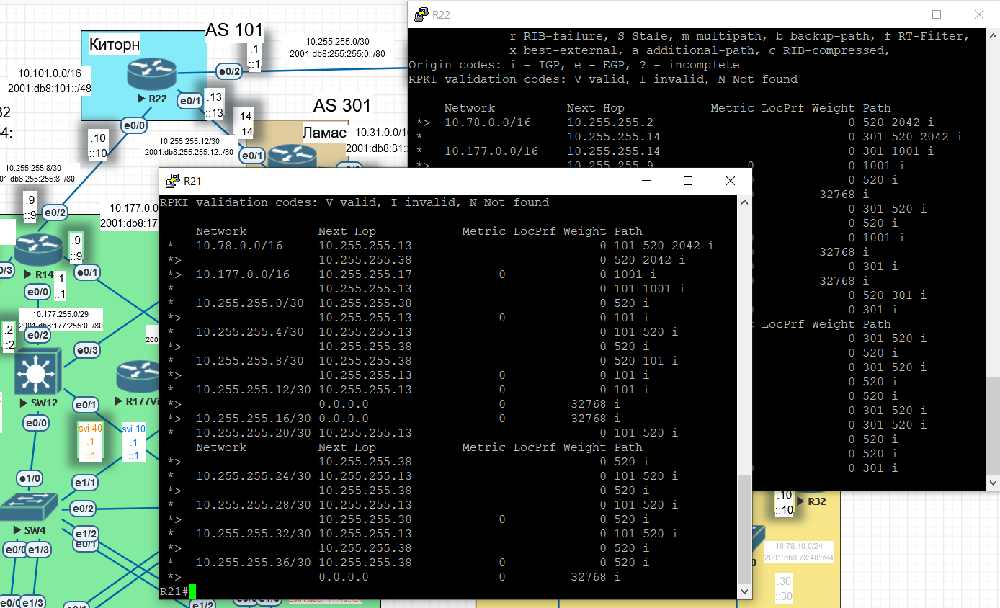
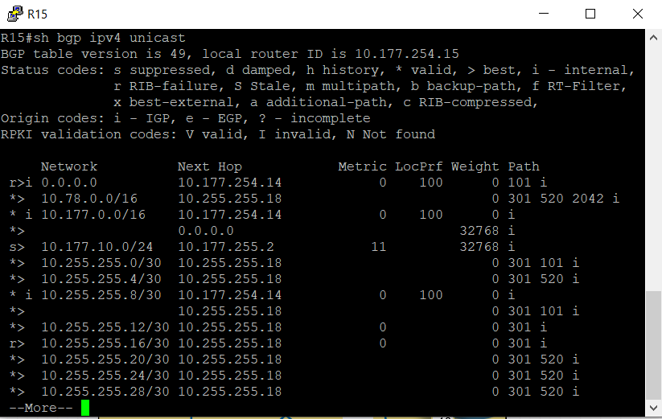
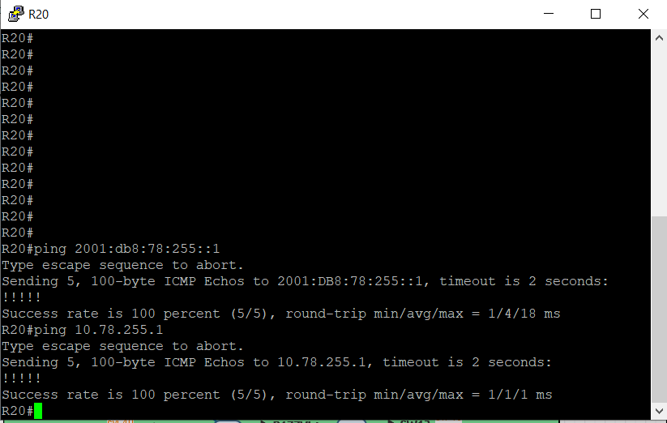

# BGP. Фильтрация

Цель:

Настроить фильтрацию для офиса в Москве;
Настроить фильтрацию для офиса в С.-Петербург.

В этой самостоятельной работе мы ожидаем, что вы самостоятельно:

1. [Настроите фильтрацию в офисе Москва так, чтобы не появилось транзитного трафика(As-path);](#head1)
2. [Настроите фильтрацию в офисе С.-Петербург так, чтобы не появилось транзитного трафика(Prefix-list);](#head2)
3. [Настроите провайдера Киторн так, чтобы в офис Москва отдавался только маршрут по-умолчанию;](#head3)
4. [Настроите провайдера Ламас так, чтобы в офис Москва отдавался только маршрут по-умолчанию и префикс офиса С.-Петербург;](#head4)
5. [Все сети в лабораторной работе должны иметь IP связность;](#head5)
6. [Конфигурации устройств](configs)


##  <a name="head1"></a>  Настройка фильтрации в офисе Москва так, чтобы не появилось транзитного трафика(As-path)


Чтобы не приходил транзитный трафик, автономная система Москвы не должна анонсировать соседям маршруты кроме тех префиксов, которые есть в самой автономной системе.

На данный момент Москва является транзитной. Убедиться в этом можно, открыв RIB-таблицу R22:


Видим, что маршрут в СПб, Триаду может проходит через Москву. 

Выполним фильтрацию исходящих из Москвы маршрутов.

R14:

```
en
conf t
router bgp 1001
address-family ipv4 unicast
ip as-path access-list 1 permit ^$
router bgp 1001
address-family ipv4 unicast
ip as-path access-list 1 deny .*
router bgp 1001
address-family ipv4 unicast
neighbor 10.255.255.10 filter-list 1 out
address-family ipv6 unicast
neighbor 2001:db8:255:255:8::10 filter-list 1 out
end
wr
```

R15:

```
en
conf t
router bgp 1001
address-family ipv4 unicast
ip as-path access-list 1 permit ^$
router bgp 1001
address-family ipv4 unicast
ip as-path access-list 1 deny .*
router bgp 1001
address-family ipv4 unicast
neighbor 10.255.255.10 filter-list 1 out
address-family ipv6 unicast
neighbor 2001:db8:255:255:16::18 filter-list 1 out
end
wr
```

Результат:




Маршрутизаторы, граничащие с Москвой, не получют от ее автономной системы транзитные маршруты.

##  <a name="head2"></a> Настройка фильтрации в офисе С.-Петербург так, чтобы не появилось транзитного трафика(Prefix-list)


Смотрим, какие маршруты получают R24 и R26 от СПб:


В принципе, при текущей топологии не должно быть транзитного трафика. Причина - R18 говорит, что знает маршрут до Москвы через AS520.  Этот апдейт приходит к единственным соседям в зоне AS520, они ее отбрасывают, т.к. видят свою AS в пришедшем апдейте.

##  <a name="head3"></a> Настройка провайдера Киторн так, чтобы в офис Москва отдавался только маршрут по-умолчанию


Что сейчас получает R14 от R22:


Настроим R22 на передачу маршрута по умолчанию:

R22:

```
en
conf t
router bgp 101
address-family ipv4 unicast
neighbor 10.255.255.9 default-originate

address-family ipv6 unicast
neighbor 2001:db8:255:255:8::9 default-originate
end
wr
```

На R14 убираем статический маршрут по умолчанию. То же делаем заодно и на R15:

```
en
conf t
no ip route 0.0.0.0 0.0.0.0 Null0
no ipv6 route ::/0 Null0

end
wr
```

Смотрим RIB:


Маршрут по умолчанию получен. Но почему есть и более подробные маршруты??? clear bgp ipv4 unicast * не исправил проблему.

##  <a name="head4"></a> Настройка провайдера Ламас так, чтобы в офис Москва отдавался только маршрут по-умолчанию и префикс офиса С.-Петербург


Исходя из предыдущего пункта команда default-originate добавляет к апдейтам дефолт, но не убирает анонс прочих сетей. Поэтому задачу выполним в два шага - анонс дефолта и фильтрация исходящих анонсов. Все делается на R21.

Что сейчас приходит на R15:



Видим префиксы до линков между маршрутизаторами, дефолт через соседа R14.

Настраиваем R21:

```
en
conf t
router bgp 301
address-family ipv4 unicast
neighbor 10.255.255.17 default-originate

address-family ipv6 unicast
neighbor 2001:db8:255:255:16::17 default-originate
end
wr
```

На R15 стал приходить маршрут по умолчанию:


Но есть и лишние префиксы, нам нужно оставить только до СПб. Делаем фильтрацию. AS-PATH использовали ранее, теперь используем префикс-лист.

R21:

```
en
conf t

ip prefix-list PL_OUT_N17 seq 5 permit 10.78.0.0/15 ge 16 le 32
ip prefix-list PL_OUT_N17 seq 10 deny 0.0.0.0/0 le 32

ipv6 prefix-list PL_OUT_N17 seq 5 permit 2001:db8:78::/47 ge 48 le 128
ipv6 prefix-list PL_OUT_N17 seq 10 deny ::/0 le 128

router bgp 301
address-family ipv4 unicast
neighbor 10.255.255.17 prefix-list PL_OUT_N17 OUT

address-family ipv6 unicast
neighbor 2001:db8:255:255:16::17 prefix-list PL_OUT_N17 OUT

end
wr
```

---

??? Если мы укажем  ip prefix-list PL_OUT_N17 seq 5 permit 10.78.0.0/15 ge 16 le 32 , то будут ли пропускаться префиксы с длиной 15???

```
R21(config)#ip prefix-list PL_OUT_N17 seq 5 permit 10.78.0.0/16 ge 16 le 32
% Invalid prefix range for 10.78.0.0/16, make sure: len < ge-value <= le-value
```

----

Результат на R15:


Получаем маршут по умолчанию от AS301. Получаем и маршут до СПб. Все прочие префиксы мы получаем от соседа по зоне.

Задача выполнена.

##  <a name="head5"></a>  Все сети в лабораторной работе должны иметь IP связность

Связность была достигнута в предыдущей лабораторной работе. Для пример проведем icmp-запросы R20-R17:




R20-R32:


