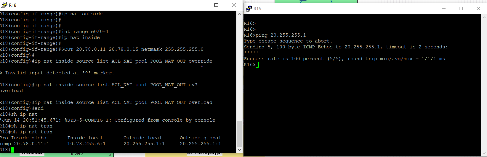
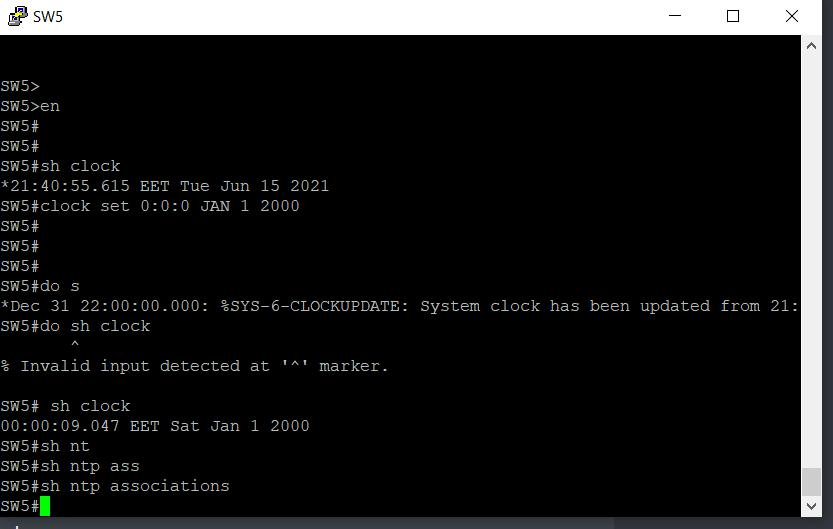

# Основные протоколы сети интернет

1. [Настроите NAT(PAT) на R14 и R15. Трансляция должна осуществляться в адрес автономной системы AS1001](#head1)
2. Настроите NAT(PAT) на R18. Трансляция должна осуществляться в пул из 5 адресов автономной системы AS2042
3. Настроите статический NAT для R20
4. Настроите NAT так, чтобы R19 был доступен с любого узла для удаленного управления
5. Настроите статический NAT(PAT) для офиса Чокурдах
6. Настроите DHCP сервер в офисе Москва на маршрутизаторах R12 и R13. VPC1 и VPC7 должны получать сетевые настройки по DHCP
7. Настроите NTP сервер на R12 и R13. Все устройства в офисе Москва должны синхронизировать время с R12 и R13
8. Все офисы в лабораторной работе должны иметь IP связность

## <a name="head1"></a> Настроите NAT(PAT) на R14 и R15. Трансляция должна осуществляться в адрес автономной системы AS1001


До данной лабораторной работы у автономной системы AS1001 не было анонсируемых адресов. Адреса из сети 10.177.0.0/16 являются серыми и анонсировались, пока не был настроен NAT.

Поэтому первым делом отключаем анонс сети 10.177.0.0/16 в BGP.

R14-15:

```
en
conf t


router bgp 1001
address-family ipv4
no network 10.177.10.0 mask 255.255.255.0
no network 10.177.40.0 mask 255.255.255.0
no network 10.177.255.0 mask 255.255.255.248
no network 10.177.255.8 mask 255.255.255.248
no network 10.177.255.16 mask 255.255.255.248
no aggregate-address 10.177.0.0 255.255.0.0 summary-only

end
wr
```

После обновления маршрутной информации из внутренней сети офиса Москвы нельзя связаться с удаленными точками. Они не будут знать, куда направлять ответ. Нужно добавить транляцию адресов.

Начнем анонсировать 1 белый адрес. Причем поскольку у нас 2 выхода из автономной системы, то мы не можем использовать 1 адрес - если трансляция будет выполнена на R14, ответный пакет может прийти на R15. На R15 в таблице трансляции не будет записи, чтобы выполнить обратную трансляцию. Поэтому нам нужно анонсировать по 1 уникальному адресу на каждом маршрутизаторе.

R14:

```
en
conf t

ip route 20.177.0.14 255.255.255.255 Null 0
router bgp 1001
address-family ipv4
network 20.177.0.14 mask 255.255.255.255
end
wr
```

R15:

```
en
conf t

ip route 20.177.0.15 255.255.255.255 Null 0
router bgp 1001
address-family ipv4
network 20.177.0.15 mask 255.255.255.255
end
wr
```

Далее настроим трансляцию в этот адрес на каждом маршрутизаторе.

R14:

```
en
conf t
ip access-list extended ACL_NAT
permit ip 10.177.0.0 0.0.255.255 any

ip nat pool POOL_NAT_OUT 20.177.0.14 20.177.0.14 netmask 255.255.255.252
ip nat inside source list ACL_NAT pool POOL_NAT_OUT overload
interface Ethernet0/0
ip nat inside

interface Ethernet0/1
ip nat inside

interface Ethernet0/3
ip nat inside

interface Ethernet0/2
ip nat outside

end
wr
```

R15:

```
en
conf t

ip access-list extended ACL_NAT
permit ip 10.177.0.0 0.0.255.255 any

interface Ethernet0/0
ip nat inside

interface Ethernet0/1
ip nat inside

interface Ethernet0/3
ip nat inside

interface Ethernet0/2
ip nat outside

ip access-list extended ACL_NAT
permit ip 10.177.0.0 0.0.255.255 any
ip nat pool POOL_NAT_OUT 20.177.0.15 20.177.0.15 netmask 255.255.255.240

ip nat inside source list ACL_NAT pool POOL_NAT_OUT overload

end
wr
```

Результат на R15:


Трансляция не выполняется. Причина в том, что адрес трансляции 20.177.0.15 при маске 255.255.255.240 оказался бродкастом. В этот адрес трансляция не будет выполняться. Поэтому делаем маску 255.255.255.0.

R15:

```
en
conf t

no ip nat pool POOL_NAT_OUT 20.177.0.15 20.177.0.15 netmask 255.255.255.240
ip nat pool POOL_NAT_OUT 20.177.0.15 20.177.0.15 netmask 255.255.255.0


end
wr
```

Успешно:


??? зачем такие проверки со стороны машрутизатора на принадлежность адреса бродкасту???

??? стоит ли использовать standard acl??? Extended позволит присвоить понятное название листу.

То же делаем для R14:

```
en
conf t

no ip nat pool POOL_NAT_OUT 20.177.0.15 20.177.0.14 netmask 255.255.255.252
ip nat pool POOL_NAT_OUT 20.177.0.15 20.177.0.14 netmask 255.255.255.0


end
wr
```

Результат:


Однако  в случае проверки связи до R21 связи нет:


Связи нет. Причина - пакет уходит через R14, а возвращается через R15, т.к. R15 анонсирует маршрут до R14, и R21 выбирает именно его. Но в таблице трансляций R15 нет трансляции для SW13.

Как решить? Сделать фильтрацию анонсируемых префиксов.

R14:

```
en
conf t
no ip prefix-list PL_DENY_WHITE_R15
ip prefix-list PL_DENY_WHITE_R15 deny 20.177.0.15/32
ip prefix-list PL_DENY_WHITE_R15 permit 0.0.0.0/0 le 32


router bgp 1001
address-family ipv4
neighbor 20.255.255.10 prefix-list PL_DENY_WHITE_R15 out

end

wr
```

R15:

```
en
conf t
no ip prefix-list PL_DENY_WHITE_R14
ip prefix-list PL_DENY_WHITE_R14 deny 20.177.0.14/32
ip prefix-list PL_DENY_WHITE_R14 permit 0.0.0.0/0 le 32


router bgp 1001
address-family ipv4
neighbor 20.255.255.18 prefix-list PL_DENY_WHITE_R14 out

end

wr
```

Теперь маршрут до внешнего анонсируемого адреса R14 идет только через Киторн, маршрут до внешнего анонсируемого адреса R15 идит через Ламас. Связь до R21 проходит:


??? Или лучше сделать фильтрацию префиксов внутри зоны 1001, чтобы R14 не знал о внешнем анонсируемом адресе R15, а R15 не знал о внешнем анонсируемом адресе R14???

## Настроите NAT(PAT) на R18. Трансляция должна осуществляться в пул из 5 адресов автономной системы AS2042


Аналогично с Москвой сперва отключаем анонс внутренних адресов 10.78.0.0/16 и анонсируем адреса AS2042.

R18:

```
en
conf t
ip route 20.78.0.0 255.255.255.0 Null 0
router bgp 2042
address-family ipv4
no network 10.78.255.0 mask 255.255.255.252
no network 10.78.255.4 mask 255.255.255.252
no aggregate-address 10.78.0.0 255.255.0.0 summary-only
network 20.78.0.0 mask 255.255.255.0
end
wr
```

Далее настраиваем PAT.

R18:

```
en
conf t
ip access-list extended ACL_NAT
permit ip 10.78.0.0 0.0.255.255 any


int range e0/2-3
ip nat outside


int range e0/0-1
ip nat inside

ip nat pool POOL_NAT_OUT 20.78.0.11 20.78.0.15 netmask 255.255.255.0

ip nat inside source list ACL_NAT pool POOL_NAT_OUT overload

end
wr
```

Результат проверки связи до Киторна:



## Настроите статический NAT для R20


??? При выходе из AS на R14 и R15 должна быть трансляция в разные адреса? Или нужна трансляция static только на R15? Но тогда при потере связи R15 с Ламасом трансляция будет выполняться через R14 PAT.

Сделаем пока что трансляцию только на R15.

R15:

```
en
conf t
ip route 20.177.20.20 255.255.255.255 Null 0
router bgp 1001
network 20.177.20.20 mask 255.255.255.255

exit
ip nat inside source static 10.177.255.22 20.177.20.20
end
wr
```

Проверка:


Запись статической трансляции появилась с прочерками, а при выполнении трансляции идет добавление новых временных записей.

Однако, если включим R14, то получим ситуацию:


Связь до Киторна есть, но трансляция на R15 не выполняется. Причина - R15 пересылает пакет на R14, где статическая трансляция не настроена, R14 выполняет PAT.

Это не совсем то, что надо.

Есть и другая проблема:


Киторн видит путь до статически транслируемого адреса через R14. Но R14 не знает, что этот адрес нужно транслировать. Поэтому из Киторна мы не можем связаться с R20. А вот из Ламаса - вполне:


 Мы можем прописать трансляцию и на R14:

R14:

```
en
conf t
ip nat inside source static 10.177.255.22 20.177.20.20
end
wr
```


Связь появилась. Но стоит ли так делать??? 

## Настроите NAT так, чтобы R19 был доступен с любого узла для удаленного управления


Для того, чтобы R19 был доступн с любого узла для удаленного управления, нужно выполнить статический NAT. Причем можно сделать NAT не целого адреса, а порта.

Для начала настроим удаленное управление на R19:

```
en
conf t
enable secret class
ip domain-name example.com
crypto key generate rsa
service password-encryption
username admin privilege 15 secret class
line vty 0 4
transport input ssh

end
wr
```

Далее на R14 и R15 выполним статическую трансляцию с указанием порта:

R14-15:

```
en
conf t

ip route 20.177.19.19 255.255.255.255 Null 0
router bgp 1001
network 20.177.19.19 mask 255.255.255.255
ip nat inside source static tcp 10.177.255.17 22 20.177.19.19 22


end

wr
```

Можем зайти на R19 из Интернета:


Из СПб:


## Настроите статический NAT(PAT) для офиса Чокурдах

Подробная настройка сделана в [Лабораторной работе №5](../lab05/readme.md)

Для примера проверим связь с VPC30 до R20 в Москве:


## Настроите DHCP сервер в офисе Москва на маршрутизаторах R12 и R13. VPC1 и VPC7 должны получать сетевые настройки по DHCP

Подробная настройка сделана в [Лабораторной работе №6](../lab06/readme.md#head110)


```

ip dhcp excluded-address 10.177.10.1 10.177.10.100
ip dhcp excluded-address 10.177.70.1 10.177.70.100

ip dhcp pool POOL-VLAN-10
network 10.177.10.0 255.255.255.0
default-router 10.177.10.1 

ip dhcp pool POOL-VLAN-70
network 10.177.70.0 255.255.255.0
default-router 10.177.70.1 


```

Пример результата - проверка связи до офиса Чокурдах:


## Настроите NTP сервер на R12 и R13. Все устройства в офисе Москва должны синхронизировать время с R12 и R13


Настроим серверы NTP R12-13:

```
en
conf t
ntp master 5
ntp update-calendar
end
wr
```


??? поподробнее про update-calendar


Настроим клиенты.

SW5:

```
en
clock set 
clock set 0:0:0 JAN 1 2000
clock update-calendar

```



Сейчас на клиенте установлено неправильное время, нет связи с серверами NTP.


SW5:

```
en
conf t
ntp server 10.177.40.1
ntp server 10.177.40.2
ntp server 10.177.40.3
ntp server 2001:db8:177:40::1
ntp server 2001:db8:177:40::2
ntp server 2001:db8:177:40::3

```


Стратумы получены, но часы не обновились. Нужна еще настройка?
