# Виртуальная частные сети - VPN

- Настроить GRE между офисами Москва и С.-Петербург

- Настроить DMVPN между офисами Москва и Чокурдах, Лабытнанги

В этой самостоятельной работе мы ожидаем, что вы самостоятельно:

1. [Настроите GRE между офисами Москва и С.-Петербург](#head1)
2. [Настроите DMVMN между Москва и Чокурдах, Лабытнанги](#head2)
3. [Все узлы в офисах в лабораторной работе должны иметь IP связность](#head3)

## <a name="head1"></a>Настроите GRE между офисами Москва и С.-Петербург

Проверим текущее состояние связности:

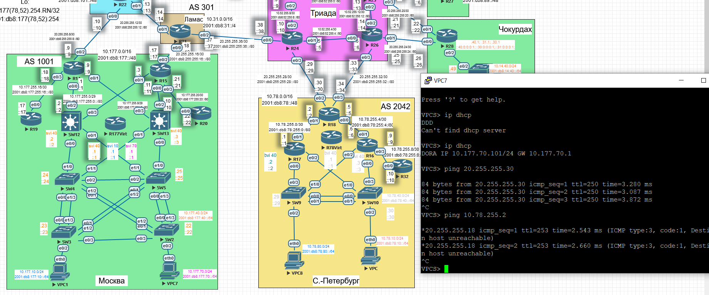

Из внутренней сети Москвы есть доступ до внешних интерфейсов R18 в СПб. Но до внутренних интерфейсов уже не добраться - маршруты до серых сетей в Интернете неизвестны. 

Выполним настройку GRE-туннеля. Топология позволяет создать различные реализации:

1. Для белых адресов туннеля можно использовать адреса на физических интерфейсах.

2. Для белых адресов туннеля можно использовать адреса с Loopback-интерфейсов, анонсируемые в Интернет через BGP.

Второй вариант более гибкий:

1. Если у маршрутизатора несколько интерфейсов, не придется настраивать два туннеля.

2. Если  из автономной системы выход через два маршрутизатора, то при потере связи с интернетом у первого маршрутизатора он останется доступным через второй маршрутизатор. Туннель не порвется.

Вариант 1 был реализован, конфигурация не приводится. Перейдем сразу к варианту с Loopback-интерфейсами.


### Настройка Loopback


В Москве на R14 создадим Lo14, на R15 Lo15; в СПб на R18 создадим на R18 Lo18. Выполним их анонсы в BGP.

R14:

```
en
conf t
no ip route 20.177.0.14 255.255.255.255 Null0

int Lo14
ip addr 20.177.0.14 255.255.255.255
no shut


no ip nat inside source list ACL_NAT pool POOL_NAT_OUT overload
ip nat inside source list ACL_NAT interface Lo14 overload
no ip nat pool POOL_NAT_OUT 20.177.0.14 20.177.0.14 netmask 255.255.255.252

router bgp 1001
address-family ipv4 unicast
network 20.177.0.14 mask 255.255.255.255

end
wr


```


R15:

```
en
conf t
no ip route 20.177.0.15 255.255.255.255 Null0

int Lo15
ip addr 20.177.0.15 255.255.255.255
no shut


no ip nat inside source list ACL_NAT pool POOL_NAT_OUT overload
ip nat inside source list ACL_NAT interface Lo15 overload
no ip nat pool POOL_NAT_OUT 20.177.0.15 20.177.0.15 netmask 255.255.255.252

router bgp 1001
address-family ipv4 unicast
network 20.177.0.15 mask 255.255.255.255

end
wr
```

NAT продолжает работать при конфигурации NAT с Loopback:


R18 (для разнообразия сделаем анонс не одного Loopback, а целой подсети 20.78.0.0/16):

```
en
conf t
ip route 20.78.0.0 255.255.255.0 Null0

int Lo18
ip addr 20.78.0.18 255.255.255.255
no shut


router bgp 2042
address-family ipv4 unicast
network 20.78.0.0 mask 255.255.0.0

end
wr
```


### Адресация


Для адресов туннельных интерфейсов будем использовать сеть 10.255.0.0/16. 

Каждый адрес будет располагаться в сети 10.255.255.N/31. Или лучше делать сеть /24????

|             | Peer-1 | Peer-1-White IP | Peer-1-Tunnel IP | Peer-2 | Peer-2-White IP | Peer-2-Tunnel IP |
| ----------- | ------ | --------------- | ---------------- | ------ | --------------- | ---------------- |
| Tunnel 1518 | R15    | 20.177.0.15     | 10.255.255.0     | R18    | 20.78.0.18      | 10.255.255.1     |
| Tunnel 1418 | R14    | 20.177.0.14     | 10.255.255.2     | R18    | 20.78.0.18      | 10.255.255.3     |

### Настройка туннеля R15-R18, туннеля R14-R18.

R18:

```
en
conf t
interface tunnel 1518
ip addr 10.255.255.1 255.255.255.254
tunnel source 20.78.0.18
tunnel destination 20.177.0.15
ip mtu 1400
ip tcp adjust-mss 1360

interface tunnel 1418
ip addr 10.255.255.3 255.255.255.254
tunnel source 20.78.0.18
tunnel destination 20.177.0.14
ip mtu 1400
ip tcp adjust-mss 1360


end
wr
```

R15:

```
en
conf t
interface tunnel 1518
ip addr 10.255.255.0 255.255.255.254
tunnel source 20.177.0.15
tunnel destination 20.78.0.18
ip mtu 1400
ip tcp adjust-mss 1360

end
wr
```


R14:

```
en
conf t
interface tunnel 1418
ip addr 10.255.255.2 255.255.255.254
tunnel source 20.177.0.14
tunnel destination 20.78.0.18
ip mtu 1400
ip tcp adjust-mss 1360

end
wr
```


Туннели поднялись, связь между маршрутизаторами через туннели есть:


надо ли указывать tunnel mode gre????

Далее настроим динамическую маршрутизацию. В Москве работает протокол OSPF, в СПб - EIGRP. Поэтому добавим в Москве динамическую маршрутизацию EIGRP.

R15:

```
en
conf t
router eigrp NG

address-family ipv4 unicast autonomous-system 1

af-interface default
passive-interface
exit-af-interface

af-interface tunnel 1518
no passive-interface
exit-af-interface

network 10.177.0.0 0.0.255.255
network 10.255.255.0 0.0.0.1

eigrp router-id 1.0.0.15


end
wr
```


R14:

```
en
conf t
router eigrp NG

address-family ipv4 unicast autonomous-system 1

af-interface default
passive-interface
exit-af-interface

af-interface tunnel 1418
no passive-interface
exit-af-interface

network 10.177.0.0 0.0.255.255
network 10.255.255.2 0.0.0.1

eigrp router-id 1.0.0.14


end
wr
```


R18:

```
en
conf t
router eigrp NG
address-family ipv4 unicast autonomous-system 1
af-interface default
passive-interface
exit-af-interface

af-interface Ethernet 0/0
no passive-interface
exit-af-interface

af-interface Ethernet 0/1
no passive-interface
exit-af-interface

af-interface Tunnel 1518
no passive-interface
exit-af-interface

af-interface Tunnel 1418
no passive-interface
exit-af-interface

network 10.255.255.0 0.0.0.1
network 10.255.255.2 0.0.0.1

exit-address-family


address-family ipv6 unicast autonomous-system 1
af-interface default
passive-interface

af-interface Ethernet 0/0
no passive-interface

af-interface Ethernet 0/1
no passive-interface

exit-address-family


end
wr
```

!!! Напоминание про работу EIGRP. Соседство будет установлено только с тех интерфейсов, которые попадают в команду network. Если нет ни одной команды network, то соседство не будет устанавливаться ни с одного интерфейса. И сообщать маршрутизатор будет только о тех маршрутах, которые попадают в команду network.

На короткий момент появилось соседство, но потом пропало. Плюс туннели переходят в down:


Это происходит из-за анонса белого адреса туннеля маршрутизатором R18. С прошлых лабораторных работ этот анонс был незамечен, да и вообще не нужен. Отключаем.

R18:

```
en
conf t
router eigrp NG
address-family ipv4 unicast autonomous-system 1
no network 20.255.255.28 0.0.0.3
no network 20.255.255.32 0.0.0.3

end
wr
```

Туннели поднялись, соседство установилось:


Но на R15 проблема продолжается:


На R15 анонсируется маршрут до сети 20.78.0.0/16. Это сеть, которая анонсируется с R18 путем добавления статического маршрута. В EIGRP была задана команда редистрибуции статики, что тоже нужно убрать. 

R18:

```
en
conf t

router eigrp NG
address-family ipv4 unicast autonomous-system 1
topology base
no redistribute static

exit-address-family

address-family ipv6 unicast autonomous-system 1
topology base
no redistribute static

end
wr
```

Пришли маршруты, которые нужны:


Лучше их суммаризировать на R18.

R18:

```
en
conf t
router eigrp NG
address-family ipv4 unicast autonomous-system 1
af-interface tunnel 1518
summary-address 10.78.0.0/16
exit-af-interface
af-interface tunnel 1418
summary-address 10.78.0.0/16
exit-af-interface

end
wr
```

Аналогично суммируем маршруты на R15:

```
en
conf t
router eigrp NG
address-family ipv4 unicast autonomous-system 1
af-interface tunnel 1518
summary-address 10.177.0.0/16
exit-af-interface

end
wr
```

И на R14:

```
en
conf t
router eigrp NG
address-family ipv4 unicast autonomous-system 1
af-interface tunnel 1418
summary-address 10.177.0.0/16
exit-af-interface

end
wr
```


Получили суммарные маршруты на R14, R15, R18:


R14 и R15 находятся в одной автономной системе и географически расположены в Москве. Однако они знают, что могут добраться до своих туннельных интерфейсов через соседа R18 в СПб. Это не оптимально, поэтому на R14-15 настроим соседство.

R14-15:

```
en
conf t
router eigrp NG

address-family ipv4 unicast autonomous-system 1

af-interface Ethernet 0/0
no passive-interface
exit-af-interface

af-interface Ethernet 0/1
no passive-interface
exit-af-interface

network 10.177.255.0 0.0.0.7
network 10.177.255.8 0.0.0.7


end
wr

```


Результат:


Маршруты суммаризируем для уменьшения количества записей.

R14-15:

```
en
conf t
router eigrp NG
address-family ipv4 unicast autonomous-system 1
af-interface Ethernet 0/0
summary-address 10.177.0.0/16
exit-af-interface

af-interface Ethernet 0/1
summary-address 10.177.0.0/16
exit-af-interface

end
wr
```


Результат - суммаризированные маршруты:


Но связи между компьютерами нет:


Видим, что вероятно проблема в СПб - маршрутизатор получает пакет, но не пожет доставить до PC8.


Идем в СПБ и пробуем R18->VPC8:

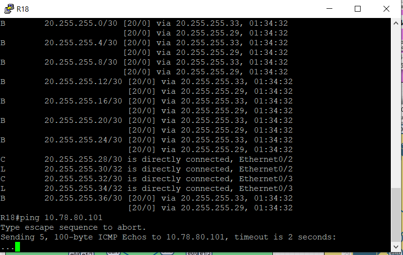

Смотрим маршруты:

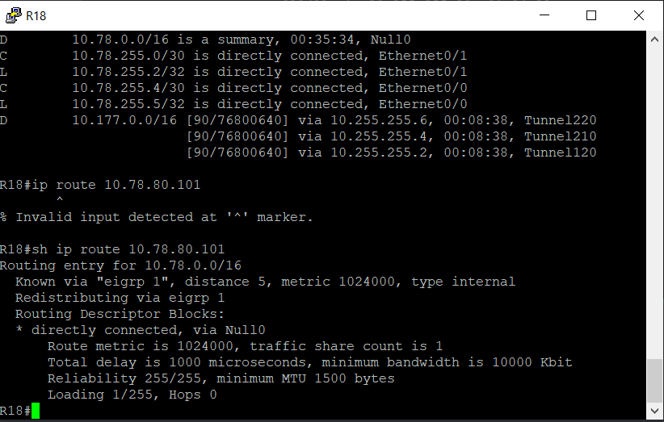

При суммаризации маршрута в туннелях была добавлена статическая запись в NULL. Если убираем суммаризацию на R18:

```
en
conf t
router eigrp NG
address-family ipv4 unicast autonomous-system 1
af-interface tunnel 110
no summary-address 10.78.0.0/16
exit-af-interface

af-interface tunnel 120
no summary-address 10.78.0.0/16
exit-af-interface

af-interface tunnel 210
no summary-address 10.78.0.0/16
exit-af-interface

af-interface tunnel 220
no summary-address 10.78.0.0/16
```

Связь сразу появилась:

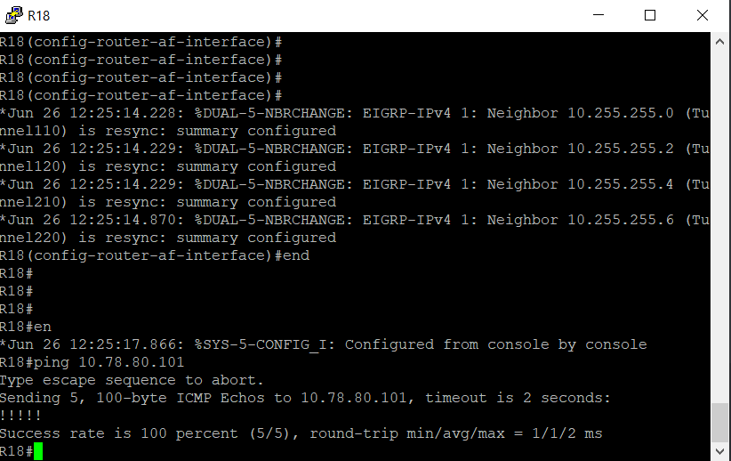

Добавляем обратно на R18 суммаризацию:

```
en
conf t
router eigrp NG
address-family ipv4 unicast autonomous-system 1
af-interface tunnel 110
 summary-address 10.78.0.0/16
exit-af-interface

af-interface tunnel 120
 summary-address 10.78.0.0/16
exit-af-interface

af-interface tunnel 210
 summary-address 10.78.0.0/16
exit-af-interface

af-interface tunnel 220
summary-address 10.78.0.0/16
```

Связь сразу пропадает:

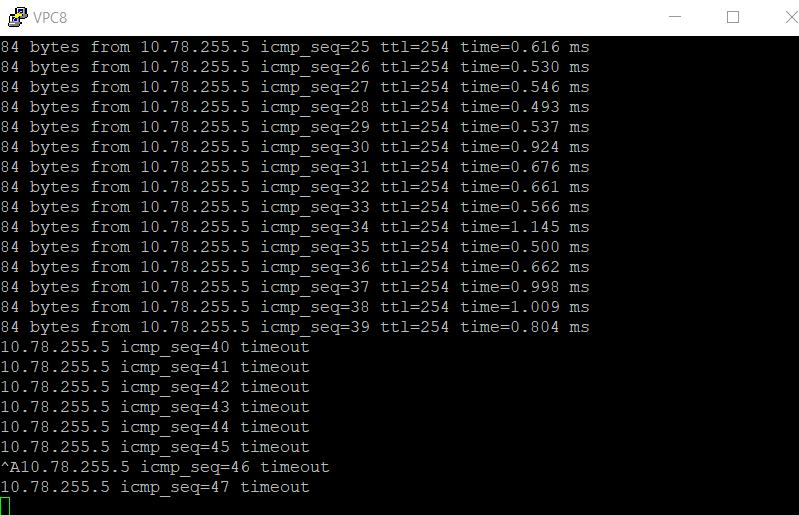

Какой выход? На R18 обязательно должны быть маршруты, которые перебьют суммарный маршрут с маской 16. Чтобы они появились, мы должны получать их от R16 и R17.

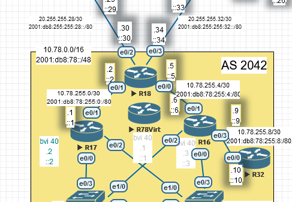

Мы их не получаем, т.к. на R16 и R17 ранее сделана суммаризация. Отключим ее. ??? Как все же поступать правильно в этом случае???

R16, 17:

```
en
conf t
router eigrp NG
address-family ipv4 unicast autonomous-system 1
af-interface Ethernet0/1
no summary-address 10.78.0.0 255.255.0.0


end
wr
```

Связь между компьютерами Москвы и СПб появилась:

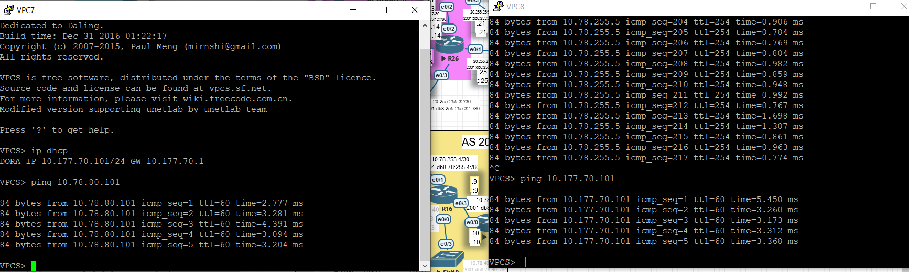 

## <a name="head2"></a>Настроите DMVMN между Москва и Чокурдах, Лабытнанги

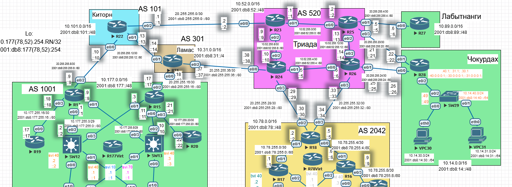

Поскольку ДЗ относится к занятию по DMVP, касающемуся Phase 1,2, то будем реализовывать DMVPN PHASE2.

Хабом выберем Москву. Каждый маршрутизатор Москвы будет хабом.

Добавим в Лабытнангах хост, чтобы выполнять проверку связи, NAT настраивать не будем:

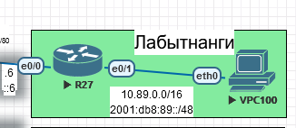

R27:

```
en
conf t

ip dhcp excluded-address 10.89.0.1
ip dhcp pool DHCP-POOL
network 10.89.0.0 255.255.255.0
default-router 10.89.0.1


int e0/1
ip addr 10.89.0.1 255.255.255.0
no shut

end
wr
```

### Адресация

Для каждого хаба нужно выделить свою сеть, в которой будут находится еще и споки. ???Они обязательно должны быть в одной сети???

Для адресов туннельных интерфейсов будем использовать сеть 10.255.0.0/16, как и при соединении точка-точка. Сеть для хаба R15 - 10.255.15.0/25, сеть для хаба R14 - 10.255.14.0/24.

Схема не подходит под 3 рекомендуемых топологии. Попробуем проверить, заработает ли такое подключение. С точки зрения избыточности схема позволяет максимально сохранить связность. (Забегая вперед, такой вариант реализовать не удалось.)

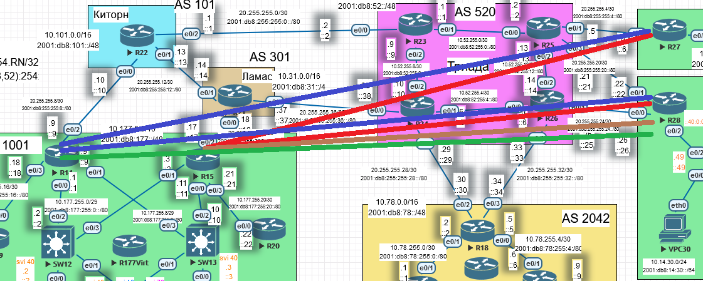

Адресация хабов:

|            | Peer-1 | network-id | Peer-1-White IP | Peer-1-Tunnel IP |
| ---------- | ------ | ---------- | --------------- | ---------------- |
| Tunnel 615 | R15    | 615        | 20.255.255.17   | 10.255.15.15     |
| Tunnel 614 | R14    | 615        | 20.255.255.9    | 10.255.14.14     |

Адресация споков:

|            | Peer-1 | network-id | Peer-1-White IP | Peer-1-Tunnel IP | Peer-2 | Peer-2-White IP | Peer-2-Tunnel IP |
| ---------- | ------ | ---------- | --------------- | ---------------- | ------ | --------------- | ---------------- |
| Tunnel 615 | R15    | 615        | 20.255.255.17   | 10.255.15.15     | R27    | 20.255.255.6    | 10.255.15.27     |
| Tunnel 615 | R15    | 615        | 20.255.255.17   | 10.255.15.15     | R28    | 20.255.255.22   | 10.255.15.28     |
| Tunnel 614 | R14    | 614        | 20.255.255.9    | 10.255.14.14     | R27    | 20.255.255.6    | 10.255.14.27     |
| Tunnel 614 | R14    | 614        | 20.255.255.9    | 10.255.14.14     | R28    | 20.255.255.22   | 10.255.14.28     |

Начнем настройку сперва с R15. R14 пока отключим, чтобы трафик не ходил через него. В туннель будем выдавать суммаризированный маршрут.

R15:

```
en
conf t
interface tu 615
tunnel mode gre multipoint
ip addr 10.255.15.15 255.255.255.0
tunnel source 20.255.255.17
ip mtu 1400
ip tcp adjust-mss 1360

ip nhrp network-id 615
ip nhrp map multicast dynamic


exit

router eigrp NG
address-family ipv4 unicast autonomous-system 1
af-interface tu 615
no passive-interface
summary-address 10.177.0.0/16
exit-af-interface

network 10.255.15.0 0.0.0.255
network 10.255.15.0 0.0.0.255

end
wr
```

Настроим спок. В туннель будем выдавать суммаризированный маршрут.

R27:

```
en
conf t

interface tu 615
ip addr 10.255.15.27 255.255.255.0
tunnel source 20.255.255.6
tunnel destination 20.255.255.17
ip mtu 1400
ip tcp adjust-mss 1360
ip nhrp network-id 615
ip nhrp map multicast 20.255.255.17


ip nhrp nhs 10.255.15.15
ip nhrp map 10.255.15.15 20.255.255.17

exit

router eigrp NG
address-family ipv4 unicast autonomous-system 1
af-interface default
passive-interface
exit-af-interface

af-interface tu615
no passive-interface
summary-address 10.89.0.0/16
exit-af-interface

network 10.255.15.0 0.0.0.255
network 10.89.0.0 0.0.0.255

end
wr
```

Связь с ПК в Москве есть:

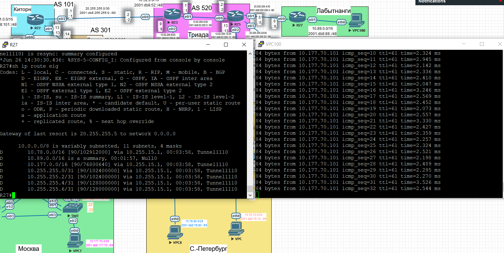

Видим, что из Москвы пришел суммаризированный маршрут, причем другие маршруты, которые не попали в эту суммаризацию, продолжают анонсироваться.

----

Наблюдение:

перезагружаем R15.

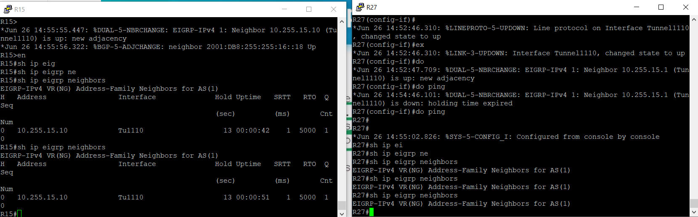

R15 видит соседа, R27 - нет. Вывод - по туннелю от R27 мультикаст приходит, по туннелю до R27 не приходит.

Но если мы на R27 отключим и включим туннель, то соседство появится:

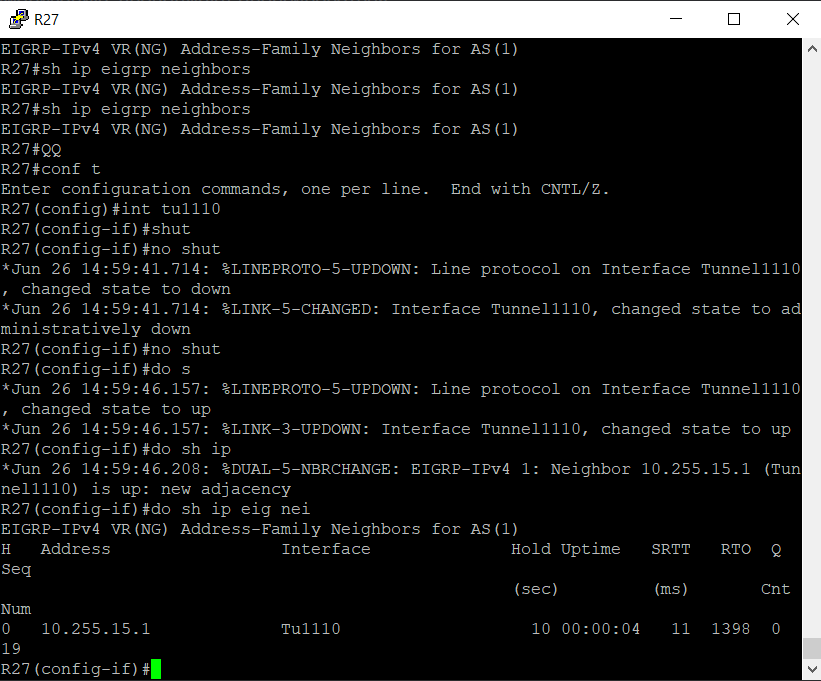

??? это виртуализация???

----

Продолжим настрйку и перейдем в Чокурдах.

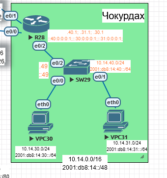

Настроим сперва туннель через e0/0. Его адрес будет находится в той же сети, что и ранее настроенный туннель Лабытнанги.

R28:

```
en
conf t

interface tu 615
ip addr 10.255.15.28 255.255.255.0
tunnel source 20.255.255.22
tunnel destination 20.255.255.17
ip mtu 1400
ip tcp adjust-mss 1360
ip nhrp network-id 615
ip nhrp map multicast 20.255.255.17


ip nhrp nhs 10.255.15.15
ip nhrp map 10.255.15.15 20.255.255.17

exit

router eigrp NG
address-family ipv4 unicast autonomous-system 1
af-interface default
passive-interface
exit-af-interface

af-interface tu615
no passive-interface
summary-address 10.14.0.0/16
exit-af-interface

network 10.255.15.0 0.0.0.255
network 10.14.0.0 0.0.255.255

end
wr
```

Результат:

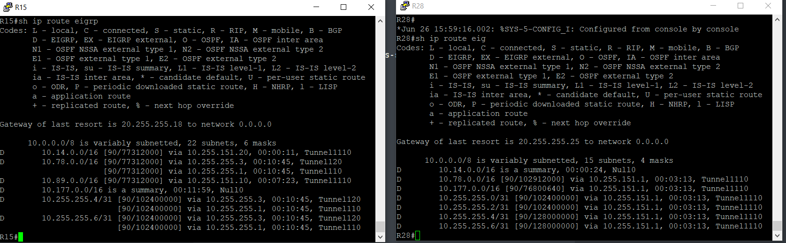

R15 видит маршрут 10.89.0.0/16, 10.78.0.0/16. R28 получает маршруты 10.78.0.0/16, 10.177.0.0/16, но маршруты до 10.89.0.0/16 - нет. Split horizon. Исправляем на хабе:

R15:

```
en
conf t

router eigrp NG
address-family ipv4 unicast autonomous-system 1
af-interface Tunnel1110
no next-hop-self
no split-horizon

end
wr
```

Результат:

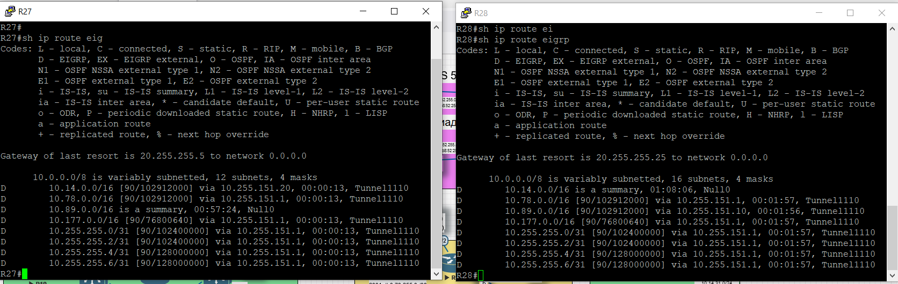

Бранчи знают маршруты друг до друга, причем хопом является не хаб, а маршрутизатор спока.

При этом:

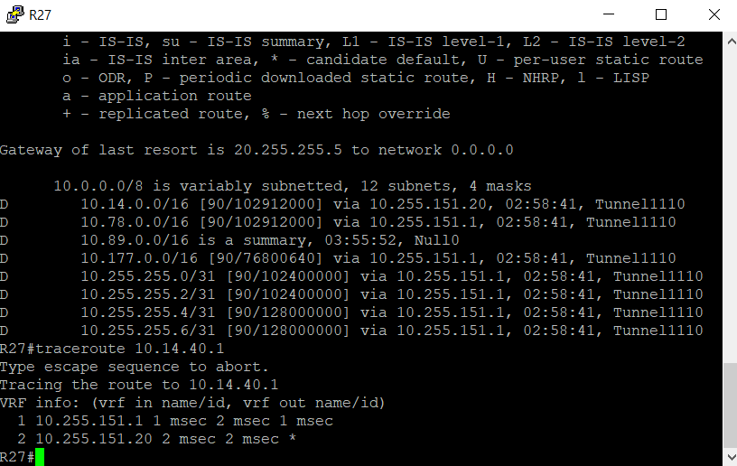

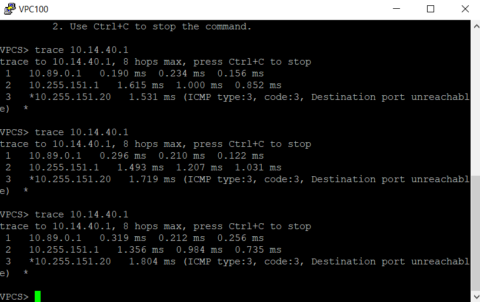

Маршрут через спок, но трассировка всегда идет через хаб. Забыли на хабах указать tunnel mode gre multipoint.

Исправляем. R27, R28. Обязательно убираем destination!!! Обязательно настраиваем на всем маршрутизаторах, иначе уйти пакет уйдет, но обратно не вернется:

```
en
conf t
int tu 1110
no tunnel destination 20.255.255.17
tunnel mode gre multipoint
end
wr
```

После этого все заработало, как требуется:

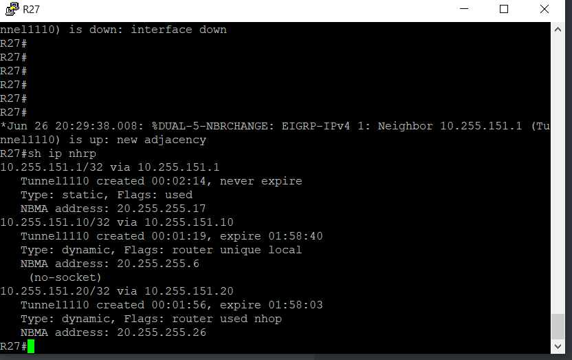

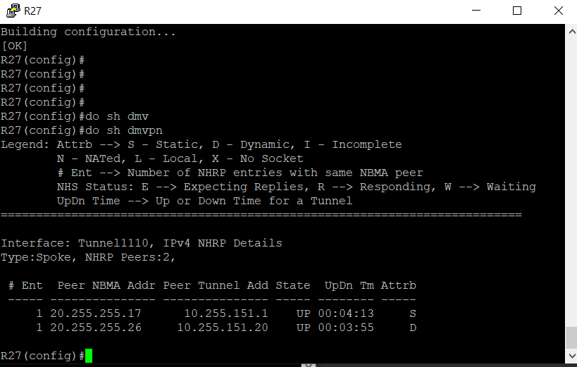

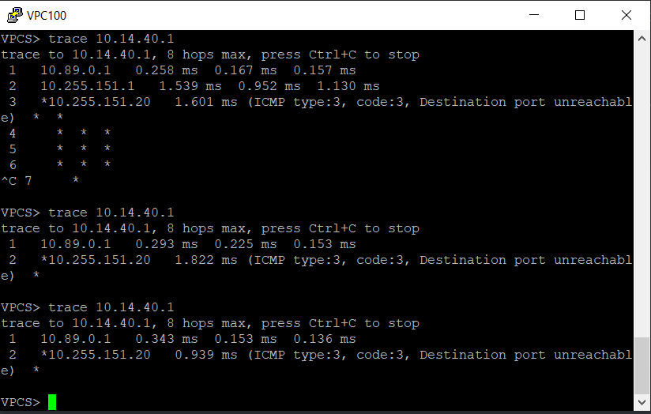

Можно ли на хабе просуммировать маршуты? Это возможно только в фазе 3, или во второй тоже сработает? Проверим. 

До суммаризации:

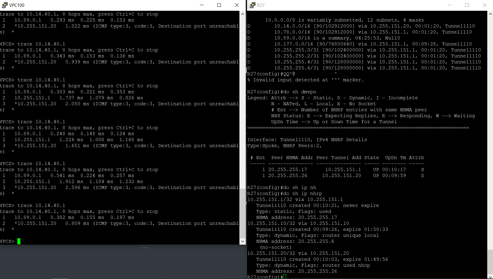

Видим, что пакет идет напрямую, маршрут есть сразу до спока, установлен туннель.

Суммаризируем на R15:

```
en
conf t
router eigrp NG
address-family ipv4 unicast autonomous-system 1
af-interface tu 1110
summary-address 10.0.0.0/8
end
```

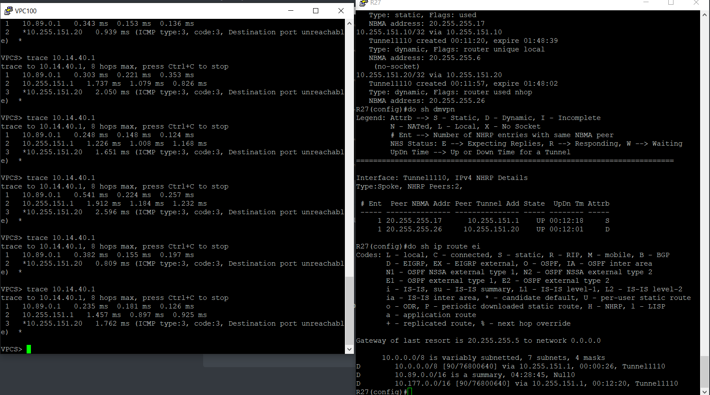

Туннели и кэши как бы пока есть, но маршрут суммаризирован. Но есть несуммаризированный маршрут до сети хаба!!!

Вывод - хаб получает маршруты и суммаризирует их, но не может перестать ставить свой хоп, т.к. маршрут получен один, значит и хоп будет один на весь суммарный префикс. Но также хаб добавляет свой специфический маршут, что странно.

Убираем суммаризацию на R15:

```
en
conf t
router eigrp NG
address-family ipv4 unicast autonomous-system 1
af-interface tu 1110
no summary-address 10.0.0.0/8
end
```

---

Далее поднимаем новый туннель на хабе R14:

```
en
conf t
interface tu 614
tunnel mode gre multipoint
ip addr 10.255.14.14 255.255.255.0
tunnel source 20.255.255.9
ip mtu 1400
ip tcp adjust-mss 1360

ip nhrp network-id 614
ip nhrp map multicast dynamic
no next-hop-self
no split-horizon

exit

router eigrp NG
address-family ipv4 unicast autonomous-system 1
af-interface tu 614
no passive-interface
summary-address 10.177.0.0/16
exit-af-interface

network 10.255.14.0 0.0.0.255

end
wr
```

И на споках.

R27:

```
en
conf t

interface tu 614
tunnel mode gre multipoint
ip addr 10.255.14.27 255.255.255.0
tunnel source 20.255.255.6
ip mtu 1400
ip tcp adjust-mss 1360
ip nhrp network-id 614
ip nhrp map multicast 20.255.255.9


ip nhrp nhs 10.255.14.14
ip nhrp map 10.255.14.14 20.255.255.9

exit

router eigrp NG
address-family ipv4 unicast autonomous-system 1
af-interface default
passive-interface
exit-af-interface

af-interface tu614
no passive-interface
summary-address 10.89.0.0/16
exit-af-interface

network 10.255.14.0 0.0.0.255
network 10.89.0.0 0.0.0.255

end
wr
```

R28:

```
en
conf t

interface tu 614
ip addr 10.255.14.28 255.255.255.0
tunnel source 20.255.255.22
tunnel mode gre multipoint
ip mtu 1400
ip tcp adjust-mss 1360
ip nhrp network-id 615
ip nhrp map multicast 20.255.255.9


ip nhrp nhs 10.255.14.14
ip nhrp map 10.255.14.14 20.255.255.9

exit

router eigrp NG
address-family ipv4 unicast autonomous-system 1
af-interface default
passive-interface
exit-af-interface

af-interface tu614
no passive-interface
summary-address 10.14.0.0/16
exit-af-interface

network 10.255.14.0 0.0.0.255
network 10.14.0.0 0.0.255.255

end
wr
```

Далее поднимаем туннель на втором физическом интрефейсе на R28.  Пробуем использовать тот же туннель, что и раньше, но задав новый туннельный адрес и новый source.

R28:

```
en
conf t

interface tu 615
ip addr 10.255.151.281 255.255.255.0
tunnel source 20.255.255.26
ip mtu 1400
ip tcp adjust-mss 1360
ip nhrp network-id 615
ip nhrp map multicast 20.255.255.17


ip nhrp nhs 10.255.15.15
ip nhrp map 10.255.15.15 20.255.255.17

exit

end
```

Проблемы:

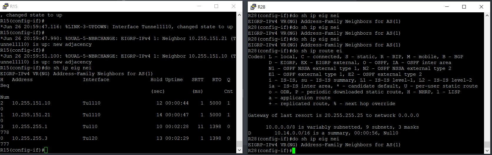

Соседство на R15 с R28 появляется, но не с двумя интерфейсами. Соcедства на R28 с R15 вообще нет. Причина в виртуализации????

Пробуем другой вариант - создать отдельный туннель. Сейчас соседство EIGRP с R27 и R28 установлено через туннель 1110:

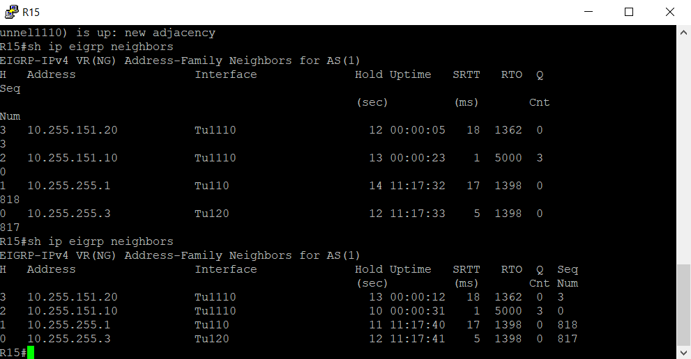

R15:

```
en
conf t
interface tu 715
tunnel mode gre multipoint
ip addr 10.255.152.1 255.255.255.0
tunnel source 20.255.255.17
ip mtu 1400
ip tcp adjust-mss 1360

ip nhrp network-id 1120
ip nhrp map multicast dynamic

exit

router eigrp NG
address-family ipv4 unicast autonomous-system 1
af-interface tu1120
no passive-interface
summary-address 10.177.0.0/16
exit-af-interface


network 10.255.152.0 0.0.0.255

end
wr
```

После появления нового туннеля на хабе R15 на том же физическом интерфейсе сразу пропало соседство EIGRP:

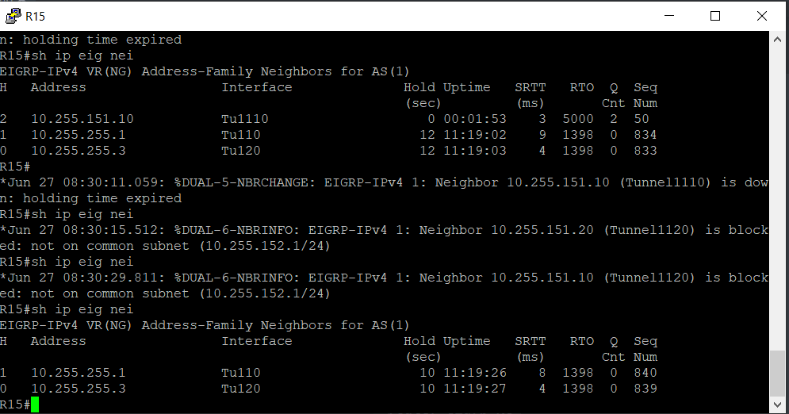

??? Как лучше поступить в этом случае??? Похоже, от идеи соединить спок (два физических интерфейс)  и хаб (один физический интерфейс) придется отказаться. На одном физическом интерфейсе хаба может быть только один туннель DMVPN.

---

Попробуем реализовать другой вариант туннелей. Есть два рекомендуемых варианта с двумя хабами:

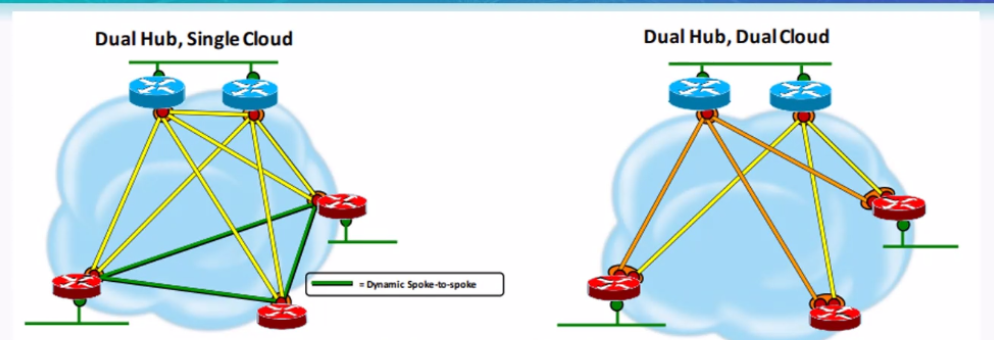

Применительно к нашей схеме:

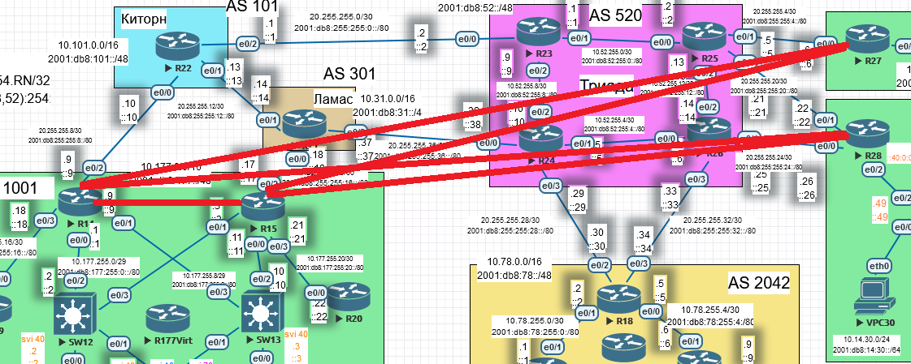

Здесь от каждого спока с одного интерфейса поднимается один и тот же туннель до каждого хаба. Что делать с E0/0 R28, можно ли с него поднять такой же туннель?

---

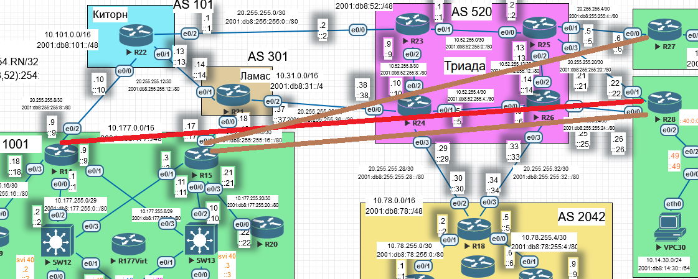

Наиболее часто используемый вариант. Но для полной отказоустойчивости необходимо, чтобы каждый спок имел такое же количество интрефейсов, что и количество хабов. Если интерфейсов меньше, то не ко всем хабам удастся подключить спок. И про выходе из строя части хабов этот спок окажется не подключенным к VPN. Для данной схемы - если выйдет из строя или пропадет связь до R15, то спок R27 потеряет туннель.
