# Виртуальная частные сети - VPN

- Настроить GRE между офисами Москва и С.-Петербург

- Настроить DMVPN между офисами Москва и Чокурдах, Лабытнанги

В этой самостоятельной работе мы ожидаем, что вы самостоятельно:

1. [Настроите GRE между офисами Москва и С.-Петербург](#head1)
2. [Настроите DMVMN между Москва и Чокурдах, Лабытнанги](#head2)
3. [Все узлы в офисах в лабораторной работе должны иметь IP связность](#head3)

## <a name="head1"></a>Настроите GRE между офисами Москва и С.-Петербург

Проверим текущее состояние связности:


Из внутренней сети Москвы есть доступ до внешних интерфейсов R18 в СПб. Но до внутренних интерфейсов уже не добраться - маршруты до серых сетей в Интернете неизвестны. 

Выполним настройку GRE-туннеля. Топология позволяет создать различные реализации:

1. Для белых адресов туннеля можно использовать адреса на физических интерфейсах.

2. Для белых адресов туннеля можно использовать адреса с Loopback-интерфейсов, анонсируемые в Интернет через BGP.

Второй вариант более гибкий:

1. Если у маршрутизатора несколько интерфейсов, не придется настраивать два туннеля.

2. Если  из автономной системы выход через два маршрутизатора, то при потере связи с интернетом у первого маршрутизатора он останется доступным через второй маршрутизатор. Туннель не порвется.

Вариант 1 был реализован, конфигурация не приводится. Перейдем сразу к варианту с Loopback-интерфейсами.

### Настройка Loopback

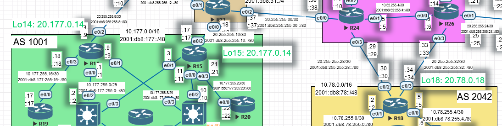

В Москве на R14 создадим Lo14, на R15 Lo15; в СПб на R18 создадим Lo18. Выполним их анонсы в BGP.

R14:

```
en
conf t
no ip route 20.177.0.14 255.255.255.255 Null0

int Lo14
ip addr 20.177.0.14 255.255.255.255
no shut


no ip nat inside source list ACL_NAT pool POOL_NAT_OUT overload
ip nat inside source list ACL_NAT interface Lo14 overload
no ip nat pool POOL_NAT_OUT 20.177.0.14 20.177.0.14 netmask 255.255.255.252

router bgp 1001
address-family ipv4 unicast
network 20.177.0.14 mask 255.255.255.255

end
wr
```

R15:

```
en
conf t
no ip route 20.177.0.15 255.255.255.255 Null0

int Lo15
ip addr 20.177.0.15 255.255.255.255
no shut


no ip nat inside source list ACL_NAT pool POOL_NAT_OUT overload
ip nat inside source list ACL_NAT interface Lo15 overload
no ip nat pool POOL_NAT_OUT 20.177.0.15 20.177.0.15 netmask 255.255.255.252

router bgp 1001
address-family ipv4 unicast
network 20.177.0.15 mask 255.255.255.255

end
wr
```

NAT продолжает работать при конфигурации NAT с Loopback:

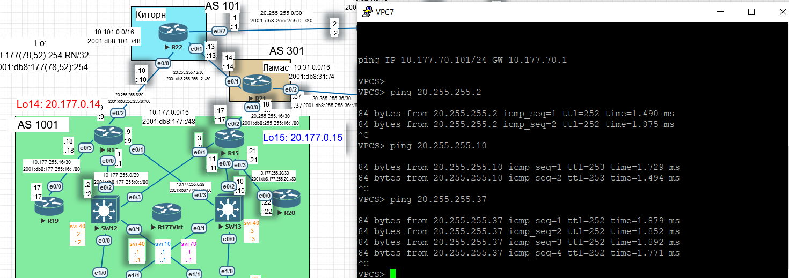

R18 (для разнообразия сделаем анонс не одного Loopback, а целой подсети 20.78.0.0/16):

```
en
conf t
ip route 20.78.0.0 255.255.255.0 Null0

int Lo18
ip addr 20.78.0.18 255.255.255.255
no shut


router bgp 2042
address-family ipv4 unicast
network 20.78.0.0 mask 255.255.0.0

end
wr
```

### Адресация

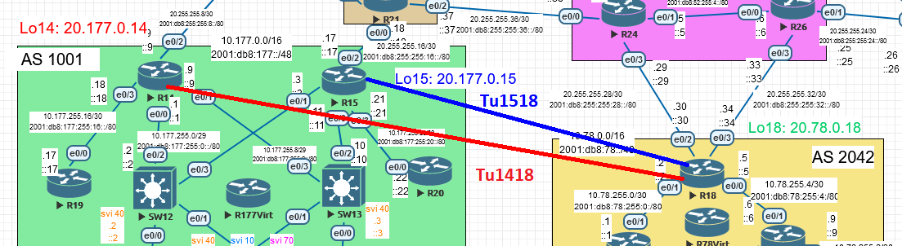

Для адресов туннельных интерфейсов будем использовать сеть 10.255.0.0/16. 

Каждый адрес будет располагаться в сети 10.255.255.N/31. Или лучше делать сеть /24????

|             | Peer-1 | Peer-1-White IP | Peer-1-Tunnel IP | Peer-2 | Peer-2-White IP | Peer-2-Tunnel IP |
| ----------- | ------ | --------------- | ---------------- | ------ | --------------- | ---------------- |
| Tunnel 1518 | R15    | 20.177.0.15     | 10.255.255.0     | R18    | 20.78.0.18      | 10.255.255.1     |
| Tunnel 1418 | R14    | 20.177.0.14     | 10.255.255.2     | R18    | 20.78.0.18      | 10.255.255.3     |

### Настройка туннеля R15-R18, туннеля R14-R18.

R18:

```
en
conf t
interface tunnel 1518
ip addr 10.255.255.1 255.255.255.254
tunnel source 20.78.0.18
tunnel destination 20.177.0.15
ip mtu 1400
ip tcp adjust-mss 1360
keepalive 5 4

interface tunnel 1418
ip addr 10.255.255.3 255.255.255.254
tunnel source 20.78.0.18
tunnel destination 20.177.0.14
ip mtu 1400
ip tcp adjust-mss 1360
keepalive 5 4

end
wr
```

R15:

```
en
conf t
interface tunnel 1518
ip addr 10.255.255.0 255.255.255.254
tunnel source 20.177.0.15
tunnel destination 20.78.0.18
ip mtu 1400
ip tcp adjust-mss 1360
keepalive 5 4

end
wr
```

R14:

```
en
conf t
interface tunnel 1418
ip addr 10.255.255.2 255.255.255.254
tunnel source 20.177.0.14
tunnel destination 20.78.0.18
ip mtu 1400
ip tcp adjust-mss 1360
keepalive 5 4

end
wr
```

Туннели поднялись, связь между маршрутизаторами через туннели есть:

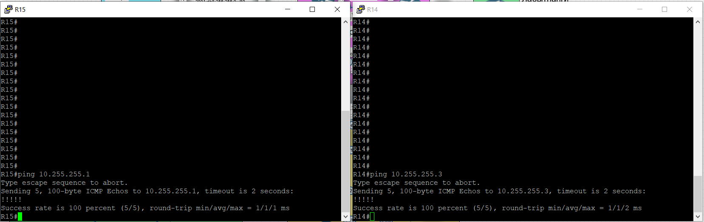

надо ли указывать tunnel mode gre????

Далее настроим динамическую маршрутизацию. В Москве работает протокол OSPF, в СПб - EIGRP. Поэтому добавим в Москве динамическую маршрутизацию EIGRP.

R15:

```
en
conf t
router eigrp NG

address-family ipv4 unicast autonomous-system 1

af-interface default
passive-interface
exit-af-interface

af-interface tunnel 1518
no passive-interface
exit-af-interface

network 10.177.0.0 0.0.255.255
network 10.255.255.0 0.0.0.1

eigrp router-id 1.0.0.15


end
wr
```

R14:

```
en
conf t
router eigrp NG

address-family ipv4 unicast autonomous-system 1

af-interface default
passive-interface
exit-af-interface

af-interface tunnel 1418
no passive-interface
exit-af-interface

network 10.177.0.0 0.0.255.255
network 10.255.255.2 0.0.0.1

eigrp router-id 1.0.0.14


end
wr
```

R18:

```
en
conf t
router eigrp NG
address-family ipv4 unicast autonomous-system 1
af-interface default
passive-interface
exit-af-interface

af-interface Ethernet 0/0
no passive-interface
exit-af-interface

af-interface Ethernet 0/1
no passive-interface
exit-af-interface

af-interface Tunnel 1518
no passive-interface
exit-af-interface

af-interface Tunnel 1418
no passive-interface
exit-af-interface


network 10.255.255.0 0.0.0.1
network 10.255.255.2 0.0.0.1

exit-address-family


address-family ipv6 unicast autonomous-system 1
af-interface default
passive-interface

af-interface Ethernet 0/0
no passive-interface

af-interface Ethernet 0/1
no passive-interface

exit-address-family


end
wr
```

!!! Напоминание про работу EIGRP. Соседство будет установлено только с тех интерфейсов, которые попадают в команду network. Если нет ни одной команды network, то соседство не будет устанавливаться ни с одного интерфейса. И сообщать маршрутизатор будет только о тех маршрутах, которые попадают в команду network.

На короткий момент появилось соседство, но потом пропало. Плюс туннели переходят в down:

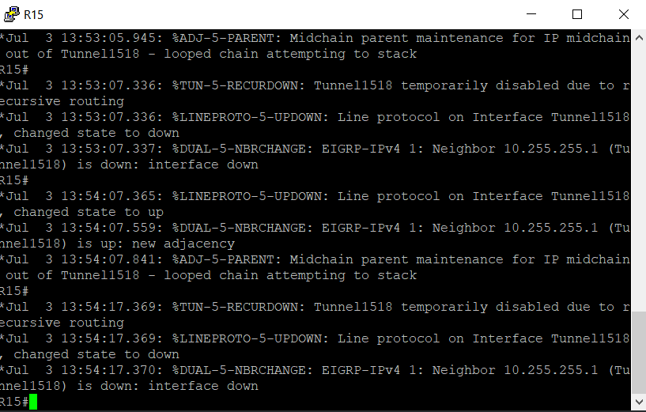

Это происходит из-за анонса белого адреса туннеля маршрутизатором R18. С прошлых лабораторных работ этот анонс был незамечен, да и вообще не нужен. Отключаем.

R18:

```
en
conf t
router eigrp NG
address-family ipv4 unicast autonomous-system 1
no network 20.255.255.28 0.0.0.3
no network 20.255.255.32 0.0.0.3

end
wr
```

Туннели поднялись, соседство установилось:

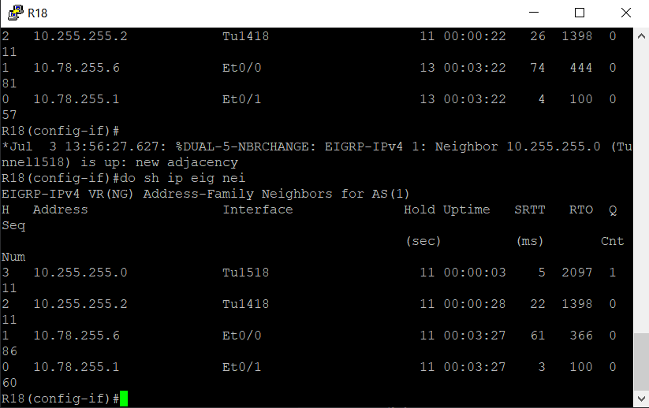

Но на R15 проблема продолжается:


На R15 анонсируется маршрут до сети 20.78.0.0/16. Это сеть, которая анонсируется с R18 путем добавления статического маршрута. В EIGRP была задана команда редистрибуции статики, что тоже нужно убрать. 

R18:

```
en
conf t

router eigrp NG
address-family ipv4 unicast autonomous-system 1
topology base
no redistribute static

exit-address-family

address-family ipv6 unicast autonomous-system 1
topology base
no redistribute static

end
wr
```

Пришли маршруты, которые нужны:

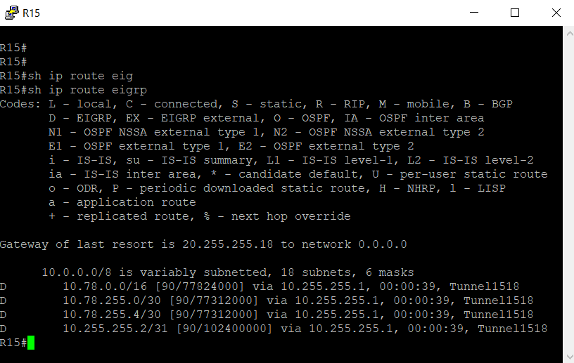

Лучше их суммаризировать на R18.

R18:

```
en
conf t
router eigrp NG
address-family ipv4 unicast autonomous-system 1
af-interface tunnel 1518
summary-address 10.78.0.0/16
exit-af-interface
af-interface tunnel 1418
summary-address 10.78.0.0/16
exit-af-interface

end
wr
```

Аналогично суммируем маршруты на R15:

```
en
conf t
router eigrp NG
address-family ipv4 unicast autonomous-system 1
af-interface tunnel 1518
summary-address 10.177.0.0/16
exit-af-interface

end
wr
```

И на R14:

```
en
conf t
router eigrp NG
address-family ipv4 unicast autonomous-system 1
af-interface tunnel 1418
summary-address 10.177.0.0/16
exit-af-interface

end
wr
```

Получили суммарные маршруты на R14, R15, R18:

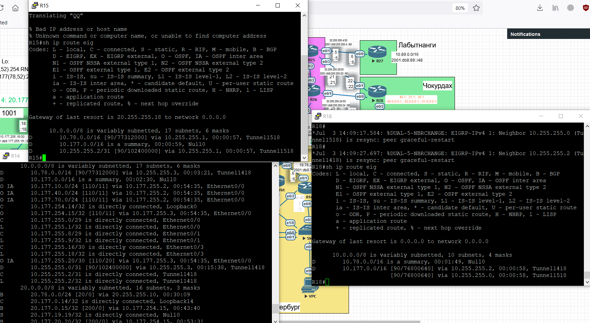

R14 и R15 находятся в одной автономной системе и географически расположены в Москве. Однако они знают, что могут добраться до своих туннельных интерфейсов через соседа R18 в СПб. Это не оптимально, поэтому на R14-15 настроим соседство EIGRP. ??? Можно было бы настроить и через OSPF, но AD EIGRP перебьет такие маршруты и связь все равно будет через СПб.???

R14-15:

```
en
conf t
router eigrp NG

address-family ipv4 unicast autonomous-system 1

af-interface Ethernet 0/0
no passive-interface
exit-af-interface

af-interface Ethernet 0/1
no passive-interface
exit-af-interface

network 10.177.255.0 0.0.0.7
network 10.177.255.8 0.0.0.7


end
wr
```

Результат:

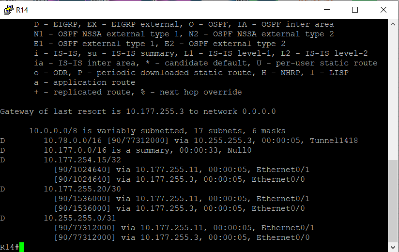

Маршруты суммаризируем для уменьшения количества записей.

R14-15:

```
en
conf t
router eigrp NG
address-family ipv4 unicast autonomous-system 1
af-interface Ethernet 0/0
summary-address 10.177.0.0/16
exit-af-interface

af-interface Ethernet 0/1
summary-address 10.177.0.0/16
exit-af-interface

end
wr
```

Результат - суммаризированные маршруты:

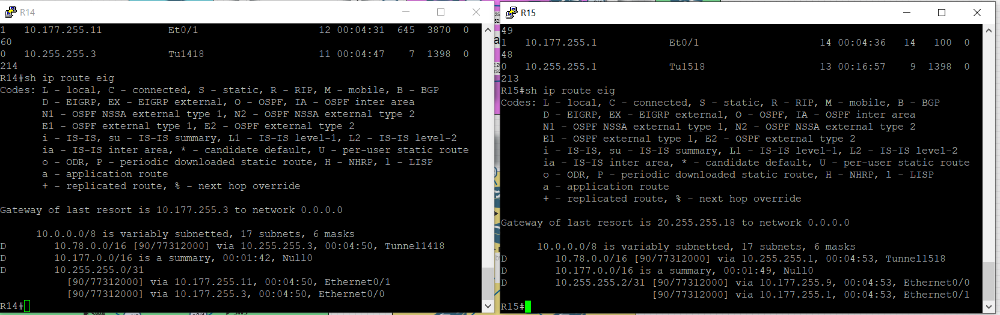

Но связи между компьютерами нет:

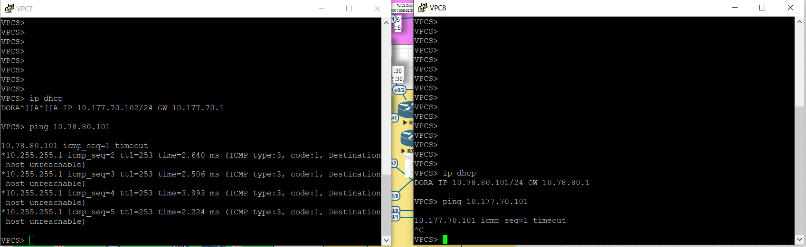

Видим, что вероятно проблема в СПб - маршрутизатор получает пакет, но не может доставить до PC8.

Идем в СПБ и пробуем R18->VPC8:


Смотрим маршруты:

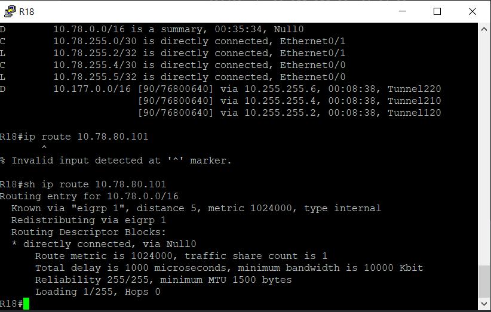

При суммаризации маршрута в туннелях была добавлена статическая запись в NULL. Если убираем суммаризацию на R18:

```
en
conf t
router eigrp NG
address-family ipv4 unicast autonomous-system 1
af-interface tunnel 1418
no summary-address 10.78.0.0/16
exit-af-interface

af-interface tunnel 1518
no summary-address 10.78.0.0/16
exit-af-interface
```

Связь сразу появилась:


Добавляем обратно на R18 суммаризацию:

```
en
conf t
router eigrp NG
address-family ipv4 unicast autonomous-system 1

af-interface tunnel 1418
 summary-address 10.78.0.0/16
exit-af-interface

af-interface tunnel 1518
 summary-address 10.78.0.0/16
exit-af-interface
```

Связь сразу пропадает:


Какой выход? На R18 обязательно должны быть маршруты, которые перебьют суммарный маршрут с маской 16. Чтобы они появились, мы должны получать их от R16 и R17.

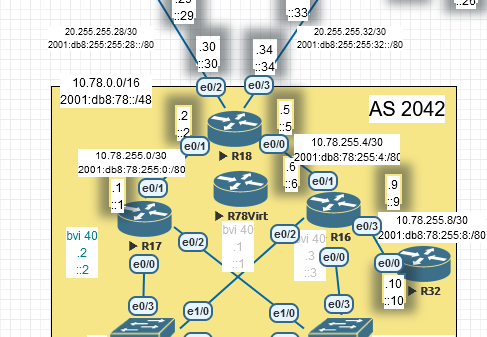

Мы их не получаем, т.к. на R16 и R17 ранее сделана суммаризация. Отключим ее. ??? Как все же поступать правильно в этом случае???

R16, 17:

```
en
conf t
router eigrp NG
address-family ipv4 unicast autonomous-system 1
af-interface Ethernet0/1
no summary-address 10.78.0.0 255.255.0.0


end
wr
```

Связь между компьютерами Москвы и СПб появилась:

 

## <a name="head2"></a>Настроите DMVMN между Москва и Чокурдах, Лабытнанги

Хабом выберем Москву. Каждый маршрутизатор Москвы будет хабом.

Добавим в Лабытнангах хост, чтобы выполнять проверку связи через поднятые туннели, NAT настраивать не будем:

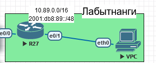

R27:

```
en
conf t

ip dhcp excluded-address 10.89.0.1
ip dhcp pool DHCP-POOL
network 10.89.0.0 255.255.255.0
default-router 10.89.0.1


int e0/1
ip addr 10.89.0.1 255.255.255.0
no shut

end
wr
```

### Планирование схемы

Для каждого хаба нужно выделить свою сеть, в которой будут находится еще и споки. ???Они обязательно должны быть в одной сети???

В DMVPN рекомендуются три варианта дизайна:

- Single Hub, Dual Cloud - нет избыточности, spoke-to-spoke не будет работать, использовать не стоит.

- Dual Hub, Single Cloud - требуется более сложная настройка хабов, между ними также дожен быть тот же туннель.

- Dual Hub, Dual Cloud - настройка типична, туннель между хабами не нужен, выберем этот вариант.

В DMVPN есть особенности (примеры в копиях readme.md):

- на хабе на одном интерфейсе может работать только один туннель,

- на споке на одном интерфейсе могут работать разные туннели,

- на споке на разных интерфейсах не могут работать одинаковые туннели.

Исходя из ограничений, реализуем следующие туннели:

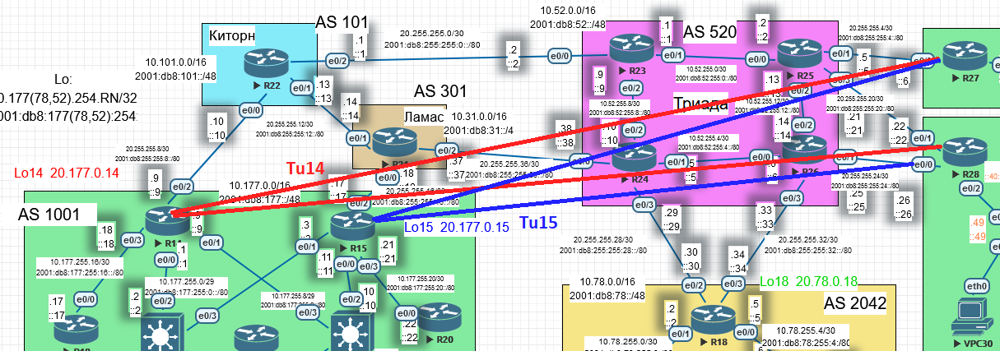

- Туннели на хабах R14 и R15 поднимем уже на имеющихся Loopback. Это будут туннели Tunnel 14 и Tunnel 15.

- Туннели на R27 поднимем на одном и том же физическом интерфейсе e0/0.

- Туннели на R28 поднимем на разных физических интерфейсах. Это снизит количество туннелей, но оставит вероятность пропажи свези до хабов в Москве - если упадет один из линков R28, то связь с Москвой будет идти через второй линк и хаб, терминирующий туннель с этого линка. Если же и этот хаб выйдет из строя, то R28 полностью потеряет связь до VPN.

Сначала реализуем фазу 2.

### Адресация

Адресация хабов:

|           | Peer-1 | network-id | Peer-1-White IP | Peer-1-Tunnel IP |
| --------- | ------ | ---------- | --------------- | ---------------- |
| Tunnel 15 | R15    | 15         | 20.177.0.15     | 10.255.15.15     |
| Tunnel 14 | R14    | 14         | 20.177.0.14     | 10.255.14.14     |

Адресация споков:

|           | Peer-1 | network-id | Peer-1-White IP | Peer-1-Tunnel IP | Peer-2 | Peer-2-White IP | Peer-2-Tunnel IP |
| --------- | ------ | ---------- | --------------- | ---------------- | ------ | --------------- | ---------------- |
| Tunnel 15 | R15    | 15         | 20.177.0.15     | 10.255.15.15     | R27    | 20.255.255.6    | 10.255.15.27     |
| Tunnel 15 | R15    | 15         | 20.177.0.15     | 10.255.15.15     | R28    | 20.255.255.22   | 10.255.15.28     |
| Tunnel 14 | R14    | 14         | 20.177.0.14     | 10.255.14.14     | R27    | 20.255.255.6    | 10.255.14.27     |
| Tunnel 14 | R14    | 14         | 20.177.0.14     | 10.255.14.14     | R28    | 20.255.255.22   | 10.255.14.28     |

Начнем.

R14:

```
en
conf t


int tu 14
ip mtu 1400
ip tcp adjust-mss 1360
ip addr 10.255.14.14 255.255.255.0
ip nhrp network-id 14
ip nhrp map multicast dynamic
tunnel mode gre multipoint
tunnel source Loopback14


end
wr
```

R15:

```
en
conf t


int tu 15
ip mtu 1400
ip tcp adjust-mss 1360
ip addr 10.255.15.15 255.255.255.0
ip nhrp network-id 15
ip nhrp map multicast dynamic
tunnel mode gre multipoint
tunnel source Loopback15

end
wr
```

На R27 настраиваем два туннеля. R27:

```
en
conf t 
int tu 14
ip addr 10.255.14.27 255.255.255.0
ip mtu 1400
ip tcp adjust-mss 1360
ip nhrp network-id 14
ip nhrp map multicast 20.177.0.14
ip nhrp nhs 10.255.14.14
ip nhrp map 10.255.14.14 20.177.0.14
tunnel mode gre multipoint
tunnel source Ethernet 0/0


int tu 15
ip addr 10.255.15.27 255.255.255.0
ip mtu 1400
ip tcp adjust-mss 1360
ip nhrp network-id 15
ip nhrp map multicast 20.177.0.15
ip nhrp nhs 10.255.15.15
ip nhrp map 10.255.15.15 20.177.0.15
tunnel mode gre multipoint
tunnel source Ethernet 0/0

end
wr
```

Связь до противоположных концов туннелей есть:

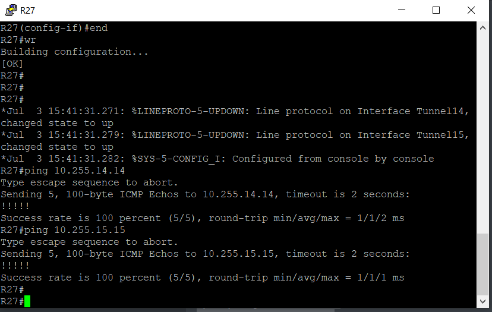

Переходим к настройке R28. R28:

```
en
conf t
int tu 14

ip addr 10.255.14.28 255.255.255.0
ip mtu 1400
ip tcp adjust-mss 1360
ip nhrp network-id 14
ip nhrp map multicast 20.177.0.14
ip nhrp nhs 10.255.14.14
ip nhrp map 10.255.14.14 20.177.0.14
tunnel mode gre multipoint
tunnel source Ethernet 0/1


int tu 15
ip addr 10.255.15.28 255.255.255.0
ip mtu 1400
ip tcp adjust-mss 1360
ip nhrp network-id 15
ip nhrp map multicast 20.177.0.15
ip nhrp nhs 10.255.15.15
ip nhrp map 10.255.15.15 20.177.0.15
tunnel mode gre multipoint
tunnel source Ethernet 0/0


end
wr
```

Связь есть:

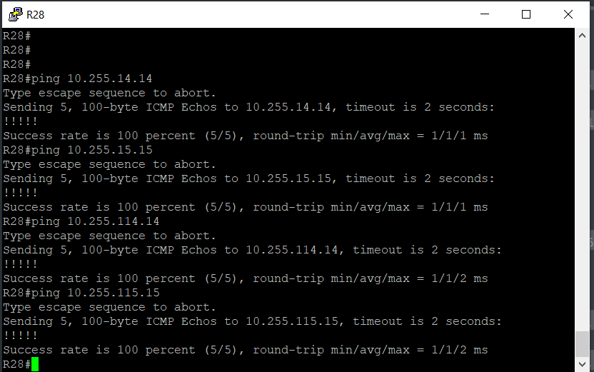

Причем спок обращается к другому споку напрямую:

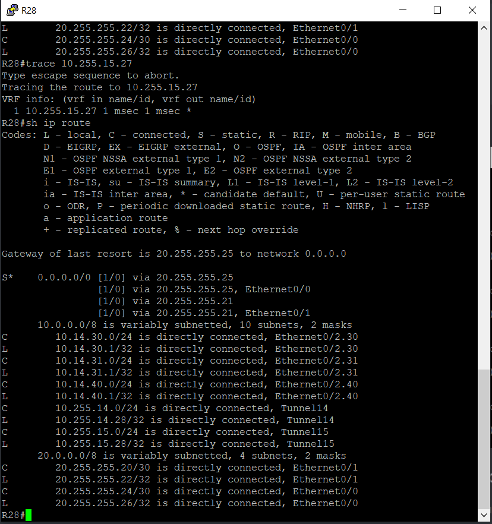

Но в таблице маршрутизации нет подробной записи. ??? Можно ли как-то провести более глубокий анализ??? Через nhrp???:

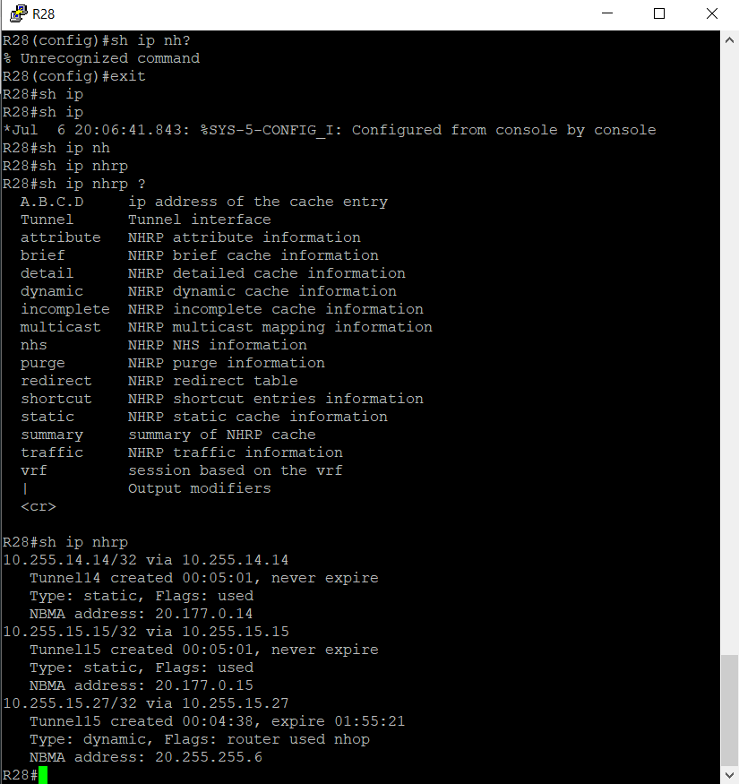

### Настройка динамической маршрутизации

Как и в случае с обычными туннелями, будем использовать EIGRP.

R14:

```
en
conf t

router eigrp NG
address-family ipv4 unicast autonomous-system 1
af-interface tunnel 14
no passive-interface
summary-address 10.177.0.0 255.255.0.0
exit-af


network 10.255.14.0 0.0.0.255

end
wr
```

R15:

```
en
conf t

router eigrp NG
address-family ipv4 unicast autonomous-system 1

af-interface tunnel 15
no passive-interface
summary-address 10.177.0.0 255.255.0.0
exit-af


network 10.255.15.0 0.0.0.255

end
wr
```

R27:

```
en
conf t

router eigrp NG
address-family ipv4 unicast autonomous-system 1
af-interface default
passive-interface

af-interface tunnel 14
no passive-interface
summary-address 10.89.0.0 255.255.0.0

exit-af

af-interface tunnel 15
summary-address 10.89.0.0 255.255.0.0
no passive-interface
exit-af

network 10.255.14.0 0.0.0.255
network 10.255.15.0 0.0.0.255
network 10.89.0.0 0.0.255.255

end
wr
```

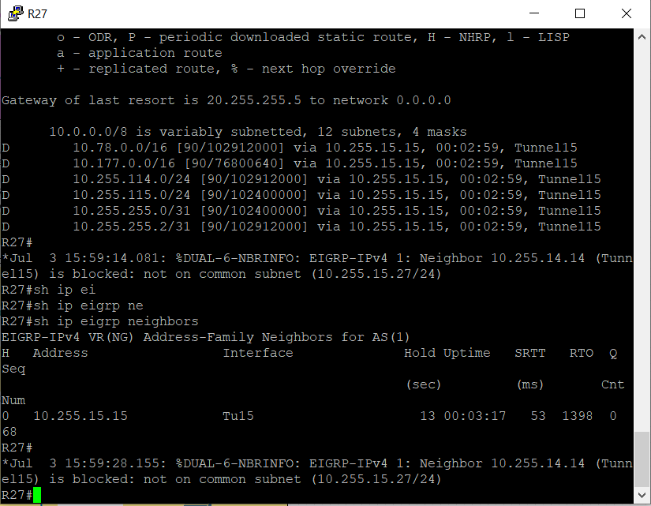

Соседство поднялось. ????Но через Tunnel не приходят hello от R14. Почему-то эти пакеты относятся к Tunnel 15 и дропаются. При включенни IPSec все поправится.

В итоге соседства с R14 нет:

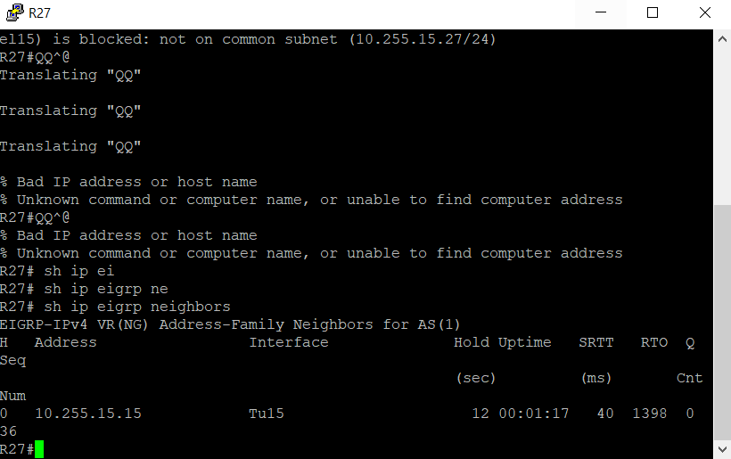

Сейчас же можем выполнить дополнительную настройку с tunnel key.

R14:

```
en
conf t
int tu 14
tunnel key 14
end
wr
```

R15:

```
en
conf t
int tu 15
tunnel key 15
end
wr
```

R27:

```
en
conf t
int tu 15
tunnel key 15
int tu 14
tunnel key 14
end
wr
```

Соседство установилось:

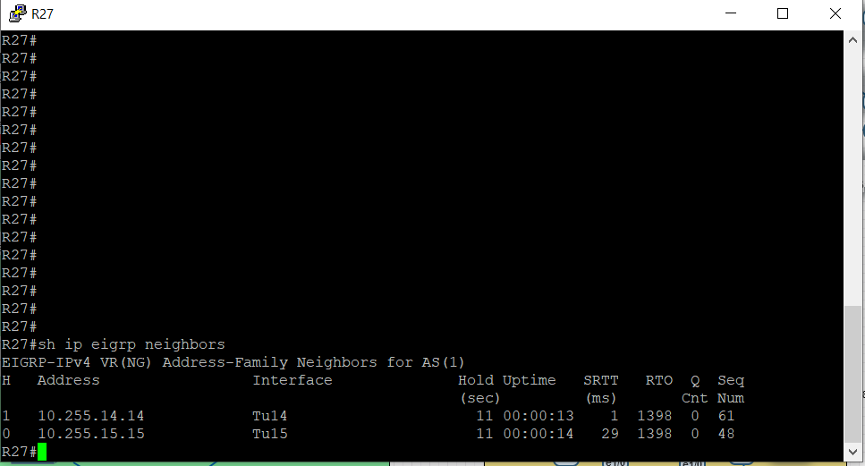

R28:

```
en
conf t

int tu 14
tunnel key 14

int tu 15
tunnel key 15

router eigrp NG
address-family ipv4 unicast autonomous-system 1

af-interface default
passive-interface

af-interface tunnel 14
summary-address 10.14.0.0 255.255.0.0
no passive-interface
exit-af

af-interface tunnel 15
summary-address 10.14.0.0 255.255.0.0
no passive-interface
exit-af


network 10.255.14.0 0.0.0.255
network 10.255.15.0 0.0.0.255
network 10.14.0.0 0.0.255.255
end
wr
```

R28 получает не все маршруты:

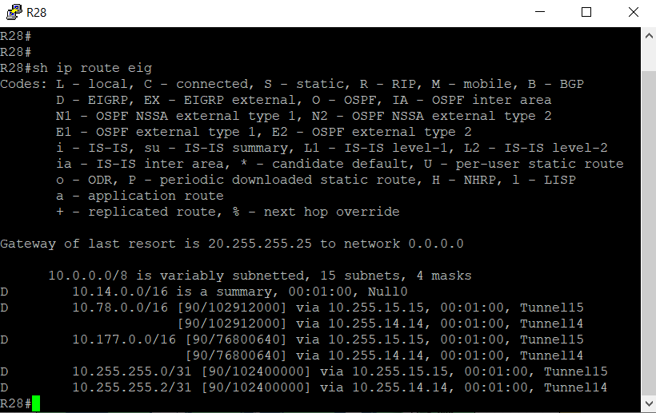

Нет маршрутов, которые должны приходит от соседей по DMVPN - через интерфейс Tunnel 14, Tunnel 15. Нужно на хабе отключить split-horizon, заодно убрать установку на хабе себя в качестве следующего хопа.

R15:

```
en
conf t
router eigrp NG
address-family ipv4 unicast autonomous-system 1

af-interface tunnel 15
no split-horizon
no next-hop-self
exit-af-interface


end
wr
```

R14:

```
en
conf t
router eigrp NG
address-family ipv4 unicast autonomous-system 1

af-interface tunnel 14
no split-horizon
no next-hop-self
exit-af-interface


end
wr
```

Спокам начали приходить все маршруты:

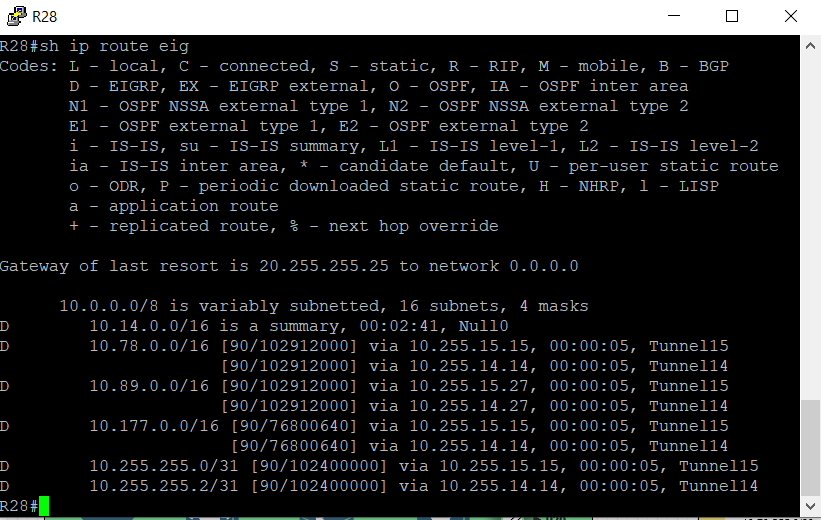

----

Наблюдение:

перезагружаем R15.


R15 видит соседа, R27 - нет. Вывод - по туннелю от R27 мультикаст приходит, по туннелю до R27 не приходит.

Но если мы на R27 отключим и включим туннель, то соседство появится:


??? это виртуализация???

----

Можно ли на хабе просуммировать маршуты? Подробности в копии readme.md. Здесь приведен только вывод: хаб получает маршруты и суммаризирует их, но не может перестать ставить свой хоп, т.к. маршрут получен один, значит и хоп будет один на весь суммарный префикс. Но также хаб добавляет свой специфический маршут, что странно.

## <a name="head3"></a>Все узлы в офисах в лабораторной работе должны иметь IP связность

Проверим связь между хостами сетей R27 и R28:

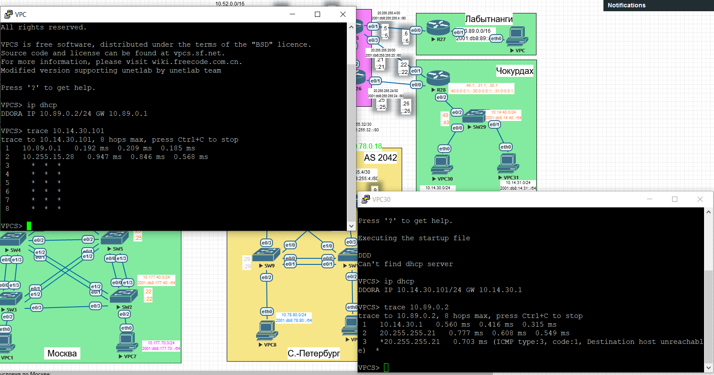

Связи нет. Пакеты с R28 уходят через PBR в интернет. Требуется корректировка, чтобы направлять пакеты в туннель. 

Текущие настройки на R28:

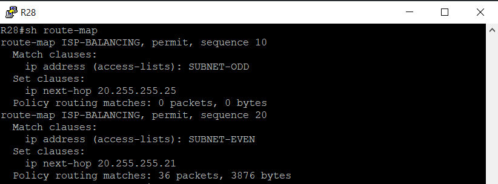

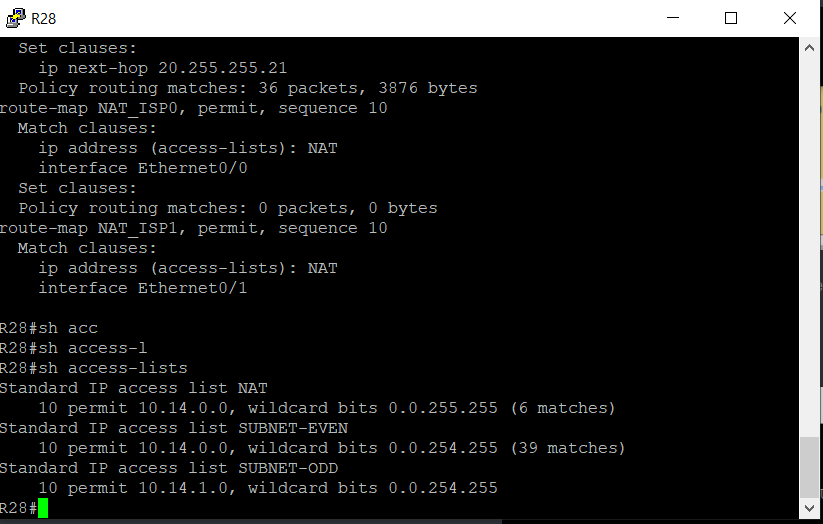

Следует поменять ACL.

R28:

```
en
conf t
no ip access-list standard SUBNET-EVEN
no ip access-list extended SUBNET-EVEN
ip access-list extended SUBNET-EVEN
deny ip any 10.0.0.0 0.255.255.255
permit ip 10.14.0.0 0.0.254.255 any

no ip access-list standard SUBNET-ODD
no ip access-list extended SUBNET-ODD
ip access-list extended SUBNET-ODD
deny ip any 10.0.0.0 0.255.255.255
permit ip 10.14.1.0 0.0.254.255 any

end
wr
```

Результат:

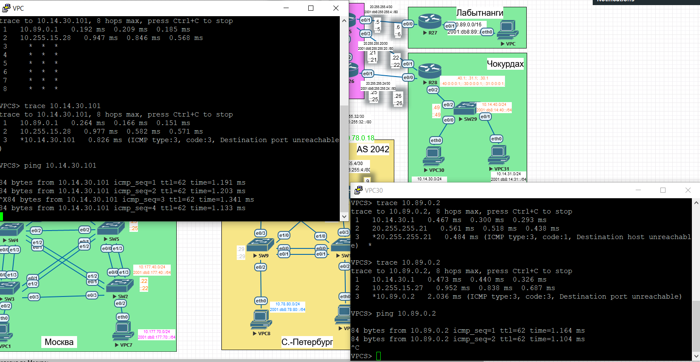

Трассировки идут как надо, через туннели, но все равно выдается ошибка от маршрутизаторов, напрямую подключенных к цели. Похоже, это баг виртуализации - команда ping успешна.

Настройка фазы 2 успешна.

### DMVPN фаза 3

В фазе 2 споки получают все маршруты, дополнительно имеют информацию по nhrp:

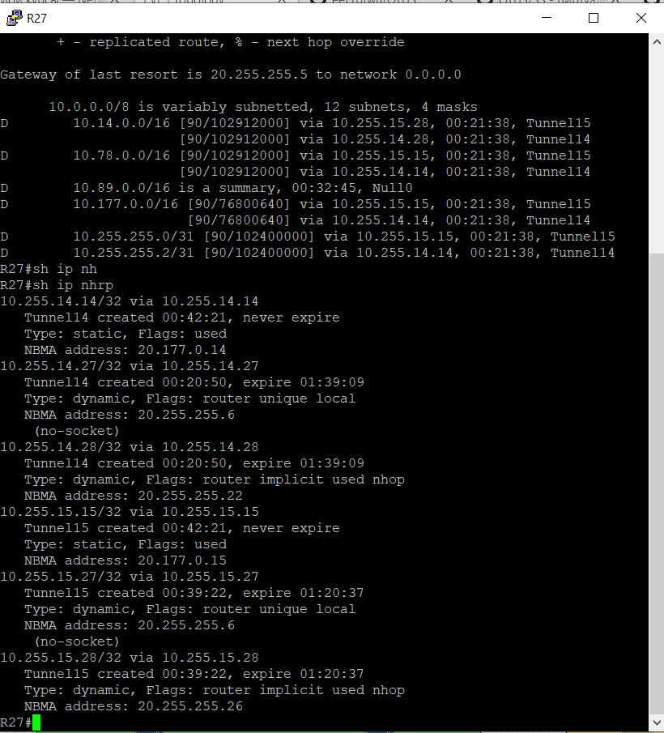

Трассировки идут напрямую, минуя хабы:

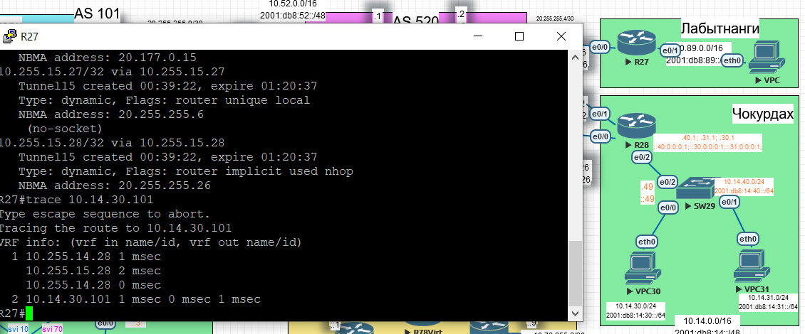

Причем:

- идет балансировка по туннелям

- трафик идет мимо хабов, т.к. туннели есть на обоих споках. Если бы на R27 были туннели, которых нет на R28, или наоборот, то трафик мог бы проходить через хабы. Поэтому важно, чтобы на всех споках были одинаковые туннели DMVPN.

Фаза 3 позволит обмениваться спокам между собой только неоходимыми маршутами.
Фаза включается парой команд.

Хаб R14:

```
en
conf t
int tu 14
ip nhrp redirect


end
wr
```

Хаб R15:

```
en
conf t
int tu 15
ip nhrp redirect

end
wr
```

Спок R27:

```
en
conf t
int tu14
ip nhrp shortcut

int tu15
ip nhrp shortcut


end
wr
```

Спок R28:

```
en
conf t

int tu14
ip nhrp shortcut

int tu15
ip nhrp shortcut


end
wr
```

Также на хабах задаем суммированный маршрут:

R14:

```
en
conf t
router eigrp NG
address-family ipv4 unicast autonomous-system 1
af-interface tu14
summary-address 10.0.0.0 255.0.0.0
exit-af-interface


end
wr
```

R15:

```
en
conf t
router eigrp NG
address-family ipv4 unicast autonomous-system 1
af-interface tu15
summary-address 10.0.0.0 255.0.0.0
exit-af-interface


end
wr
```

Смотрим маршруты на споке:

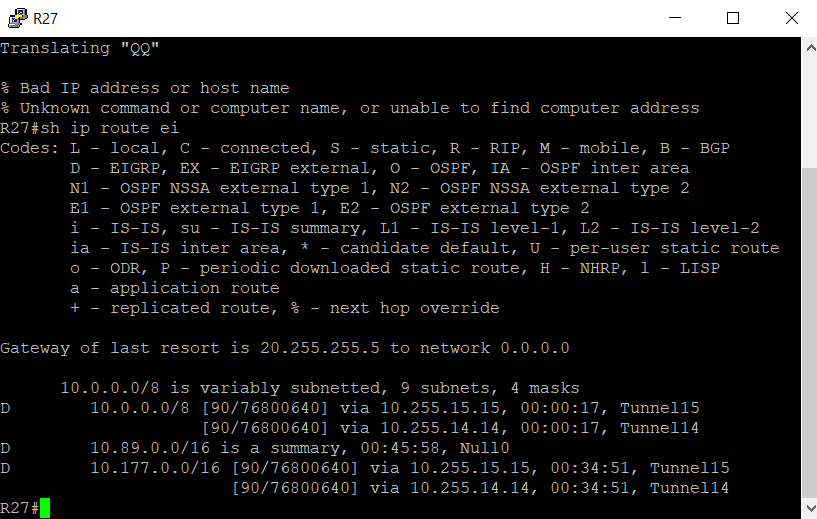

Суммарный маршрут от хаба получен, но есть еще и отдельный до сети хаба. Почему???

Выполним проверку связи до R28:

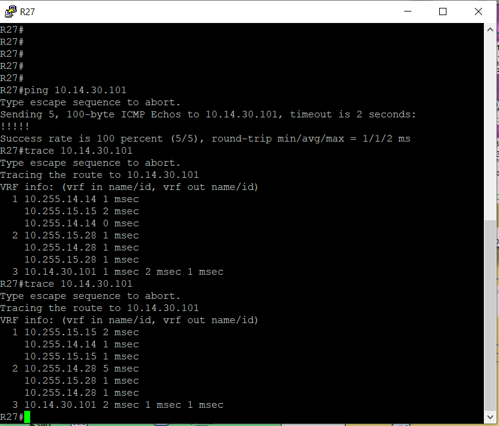

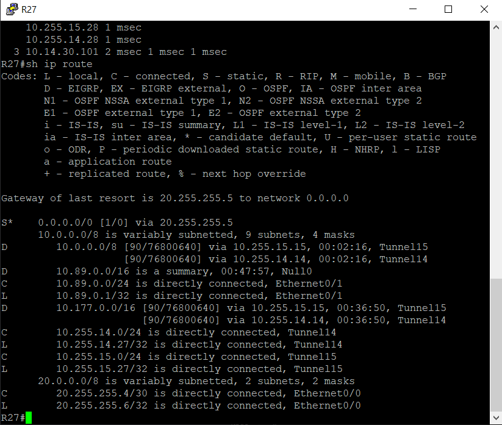

Маршрут не появился.

Но Wireshark показывает, что пакет от хаба к споку R28 был направлен:

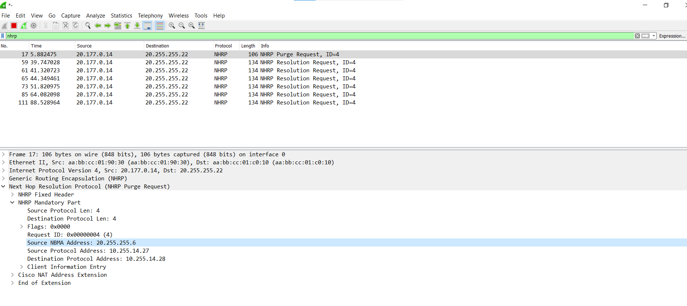

Но пакета от R28 к споку R27, с которого выполняется проверка связи, направлено не было:

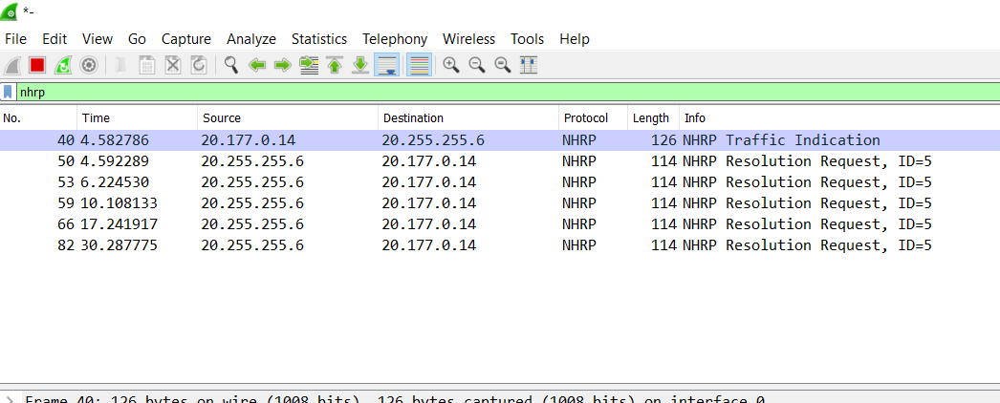

На R28 shortcut был настроен:

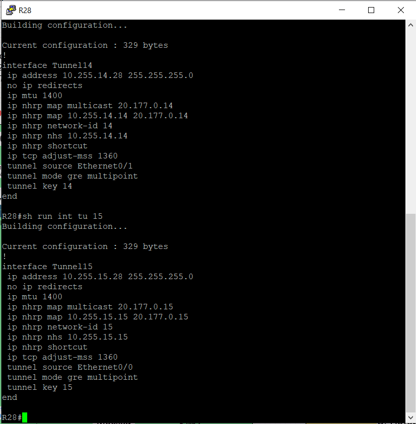

Wireshark на интерфейсе R28 не показывает каких-либо пакетов от R28 к R27:

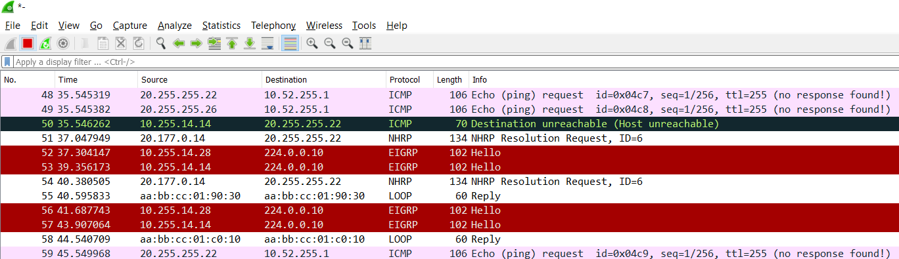

Второй интерфейс R28 отключен, чтобы не мешать на время эксперимента.

После wipe маршутизаторов до настройки фазы 2 и повторной настройки фазы 3 все заработало:
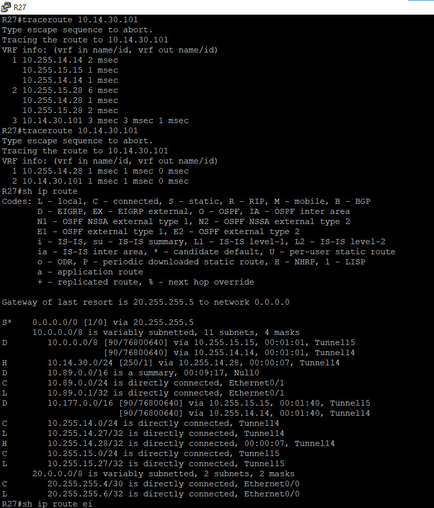
Первые пакети пошли через хаб, следующие - напрямую, запись в таблице маршутизации появилась.

---

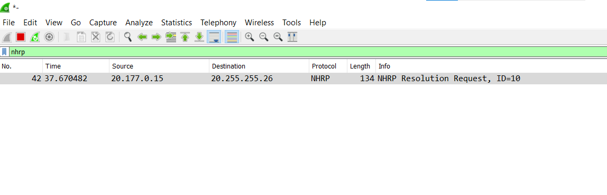
От хаба прошел пакет ip nhrp redirect.

---

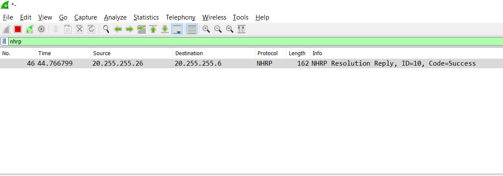
От спока пошел пакет к споку-источнику ping.

---

Однако через некоторое время сбросим nhrp кэш, связь опять стала идти только через хаб:

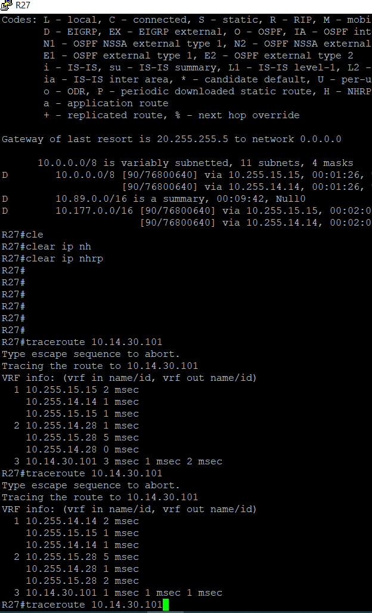

После очистки кэша на хабах и переподнятии туннелей связь снова пошла напрямую:

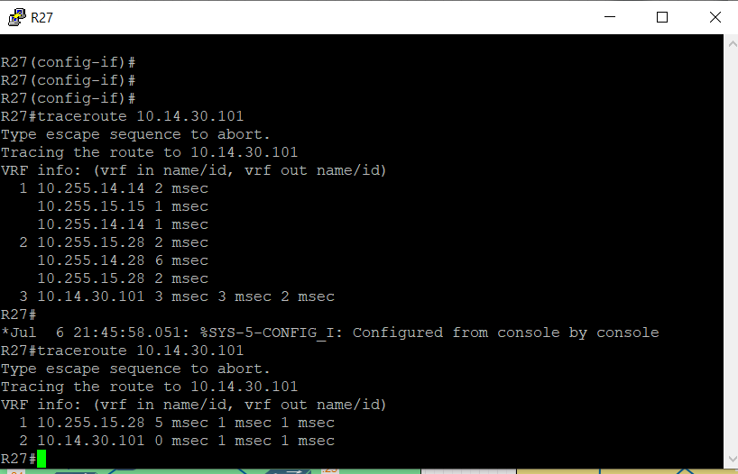

Причина? После очистки кэша на споке R27 он отправляет пакеты хабу. Но хаб не выполняет redirect. После переподнятия туннелей редиректы снова начинают работать, связь между хабами идет напрямую.

Повторная проверка после очистки кэша на споке снова сломала прямую связность споков. Перезагрузка устройств не помогла. Помогает переподнятие туннелей на всех устройствах.

Это особенность виртуализации???

Все требования задания выполнены - туннели подняты, связность есть.

------

Далее остался ненужный участкок отчета, в котором связи между узлами не было. Причина оказалась проста - R28 анонсировал сеть 10.15.0.0, а не 10.14.0.0.


Причина в R14. На нем отключены временно туннели Tunnel 14, 114, чтобы не флудить ошибками соседства на споках. Отключим R14 полностью. При настройке IPSec эта ошибка пропадет и мы сможем включить R14 обратно. Также гасим на R27 и R28 туннели Tunnel 14, 114.

Появилась новая ошибка - трафик на R28 не идет в туннель. Причина - PBR. На inside интервфейс приходит трафик, матчится и отправляется на внешние интерфейсы, где происходит трансляция.

Сейчас в зависимости от четности третьего октета идет NAT на одного из двух провайдеров. Нам же надо направлять в NAT только пакеты для адресов интернета, остальные - в туннели. Причем на уровне туннелей балансировка будет работать автоматом, но вот к какому провайдеру выпускать такой пакет, нужна дополнительная настройка. Ее делать не будем.

Поправим ACL - будем осуществлять PBR только для белых адресов. Остальные не смотрим, и они пойдут по таблице маршутизации.

Сперва поправим трекинг:

```
en
conf t
no ip sla 1
ip sla 1
 icmp-echo 20.177.0.15 source-interface Ethernet0/0
 frequency 10
end
conf t

ip sla schedule 1 life forever start-time now
no ip sla 2
ip sla 2
 icmp-echo 20.177.0.15 source-interface Ethernet0/1
 frequency 10

end
wr
```

R28:

```
en
conf t

no ip access-list extended SUBNET-EVEN
ip access-list extended SUBNET-EVEN
deny ip any 10.0.0.0 0.255.255.255
deny ip any 255.255.255.255 0.0.0.0
deny ip any 0.0.0.0 0.0.0.0
deny ip 255.255.255.255 0.0.0.0 any
deny ip 0.0.0.0 0.0.0.0 any
permit ip 0.0.254.0 255.255.254.255 any

no ip access-list extended SUBNET-ODD
ip access-list extended SUBNET-ODD
deny ip any 10.0.0.0 0.255.255.255
deny ip any 255.255.255.255 0.0.0.0
deny ip any 0.0.0.0 0.0.0.0
deny ip 255.255.255.255 0.0.0.0 any
deny ip 0.0.0.0 0.0.0.0 any
permit ip 0.0.255.0 255.255.254.255 any

end
wr
```

Связи все равно нет:

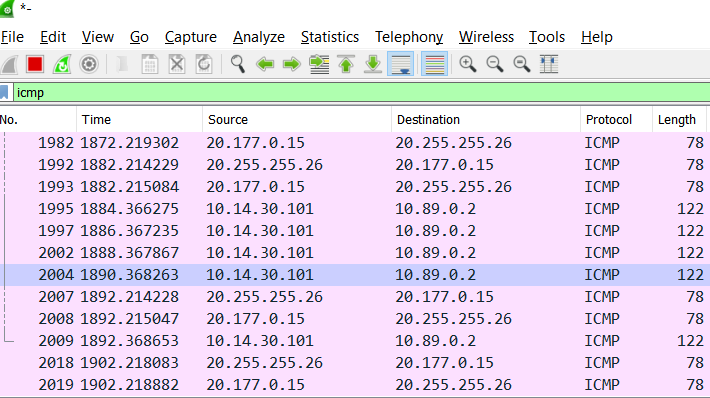

Пакеты уходят в Интернет, вместо туннелей, причем минуя NAT. Пакет до белых адресов транслируются.

Также транслируются любые пакеты до сетей, которые неизвестны R28:

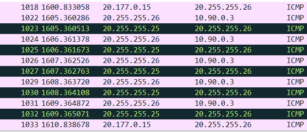

???

Неправильная трактовка - Wireshark показывает адреса, подсматривая их в GRE:

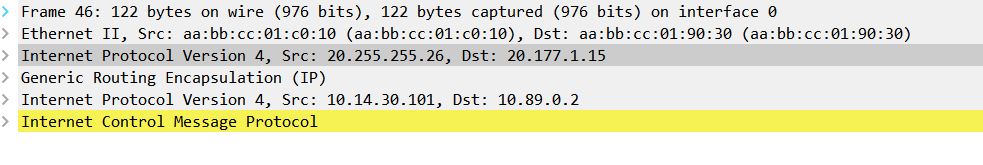

Будем предполагать, что причина в отсутвии IPSec.

???Также остается ситуация, когда имеем два маршрута из R28 к R27 - один напрямую, второй через R15:

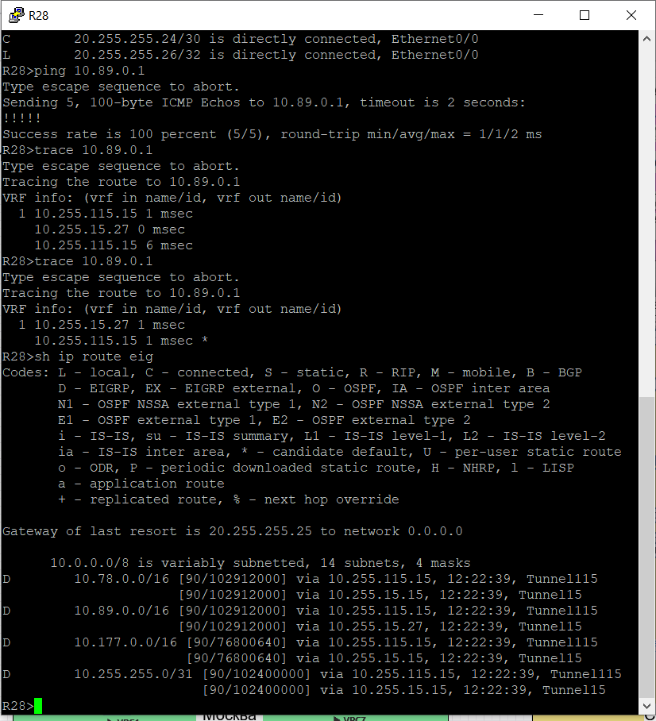

Как это лучше исправить??? Фазой 3?

Из-за GRE проявляются проблемы, поэтому связность между рядом устройств будет отсутствовать. Задачу стоит перенести на следующую работу, где за счет IPSec проблема уйдет.


---

Проверка связи при падении туннелей.


Туннели точка-точка.

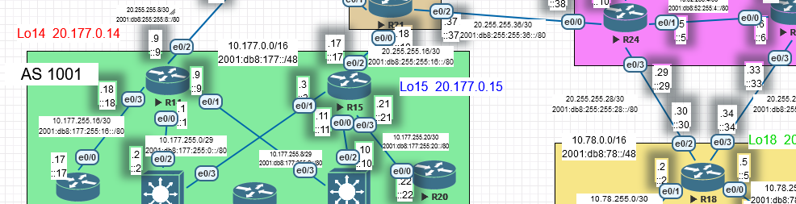

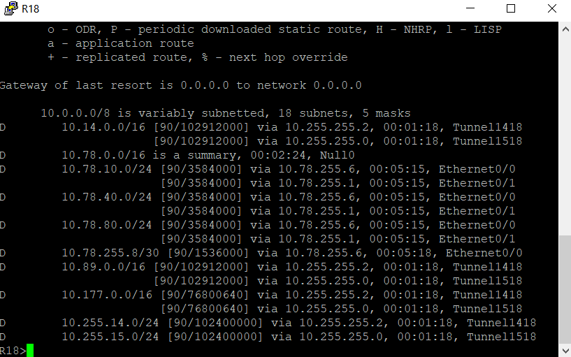

Из СПб сети Москвы доступны через туннели 1418 и 1518.


Гасим один конец туннеля:

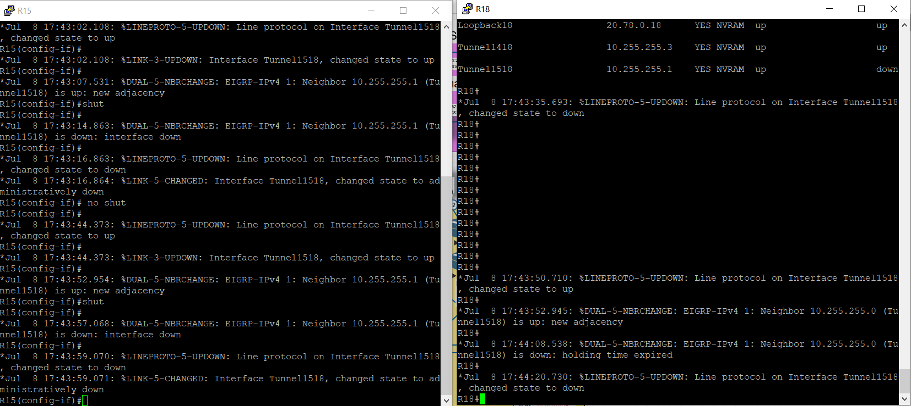

Соседство EIGRP пропадает раньше, чем определяется падение туннеля. Настройки keep alive:

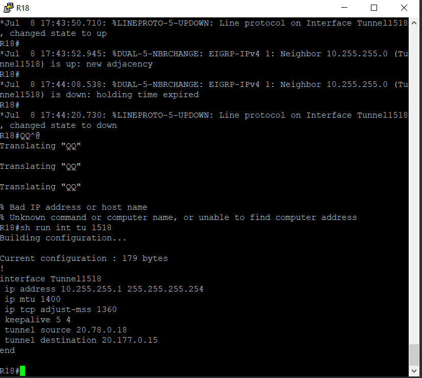

Состояние же down определяется лишь через 20 секунд. Виртуализация????


DMVPN:


При падении хаба линк на споке не отслеживается, несмотря на настройку keepalive:

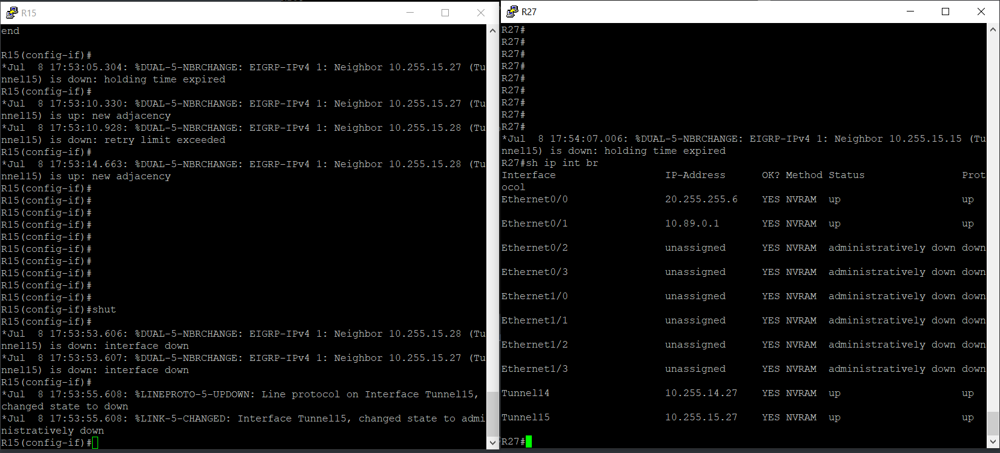

Более того, при поднятии на хабе интерфеса Tu 15 хаб видит соседа, спок - нет:

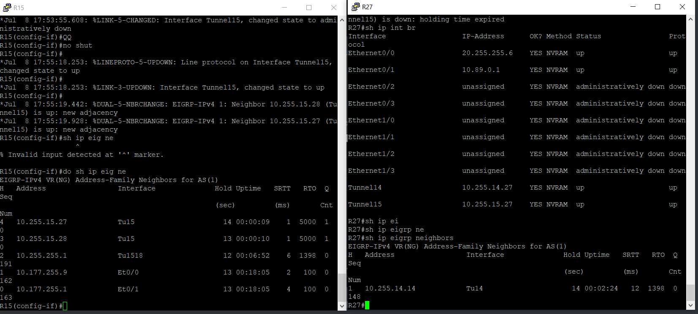

Для восстановления соседства нужно переподнять интерфейс Tu 15 на споке:

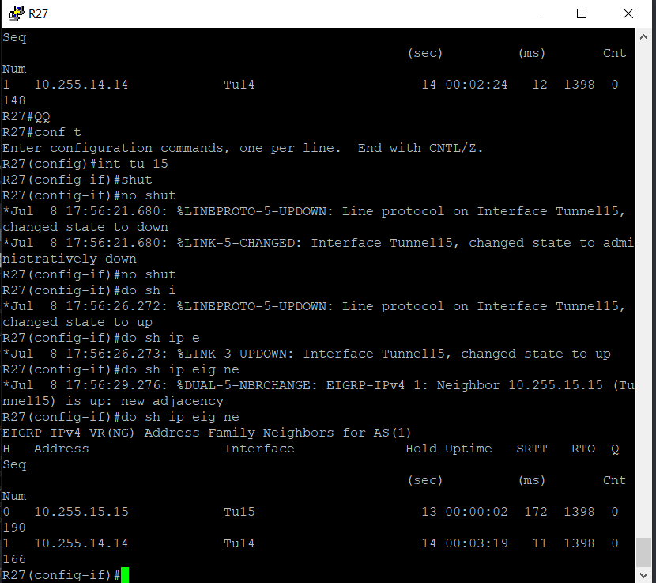

Виртуализация
