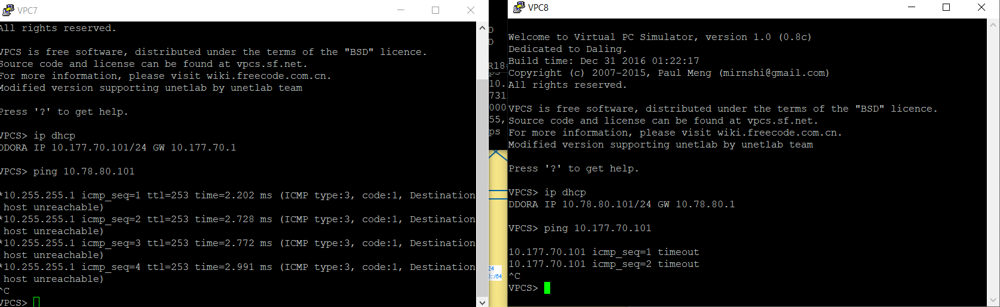
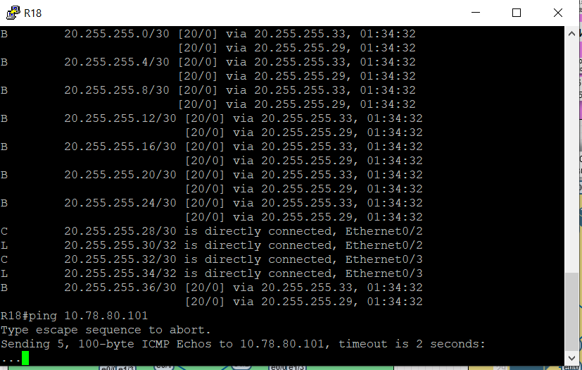
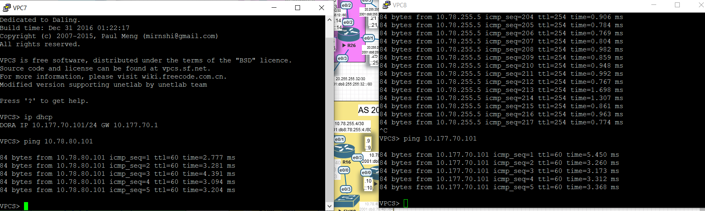

# Виртуальная частные сети - VPN

- Настроить GRE между офисами Москва и С.-Петербург

- Настроить DMVPN между офисами Москва и Чокурдах, Лабытнанги

В этой самостоятельной работе мы ожидаем, что вы самостоятельно:

1. Настроите GRE между офисами Москва и С.-Петербург
2. Настроите DMVMN между Москва и Чокурдах, Лабытнанги
3. Все узлы в офисах в лабораторной работе должны иметь IP связность

## Настроите GRE между офисами Москва и С.-Петербург

Проверим текущее состояние связности:


Из внутренней сети Москвы есть доступ до внешних интерфейсов R18 в СПб. Но до внутренних интерфейсов уже не добраться - маршруты до серых сетей в Интернете неизвестны. 

Выполним настройку GRE-туннеля. Топология позволяет создать различные реализации:

1. Для белых адресов туннеля можно использовать адреса на физических интерфейсах.

2. Для белых адресов туннеля можно использовать адреса с Loopback-интерфейсов, анонсируемые в Интернет через BGP.

Второй вариант более гибкий:

1. Если у маршрутизатора несколько интерфейсов, не придется настраивать два туннеля.

2. Если  из автономной системы выход через два маршрутизатора, то при потере связи с интернетом у первого маршрутизатора он останется доступным через второй маршрутизатор. Туннель не порвется.

Реализуем сперва наименее гибкий вариант для сравнения - с каждого физического интерфейса.

### Адресация

Для адресов туннельных интерфейсов будем использовать сеть 10.255.0.0/16. Каждый адрес будет располагаться в сети 10.255.255.N/31. Или лучше делать сеть /24????

|            | Peer-1 | Peer-1-White IP | Peer-1-Tunnel IP | Peer-2 | Peer-2-White IP | Peer-2-Tunnel IP |
| ---------- | ------ | --------------- | ---------------- | ------ | --------------- | ---------------- |
| Tunnel 110 | R15    | 20.255.255.17   | 10.255.255.0     | R18    | 20.255.255.30   | 10.255.255.1     |
| Tunnel 120 | R15    | 20.255.255.17   | 10.255.255.2     | R18    | 20.255.255.34   | 10.255.255.3     |
| Tunnel 210 | R14    | 20.255.255.9    | 10.255.255.4     | R18    | 20.255.255.30   | 10.255.255.5     |
| Tunnel 220 | R14    | 20.255.255.9    | 10.255.255.6     | R18    | 20.255.255.34   | 10.255.255.7     |

### Настройка туннелей R15-R18

R18:

```
en
conf t
interface tunnel 110
ip addr 10.255.255.1 255.255.255.254
tunnel source 20.255.255.30
tunnel destination 20.255.255.17
ip mtu 1400
ip tcp adjust-mss 1360

interface tunnel 120
ip addr 10.255.255.3 255.255.255.254
tunnel source 20.255.255.34
tunnel destination 20.255.255.17
ip mtu 1400
ip tcp adjust-mss 1360


end
wr
```

R15:

```
en
conf t
interface tunnel 110
ip addr 10.255.255.0 255.255.255.254
tunnel source 20.255.255.17
tunnel destination 20.255.255.30
ip mtu 1400
ip tcp adjust-mss 1360

interface tunnel 120
ip addr 10.255.255.2 255.255.255.254
tunnel source 20.255.255.17
tunnel destination 20.255.255.34
ip mtu 1400
ip tcp adjust-mss 1360


end
wr
```

Туннели поднялись, связь между маршрутизаторами через туннели есть:


надо ли указывать tunnel mode gre????

Далее настроим динамическую маршрутизацию. В Москве работает протокол OSPF, в СПб - EIGRP. Поэтому добавим в Москве динамическую маршрутизацию EIGRP.

R15:

```
en
conf t
router eigrp NG

address-family ipv4 unicast autonomous-system 1

af-interface default
passive-interface
exit-af-interface

af-interface tunnel 110
no passive-interface
exit-af-interface

af-interface tunnel 120
no passive-interface
exit-af-interface

network 10.177.0.0 0.0.255.255
network 10.255.255.0 0.0.0.1
network 10.255.255.2 0.0.0.1

eigrp router-id 1.0.0.15


end
wr
```

R18:

```
en
conf t
router eigrp NG
address-family ipv4 unicast autonomous-system 1
af-interface default
passive-interface
exit-af-interface

af-interface Ethernet 0/0
no passive-interface
exit-af-interface

af-interface Ethernet 0/1
no passive-interface
exit-af-interface

af-interface Tunnel 110
no passive-interface
exit-af-interface

af-interface Tunnel 120
no passive-interface
exit-af-interface

network 10.255.255.0 0.0.0.1
network 10.255.255.2 0.0.0.1

exit-address-family


address-family ipv6 unicast autonomous-system 1
af-interface default
passive-interface

af-interface Ethernet 0/0
no passive-interface

af-interface Ethernet 0/1
no passive-interface

exit-address-family


end
wr
```

!!! Напоминание про работу EIGRP. Соседство будет установлено только с тех интерфейсов, которые попадают в команду network. Если нет ни одной команды network, то соседство не будет устанавливаться ни с одного интерфейса. И сообщать маршрутизатор будет только о тех маршрутах, которые попадают в команду network.

На короткий момент появилось соседство, но потом пропало. Плюс туннели переходят в down:


Это происходит из-за анонса белого адреса туннеля маршрутизатором R18. С прошлых лабораторных работ этот анонс был незамечен, да и вообще не нужен. Отключаем.

R18:

```
en
conf t
router eigrp NG
address-family ipv4 unicast autonomous-system 1
no network 20.255.255.28 0.0.0.3
no network 20.255.255.32 0.0.0.3

end
wr
```

Туннели поднялись, соседство установилось:


Но на R15 появился маршрут D EX до сети 20.78.0.0/24. Это сеть, которая анонсируется с R18 путем добавления статического маршрута. В EIGRP была задана команда редистрибуции статики, что тоже нужно убрать. 

R18:

```
en
conf t

router eigrp NG
address-family ipv4 unicast autonomous-system 1
topology base
no redistribute static

exit-address-family

address-family ipv6 unicast autonomous-system 1
topology base
no redistribute static

end
wr
```

Пришли маршруты, которые нужны:


Лучше их суммаризировать на R18.

R18:

```
en
conf t
router eigrp NG
address-family ipv4 unicast autonomous-system 1
af-interface tunnel 110
summary-address 10.78.0.0/16
exit-af-interface
af-interface tunnel 120
summary-address 10.78.0.0/16
exit-af-interface

end
wr
```

Аналогично суммируем маршруты на R15:

```
en
conf t
router eigrp NG
address-family ipv4 unicast autonomous-system 1
af-interface tunnel 110
summary-address 10.177.0.0/16
exit-af-interface
af-interface tunnel 120
summary-address 10.177.0.0/16
exit-af-interface

end
wr
```

Получили суммарные маршруты на R15, R18:


Но связи между компьютерами все равно нет:



Причина - пакеты пытаются дойти через R14, а не R15. На R14 тоже необходимы туннели. Учитывая выполненное на R15, конфигурируем R14:

R14:

```
en
conf t
interface tunnel 210
ip addr 10.255.255.4 255.255.255.254
tunnel source 20.255.255.9
tunnel destination 20.255.255.30
ip mtu 1400
ip tcp adjust-mss 1360

interface tunnel 220
ip addr 10.255.255.6 255.255.255.254
tunnel source 20.255.255.9
tunnel destination 20.255.255.34
ip mtu 1400
ip tcp adjust-mss 1360


router eigrp NG

address-family ipv4 unicast autonomous-system 1

af-interface default
passive-interface
exit-af-interface


af-interface tunnel 210
no passive-interface
summary-address 10.177.0.0/16
exit-af-interface

af-interface tunnel 220
no passive-interface
summary-address 10.177.0.0/16
exit-af-interface

network 10.177.0.0 0.0.255.255
network 10.255.255.4 0.0.0.1
network 10.255.255.6 0.0.0.1

eigrp router-id 1.0.0.14


end
wr
```

R18:

```
en
conf t
interface tunnel 210
ip addr 10.255.255.5 255.255.255.254
tunnel source 20.255.255.30
tunnel destination 20.255.255.9
ip mtu 1400
ip tcp adjust-mss 1360

interface tunnel 220
ip addr 10.255.255.7 255.255.255.254
tunnel source 20.255.255.34
tunnel destination 20.255.255.9
ip mtu 1400
ip tcp adjust-mss 1360


router eigrp NG
address-family ipv4 unicast autonomous-system 1

af-interface Tunnel 210
no passive-interface
summary-address 10.78.0.0/16
exit-af-interface

af-interface Tunnel 220
no passive-interface
summary-address 10.78.0.0/16
exit-af-interface

network 10.255.255.4 0.0.0.1
network 10.255.255.6 0.0.0.1

end
wr
```

Соседство поднялось:


Но связи между пк по-прежнему нет...

Идем в СПБ и пробуем R18->VPC8:



Смотрим маршруты:


При суммаризации маршрута в туннелях была добавлена статическая запись в NULL. Если убираем суммаризацию на R18:

```
en
conf t
router eigrp NG
address-family ipv4 unicast autonomous-system 1
af-interface tunnel 110
no summary-address 10.78.0.0/16
exit-af-interface

af-interface tunnel 120
no summary-address 10.78.0.0/16
exit-af-interface

af-interface tunnel 210
no summary-address 10.78.0.0/16
exit-af-interface

af-interface tunnel 220
no summary-address 10.78.0.0/16
```

Связь сразу появилась:


Добавляем обратно на R18 суммаризацию:

```
en
conf t
router eigrp NG
address-family ipv4 unicast autonomous-system 1
af-interface tunnel 110
 summary-address 10.78.0.0/16
exit-af-interface

af-interface tunnel 120
 summary-address 10.78.0.0/16
exit-af-interface

af-interface tunnel 210
 summary-address 10.78.0.0/16
exit-af-interface

af-interface tunnel 220
summary-address 10.78.0.0/16
```

Связь сразу пропадает:


Какой выход? На R18 обязательно долждны быть маршруты, которые перебьют суммарный маршрут с маской 16. Чтобы они появились, мы должны получать их от R16 и R17.


Мы их не получаем, т.к. на R16 и R17 ранее сделана суммаризация. Отключим ее. ??? Как все же поступать правильно в этом случае???

R16, 17:

```
en
conf t
router eigrp NG
address-family ipv4 unicast autonomous-system 1
af-interface Ethernet0/1
no summary-address 10.78.0.0 255.255.0.0


end
wr
```

Связь между компьютерами Москвы и СПб появилась:

 
