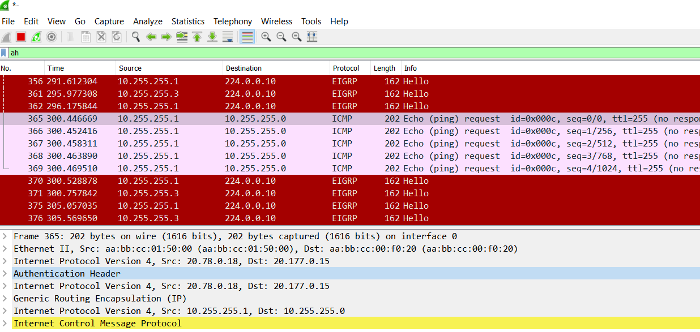

# IPSec over DmVPN

В этой самостоятельной работе мы ожидаем, что вы самостоятельно:

1. [Настроите GRE поверх IPSec между офисами Москва и С.-Петербург](#head01)
2. [Настроите DMVPN поверх IPSec между Москва и Чокурдах, Лабытнанги](#head02)
3. [Все узлы в офисах в лабораторной работе должны иметь IP связность](#head03)

# Предварительная настройка

Ранее маршрутизаторы R14 и R15 анонсировали свои адреса, через которые идет NAT, только в сторону подключенных напрямую провайдеров. Анонс адреса соседа фильтравался. Причина такой настройки - на запрос узла из Москвы ответный пакет мог прийти не на тот маршрутизатор Москвы, обратная трансляция не выполнится, пакет не дойдет до узла-инициатора в Москве.

Демонстрация - отключим фильтрацию снова:

R14:

```
en
conf t

router bgp 1001
address-family ipv4
no  neighbor 20.255.255.10 prefix-list PL_DENY_WHITE_R15 out

end

wr
```

R15:

```
en
conf t
router bgp 1001
address-family ipv4
no neighbor 20.255.255.18 prefix-list PL_DENY_WHITE_R14 out

end
wr
```

Проверим, как работает связь:


VPC7 отправляет запрос к маршрутизатору Ламас. Пакет транслируется на R14 и доходит до R21. R21 формирует ответ и отправляет на R15. R15 пересылает пакет на R14, но R14 не выполняет трансляцию, т.к. пакет пришел не на Outside-интерфейс.

Чтобы это исправить, создадим линк между R14 и R15. Линк сделаем через туннель.

На R14 и R15 cоздадим Loopback с серым адресом, анонсируем в OSPF, поднимем туннель до соседа.

R14:

```
en
conf t


int lo 14
ip ospf 1 area 0

int tu 1415
ip addr 10.177.255.64 255.255.255.254
tunnel source lo 0
tunnel destination 10.177.254.15
ip ospf 1 area 0
ip ospf network point-to-point
no shut
ip nat outside
end

conf t
router ospf 1
no passive-interface Tu1415
end
wr
```

R15:

```
en
conf t
int tu 1415
ip addr 10.177.255.65 255.255.255.254
tunnel source lo 0
tunnel destination 10.177.254.14
ip nat outside
ip ospf 1 area 0
ip ospf network point-to-point
no shut
end

conf t
router ospf 1
no passive-interface Tu1415
end

wr
```

?????Соседство появилось, но маршруты через него - нет:


Если сделать прямой физический отдельный линк:

R14:

```
en
conf t


int e1/0
ip addr 10.177.255.64 255.255.255.254
ip ospf 1 area 0
ip nat outside
no shut
end

conf t
router ospf 1
no passive-interface e1/0
end
wr
```

R15:

```
en
conf t
int e1/0
ip addr 10.177.255.65 255.255.255.254
ip nat outside
ip ospf 1 area 0
no shut
end

conf t
router ospf 1
no passive-interface e1/0
end

wr
```

Соседство  зависает в состоянии EXSTART. Причина - интерфейс NAT OUTSIDE. Он не пропускает входящий трафик.

Вопрос оставляем открытым, переходим к IPSec.

### <a name="head01"></a> Настроите GRE поверх IPSec между офисами Москва и С.-Петербург

Между Москвой и СПб настроены туннели Tu1418 и Tu1518, используя Loopback:


Добавим к ним IPSec, пока что в режиме AH, чтобы можно было видеть в Wireshark структуру.

R14:

```
en
conf t

crypto isakmp policy 10
auth pre-share

crypto isakmp key otus address 20.78.0.18

crypto ipsec transform-set ENC_ALG ah-sha512-hmac


crypto ipsec profile OTUS
set transform-set ENC_ALG


int tu1418
tunnel protection ipsec profile OTUS

end
wr
```

R15:

```
en
conf t

crypto isakmp policy 10
auth pre-share

crypto isakmp key otus address 20.78.0.18

crypto ipsec transform-set ENC_ALG ah-sha512-hmac


crypto ipsec profile OTUS
set transform-set ENC_ALG


int tu1518
tunnel protection ipsec profile OTUS

end
wr
```

R18:

```
en
conf t

crypto isakmp policy 10
auth pre-share

crypto isakmp key otus address 20.177.0.14
crypto isakmp key otus address 20.177.0.15

crypto ipsec transform-set ENC_ALG ah-sha512-hmac

crypto ipsec profile OTUS
set transform-set ENC_ALG


int tu1418
tunnel protection ipsec profile OTUS

int tu1518
tunnel protection ipsec profile OTUS

end
wr
```

Результат:


Туннели работают, связь есть.

Подробнее в Wireshark:



Пакет icmp запакован в IP, Далее в GRE, далее в IP с белыми адресами, далее в IPSec, далее снова в IP с белыми адресами. Размер фрейма 202 байта. Режим работы - туннельный.

Переключим в транспортный режим.

R14, R15, R18:

```
en
conf t
crypto ipsec transform-set ENC_ALG ah-sha512-hmac
mode transport

end
wr
```

Результат:


ICMP запакован в IP с серыми адресами, далее в GRE, далее в IPSec, далее в IP с белыми адресами. Размер фрейма уменьшился на 20 байт за счет транспортного режима.

??? При настройке GRE мы снижали MTU до 1400, MSS до 1360. За счет шифрования эти пороги не увеличаться при формировании исходящих пакетов???

### <a name="head02"></a>Настроите DMVPN поверх IPSec между Москва и Чокурдах, Лабытнанги

Включаем настройку на туннельных интерфейсах аналогично предыдущему пункту.

R14:

```
en
conf t

crypto isakmp policy 10
auth pre-share

crypto isakmp key otus address 20.255.255.6
crypto isakmp key otus address 20.255.255.22
crypto isakmp key otus address 20.255.255.26

crypto ipsec transform-set ENC_ALG ah-sha512-hmac
mode transport


crypto ipsec profile OTUS
set transform-set ENC_ALG


int tu14
tunnel protection ipsec profile OTUS

int tu114
tunnel protection ipsec profile OTUS


end
wr
```

R15:

```
en
conf t

crypto isakmp policy 10
auth pre-share

crypto isakmp key otus address 20.255.255.6
crypto isakmp key otus address 20.255.255.22
crypto isakmp key otus address 20.255.255.26

crypto ipsec transform-set ENC_ALG ah-sha512-hmac
mode transport


crypto ipsec profile OTUS
set transform-set ENC_ALG


int tu15
tunnel protection ipsec profile OTUS

int tu115
tunnel protection ipsec profile OTUS


end
wr
```

R27:

```
en
conf t

crypto isakmp policy 10
auth pre-share

crypto isakmp key otus address 20.177.0.14
crypto isakmp key otus address 20.177.0.15

crypto ipsec transform-set ENC_ALG ah-sha512-hmac
mode transport


crypto ipsec profile OTUS
set transform-set ENC_ALG


int tu14
tunnel protection ipsec profile OTUS

int tu15
tunnel protection ipsec profile OTUS


end
wr
```

Туннель на R27 поднялся только до R15:


Причина - туннель выключен на R14 из-за проблем с установлением соседства EIGRP (описано в предыдущей работе). Включаем их обратно.

R14:

```
en
conf t
int tu14
no shut
int tu114
no shut
end 
wr
```

В результате связь есть, но туннель не виден:


Перезагрузка не помогла. Мы забыли включить Tu14 и на R27. Включаем, смотрим результат:


На R27 оба туннеля поднялись, связь есть.

Также ушла проблема, когда HELLO пакеты попадали на Tu14 вместо Tu15:


Теперь соседство есть со всеми маршрутизаторами с другой стороны туннелей.

Переходим к настройке R28:


R28:

```
en
conf t

crypto isakmp policy 10
auth pre-share

crypto isakmp key otus address 20.177.0.14
crypto isakmp key otus address 20.177.0.15
crypto isakmp key otus address 20.177.1.14
crypto isakmp key otus address 20.177.1.15

crypto ipsec transform-set ENC_ALG ah-sha512-hmac
mode transport


crypto ipsec profile OTUS
set transform-set ENC_ALG


int tu14
tunnel protection ipsec profile OTUS
no shut

int tu15
tunnel protection ipsec profile OTUS


int tu114
tunnel protection ipsec profile OTUS
no shut

int tu115
tunnel protection ipsec profile OTUS


end
wr
```

Туннели поднялись:


Связь между споками:


### <a name="head03"></a>Все узлы в офисах в лабораторной работе должны иметь IP связность


Связь конечных хостов между собой проверена.