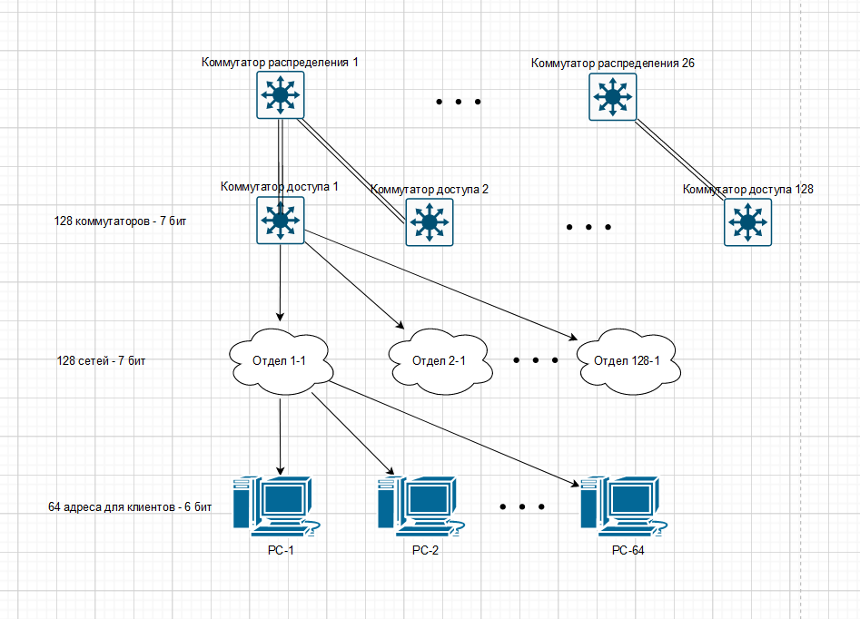

# Проектная работа

# Структура сети

## Общая схема:

   Мы имеем 3 провайдера, основной офис, дата-центр и два небольших удаленных офиса. Общая схема следующая:


   Можем ли мы разделить автономную систему 9001 на 2 географические области?

   Далее подробнее распишем каждый структурный участок.

## Сеть из 3 провайдеров.


1. Каждый провайдер имеет свою автономную систему.

2. Внутри автономных систем находятся маршутизаторы, которые обеспечивают отказоустойчивость.

3. Для внутренней связи используется протокол динамической маршрутизации IS-IS.

## Сеть центрального офиса компании GrowWide.


1. Компания владеет своей автономной системой.

2. Ядро сети подключено к провайдерам. Реализована отказоустойчивость.

3. К ядру сети подключены маршутизаторы распределения.

4. К маршрутизаторам распределения подключены L3-коммутаторы доступа.

5. В рамках сети действует протокол OSPF.

6. Site-to-site VPN.

7. VPN-шлюз Remote-Access VPN.

## Сеть в дата-центре


1. Подключение через двух провайдеров.

2. DMZ-сеть для серверов.

3. Site-to-Site VPN.

## Сеть необольшого регионального офиса без автономной системы.


1. Выход через два линка. 
2. Site-to-Site VPN.

## Сеть еще одного небольшого офиса с уже использующейся в остальной сети адресацией.


1. Реализация случая, когда нужно объединить в подсети с одинаковой адресацией.

2. Лучший вариант - адресацию поменять, но для работы реализуем такой экстренный сценарий.

3. Site-to-Site VPN. 

## DHCP

1. Вариант - сделать централизованный DHCP-сервер в центральном офисе.
   
   1. При потере связи с центральным офисом клиенты в регионах не получат адресов.
   
   2. Если в регионах использовать резервные DHCP на период недоступности центрального офиса - возможны конфликты адресов. Часть адресов будет получена из центра, часть от сервера.
   
   3. Выход - выдавать из разных диапазонов. Например диапазоны 1-126/24; 129-254/24.
   
   4. В этом случае в регионах по умолчанию DHCP отключен. Отслеживается основной DHCP и при его недоступности включается резервный.
   
   5. Вариант для курсовой интересный.
   
   # Этапы достижения результата

2. Формирование схемы всей сети.

3. Адресация устройств, сегментов.

4. Назначение сетевым устройставам адресов управления.

5. Настройка устройств провайдеров.

6. Настройка устройств центрального офиса.

7. Настройка устройств дата-центра.

8. Разрешение для управления только через определенные интерфейсы и с определенных устройств.

# Реализация

## Планирование адресного пространства

Начнем формировать адресацию. Точкой отсчета возмем центральный офис.


### Исходные данные

- В работе максимально отойдем от использования L2.

- К каждому коммутатору доступа будет подключаться несколько сетей (отделов).

- На коммутаторе эти сети должны суммаризовываться, т.о. количество маршрутов в сети значительно снизится.

- Исходные данные:
  
  - Центральный офис занимает 10 этажей.
  
  - На каждом этаже 100 рабочих мест.
    
    - Для подключения рабочих мест на этаже установлено 5 коммутаторов доступа (24 порта) и 1 коммутатор распределения.
    
    - Коммутаторы доступа подключены к коммутатору распределения на этаже и к коммутатору распределения на соседнем этаже.

### Визуализация для определения размера сетей

- На схеме ниже приведена разбивка сети на подсети коммутаторов доступа, подсети отделов (подключаются к коммутаторам доступа) и хосты одного из отделов. Пока что нас интересует именно суммаризация и разбиение клиентской сети. Избыточные линки между коммутаторами не показаны, чтобы не загромождать рисунок, они не участвуют в суммаризации. Подробное описание следует за схемой. 



- Поскольку установлено 50 коммутаторов доступа, у нас будет 50 сетей, которые анонсируют эти коммутаторы. Заложим преспективу масштабирования в два раза. Получим 100 коммутаторов, "округлим" это значение до 128 для более удобного планирования адресного пространства. Т.е. чтобы уникально идентифицировать каждую суммарную сеть, нам нужно 7 бит.

- Спускаемся далее и рассмотрим, сколько клиентских сетей может "скрываться" за одним коммутатором. Поскольку к коммутатору может быть подключен любой отдел, то количество подключаемых сетей определяется количеством отделов. Будем считать, что мы имеет 64 отдела, но заложим избыточность и увеличим их число до 128. Т.о. чтобы идентифицировать каждую минимальную сеть за коммутатором, нам нужно 7 бит.

- Осталось определить количество хостов в минимальной сети. Поскольку у нас коммутаторы доступа имеют 24 порта, то максимум подключаемых к нему хостов условно 20. Забегая вперед, увеличим это число в 2 раза, чтобы реализовать DHCP-отказоустойчивость на двух DHCP-серверах. Таким образом, число адресов в одной подсети составляет 64. Для идентификации хоста нужно 6 бит.

Переходим к формированию результата. 6 бит на хост + 7 бит на сеть отдела в одном коммутаторе + 7 бит на идентификацию коммутатора. Получаем 20 бит. Сеть с маской 32-20=12 бит полностью опишет клиентские подключения. Нам потребуются еще сети для назначения loopback-адресов, создания линков между сетевыми устройствами. Поэтому маску с 12 бит мы меняем на 11.

### Таблица адресов клиентских подсетей

Исходя из маски 11 бит выберем сеть 10.192.0.0/11. Она находится не в начале дипазона (будем надеяться, что при подключении "чужих" сетей это снизит вероятность совпадения адресов), также после этой сети остается еще одна такая же, что в случае чего позволит выполнить суммаризацию до маски 10. Имеем диапазон адесов 10.192.0.0 - 10.223.255.255.

Приступаем к определению клиентских подсетей. Под них выделена сеть 10.192.0.0/12. Диапазон 10.192.0.0-10.207.255.255.

---

Из этой сети мы выделяем 128 подсетей для 128 коммутаторов. Маска 19.

Тогда получим следующую адресацию для суммарных подсетей за коммутаторами:

|                | Диапазон адресов            | Маска |
| -------------- | --------------------------- | ----- |
| Коммутатор 1   | 10.192.0.0-10.192.31.255    | 19    |
| Коммутатор 2   | 10.192.32.0-10.192.63.255   | 19    |
| Коммутатор 3   | 10.192.64.0-10.192.95.255   | 19    |
| Коммутатор 4   | 10.192.96.0-10.192.127.255  | 19    |
| Коммутатор 5   | 10.192.128.0-10.192.159.255 | 19    |
| Коммутатор 6   | 10.192.160.0-10.192.191.255 | 19    |
| Коммутатор 7   | 10.192.192.0-10.192.223.255 | 19    |
| Коммутатор 8   | 10.192.224.0-10.192.255.255 | 19    |
| ---            | ---                         | ---   |
| Коммутатор 121 | 10.207.0.0-10.207.31.255    | 19    |
| Коммутатор 122 | 10.207.32.0-10.207.63.255   | 19    |
| Коммутатор 123 | 10.207.64.0-10.207.95.255   | 19    |
| Коммутатор 124 | 10.207.96.0-10.207.127.255  | 19    |
| Коммутатор 125 | 10.207.128.0-10.207.159.255 | 19    |
| Коммутатор 126 | 10.207.160.0-10.207.191.255 | 19    |
| Коммутатор 127 | 10.207.207.0-10.207.223.255 | 19    |
| Коммутатор 128 | 10.207.224.0-10.207.255.255 | 19    |

В пределах сети коммутатора 1 у нас должно быть 128 подсетей с маской 26.
Получим следующую адресацию для сетей за коммутатором 1:

|           | Диапазон адресов            | Маска |
| --------- | --------------------------- | ----- |
| Отдел 1   | 10.192.0.0-10.192.0.63      | 26    |
| Отдел 2   | 10.192.0.64-10.192.0.127    | 26    |
| Отдел 3   | 10.192.0.128-10.192.0.191   | 26    |
| Отдел 4   | 10.192.0.192-10.192.0.255   | 26    |
| Отдел 5   | 10.192.1.0-10.192.1.63      | 26    |
| Отдел 6   | 10.192.1.64-10.192.1.127    | 26    |
| Отдел 7   | 10.192.1.128-10.192.1.191   | 26    |
| Отдел 8   | 10.192.1.192-10.192.1.255   | 26    |
| ---       | ---                         | ---   |
| Отдел 121 | 10.192.30.0-10.192.30.63    | 26    |
| Отдел 122 | 10.192.30.64-10.192.30.127  | 26    |
| Отдел 123 | 10.192.30.128-10.192.30.191 | 26    |
| Отдел 124 | 10.192.30.192-10.192.30.255 | 26    |
| Отдел 125 | 10.192.31.0-10.192.31.63    | 26    |
| Отдел 126 | 10.192.31.64-10.192.31.127  | 26    |
| Отдел 127 | 10.192.31.128-10.192.31.191 | 26    |
| Отдел 128 | 10.192.31.192-10.192.31.255 | 26    |

### Общая запись адреса, исходя из номера коммутатора и минимальной сети за ним

Сеть клиентских устройств за коммутаторами записывается следующим образом:

| Зафиксировано | Коммутатор | Отдел    | Хост   |
| ------------- | ---------- | -------- | ------ |
| 00001010.1100 | 0000.000   | 00000.00 | 000000 |

Например, если мы захотим узнать суммарную сеть за 121 коммутатором, то мы должны в адресе в поле коммутатора сформировать число 120. Получим:

| Зафиксировано | Коммутатор 121 | Отдел    | Хост   |
| ------------- | -------------- | -------- | ------ |
| 00001010.1100 | 1111.000       | 00000.00 | 000000 |

И далее, если мы хотим узнать адрес отдела 124, то мы должны в адресе в поле отдела сформировать число 123:

| Зафиксировано | Коммутатор 121 | Отдел    | Хост   |
| ------------- | -------------- | -------- | ------ |
| 00001010.1100 | 1111.000       | 11110.11 | 000000 |

В десятичном виде получаем 10.207.30.192. Адрес совпадает с тем, который должен быть - по составленной ранее таблице с коммутаторами видим, что суммарная подсеть за 121 коммутатором  10.207.0.0/19. И по таблице с отделами видим, что 124 отдел начинается с 30.192. Расчеты верны.

### Вывод

Сформирована адресация с учетом суммаризации подсетей на коммутаторах. Также есть возможность с помощью Wildcard-маски выделить один отдел, устройства которого подключены к разным коммутаторам.

# Настройка устройств в центральном офисе

## Описание


В офисе 10 этажей, на каждом этаже по 5 коммутаторов доступа и одному коммутатору распределения. Их все размещать на схеме не будем. Отобразим лишь этажи 5, 6, 7 с 1-2 коммутаторами.

На 5м этаже расположены коммутаторы 21 и 22.

На 6м этаже расположены коммутаторы 27 и 28.

На 7м этаже расположен коммутатор 35.

Также будем подключать не все рабочие места и отделы. Ограничимся HR, бухгалтерией, Wi-Fi, серверами.

К коммутатору 21 подключено:

- 2 компьютера HR в одной подсети.

- Один компьютер бухгалтерии в другой подсети.

К коммутатору 22 подключен:

- Один компьютер HR в отдельной подсети.

- Wi-Fi точка. Для простоты на схеме представим ее компьютером, коммутировать Wi-Fi-клиентов он не будет, только получать доступ к сети.

К коммутатору 27 подключен:

- Один компьютер HR в отдельной подсети.

- Один компьютер ACC в отдельной подсети.
  
  К коммутатору 28 подключена:

- Wi-Fi точка. Для простоты на схеме представим ее компьютером, коммутировать Wi-Fi-клиентов он не будет, только получать доступ к сети.

К коммутатору 35 подключены:

- Сервер печати в отдельной подсети.

- Сервер IP-телефонии в отдельной подсети.

## Распределение адресации

Исходя из разработанной ранее методики сформируем адреса сетей, в которых будут устройства.


Для этого воспользуемся составленной ранее таблицей.


Коммутатор 21: 0010100

Коммутатор 22: 0010.101

Коммутатор 27: 0011.010

Коммутатор 28: 0011.011

Коммутатор 35: 0100.010


Отдел 23:   00101.10

Отдел 36:   01000.11

Отдел 65:   10000.00

Отдел 100: 11000.11

Отдел 101: 11001.00


| Зафиксировано | Коммутатор | Отдел    | Хост   |
| ------------- | ---------- | -------- | ------ |
| 00001010.1100 | 0000.000   | 00000.00 | 000000 |


| Коммутатор                               | Access-Floor-5-21 | Access-Floor-5-22 | Access-Floor-6-27 | Access-Floor-6-28 | Access-Floor-7-35 |
| ---------------------------------------- | ----------------- | ----------------- | ----------------- | ----------------- | ----------------- |
| Суммарная сеть за коммутатором           | 10.194.128.0/19   | 10.194.160.0/19   | 10.195.64.0/19    | 10.195.96.0/19    | 10.196.64.0/19    |
| Сеть устройства HR-21-1 (Отдел 23)       | 10.194.133.128/26 | ---               | ---               | ---               | ---               |
| Сеть устройства HR-21-2 (Отдел 23)       | 10.194.133.128/26 | ---               | ---               | ---               | ---               |
| Сеть устройства Acc-21-1 (Отдел 36)      | 10.194.136.192/26 | ---               | ---               | ---               | ---               |
| Сеть устройства HR-22-1 (Отдел 23)       | ---               | 10.194.165.128/26 | ---               | ---               | ---               |
| Сеть устройства Wi-Fi-22 (Отдел 65)      | ---               | 10.194.176.0/26   | ---               | ---               | ---               |
| Сеть устройства HR-27-1 (Отдел 23)       | ---               | ---               | 10.195.69.128/26  | ---               | ---               |
| Сеть устройства Acc-27-1 (Отдел 36)      | ---               | ---               | 10.195.72.192/26  | ---               | ---               |
| Сеть устройства Wi-Fi-28 (Отдел 65)      | ---               | ---               | ---               | 10.195.112.0/26   | ---               |
| Сеть устройства Srv-Print-35 (Отдел 100) | ---               | ---               | ---               | ---               | 10.196.88.192/26  |
| Сеть устройства Srv-Voice-35 (Отдел 101) | ---               | ---               | ---               | ---               | 10.196.89.0/26    |

Наносим адресацию на схему. Первый возможный адрес подсети /26 присваиваем L3-коммутатору.


## Адресация сетевых устройств.

Коммутаторы на одном этаже между собой связывать не будем. Такие дополнительные связи были бы полезны, если между этими коммутаторами гулял трафик, т.е. трафик между клиентами. Это редкий случай, поэтому добавлять лишние связи не будем.


На седьмом этаже находятся серверы, поэтому коммутатор доступа подключен к коммутаторам распределения агрегированным линком. ???Сработает ли на стенде???


Для связи устройств будем брать сеть с маской 31.

Для напоминания, сеть конечных устройств имеет диапазон 10.192.0.0-10.207.255.255. Поэтому начинаем формировать сети /31, начиная с адреса 10.208.0.0. На схеме не указаны первые три октета, чтобы не занимать лишнее место.


-----

Далее идет практическая реализация. В дальнейшем будет разделение на отдельные файлы с оглавлением. Сейчас - все в одном файле.

------

### Базовая настройка сетевых устройств.

Переведем коммутаторы в режим L3, настроим на коммутаторах и маршрутизаторах агрегацию, физические порты.


Access-Floor-5-21:

```
en
conf t
hostname Access-Floor-5-21
ip routing
int e0/0
no switchport
ip addr 10.208.0.0 255.255.255.254
int e1/0
no switchport
ip addr 10.208.0.2 255.255.255.254
no shut
end
wr
```


Access-Floor-5-22:

```
en
conf t
hostname Access-Floor-5-22
ip routing
int e0/0
no switchport
ip addr 10.208.0.5 255.255.255.254
no shut
int e0/2
no switchport
ip addr 10.208.0.14 255.255.255.254
no shut
end
wr
```


Access-Floor-6-27:

```
en
conf t
hostname Access-Floor-6-27
ip routing
int e0/0
no switchport
ip addr 10.208.0.22 255.255.255.254
no shut
int e0/3
no switchport
ip addr 10.208.0.32 255.255.255.254
no shut
end
wr
```


Access-Floor-6-28:

```
en
conf t
hostname Access-Floor-6-28
ip routing
int e0/0
no switchport
ip addr 10.208.0.29 255.255.255.254
no shut
int e0/3
no switchport
ip addr 10.208.0.34 255.255.255.254
no shut
end
wr
```


Access-Floor-7-35:

```
en
conf t
hostname Access-Floor-7-35
ip routing
int range e1/0-1
no switchport
channel-group 1 mode active
int po1
ip addr 10.208.0.31 255.255.255.254
int range e0/0, e0/3
no switchport
channel-group 2 mode active
int po2
ip addr 10.208.0.38 255.255.255.254
end
wr

```


Distr-Floor-5:

```
en
conf t
hostname Distr-Floor-5
ip routing
int e0/0
no switchport
ip addr 10.208.0.6 255.255.255.254

int e0/1
no switchport
ip addr 10.208.0.8 255.255.255.254

int e0/2
no switchport
ip addr 10.208.0.10 255.255.255.254

int e1/0
no switchport
ip addr 10.208.0.12 255.255.255.254

int e1/1
no switchport
ip addr 10.208.0.4 255.255.255.254

int e0/3
no switchport
ip addr 10.208.0.1 255.255.255.254


end
wr
```


Distr-Floor-6:

```
en
conf t
hostname Distr-Floor-6
ip routing

int e0/2
no switchport
ip addr 10.208.0.11 255.255.255.254

int e0/1
no switchport
ip addr 10.208.0.21 255.255.255.254

int e0/0
no switchport
ip addr 10.208.0.24 255.255.255.254

int e0/3
no switchport
ip addr 10.208.0.26 255.255.255.254

int e1/1
no switchport
ip addr 10.208.0.28 255.255.255.254

int e1/0
no switchport
ip addr 10.208.0.23 255.255.255.254

int e1/3
no switchport
ip addr 10.208.0.15 255.255.255.254

int e1/2
no switchport
ip addr 10.208.0.3 255.255.255.254


int range e2/0-1
no switchport
channel-group 1 mode active
int po1
ip addr 10.208.0.30 255.255.255.254
end
wr
```


Distr-Floor-7:

```
en
conf t
hostname Distr-Floor-7
ip routing


int e0/1
no switchport
ip addr 10.208.0.37 255.255.255.254

int e0/0
no switchport
ip addr 10.208.0.19 255.255.255.254

int e0/3
no switchport
ip addr 10.208.0.27 255.255.255.254

int e1/1
no switchport
ip addr 10.208.0.33 255.255.255.254

int e1/0
no switchport
ip addr 10.208.0.13 255.255.255.254

int e1/2
no switchport
ip addr 10.208.0.35 255.255.255.254


int range e0/2, e1/3
no switchport
channel-group 2 mode active
int po2
ip addr 10.208.0.39 255.255.255.254
end
wr
```


Core-1:

```
en
conf t
hostname Core-1

int e0/2
ip addr 10.208.0.7 255.255.255.254
no shut

int e0/3
ip addr 10.208.0.20 255.255.255.254
no shut

int e1/0
ip addr 10.208.0.18 255.255.255.254
no shut

int e0/0
ip addr 10.208.0.16 255.255.255.254
no shut


end 
wr


```


Core-2:

```
en
conf t
hostname Core-2

int e0/2
ip addr 10.208.0.25 255.255.255.254
no shut

int e0/3
ip addr 10.208.0.9 255.255.255.254
no shut

int e1/0
ip addr 10.208.0.36 255.255.255.254
no shut

int e0/0
ip addr 10.208.0.17 255.255.255.254
no shut


end 
wr
```


### Включаем на сетевых устройствах OSPF.

На новых устройствах возможно держать 100-150 единиц в зоне.  По исходной конфигурации (50 коммутаторов доступа) до этого порога запас есть. Но с учетом масштабирования выполним деление на зоны. Это снизит количество служебного трафика??? Какого??? На выходе из зоны суммаризацию мы делать не будем (во-первых, для этого нужно правильно выбрать первоначальное разбиение; во-вторых - одна зона подключена к нескльким коммутаторам распределения, поэтому адреса не суммаризировать, как мне кажется).


### Настраиваем зону 0.

Core-1:

```
en
conf t
router ospf 1
router-id 16.16.16.16
passive-interface default
no passive-interface e0/0
no passive-interface e0/2
no passive-interface e0/3
no passive-interface e1/0

int range e0/0,e0/2,e0/3,e1/0
ip ospf 1 area 0

end
wr
```

Core-2:

```
en
conf t
router ospf 1
router-id 17.17.17.17
passive-interface default
no passive-interface e0/0
no passive-interface e0/2
no passive-interface e0/3
no passive-interface e1/0

int range e0/0,e0/2,e0/3,e1/0
ip ospf 1 area 0

end
wr
```


Первые динамические маршруты:


Distr-Floor-5:

```
en
conf t
router ospf 1
router-id 6.6.6.6
passive-interface default
no passive-interface e0/0
no passive-interface e0/1
no passive-interface e0/2
no passive-interface e0/3
no passive-interface e1/0
no passive-interface e1/1

int range e0/0,e0/1,e0/2,e1/0
ip ospf 1 area 0

int range e0/3,e1/1
ip ospf 1 area 0


end
wr
```


Первые маршруты из другой зоны:


Distr-Floor-6:

```
en
conf t
router ospf 1
router-id 24.24.24.24
passive-interface default
no passive-interface e0/0
no passive-interface e0/1
no passive-interface e0/2
no passive-interface e0/3
no passive-interface e1/0
no passive-interface e1/1
no passive-interface e1/2
no passive-interface e1/3
no passive-interface po1


int range e0/0-3
ip ospf 1 area 0

int range e1/3,e1/2
ip ospf 1 area 0

int range e1/0,e1/1
ip ospf 1 area 0

int po1
ip ospf 1 area 0


end
wr
```


Distr-Floor-7:

```
en
conf t
router ospf 1
router-id 27.27.27.27
passive-interface default
no passive-interface e0/0
no passive-interface e0/1
no passive-interface e0/3
no passive-interface e1/0
no passive-interface e1/1
no passive-interface e1/2
no passive-interface po2


int range e0/0, e0/1, e0/3, e1/0
ip ospf 1 area 0


int range e1/2,e1/1
ip ospf 1 area 0

int po2
ip ospf 1 area 0


end
wr
```


Проверим, приходят ли все маршруты на Core:


Маршруты появлялись с задержкой в десяток секунд. Часть так и не появилась. Причина - дубль router-id на одном из маршрутизаторов. После исправления и сброса процесса ospf маршруты пришли все:


### Настройка на коммутаторах доступа SVI и OSPF.

На каждом коммутаторе настроим SVI. Номером SVI будем указывать отдел, который будет подключаться в соответствующий VLAN. Вспоминаем нумерацию отделов:

HR - Отдел 23
Acc - Отдел 36
Wi-Fi - Отдел 65
Srv-Print - Отдел 100
Srv-Voice - Отдел 101


Access-Floor-5-21:

```
en
conf t

vlan 23
name HR
exit
vlan 36
name Acc
exit

int vlan 23
ip addr 10.194.133.129 255.255.255.192
description HR
no shut

int vlan 36
description Acc
ip addr 10.194.136.193 255.255.255.192
no shut

int e1/1
switchport mode access
switchport access vlan 36


int range e0/1-2
switchport mode access
switchport access vlan 23


router ospf 1
router-id 2.2.2.2
passive-interface default
no passive-interface e0/0
no passive-interface e1/0

int range vlan 23, vlan 36
ip ospf 1 area 5

int range e0/0,e1/0
ip ospf 1 area 0

end

wr
```


Появились первые маршруты до конечных устройств:


Недоработка - суммировать маршруты можно только на ABR. Поэтому придется немного изменить схему - расширить зону 0, превратив в ABR маршрутизаторы доступа:


Не забудем сделать суммаризацию на коммутаторе.

Access-Floor-5-21:

```
en
conf t

router ospf 1
area 5 range  10.194.128.0 255.255.224.0
end
wr

```

Получили суммарный маршрут с маской 19:


Продолжаем настраивать коммутаторы доступа.


Access-Floor-5-21:

```
en
conf t

vlan 23
name HR
exit
vlan 36
name Acc
exit

vlan 65
name Wi-fi
exit

vlan 100
name Srv-print
exit

vlan 101
name Srv-voice
exit


int vlan 23
ip addr 10.194.165.129 255.255.255.192
description HR
no shut

int vlan 65
description Wi-Fi
ip addr 10.194.176.1 255.255.255.192
no shut

int e1/1
switchport mode access
switchport access vlan 23
no shut


int e1/0
switchport mode access
switchport access vlan 65
no shut


router ospf 1
router-id 3.3.3.3
passive-interface default
no passive-interface e0/0
no passive-interface e0/2
area 5 range  10.194.160.0 255.255.224.0

int range vlan 23, vlan 36, vlan 65, vlan 100, vlan 101
ip ospf 1 area 5

int range e0/0,e0/2
ip ospf 1 area 0

end
wr
```


Access-Floor-6-27:

```
en
conf t

vlan 23
name HR
exit

vlan 36
name Acc
exit

vlan 65
name Wi-fi
exit

vlan 100
name Srv-print
exit

vlan 101
name Srv-voice
exit


int vlan 23
ip addr 10.195.69.129 255.255.255.192
description HR
no shut

int vlan 36
description Acc
ip addr 10.195.72.193 255.255.255.192
no shut

int e0/1
switchport mode access
switchport access vlan 23
no shut


int e1/0
switchport mode access
switchport access vlan 36
no shut


router ospf 1
router-id 32.32.32.32
passive-interface default
no passive-interface e0/0
no passive-interface e0/3
area 6 range  10.195.64.0 255.255.224.0

int range vlan 23, vlan 36, vlan 65, vlan 100, vlan 101
ip ospf 1 area 6

int range e0/0,e0/3
ip ospf 1 area 0

end
wr
```


Access-Floor-6-28:

```
en
conf t

vlan 23
name HR
exit

vlan 36
name Acc
exit

vlan 65
name Wi-fi
exit

vlan 100
name Srv-print
exit

vlan 101
name Srv-voice
exit


int vlan 65
description Wi-Fi
ip addr 10.195.112.1 255.255.255.192
no shut

int e0/1
switchport mode access
switchport access vlan 65
no shut


router ospf 1
router-id 29.29.29.29
passive-interface default
no passive-interface e0/0
no passive-interface e0/3
area 6 range  10.195.96.0 255.255.224.0

int range vlan 23, vlan 36, vlan 65, vlan 100, vlan 101
ip ospf 1 area 6

int range e0/0,e0/3
ip ospf 1 area 0

end
wr
```


Access-Floor-7-35:

```
en
conf t

vlan 23
name HR
exit

vlan 36
name Acc
exit

vlan 65
name Wi-fi
exit

vlan 100
name Srv-print
exit

vlan 101
name Srv-voice
exit


int vlan 100
description Srv-print
ip addr 10.196.88.193 255.255.255.192
no shut


int vlan 101
description Srv-voice
ip addr 10.196.89.1 255.255.255.192
no shut


int e0/1
switchport mode access
switchport access vlan 100
no shut


int e0/2
switchport mode access
switchport access vlan 101
no shut


router ospf 1
router-id 31.31.31.31
passive-interface default
no passive-interface po1
no passive-interface po2
area 7 range  10.196.64.0 255.255.224.0

int range vlan 23, vlan 36, vlan 65, vlan 100, vlan 101
ip ospf 1 area 7

int range po1,po2
ip ospf 1 area 0

end
wr
```


При прохождении ping от Access-Floor-7-35 через LAG коммутаторы распределения отключаются:


Придется от LAG отказаться:


Distr-Floor-6

```
en
conf t
no interface Port-channel1


interface Ethernet2/0
 switchport
 no shutdown

interface Ethernet2/1
no switchport
ip address 10.208.0.30 255.255.255.254
ip ospf 1 area 0
no shut

router ospf 1
no passive-interface Ethernet2/1

end

wr


```

Distr-Floor-7

```
en
conf t
no interface Port-channel2


interface Ethernet1/3
 switchport
 no shutdown

interface Ethernet0/2
no switchport
ip address 10.208.0.39 255.255.255.254
ip ospf 1 area 0
no shut

router ospf 1
no passive-interface Ethernet0/2

end

wr
```


Access-Floor-7-35

```
en
conf t
no interface Port-channel1
no interface Port-channel2


interface Ethernet1/1
no switchport
ip address 10.208.0.31 255.255.255.254
ip ospf 1 area 0
no shut

interface e0/0
no switchport
ip address 10.208.0.38 255.255.255.254
ip ospf 1 area 0
no shut

interface Ethernet1/0
 switchport
 no shutdown

interface Ethernet0/3
 switchport
 no shutdown


router ospf 1
no passive-interface Ethernet1/1
no passive-interface Ethernet0/0

end

wr
```

Схема скорректирована, связь проходит:


Итог настройки OSPF:


Все маршруты приходят, от коммутаторов доступа приходят суммарные маршруты.
