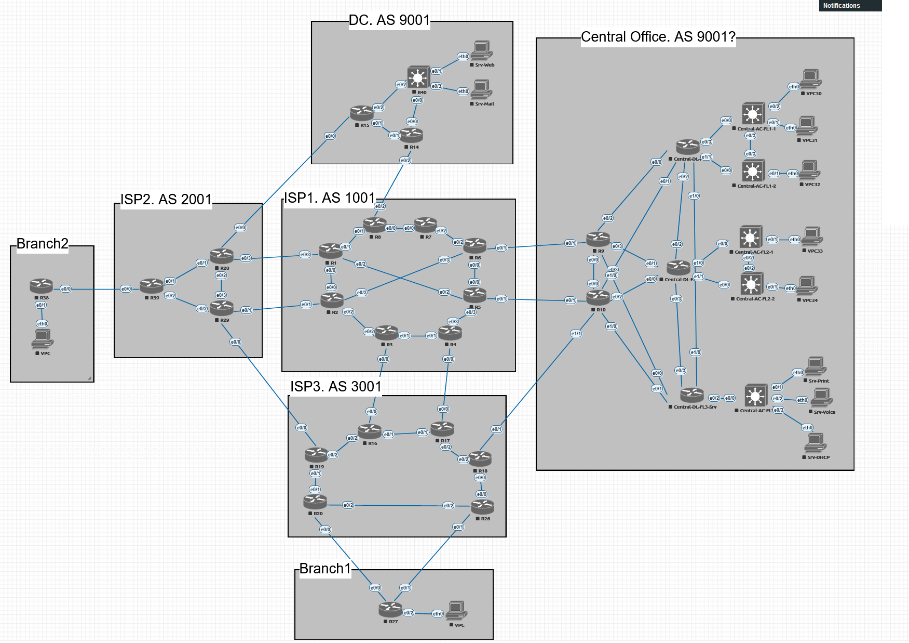
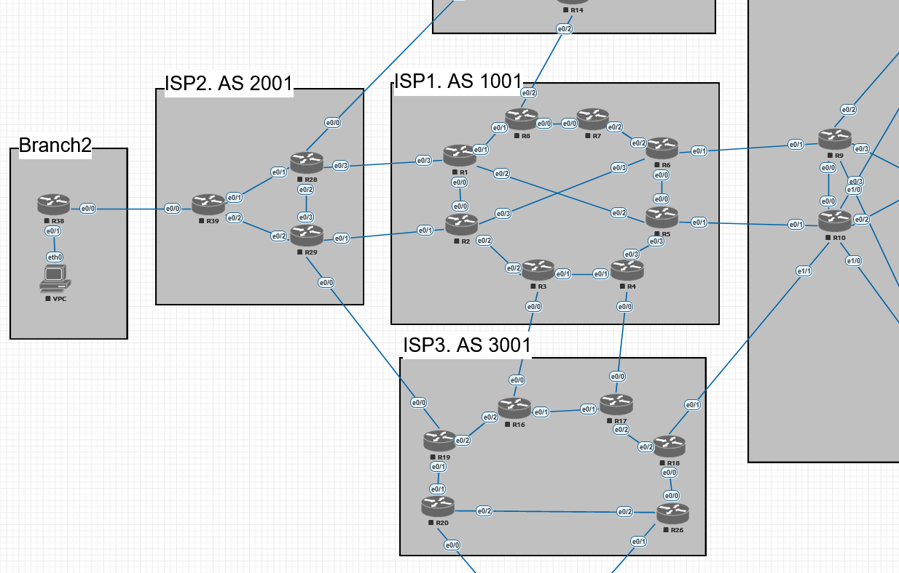
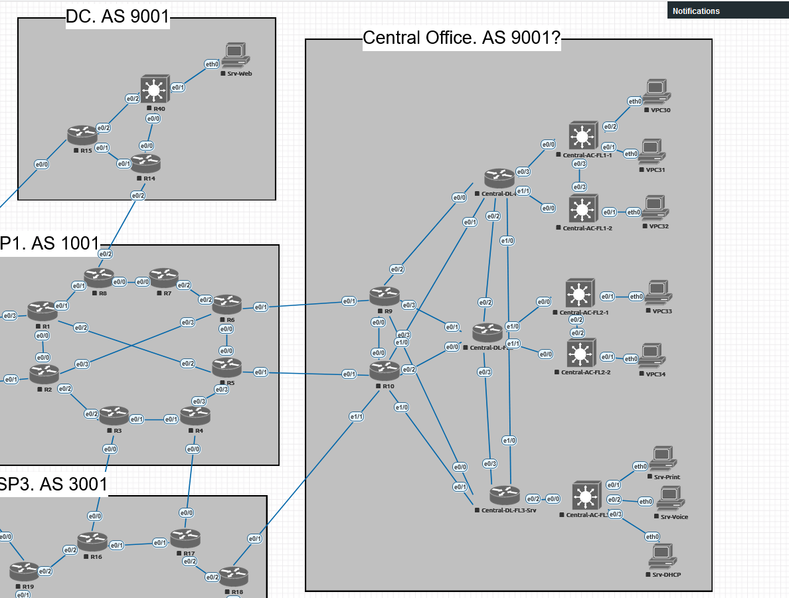

# Проектная работа

# Структура сети

## Общая схема:

   Мы имеем 3 провайдера, основной офис, дата-центр и два небольших удаленных офиса. Общая схема следующая:

   Можем ли мы разделить автономную систему 9001 на 2 географические области?

   Далее подробнее распишем каждый структурный участок.

## Сеть из 3 провайдеров.

1. Каждый провайдер имеет свою автономную систему.

2. Внутри автономных систем находятся маршутизаторы, которые обеспечивают отказоустойчивость.

3. Для внутренней связи используется протокол динамической маршрутизации IS-IS.

## Сеть центрального офиса компании GrowWide.

1. Компания владеет своей автономной системой.

2. Ядро сети подключено к провайдерам. Реализована отказоустойчивость.

3. К ядру сети подключены маршутизаторы распределения.

4. К маршрутизаторам распределения подключены L3-коммутаторы доступа.

5. В рамках сети действует протокол OSPF.

6. Site-to-site VPN.

7. VPN-шлюз Remote-Access VPN.

## Сеть в дата-центре

1. Подключение через двух провайдеров.

2. DMZ-сеть для серверов.

3. Site-to-Site VPN.

## Сеть необольшого регионального офиса без автономной системы.

1. Выход через два линка. 
2. Site-to-Site VPN.

## Сеть еще одного небольшого офиса с уже использующейся в остальной сети адресацией.

1. Реализация случая, когда нужно объединить в подсети с одинаковой адресацией.

2. Лучший вариант - адресацию поменять, но для работы реализуем такой экстренный сценарий.

3. Site-to-Site VPN. 

## DHCP

1. Вариант 1. Сделать централизованный DHCP-сервер.
   
   1. При потере связи с центральным офисом клиенты в регионах не получат адресов.
   
   2. Если в регионах использовать резервные DHCP на период недоступности центрального офиса - возможны конфликты адресов. Часть адресов будет получена из центра, часть от сервера.
   
   3. Выход - выдавать из разных диапазонов. Например диапазоны 1-126/24; 129-254/24.
   
   4. В этом случае в регионах по умолчанию DHCP отключен. Отслеживается основной DHCP и при его недоступности включается резервный.
   
   5. Вариант для курсовой интересный.

2. Альтернативынй вариант 2. В каждом офисе свой DHCP-сервер.
   
   1. Нет зависимости от внешних каналов.
   
   2. Нет центральной точки со всей информацией.
   
   3. Но можно реализовать сбор через центральный SYSLOG-сервер.

# Этапы достижения результата

1. Формирование схемы всей сети.

2. Адресация устройств, сегментов.

3. Назначение сетевым устройставам адресов управления.

4. Настройка устройств провайдеров.

5. Настройка устройств центрального офиса.

6. Настройка устройств дата-центра.

7. Разрешение для управления только через определенные интерфейсы и с определенных устройств.

# Реализация

## Планирование адресного пространства

Начнем формировать адресацию. Точкой отсчета возмем центральный офис.

- В работе максимально отойдем от использования L2.

- К каждому коммутатору доступа будет подключена своя сеть.

- Если к двум коммутаторам подключены сотрудники одного отдела или логической группы, то адреса подключенных устройств будут в разных сетях. Будем называть отделом логическую группу. Это может быть как отдел, так и например VLAN голосовой.

- Для того, чтобы в дальнейшей настройке (например, ACL) представлять один отдел не набором подсетей, а одной, нужно заранее выполнить планирование таким образом, чтобы подсети одного отдела суммаризировались в одну.

- Исходные данные:
  
  - В одной подсети, подключенной к коммуататору доступа, будет не более 62 устройств. Отсюда получаем маску 26. Назовем для примера сеть HR-Base, 10.0.0.0-10.0.0.64.
  
  - Коммутаторов доступа в центрально офисе может быть 128 единиц. На каждом может быть подсеть HR-Base. Чтобы суммаризировать эти сети, маску 26 нужно сдвинуть на 7 единиц. Получаем маску 19.  Назовем сеть для примера HR-Summary, 10.0.0.0-10.0.31.255. Проверим:
    
    - 10.0.0.0-10.0.0.63 - HR-Base Коммутатора 1
    
    - 10.0.0.64-10.0.0.127 - HR-Base Коммутатора 2
    
    - 10.0.0.128-10.0.0.191 - HR-Base Коммутатора 3
    
    - 10.0.0.192-10.0.0.255 - HR-Base Коммутатора 4
    
    - 10.0.1.0-10.0.1.63 - HR-Base Коммутатора 5
    
    - 10.0.1.64-10.0.1.127 - HR-Base Коммутатора 6
    
    - 10.0.1.128-10.0.1.191 - HR-Base Коммутатора 7
    
    - 10.0.1.192-10.0.1.255 - HR-Base Коммутатора 8
    
    - ...
    
    - 10.0.31.0-10.0.31.63 - HR-Base Коммутатора 125
    
    - 10.0.31.64-10.0.31.127 - HR-Base Коммутатора 126
    
    - 10.0.31.128-10.0.31.191 - HR-Base Коммутатора 127
    
    - 10.0.31.192-10.0.31.255 - HR-Base Коммутатора 128
  
  Адреса не пересекаются между собой, распределяются между 128 коммутаторами, размещаются в пределах сети с маской 19.
  
  - Summary-сеть требуется для каждого отдела. Будем считать, что в центральном офисе будет 32 отдела. Заложим, что для каждого отдела требуется голосовой VLAN. Тогда их количество удваивается и составляет 64. Для суммаризации всех адресов всех отделов в одну сеть следует маску 19 бит сместить еще на 6 позиций. Получим маску 13. Суммаризованная сеть для всех отделов - 10.0.0.0/13. Адресация 10.0.0.0-10.7.255.255.
  
  - Еще раз проверим:
    
    - Суммарную сеть 10.0.0.0.-10.7.255.255/13 делим на подсети с маской 19. Это 64 подсети, каждая из которой назначается отделу.
      
      - 10.0.0.0-10.0.31.255 - Отдел 1
      
      - 10.0.32.0-10.0.63.255 - Отдел 2
      
      - 10.0.64.0.0-10.0.95.255 - Отдел 3
      
      - 10.0.96.0.0-10.0.127.255 - Отдел 4
      
      - 10.0.128.0.0-10.0.159.255 - Отдел 5
      
      - 10.0.160.0.0-10.0.191.255 - Отдел 6
      
      - 10.0.192.0.0-10.0.223.255 - Отдел 7
      
      - 10.0.224.0.0-10.0.255.255 - Отдел 8
      
      - ...
      
      - 10.7.0.0-10.7.31.255 - Отдел 57
      
      - 10.7.32.0-10.7.63.255 - Отдел 58
      
      - 10.7.64.0.0-10.7.95.255 - Отдел 59
      
      - 10.7.96.0.0-10.7.127.255 - Отдел 60
      
      - 10.7.128.0.0-10.7.159.255 - Отдел 61
      
      - 10.7.160.0.0-10.7.191.255 - Отдел 62
      
      - 10.7.192.0.0-10.7.223.255 - Отдел 63
      
      - 10.7.224.0.0-10.7.255.255 - Отдел 64

    - Каждый отдел мы делим на 128 подсетей по количеству возможных коммутаторов доступа. Пример для Отдела 1 - 10.0.0.0-10.0.31.255.
    
      - 10.0.0.0-10.0.0.63 - Коммутатор 1
    
      - 10.0.0.64-10.0.0.127 - Коммутатор 2
    
      - 10.0.0.128-10.0.0.191 - Коммутатор 3
    
      - 10.0.0.192-10.0.0.255 - Коммутатор 4
    
      - 10.0.1.0-10.0.1.63 - Коммутатор 5
    
      - 10.0.1.64-10.0.1.127 - Коммутатор 6
    
      - 10.0.1.128-10.0.1.191 - Коммутатор 7
    
      - 10.0.1.192-10.0.0.255 - Коммутатор 8
    
      - ...
    
      - 10.0.31.0-10.0.31.63 - Коммутатор 125
    
      - 10.0.31.64-10.0.31.127 - Коммутатор 126
    
      - 10.0.31.128-10.0.31.191 - Коммутатор 127
    
      - 10.0.31.192-10.0.31.255 - Коммутатор 128

- Итак, мы получили результат - для центрального офиса выбрана подсеть 10.0.0.0/13. Внутри подсети можем иметь 64 отдела (32 отдела + 32 голосовые сети), распределенных по 128 коммутаторам.

- Поскольку у нас есть еще, куда расширять маску, сдвинем ее для запаса с 13 бит до 12 бит. И переместим сеть офиса из начала дапазона в конец. Получим финальный результат 10.240.0.0/12. Диапазон адресов - 10.240.0.0-10.255.255.255.

- Далее планируем, что DHCP-сервер будет реализован на базе маршрутизаторов распределения - основного и резервного. В функционале Cisco нет резервирования DHCP. Поэтому в качестве решения такой ситуации предпримем следующее:
  
  - Каждая минимальная сеть из 64 адресов, закрепленная за отделом на коммутаторе доступа, увеличивается вдвое, до адресации в 128 адресов. Эта общая сеть прописывается в VLAN на коммутаторе доступа.
  - Клиент отправляет DHCP-запрос, коммутатор пересылает его на серверы.
  - Если запрос DHCP приходит на 1й сервер, то выдаются адреса из первого диапазона 2-63.
  - Если запрос DHCP приходит на 2й сервер, то выдаются адреса из второго диапазона 66-127.
  - В обоих случаях шлюзом по умолчанию назначается адрес 1. И маска сети 25.
  - Таким образом клиент получит адрес или из первой половины адресного пространства, которое назначено за его отделом на данном комутаторе, либо адрес из второй половины. Маска сети и шлюз будут одинаковыми.

----

При выбранной выше адресации у нас будет возможность добавить новые отделы и подключить их к имеющимся 128 коммутаторам. Однако каждый коммутатор доступа будет анонсировать 64 сети, без возможности суммаризации. Общее количество маршрутов в сети центрального офиса составит 64*128=8192. Для IGP большое количество? Можно запустить iBGP? Но такое количество маршрутов будет сложно траблшутить.

Проверим другой вариант - сеть офиса разбивается на 128 сегментов по максимально возможному числу коммутаторов доступа. И каждый сегмент разбивается на 64 подсети по числу отделов. В этом случае коммутатор доступа может суммаризировать маршрут. Но в этом случае, если мы имеем один отдел, подключенный к разным коммутаторам, такой отдел нельзя суммаризировать. Это проблемой не должно являться, т.к. при составлении ACL (цель, ради которой отдел стоит суммариризовать) wildcard-маска позволит описать все хосты этого отдела.

В этом случае будет ограничение - мы не сможем добавить новые отделы, т.к. в адресации коммутаторов не заложено дополнительного пространства для новых подсетей.

Поэтому заложим изначально, что у нас максимальное число коммутаторов доступа - 128, максимальное число отделов - 128. Тогда получим следующую адресацию:

|                |           |                             |       |
| -------------- | --------- | --------------------------- | ----- |
|                |           | Адрес                       | Маска |
| Коммутатор 1   |           | 10.0.0.0-10.0.63.255        | 18    |
|                | Отдел 1   | 10.0.0.0-10.0.0.127         | 25    |
|                | Отдел 2   | 10.0.0.128-10.0.0.255       | 25    |
|                | Отдел 3   | 10.0.1.0-10.0.1.127         | 25    |
|                | Отдел 4   | 10.0.1.128-10.0.1.255       | 25    |
|                | ...       |                             | 25    |
|                | Отдел 125 | 10.0.62.0-10.0.62.127       | 25    |
|                | Отдел 126 | 10.0.62.128-10.0.62.255     | 25    |
|                | Отдел 127 | 10.0.63.0-10.0.63.127       | 25    |
|                | Отдел 128 | 10.0.63.128-10.0.63.255     | 25    |
| Коммутатор 2   |           | 10.0.64.0-10.0.127.255      | 18    |
|                | Отдел 1   | 10.0.64.0-10.0.64.127       | 25    |
|                | Отдел 2   | 10.0.64.128-10.0.64.255     | 25    |
|                | Отдел 3   | 10.0.65.0-10.0.65.127       | 25    |
|                | Отдел 4   | 10.0.65.128-10.0.65.255     | 25    |
|                | ...       |                             | 25    |
|                | Отдел 125 | 10.0.126.0-10.0.126.127     | 25    |
|                | Отдел 126 | 10.0.126.128-10.0.126.255   | 25    |
|                | Отдел 127 | 10.0.127.0-10.0.127.127     | 25    |
|                | Отдел 128 | 10.0.127.128-10.0.127.255   | 25    |
| ...            | …         | …                           | …     |
| Коммутатор 128 |           | 10.31.192.0-10.31.255.255   | 18    |
|                | Отдел 1   | 10.31.192.0-10.31.192.127   | 25    |
|                | Отдел 2   | 10.31.192.128-10.31.192.255 | 25    |
|                | Отдел 3   | 10.31.193.0-10.31.193.127   | 25    |
|                | Отдел 4   | 10.31.193.128-10.31.193.255 | 25    |
|                | ...       |                             | 25    |
|                | Отдел 125 | 10.31.254.0-10.31.254.127   | 25    |
|                | Отдел 126 | 10.31.254.128-10.31.254.255 | 25    |
|                | Отдел 127 | 10.31.255.0-10.31.255.127   | 25    |
|                | Отдел 128 | 10.31.255.128-10.31.255.255 | 25    |

Посмотрим, как будет выглядеть адресация для разных отделов:

|                |                             |                               |                                                        |
| -------------- | --------------------------- | ----------------------------- | ------------------------------------------------------ |
| Отдел 3:       | Адреса                      | Net                           | Binary                                                 |
| Коммутатор 1   | 10.0.1.0-10.0.1.127         | 10.0.1.0 255.255.255.128      | 0001010.00000000.00\|000001.0\|0000000 255.255.255.128 |
| Коммутатор 2   | 10.0.65.0-10.0.65.127       | 10.0.65.0 255.255.255.128     | 0001010.00000000.01\|000001.0\|0000000 255.255.255.128 |
| Коммутатор 128 | 10.31.193.0-10.31.193.127   | 10.31.193.0 255.255.255.128   | 0001010.00011111.11\|000001.0\|0000000 255.255.255.128 |
|                |                             |                               |                                                        |
|                |                             |                               |                                                        |
| Отдел 126:     | Адреса                      | Net                           | Binary                                                 |
| Коммутатор 1   | 10.0.62.128-10.0.62.255     | 10.0.62.128 255.255.255.128   | 0001010.00000000.00\|111110.1\|0000000 255.255.255.128 |
| Коммутатор 2   | 10.0.126.128-10.0.126.255   | 10.0.126.128 255.255.255.128  | 0001010.00000000.01\|111110.1\|0000000 255.255.255.128 |
| Коммутатор 128 | 10.31.254.128-10.31.254.255 | 10.31.254.128 255.255.255.128 | 0001010.00011111.11\|111110.1\|0000000 255.255.255.128 |

|                |                             |                               |                                                                                             |                                                                                             |
| -------------- | --------------------------- | ----------------------------- | ------------------------------------------------------------------------------------------- | ------------------------------------------------------------------------------------------- |
| Отдел 3:       | Адреса                      | Net                           | Binary mask                                                                                 | Wildcard                                                                                    |
| Коммутатор 1   | 10.0.1.0-10.0.1.127         | 10.0.1.0 255.255.255.128      | 00001010.000\|00000.00\|000001.0\|0000000   11111111.111\|11111.11\|111111.1\|0000000 | 00001010.000\|00000.00\|000001.0\|0000000   00000000.000\|11111.11\|000000.0\|1111111 |
| Коммутатор 2   | 10.0.65.0-10.0.65.127       | 10.0.65.0 255.255.255.128     | 00001010.000\|00000.01\|000001.0\|0000000   11111111.111\|11111.11\|111111.1\|0000000 | 00001010.000\|00000.01\|000001.0\|0000000   00000000.000\|11111.11\|000000.0\|1111111 |
| Коммутатор 128 | 10.31.193.0-10.31.193.127   | 10.31.193.0 255.255.255.128   | 00001010.000\|11111.11\|000001.0\|0000000   11111111.111\|11111.11\|111111.1\|0000000 | 00001010.000\|11111.11\|000001.0\|0000000   00000000.000\|11111.11\|000000.0\|1111111 |
| Общий ACL      |                             |                               |                                                                                             | 10.0.2.0 0.31.192.127                                                                       |
|                |                             |                               |                                                                                             |                                                                                             |
| Отдел 126:     | Адреса                      | Net                           | Binary                                                                                      |                                                                                             |
| Коммутатор 1   | 10.0.62.128-10.0.62.255     | 10.0.62.128 255.255.255.128   | 00001010.000\|00000.00\|111110.1\|0000000   11111111.111\|11111.11\|111111.1\|0000000 | 00001010.000\|00000.00\|111110.1\|0000000   00000000.000\|11111.11\|000000.0\|1111111 |
| Коммутатор 2   | 10.0.126.128-10.0.126.255   | 10.0.126.128 255.255.255.128  | 00001010.000\|00000.01\|111110.1\|0000000   11111111.111\|11111.11\|111111.1\|0000000 | 00001010.000\|00000.01\|111110.1\|0000000   00000000.000\|11111.11\|000000.0\|1111111 |
| Коммутатор 128 | 10.31.254.128-10.31.254.255 | 10.31.254.128 255.255.255.128 | 00001010.000\|11111.11\|111110.1\|0000000   11111111.111\|11111.11\|111111.1\|0000000 | 00001010.000\|11111.11\|111110.1\|0000000   00000000.000\|11111.11\|000000.0\|1111111 |
|                |                             |                               |                                                                                             | 10.0.62.128 0.31.192.127                                                                    |
