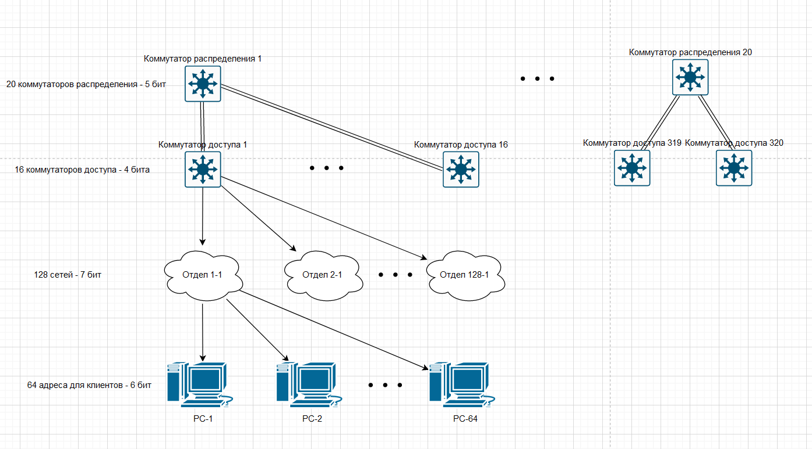
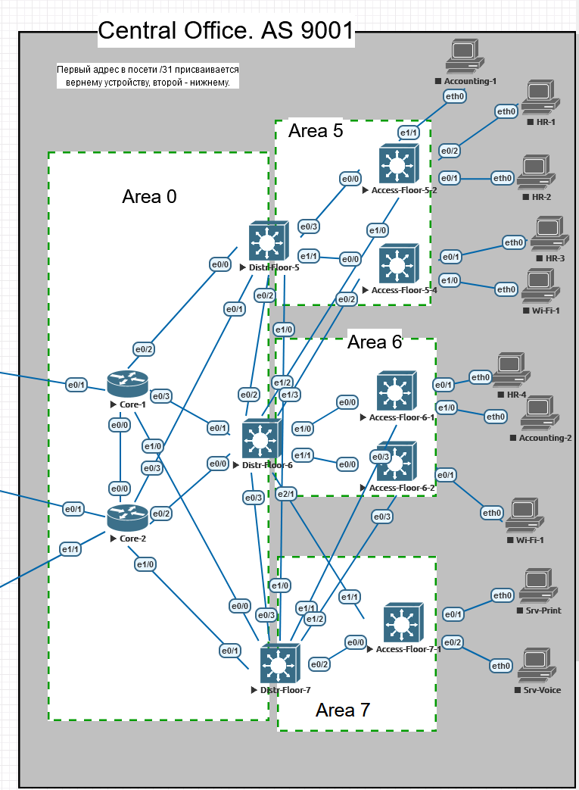

# Проектная работа

Целью проектной работы является создание сетевой инфраструктуры, состоящей из провайдерской сети и сетей удаленных офисов.

# Содержание

1. [Общая схема сети.](#net_whole)
   
   1. [Сеть из трех провайдеров.](#net_providers)
   2. [Сеть центрального офиса компании GrowWide.](#net_hq)
   3. [Сеть в дата-центре.](#net_dc)
   4. [Сеть необольшого регионального офиса без автономной системы.](#net_branch)
   5. [Сеть офиса контрагента с уже использующейся в остальной сети адресацией.](#net_partner)

2. [Реализация.](#realization)
   
   1. [Базовая настройка сети центрального офиса](#realization_base)
      1. [Планирование адресного пространства центрального офиса.](#realization_address_planning)
         1. [Исходные данные.](#realization_input)
         2. [Требования к масштабируемости.](#realization_scale_req)
         3. [Расчет подсетей.](#realization_net_calc)
         4. [Таблица адресов клиентских подсетей.](#realization_add_tables)
         5. [Результирующие правила адресации клиентских подсетей.](#realization_addr_result_client)
         6. [Результирующие правила адресации линков коммутатор распределения-коммутатор доступа.](#realization_addr_result_distr_access_link)
         7. [Результирующие правила адресации линков маршрутизатор ядра-коммутатор распределения.](#realization_addr_result_distr_access_link)
         8. [Таблица с адресами сетей устройств, расположенных в лабораторной работе.](#realization_addr_result_summary)
         9. [Таблица с адресами сетей для организации линков в каждой зоне OSPF.](#realization_addr_result_links)
      2. [Базовая настройка сетевых устройств.](#realization_base_config)
      3. [Настройка динамической маршрутизации.](#)
      4. [Настройка DHCP.](#)
   2. [Настройка провайдерской сети.](#)
      1. [Планирование адресного пространства.](#)
      2. [Базовая настройка маршрутизаторов.](#)
      3. [Настройка IGP.](#)
      4. [Настройка BGP.](#)
   3. [Базовая настройка сети в дата-центре.](#)
      1. [Планирование адресного пространства.](#)
      2. [Базовая настройка устройств.](#)
   4. [Настройка BGP в центральном офисе и дата-центре.](#)

# <a name="net_whole"></a>Общая схема сети

   Мы имеем 3 провайдера, основной офис, дата-центр и два небольших удаленных офиса. Общая схема следующая:


   Можем ли мы разделить автономную систему 9001 на 2 географические области?

   Далее подробнее распишем каждый структурный участок.

## <a name="net_prividers"></a>Сеть из 3 провайдеров


1. Каждый провайдер имеет свою автономную систему.

2. Внутри автономных систем находятся маршутизаторы, которые обеспечивают отказоустойчивость.

3. Для внутренней связи используется протокол динамической маршрутизации IS-IS.

## <a name="net_hq"></a>Сеть центрального офиса компании GrowWide


1. Компания владеет своей автономной системой.

2. Ядро сети подключено к провайдерам. Реализована отказоустойчивость.

3. К ядру сети подключены маршутизаторы распределения.

4. К маршрутизаторам распределения подключены L3-коммутаторы доступа.

5. В рамках сети действует протокол OSPF.

6. Site-to-site VPN.

7. VPN-шлюз Remote-Access VPN.

## <a name="net_dc"></a>Сеть в дата-центре


1. Подключение через двух провайдеров.

2. DMZ-сеть для серверов.

3. Site-to-Site VPN.

## <a name="net_branch"></a>Сеть необольшого регионального офиса без автономной системы


1. Выход через два линка. 
2. Site-to-Site VPN.

## <a name="net_partner"></a>Сеть офиса контрагента с уже использующейся в остальной сети адресацией


1. Реализация случая, когда нужно объединить в подсети с одинаковой адресацией.

2. Лучший вариант - адресацию поменять, но для работы реализуем такой экстренный сценарий.

3. Site-to-Site VPN. 

# <a name="realization"></a>Реализация

## <a name="realization_base"></a>Базовая настройка сети центрального офиса

### <a name="realization_address_planning"></a>Планирование адресного пространства центрального офиса

#### <a name="realization_input"></a>Исходные данные


- В работе максимально отойдем от использования L2.

- К каждому коммутатору доступа будет подключаться несколько сетей (отделов).

- На коммутаторе эти сети должны суммаризовываться, т.о. количество маршрутов в сети значительно снизится.

- Центральный офис занимает 10 этажей.

- На каждом этаже 100 рабочих мест.
  
  - Для подключения рабочих мест на этаже установлено 5 коммутаторов доступа (24 порта) и 1 коммутатор распределения.
  
  - Коммутаторы доступа подключены к коммутатору распределения на этаже и к коммутатору распределения на соседнем этаже.
  
  - Количество отделов 64. Под отделом понимаем более широкую сущность - не только отдел в кадровом понимании, но и в функциональном, например, сеть Wi-Wi, голосовой VLAN. Использовать термин подсеть было бы неправильно, т.к. один отдел будет использовать несколько подсетей, несуммаризируемых в одну.

- Для выдачи адресов используется DHCP на 2 маршрутизаторах доступа. Они должны резервировать друг друга.

- Для динамической маршрутизации будем использовать OSPF.

#### <a name="realization_scale_req"></a>Требования к масштабируемости.

1. Количество этажей может увеличиться в 2 раза.
2. Количество коммутаторов доступа на каждом этаже может увеличиться в 2 раза.
3. Количество отделов может увеличиться в 2 раза.

#### <a name="realization_net_calc"></a>Расчет подсетей

- Основное условие - суммаризация маршрутов. В качестве IGP выбран OSPF как распространненый. Это Link-state протокол, суммаризация возможна только на ABR.

- Пограничным маршрутизатором можно сделать каждый коммутатор доступа. Но в этом случае в зоне 0 у нас будут все сетевые устройства, что не является хорошим планированием.

- Поэтому ABR будут служить коммутаторы распределения. Следовательно для правильной суммаризации за каждым коммутатором распределенияя должна быть своя подсеть.

- На схеме ниже приведена разбивка всей сети центрального офиса на подсети за коммутаторами распределения, за коммутаторами доступа, на подсети отделов (подключаются к коммутаторам доступа) и хосты одного из отделов. Пока что нас интересует именно суммаризация и разбиение клиентской сети. Избыточные линки между коммутаторами не показаны, чтобы не загромождать схему. Подробное описание приведено следом за схемой. 



- Коммутаторов распределения может быть 20 единииц - по одному на этаж. Для идентификации подсети за коммутатором потребуется 5 бит.

- С учетом масштабирования на одном этаже может быть 10 коммутаторов доступа. "Округлим" 12 до 16. Полученное число умножим на 20 этажей и получим 320 коммутаторов доступа. Это число высоко, но взято с запасом, с учетом увеличения количества устройств в 4 раза. Сценарий маловероятный, но на всякий случай такой запас заложен, чтобы исходя из предположения роста заранее заложить соответсвующее деление на сети. Таким образом на этаже может быть 16 коммутаторов доступа, для идентификации подсети за каждым из них нужно 4 бита.

- Спускаемся далее и рассмотрим, сколько клиентских сетей может "скрываться" за одним коммутатором распределения.

- Поскольку к коммутатору может быть подключен любой отдел, то количество подключаемых сетей определяется количеством отделов. С учетом масштабирования у нас заложено 128 отделов. Т.о. чтобы идентифицировать каждую минимальную сеть за коммутатором, нам нужно 7 бит.

- Осталось определить количество хостов в минимальной сети. Поскольку у нас коммутаторы доступа имеют 24 порта, то максимум подключаемых к нему хостов условно 20. Увеличим это число в 2 раза, чтобы реализовать DHCP-отказоустойчивость на двух DHCP-серверах. Таким образом, число адресов в одной подсети составляет 64. Для идентификации хоста нужно 6 бит.

Переходим к формированию результата. 6 бит на хост + 7 бит на сеть отдела за одним коммутатором + 4 бита на идентификацию сети за коммутатора доступа + 5 бит на идентификацию сети за коммутатором распределения. Получаем 22 бита. Сеть с маской 32-22=10 бит полностью опишет клиентские подключения. Поскольку весь диапазон адресов использоваться клиентами не будет (не будет достигнуто предельное количество), мы сможем из данной сети с маской 10 выделить адреса для линков между сетевыми устройствами.

#### <a name="realization_add_tables"></a>Таблица адресов клиентских подсетей

Исходя из маски 10 бит выберем сеть 10.192.0.0/10. Она находится не в начале дипазона (будем надеяться, что при подключении "чужих" сетей это снизит вероятность совпадения адресов).

Приступаем к определению подсетей за коммутаторами распределения. Под них выделены сети с маской 15, начиная с 10.192.0.0/17. Диапазон 10.192.0.0-10.255.255.255.

|                        |                           |
| ---------------------- | ------------------------- |
| Distribution switch 1  | 10.192.0.0-10.193.255.255 |
| Distribution switch 2  | 10.194.0.0-10.195.255.255 |
| Distribution switch 3  | 10.196.0.0-10.197.255.255 |
| Distribution switch 4  | 10.198.0.0-10.199.255.255 |
| Distribution switch 5  | 10.200.0.0-10.201.255.255 |
| Distribution switch 6  | 10.202.0.0-10.203.255.255 |
| Distribution switch 7  | 10.204.0.0-10.205.255.255 |
| Distribution switch 8  | 10.206.0.0-10.207.255.255 |
| Distribution switch 9  | 10.208.0.0-10.209.255.255 |
| Distribution switch 10 | 10.210.0.0-10.211.255.255 |
| Distribution switch 11 | 10.212.0.0-10.213.255.255 |
| Distribution switch 12 | 10.214.0.0-10.215.255.255 |
| Distribution switch 13 | 10.216.0.0-10.217.255.255 |
| Distribution switch 14 | 10.218.0.0-10.219.255.255 |
| Distribution switch 15 | 10.220.0.0-10.221.255.255 |
| Distribution switch 16 | 10.222.0.0-10.223.255.255 |
| Distribution switch 17 | 10.224.0.0-10.225.255.255 |
| Distribution switch 18 | 10.226.0.0-10.227.255.255 |
| Distribution switch 19 | 10.228.0.0-10.229.255.255 |
| Distribution switch 20 | 10.230.0.0-10.231.255.255 |
| Distribution switch 21 | 10.232.0.0-10.233.255.255 |
| Distribution switch 22 | 10.234.0.0-10.235.255.255 |
| Distribution switch 23 | 10.236.0.0-10.237.255.255 |
| Distribution switch 24 | 10.238.0.0-10.239.255.255 |
| Distribution switch 25 | 10.240.0.0-10.241.255.255 |
| Distribution switch 26 | 10.242.0.0-10.243.255.255 |
| Distribution switch 27 | 10.244.0.0-10.245.255.255 |
| Distribution switch 28 | 10.246.0.0-10.247.255.255 |
| Distribution switch 29 | 10.248.0.0-10.249.255.255 |
| Distribution switch 30 | 10.250.0.0-10.251.255.255 |
| Distribution switch 31 | 10.252.0.0-10.253.255.255 |
| Distribution switch 32 | 10.254.0.0-10.255.255.255 |

При расчете адресного пространства мы заложили 20 коммутаторов, поэтому все прочее адресное пространство, начиная с 21 коммутатора, свободно.

---

Рассмотрим адресацию коммутаторов доступа. Маска 19. Для примера, возмем коммутаторы доступа, подключенные к коммутатору распределения 1.

|                  |                             |
| ---------------- | --------------------------- |
| Access Switch 1  | 10.192.0.0-10.192.31.255    |
| Access Switch 2  | 10.192.32.0-10.192.63.255   |
| Access Switch 3  | 10.192.64.0-10.192.95.255   |
| Access Switch 4  | 10.192.96.0-10.192.127.255  |
| Access Switch 5  | 10.192.128.0-10.192.159.255 |
| Access Switch 6  | 10.192.160.0-10.192.191.255 |
| Access Switch 7  | 10.192.192.0-10.192.223.255 |
| Access Switch 8  | 10.192.224.0-10.192.255.255 |
| Access Switch 9  | 10.193.0.0-10.193.31.255    |
| Access Switch 10 | 10.193.32.0-10.193.63.255   |
| Access Switch 11 | 10.193.64.0-10.193.95.255   |
| Access Switch 12 | 10.193.96.0-10.193.127.255  |
| Access Switch 13 | 10.193.128.0-10.193.159.255 |
| Access Switch 14 | 10.193.160.0-10.193.191.255 |
| Access Switch 15 | 10.193.192.0-10.193.223.255 |
| Access Switch 16 | 10.193.224.0-10.193.255.255 |

---

В пределах сети коммутатора доступа 1 у нас должно быть 128 подсетей с маской 26.
Получим следующую адресацию для сетей за коммутатором 1:

|           |                             |
| --------- | --------------------------- |
| Отдел 1   | 10.192.0.0-10.192.0.63      |
| Отдел 2   | 10.192.0.64-10.192.0.127    |
| Отдел 3   | 10.192.0.128-10.192.0.191   |
| Отдел 4   | 10.192.0.192-10.192.0.255   |
| Отдел 5   | 10.192.1.0-10.192.1.63      |
| Отдел 6   | 10.192.1.64-10.192.1.127    |
| Отдел 7   | 10.192.1.128-10.192.1.191   |
| Отдел 8   | 10.192.1.192-10.192.1.255   |
| Отдел 9   | 10.192.2.0-10.192.2.63      |
| Отдел 10  | 10.192.2.64-10.192.2.127    |
| Отдел 11  | 10.192.2.128-10.192.2.191   |
| Отдел 12  | 10.192.2.192-10.192.2.255   |
| Отдел 13  | 10.192.3.0-10.192.3.63      |
| Отдел 14  | 10.192.3.64-10.192.3.127    |
| Отдел 15  | 10.192.3.128-10.192.3.191   |
| Отдел 16  | 10.192.3.192-10.192.3.255   |
| Отдел 17  | 10.192.4.0-10.192.4.63      |
| Отдел 18  | 10.192.4.64-10.192.4.127    |
| Отдел 19  | 10.192.4.128-10.192.4.191   |
| Отдел 20  | 10.192.4.192-10.192.4.255   |
| Отдел 21  | 10.192.5.0-10.192.5.63      |
| Отдел 22  | 10.192.5.64-10.192.5.127    |
| Отдел 23  | 10.192.5.128-10.192.5.191   |
| Отдел 24  | 10.192.5.192-10.192.5.255   |
| Отдел 25  | 10.192.6.0-10.192.6.63      |
| Отдел 26  | 10.192.6.64-10.192.6.127    |
| Отдел 27  | 10.192.6.128-10.192.6.191   |
| Отдел 28  | 10.192.6.192-10.192.6.255   |
| …         | …                           |
| Отдел 121 | 10.192.30.0-10.192.30.63    |
| Отдел 122 | 10.192.30.64-10.192.30.127  |
| Отдел 123 | 10.192.30.128-10.192.30.191 |
| Отдел 124 | 10.192.30.192-10.192.30.255 |
| Отдел 125 | 10.192.31.0-10.192.31.63    |
| Отдел 126 | 10.192.31.64-10.192.31.127  |
| Отдел 127 | 10.192.31.128-10.192.31.191 |
| Отдел 128 | 10.192.31.192-10.192.31.255 |

В пределах сети коммутатора доступа 3 у нас должно быть 128 подсетей с маской 26.
Получим следующую адресацию для сетей за коммутатором 1:

|           |                             |
| --------- | --------------------------- |
| Отдел 1   | 10.192.64.0-10.192.64.63    |
| Отдел 2   | 10.192.64.64-10.192.64.127  |
| Отдел 3   | 10.192.64.128-10.192.64.191 |
| Отдел 4   | 10.192.64.192-10.192.64.255 |
| Отдел 5   | 10.192.65.0-10.192.65.63    |
| Отдел 6   | 10.192.65.64-10.192.65.127  |
| Отдел 7   | 10.192.65.128-10.192.65.191 |
| Отдел 8   | 10.192.65.192-10.192.65.255 |
| Отдел 9   | 10.192.66.0-10.192.66.63    |
| Отдел 10  | 10.192.66.64-10.192.66.127  |
| Отдел 11  | 10.192.66.128-10.192.66.191 |
| Отдел 12  | 10.192.66.192-10.192.66.255 |
| Отдел 13  | 10.192.67.0-10.192.67.63    |
| Отдел 14  | 10.192.67.64-10.192.67.127  |
| Отдел 15  | 10.192.67.128-10.192.67.191 |
| Отдел 16  | 10.192.67.192-10.192.67.255 |
| Отдел 17  | 10.192.68.0-10.192.68.63    |
| Отдел 18  | 10.192.68.64-10.192.68.127  |
| Отдел 19  | 10.192.68.128-10.192.68.191 |
| Отдел 20  | 10.192.68.192-10.192.68.255 |
| Отдел 21  | 10.192.69.0-10.192.69.63    |
| Отдел 22  | 10.192.69.64-10.192.69.127  |
| Отдел 23  | 10.192.69.128-10.192.69.191 |
| Отдел 24  | 10.192.69.192-10.192.69.255 |
| Отдел 25  | 10.192.70.0-10.192.70.63    |
| Отдел 26  | 10.192.70.64-10.192.70.127  |
| Отдел 27  | 10.192.70.128-10.192.70.191 |
| Отдел 28  | 10.192.70.192-10.192.70.255 |
| …         | …                           |
| Отдел 121 | 10.192.94.0-10.192.94.63    |
| Отдел 122 | 10.192.94.64-10.192.94.127  |
| Отдел 123 | 10.192.94.128-10.192.94.191 |
| Отдел 124 | 10.192.94.192-10.192.94.255 |
| Отдел 125 | 10.192.95.0-10.192.95.63    |
| Отдел 126 | 10.192.95.64-10.192.95.127  |
| Отдел 127 | 10.192.95.128-10.192.95.191 |
| Отдел 128 | 10.192.95.192-10.192.95.255 |

#### <a name="realization_addr_result_client"></a>Результирующие правила адресации клиентских подсетей

Сеть клиентских устройств за коммутаторами записывается следующим образом:

| Зафиксировано | Коммутатор распределения | Коммутатор доступа | Отдел    | Хост   |
| ------------- | ------------------------ | ------------------ | -------- | ------ |
| 00001010.11   | 00000                    | 0.000              | 00000.00 | 000000 |

Например, если мы захотим узнать суммарную сеть за 8 коммутатором распределения, то мы должны в адресе в поле коммутатора распределения сформировать число 7. Получим:

| Зафиксировано | Коммутатор распределения | Коммутатор доступа | Отдел    | Хост   |
| ------------- | ------------------------ | ------------------ | -------- | ------ |
| 00001010.11   | 00111                    | 0.000              | 00000.00 | 000000 |

Далее, если мы хотим узнать адрес подсети за коммутатором доступа 3, то мы должны в адресе в поле коммутатора доступа сформировать число 2:

| Зафиксировано | Коммутатор распределения | Коммутатор доступа | Отдел    | Хост   |
| ------------- | ------------------------ | ------------------ | -------- | ------ |
| 00001010.11   | 01000                    | 0.010              | 00000.00 | 000000 |

И далее, если мы хотим узнать адрес отдела 124, то мы должны в адресе в поле отдела сформировать число 123:

| Зафиксировано | Коммутатор распределения | Коммутатор доступа | Отдел    | Хост   |
| ------------- | ------------------------ | ------------------ | -------- | ------ |
| 00001010.11   | 00111                    | 0.010              | 11110.11 | 000000 |

В десятичном виде получаем 10.206.94.192. Адрес совпадает с тем, который должен быть - по составленной ранее таблице с коммутаторами распределения видим, что суммарная подсеть за 8 коммутатором распределения 10.206.0.0-10.207.255.255. По таблице с коммутаторами доступа видим, что за 3м коммутатором доступа находится сеть .64.0-.95.255. И по таблице с отделами видим, что 124 отдел .192-.255. Расчеты верны.

#### <a name="realization_addr_result_distr_access_link"></a>Результирующие правила адресации линков коммутатор распределения-коммутатор доступа

Поскольку коммутаторы распределения должны суммировать подсети за ними, то и адресация линков до коммутаторов доступа должна быть внутри сети за коммутатором распределения.

Напомним, что за каждым коммутатором распределения запланировано масштабирование до 10 коммутаторов доступа, а адресация позволяет использовать вплоть до 16 коммутаторов доступа. Поэтому возьмем последнюю сеть, закрепленную за 16 коммутатором доступа (поскольку такого коммутатора никогда не будет установлено) и зарезервируем ее для линков между устройтсвами за коммутатором распределения.

Пример. Нам нужно определить сеть, из которой будем брать линковые адреса для подсетей за коммутатором распределения 6. Исходя из выведенного правила вычисляем подсеть за коммутатором доступа 16:

| Зафиксировано | Коммутатор распределения | Коммутатор доступа | Отдел    | Хост   |
| ------------- | ------------------------ | ------------------ | -------- | ------ |
| 00001010.11   | 00101                    | 1.111              | 00000.00 | 000000 |

Получаем сеть 10.203.224.0/19.
Проверим - за коммутатором распределения 6 находится сеть 10.202.0.0-10.203.255.255. Сеть для коммутатора доступа 16 .224.0-.255.255. Расчет верный.

Из сети 10.203.224.0/19 формируем подсети /31 для организации линков между сетевыми устройствами за коммутатором распределения 6.

#### <a name="realization_addr_result_distr_access_link"></a>Результирующие правила адресации линков маршрутизатор ядра-коммутатор распределения

С учетом масштабирования мы можем иметь 20 коммутаторов распределения. В адресацию мы заложили адреса для 32 коммутаторов распределения. Поэтому 32 коммутатор распределения использоваться не будет. Возьмем его адресное пространство 10.254.0.0-10.255.255.255 для организации линков.

#### <a name="realization_addr_result_summary"></a>Таблица с адресами сетей устройств, расположенных в лабораторной работе



В офисе 10 этажей, на каждом этаже по 5 коммутаторов доступа и одному коммутатору распределения. Их все размещать на схеме не будем. Отобразим лишь этажи 5, 6, 7 с 1-2 коммутаторами.

На 5м этаже расположены коммутаторы 2 и 4.

На 6м этаже расположены коммутаторы 1 и 2.

На 7м этаже расположен коммутатор 1.

Также будем подключать не все рабочие места и отделы. Ограничимся HR, бухгалтерией, Wi-Fi, серверами.

К коммутатору 5-2 подключено:

- 2 компьютера HR в одной подсети.

- Один компьютер бухгалтерии в другой подсети.

К коммутатору 5-4 подключен:

- Один компьютер HR в отдельной подсети.

- Wi-Fi точка. Для простоты на схеме представим ее компьютером, коммутировать Wi-Fi-клиентов он не будет, только получать доступ к сети.

К коммутатору 6-1 подключен:

- Один компьютер HR в отдельной подсети.

- Один компьютер ACC в отдельной подсети.

К коммутатору 6-2 подключен:

- Wi-Fi точка. Для простоты на схеме представим ее компьютером, коммутировать Wi-Fi-клиентов он не будет, только получать доступ к сети.

К коммутатору 7-1 подключены:

- Сервер печати в отдельной подсети.

- Сервер IP-телефонии в отдельной подсети.

Исходя из разработанной ранее методики сформируем адреса сетей, в которых будут устройства.

Для этого воспользуемся составленной ранее таблицей:

| Зафиксировано | Коммутатор распределения | Коммутатор доступа | Отдел    | Хост   |
| ------------- | ------------------------ | ------------------ | -------- | ------ |
| 00001010.11   | 00000                    | 0.000              | 00000.00 | 000000 |

Distr-Floor-5: 00100

Distr-Floor-6: 00101

Distr-Floor-7: 00110

Access-Floor-5-2: 0.001

Access-Floor-5-4: 0.011

Access-Floor-6-1: 0.000

Access-Floor-6-2: 0.001

Access-Floor-7-1: 0.000

Отдел 23:  00101.10

Отдел 36:  01000.11

Отдел 65:  10000.00

Отдел 100: 11000.11

Отдел 101: 11001.00

| Устройство              | Зафиксировано | Коммутатор распределения | Коммутатор доступа | Отдел    | Сеть /26 в десятичном виде |
| ----------------------- | ------------- | ------------------------ | ------------------ | -------- | -------------------------- |
| Accounting-1 (Отдел 36) | 00001010.11   | 00100                    | 0.001              | 01000.11 | 10.200.40.192              |
| HR-1 (Отдел 23)         | 00001010.11   | 00100                    | 0.001              | 00101.10 | 10.200.37.128              |
| HR-2 (Отдел 23)         | 00001010.11   | 00100                    | 0.001              | 00101.10 | 10.200.37.128              |
| HR-3 (Отдел 23)         | 00001010.11   | 00100                    | 0.011              | 00101.10 | 10.200.101.128             |
| Wi-Fi-1 (Отдел 65)      | 00001010.11   | 00100                    | 0.011              | 10000.00 | 10.200.112.0               |
| HR-4 (Отдел 23)         | 00001010.11   | 00101                    | 0.000              | 00101.10 | 10.202.5.128               |
| Accounting-2 (Отдел 36) | 00001010.11   | 00101                    | 0.000              | 01000.11 | 10.202.8.192               |
| Wi-Fi-2 (Отдел 65)      | 00001010.11   | 00101                    | 0.001              | 10000.00 | 10.202.48.0                |
| Srv-Print-1 (Отдел 100) | 00001010.11   | 00110                    | 0.000              | 11000.11 | 10.204.24.192              |
| Srv-Voice-1 (Отдел 101) | 00001010.11   | 00110                    | 0.000              | 11001.00 | 10.204.25.0                |

Договоримся первый доступный адрес сети назначать SVI коммутатора.

#### <a name="realization_addr_result_links"></a>Таблица с адресами сетей устройств, расположенных в лабораторной работе

Для организации линков мы договорились использовать адресное пространство, приходящееся на коммутатор доступа 16.

| Зона | Зафиксировано | Коммутатор распределения | Коммутатор доступа 16 | Сеть /19 в десятичном виде |
| ---- | ------------- | ------------------------ | --------------------- | -------------------------- |
| 5    | 00001010.11   | 00100                    | 1.111                 | 10.201.224.0              |
| 6    | 00001010.11   | 00101                    | 1.111                 | 10.203.224.0                          |
| 7    | 00001010.11   | 00110                    | 1.111                 | 10.205.224.0                         |


Это адресное пространство будет использоваться для назначения адресов интерфейсам коммутаторов доступа в зоне. Поскольку коммутаторы доступа подключены не только к коммутатору распределения на своем этаже, но и к коммутатору распределения на соседнем этаже, то получаем, что адреса пятой зоны будут на интерфейсах коммутатора распределения на 5м этаже и на части интерфейсов коммутатора распределения на этаже 6.


### <a name="realization_base_config"> Базовая настройка сетевых устройств

Включим маршрутизацию, назначим адреса интерфейсам, имена устройствам.

Агрегацию линков делать на стенде не будем - для L3 интерфейсов наблюдаются баги - отключение коммутатора при полученни пакета.

Access-Floor-5-21:

```
en
conf t
hostname Access-Floor-5-21
ip routing
int e0/0
no switchport
ip addr 10.208.0.0 255.255.255.254
int e1/0
no switchport
ip addr 10.208.0.2 255.255.255.254
no shut
end
wr
```

Access-Floor-5-22:

```
en
conf t
hostname Access-Floor-5-22
ip routing
int e0/0
no switchport
ip addr 10.208.0.5 255.255.255.254
no shut
int e0/2
no switchport
ip addr 10.208.0.14 255.255.255.254
no shut
end
wr
```

Access-Floor-6-27:

```
en
conf t
hostname Access-Floor-6-27
ip routing
int e0/0
no switchport
ip addr 10.208.0.22 255.255.255.254
no shut
int e0/3
no switchport
ip addr 10.208.0.32 255.255.255.254
no shut
end
wr
```

Access-Floor-6-28:

```
en
conf t
hostname Access-Floor-6-28
ip routing
int e0/0
no switchport
ip addr 10.208.0.29 255.255.255.254
no shut
int e0/3
no switchport
ip addr 10.208.0.34 255.255.255.254
no shut
end
wr
```

Access-Floor-7-35:

```
en
conf t
hostname Access-Floor-7-35
ip routing
int range e1/0-1
no switchport
channel-group 1 mode active
int po1
ip addr 10.208.0.31 255.255.255.254
int range e0/0, e0/3
no switchport
channel-group 2 mode active
int po2
ip addr 10.208.0.38 255.255.255.254
end
wr
```

Distr-Floor-5:

```
en
conf t
hostname Distr-Floor-5
ip routing
int e0/0
no switchport
ip addr 10.208.0.6 255.255.255.254

int e0/1
no switchport
ip addr 10.208.0.8 255.255.255.254

int e0/2
no switchport
ip addr 10.208.0.10 255.255.255.254

int e1/0
no switchport
ip addr 10.208.0.12 255.255.255.254

int e1/1
no switchport
ip addr 10.208.0.4 255.255.255.254

int e0/3
no switchport
ip addr 10.208.0.1 255.255.255.254


end
wr
```

Distr-Floor-6:

```
en
conf t
hostname Distr-Floor-6
ip routing

int e0/2
no switchport
ip addr 10.208.0.11 255.255.255.254

int e0/1
no switchport
ip addr 10.208.0.21 255.255.255.254

int e0/0
no switchport
ip addr 10.208.0.24 255.255.255.254

int e0/3
no switchport
ip addr 10.208.0.26 255.255.255.254

int e1/1
no switchport
ip addr 10.208.0.28 255.255.255.254

int e1/0
no switchport
ip addr 10.208.0.23 255.255.255.254

int e1/3
no switchport
ip addr 10.208.0.15 255.255.255.254

int e1/2
no switchport
ip addr 10.208.0.3 255.255.255.254


int range e2/0-1
no switchport
channel-group 1 mode active
int po1
ip addr 10.208.0.30 255.255.255.254
end
wr
```

Distr-Floor-7:

```
en
conf t
hostname Distr-Floor-7
ip routing


int e0/1
no switchport
ip addr 10.208.0.37 255.255.255.254

int e0/0
no switchport
ip addr 10.208.0.19 255.255.255.254

int e0/3
no switchport
ip addr 10.208.0.27 255.255.255.254

int e1/1
no switchport
ip addr 10.208.0.33 255.255.255.254

int e1/0
no switchport
ip addr 10.208.0.13 255.255.255.254

int e1/2
no switchport
ip addr 10.208.0.35 255.255.255.254


int range e0/2, e1/3
no switchport
channel-group 2 mode active
int po2
ip addr 10.208.0.39 255.255.255.254
end
wr
```

Core-1:

```
en
conf t
hostname Core-1

int e0/2
ip addr 10.208.0.7 255.255.255.254
no shut

int e0/3
ip addr 10.208.0.20 255.255.255.254
no shut

int e1/0
ip addr 10.208.0.18 255.255.255.254
no shut

int e0/0
ip addr 10.208.0.16 255.255.255.254
no shut


end 
wr
```

Core-2:

```
en
conf t
hostname Core-2

int e0/2
ip addr 10.208.0.25 255.255.255.254
no shut

int e0/3
ip addr 10.208.0.9 255.255.255.254
no shut

int e1/0
ip addr 10.208.0.36 255.255.255.254
no shut

int e0/0
ip addr 10.208.0.17 255.255.255.254
no shut


end 
wr
```

### 

### Выбор протокола динамической маршрутизации.

1. OSPF. Широко распространен. Но он позволяет суммировать маршруты только на ABR. Можно выполнить два варианта деления на зоны.
   
   1. В отдельную зону поместить коммутатор распределения в качестве ABR, а также подключенные к нему коммутаторы доступа на этаже.
      
      
      
      Коммутатор распределения будет формировать агрегированные L3-update. Однако при неоходимости подключения нового коммутатора на этаже может оказаться, что сети за ним не будут попадать в анонсируемую суммарную сеть. А расширить анонс мы не сможем, т.к. он начнет пересекаться с анонсом других ABR.
   
   2. Каждый коммутатор доступа нужно разместить в зоне 0. Поэтому в одной зоне по исходным данным окажется более 50 устройств. С учетом масштабирования в два раза число сетевых устройств дойдет до 100-150, что является не совсем хорошо.  

### Включаем на сетевых устройствах OSPF.

На новых устройствах возможно держать 100-150 единиц в зоне.  По исходной конфигурации (50 коммутаторов доступа) до этого порога запас есть. Но с учетом масштабирования выполним деление на зоны. 

Однако в таком варианте

### Настраиваем зону 0.

Core-1:

```
en
conf t
router ospf 1
router-id 16.16.16.16
passive-interface default
no passive-interface e0/0
no passive-interface e0/2
no passive-interface e0/3
no passive-interface e1/0

int range e0/0,e0/2,e0/3,e1/0
ip ospf 1 area 0

end
wr
```

Core-2:

```
en
conf t
router ospf 1
router-id 17.17.17.17
passive-interface default
no passive-interface e0/0
no passive-interface e0/2
no passive-interface e0/3
no passive-interface e1/0

int range e0/0,e0/2,e0/3,e1/0
ip ospf 1 area 0

end
wr
```

Первые динамические маршруты:


Distr-Floor-5:

```
en
conf t
router ospf 1
router-id 6.6.6.6
passive-interface default
no passive-interface e0/0
no passive-interface e0/1
no passive-interface e0/2
no passive-interface e0/3
no passive-interface e1/0
no passive-interface e1/1

int range e0/0,e0/1,e0/2,e1/0
ip ospf 1 area 0

int range e0/3,e1/1
ip ospf 1 area 0


end
wr
```

Первые маршруты из другой зоны:


Distr-Floor-6:

```
en
conf t
router ospf 1
router-id 24.24.24.24
passive-interface default
no passive-interface e0/0
no passive-interface e0/1
no passive-interface e0/2
no passive-interface e0/3
no passive-interface e1/0
no passive-interface e1/1
no passive-interface e1/2
no passive-interface e1/3
no passive-interface po1


int range e0/0-3
ip ospf 1 area 0

int range e1/3,e1/2
ip ospf 1 area 0

int range e1/0,e1/1
ip ospf 1 area 0

int po1
ip ospf 1 area 0


end
wr
```

Distr-Floor-7:

```
en
conf t
router ospf 1
router-id 27.27.27.27
passive-interface default
no passive-interface e0/0
no passive-interface e0/1
no passive-interface e0/3
no passive-interface e1/0
no passive-interface e1/1
no passive-interface e1/2
no passive-interface po2


int range e0/0, e0/1, e0/3, e1/0
ip ospf 1 area 0


int range e1/2,e1/1
ip ospf 1 area 0

int po2
ip ospf 1 area 0


end
wr
```

Проверим, приходят ли все маршруты на Core:


Маршруты появлялись с задержкой в десяток секунд. Часть так и не появилась. Причина - дубль router-id на одном из маршрутизаторов. После исправления и сброса процесса ospf маршруты пришли все:


### Настройка на коммутаторах доступа SVI и OSPF.

На каждом коммутаторе настроим SVI. Номером SVI будем указывать отдел, который будет подключаться в соответствующий VLAN. Вспоминаем нумерацию отделов:

HR - Отдел 23
Acc - Отдел 36
Wi-Fi - Отдел 65
Srv-Print - Отдел 100
Srv-Voice - Отдел 101

Access-Floor-5-21:

```
en
conf t

vlan 23
name HR
exit
vlan 36
name Acc
exit

int vlan 23
ip addr 10.194.133.129 255.255.255.192
description HR
no shut

int vlan 36
description Acc
ip addr 10.194.136.193 255.255.255.192
no shut

int e1/1
switchport mode access
switchport access vlan 36


int range e0/1-2
switchport mode access
switchport access vlan 23


router ospf 1
router-id 2.2.2.2
passive-interface default
no passive-interface e0/0
no passive-interface e1/0

int range vlan 23, vlan 36
ip ospf 1 area 5

int range e0/0,e1/0
ip ospf 1 area 0

end

wr
```

Появились первые маршруты до конечных устройств:


Недоработка - суммировать маршруты можно только на ABR. Поэтому придется немного изменить схему - расширить зону 0, превратив в ABR маршрутизаторы доступа:


Не забудем сделать суммаризацию на коммутаторе.

Access-Floor-5-21:

```
en
conf t

router ospf 1
area 5 range  10.194.128.0 255.255.224.0
end
wr
```

Получили суммарный маршрут с маской 19:


Продолжаем настраивать коммутаторы доступа.

Access-Floor-5-21:

```
en
conf t

vlan 23
name HR
exit
vlan 36
name Acc
exit

vlan 65
name Wi-fi
exit

vlan 100
name Srv-print
exit

vlan 101
name Srv-voice
exit


int vlan 23
ip addr 10.194.165.129 255.255.255.192
description HR
no shut

int vlan 65
description Wi-Fi
ip addr 10.194.176.1 255.255.255.192
no shut

int e1/1
switchport mode access
switchport access vlan 23
no shut


int e1/0
switchport mode access
switchport access vlan 65
no shut


router ospf 1
router-id 3.3.3.3
passive-interface default
no passive-interface e0/0
no passive-interface e0/2
area 5 range  10.194.160.0 255.255.224.0

int range vlan 23, vlan 36, vlan 65, vlan 100, vlan 101
ip ospf 1 area 5

int range e0/0,e0/2
ip ospf 1 area 0

end
wr
```

Access-Floor-6-27:

```
en
conf t

vlan 23
name HR
exit

vlan 36
name Acc
exit

vlan 65
name Wi-fi
exit

vlan 100
name Srv-print
exit

vlan 101
name Srv-voice
exit


int vlan 23
ip addr 10.195.69.129 255.255.255.192
description HR
no shut

int vlan 36
description Acc
ip addr 10.195.72.193 255.255.255.192
no shut

int e0/1
switchport mode access
switchport access vlan 23
no shut


int e1/0
switchport mode access
switchport access vlan 36
no shut


router ospf 1
router-id 32.32.32.32
passive-interface default
no passive-interface e0/0
no passive-interface e0/3
area 6 range  10.195.64.0 255.255.224.0

int range vlan 23, vlan 36, vlan 65, vlan 100, vlan 101
ip ospf 1 area 6

int range e0/0,e0/3
ip ospf 1 area 0

end
wr
```

Access-Floor-6-28:

```
en
conf t

vlan 23
name HR
exit

vlan 36
name Acc
exit

vlan 65
name Wi-fi
exit

vlan 100
name Srv-print
exit

vlan 101
name Srv-voice
exit


int vlan 65
description Wi-Fi
ip addr 10.195.112.1 255.255.255.192
no shut

int e0/1
switchport mode access
switchport access vlan 65
no shut


router ospf 1
router-id 29.29.29.29
passive-interface default
no passive-interface e0/0
no passive-interface e0/3
area 6 range  10.195.96.0 255.255.224.0

int range vlan 23, vlan 36, vlan 65, vlan 100, vlan 101
ip ospf 1 area 6

int range e0/0,e0/3
ip ospf 1 area 0

end
wr
```

Access-Floor-7-35:

```
en
conf t

vlan 23
name HR
exit

vlan 36
name Acc
exit

vlan 65
name Wi-fi
exit

vlan 100
name Srv-print
exit

vlan 101
name Srv-voice
exit


int vlan 100
description Srv-print
ip addr 10.196.88.193 255.255.255.192
no shut


int vlan 101
description Srv-voice
ip addr 10.196.89.1 255.255.255.192
no shut


int e0/1
switchport mode access
switchport access vlan 100
no shut


int e0/2
switchport mode access
switchport access vlan 101
no shut


router ospf 1
router-id 31.31.31.31
passive-interface default
no passive-interface po1
no passive-interface po2
area 7 range  10.196.64.0 255.255.224.0

int range vlan 23, vlan 36, vlan 65, vlan 100, vlan 101
ip ospf 1 area 7

int range po1,po2
ip ospf 1 area 0

end
wr
```

При прохождении ping от Access-Floor-7-35 через LAG коммутаторы распределения отключаются:


Придется от LAG отказаться:


Distr-Floor-6

```
en
conf t
no interface Port-channel1


interface Ethernet2/0
 switchport
 no shutdown

interface Ethernet2/1
no switchport
ip address 10.208.0.30 255.255.255.254
ip ospf 1 area 0
no shut

router ospf 1
no passive-interface Ethernet2/1

end

wr
```

Distr-Floor-7

```
en
conf t
no interface Port-channel2


interface Ethernet1/3
 switchport
 no shutdown

interface Ethernet0/2
no switchport
ip address 10.208.0.39 255.255.255.254
ip ospf 1 area 0
no shut

router ospf 1
no passive-interface Ethernet0/2

end

wr
```

Access-Floor-7-35

```
en
conf t
no interface Port-channel1
no interface Port-channel2


interface Ethernet1/1
no switchport
ip address 10.208.0.31 255.255.255.254
ip ospf 1 area 0
no shut

interface e0/0
no switchport
ip address 10.208.0.38 255.255.255.254
ip ospf 1 area 0
no shut

interface Ethernet1/0
 switchport
 no shutdown

interface Ethernet0/3
 switchport
 no shutdown


router ospf 1
no passive-interface Ethernet1/1
no passive-interface Ethernet0/0

end

wr
```

Схема скорректирована, связь проходит:


Итог настройки OSPF:


Все маршруты приходят, от коммутаторов доступа приходят суммарные маршруты.
