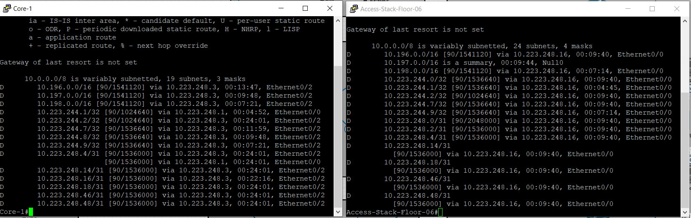
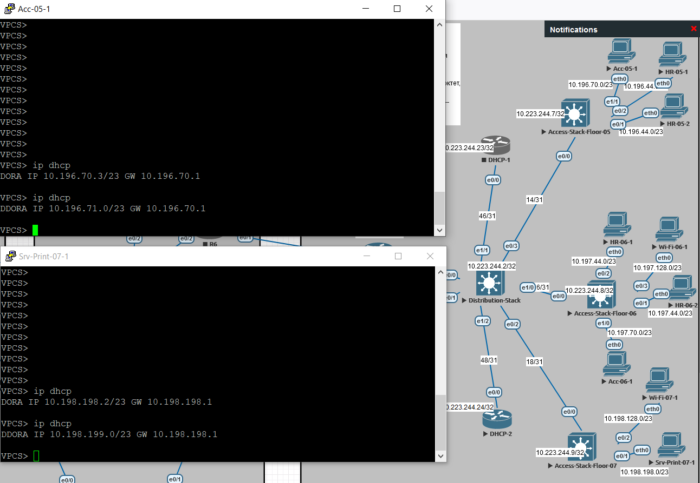
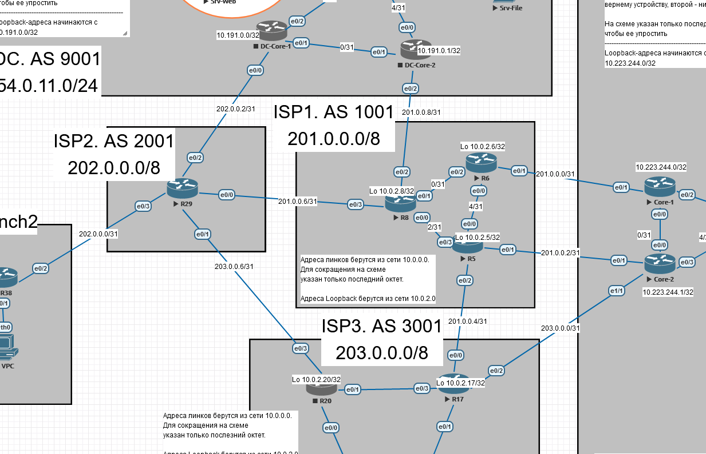

# Проектная работа

Целью проектной работы является создание сетевой инфраструктуры, состоящей из провайдерской сети и сетей удаленных офисов.

# Содержание

1. [Общая схема сети.](#net_whole)
   
   1. [Сеть из трех провайдеров.](#net_providers)
   2. [Сеть центрального офиса компании GrowWide.](#net_hq)
   3. [Сеть в дата-центре.](#net_dc)
   4. [Сеть небольшого регионального офиса без автономной системы.](#net_branch)
   5. [Сеть офиса контрагента с уже использующейся в остальной сети адресацией.](#net_partner)

2. [Реализация.](#realization)
   
   1. [Базовая настройка сети центрального офиса](#realization_base)
      1. [Планирование адресного пространства центрального офиса.](#realization_address_planning)
         1. [Исходные данные.](#realization_input)
         2. [Требования к масштабируемости.](#realization_scale_req)
         3. [Расчет подсетей.](#realization_net_calc)
         4. [Таблица адресов клиентских подсетей.](#realization_add_tables)
         5. [Результирующие правила адресации клиентских подсетей.](#realization_addr_result_client)
         6. [Выбор протокола динамической маршрутизации.](#realization_addr_dyn_routing)
         7. [Результирующие правила адресации линков между сетевыми устройствами.](#realization_addr_result_distr_access_link)
         8. [Таблица с адресами сетей конечных устройств, расположенных в лабораторной работе.](#realization_addr_result_summary)
      2. [Базовая настройка сетевых устройств.](#realization_base_config)
      3. [Настройка коммутаторов доступа.](#realization_acess_config)
      4. [Настройка динамической маршрутизации.](#realization_dynamic_config)
      5. [Настройка DHCP.](#realization_dhcp_hq)
      6. [Настройка NAT.](#realization_nat)
   2. [Настройка провайдерской сети.](#realization_providers)
      1. [Планирование адресного пространства.](#realization_prov_addr_plan)
      2. [Базовая настройка маршрутизаторов.](#realizatioin_isp_base_config)
      3. [Настройка IGP.](#realization_isp_igp)
      4. [Настройка BGP.](#realization_isp_bgp)
   3. [Базовая настройка сети в дата-центре.](#realization_dc_base)
      1. [Планирование адресного пространства.](#realization_dc_addr_plan)
      2. [Базовая настройка устройств.](#)
      3. [Настройка IGP-динамической маршрутизации](#)
      4. [Настройка EGP-динамической маршрутизации](#)
   4. [Настройка BGP в центральном офисе и дата-центре.](#)

# <a name="net_whole"></a>Общая схема сети

   Мы имеем 3 провайдера, основной офис, дата-центр и два небольших удаленных офиса. Общая схема следующая (переделать по завершении общей настройки):


Далее подробнее распишем каждый структурный участок.

## <a name="net_providers"></a>Сеть из 3 провайдеров


1. Каждый провайдер имеет свою автономную систему.

2. Внутри автономных систем находятся маршутизаторы, которые обеспечивают отказоустойчивость.

3. Для внутренней связи используется протокол динамической маршрутизации IS-IS.

## <a name="net_hq"></a>Сеть центрального офиса компании GrowWide


1. Компания владеет своей автономной системой. Автономная система будет только в дата-центре. Внешние адреса офиса принадлежат провайдеру.

2. Ядро сети подключено к провайдерам. Реализована отказоустойчивость.

3. К ядру сети подключены маршутизаторы распределения. Они находятся в стеке.

4. К маршрутизаторам распределения L3-коммутаторы доступа. На каждом этаже расположен стек из коммутаторов доступа. Стэк подключен через LAG к стеку коммутаторов распределения. В EVE-NG LAG L3 работает со сбоями, поэтому в работе использованы обычные линки.

5. В рамках сети действует протокол динамической машрутизации.

6. Site-to-site VPN.

7. VPN-шлюз Remote-Access VPN.

## <a name="net_dc"></a>Сеть в дата-центре


1. Подключение через двух провайдеров.

2. DMZ-сеть для серверов.

3. Site-to-Site VPN.

## <a name="net_branch"></a>Сеть небольшого регионального офиса без автономной системы


1. Выход через два линка. 
2. Site-to-Site VPN.

## <a name="net_partner"></a>Сеть офиса контрагента с уже использующейся в остальной сети адресацией


1. Реализация случая, когда нужно объединить в подсети с одинаковой адресацией.

2. Лучший вариант - адресацию поменять, но для работы реализуем такой экстренный сценарий.

3. Site-to-Site VPN. 

# <a name="realization"></a>Реализация

## <a name="realization_base"></a>Базовая настройка сети центрального офиса

### <a name="realization_address_planning"></a>Планирование адресного пространства центрального офиса

#### <a name="realization_input"></a>Исходные данные


- В работе максимально отойдем от использования L2.

- К каждому стеку доступа будет подключаться несколько сетей (отделов).

- На коммутаторе эти сети должны суммаризовываться, т.о. количество маршрутов в сети значительно снизится.

- Центральный офис занимает 10 этажей.

- На каждом этаже 100 рабочих мест.
  
  - Для подключения рабочих мест на этаже установлен стек из 3х коммутаторов доступа по 48 портов. На каждом коммутаторе 2 порта необходимы для связи друг с другом, останутся доступными 46 портов. Общее количество портов - 138. Еще два порта требуются для связи со стеком распределения. Для подключения конечных устройств доступно 136 портов.
  
  - Стэки доступа подключены к стеку распределения (состоит из 2 коммутаторов) на одном из этажей. Подключение выполнено двумя линками, объединенными в LAG. Т.о. в стеке распределения требуется 20 портов до стеков распределения, 2 порта для DHCP, 2 порта для подключения к ядру. Суммарно 24 порта. На отдельном коммутаторе в стеке распределения необходимо 12 портов, плюс один порт для объединения в стек. Т.е. стек распределения состоит из 2 комутаторов по 16 портов. 
  
  - Количество отделов 64. Под отделом понимаем более широкую сущность - не только отдел в кадровом понимании, но и в функциональном, например, сеть Wi-Wi, голосовой VLAN. Использовать термин подсеть было бы неправильно, т.к. один отдел будет использовать несколько подсетей, несуммаризируемых в одну.

- Для выдачи адресов используется DHCP-сервер на стеке распределения.

- Каждый стек доступа является шлюзом для подключенных к нему конечных устройств.

#### <a name="realization_scale_req"></a>Требования к масштабируемости.

1. Количество этажей может увеличиться в 2 раза - максимум 20. Поэтому количество портов в стеке распределения для подключения стека доступа равно 40. Плюс 4 порта на DHCP+Core. На отдельном коммутаторе в стеке распределения требуется 22 порта, плюс порт для организации стека. Таким образом для стека распределения запланируем 2 коммутатора на 28 портов. Коммутаторы будут установлены сразу.
2. Количество рабочих мест на этаже может увеличиться в 2 раза. Максимум - 200. Поэтому к имеющемуся стеку из 3x48 достаточно при необходимости добавить 1-2 коммутатора. Если необходимости нет, то в стеке достаточно трех коммутаторов.
3. Количество отделов может увеличиться в 2 раза. Максимум - 128.

#### <a name="realization_net_calc"></a>Расчет подсетей

- За каждым стеком доступа на этаже должны находиться свои сети, которые можно суммаризировать в одну.

- К каждому стеку доступа на этаже могут быть подключены клиенты разных отделов. Для каждого отдела должна быть выделена своя подсеть. Поэтому максимальное число подсетей за стеком равно 128.

- Каждый отдел может находится на разных этажах. Сеть отдела на одном этаже отличается от сети того же отдела на другом этаже. Это позволит формировать ACL на основе Wildcard mask для формирования правил доступа одного отдела к другому.

- В каждой подсети отдела, которая находится за стеком доступа, максимальное число возможных клиентов берется по максимальному числу рабочих мест на этаже. Это 200, округляем до 256. Такое число по некоторым рекомендациям является предельным для широковещательного домена. Однако это величина достигнута не будет, в крайнем случае такую сеть можно будет разбить на более мелкие. 
  
  - Пример. Есть отдел продаж, расположенный на нескольких этажах. Номер этого отдела в диапазоне от 1 до 128.
  
  - На каждом этаже выделена  сеть /24 под рабочие места этого отдела.
  
  - На каждом этаже число рабочих мест отдела около 50. Остальные адреса подсетией отдела окажутся незанятыми.
  
  - На одном этаже сосредоточено 200 сотрудников. Их рабочие места будут размещены в сети /24. При небходимости сеть на этом этаже можно разбить  на 4 сегмента. Тогда потребуется для этих сетей настраивать 4 SVI вместо одного SVI на стеке доступа. Также потребуется на DHCP-сервере создать вместо 1 пула адресов 4 пула. Тем не менее, суммарная сеть будет все равно закрепелна за одним отделом.

- Запланируем резервирование DHCP. Резервирование реализуется с помощью второго DHCP-сервера и непересекающимися диапазонами адресов. Поэтому сеть одного отдела будет состоять из 512 адресов. Адреса из первой половины будет выдавать первый сервер, второй половины - второй.

- Диаграмма для визулизации (описание ниже):


- К стеку распределения подклчается 20 стеков доступа. Для идентификации подсети за стеком необходимо 5 бит.

- Поскольку к стеку доступа может быть подключен любой отдел, то количество подключаемых сетей определяется количеством отделов. С учетом масштабирования у нас заложено 128 отделов. Т.о. чтобы идентифицировать каждую минимальную сеть за коммутатором, нам нужно 7 бит.

- В одной подсети отдела зарезервировано 512 адресов. Для идентификации адреса неоходимо 9 бит.

Переходим к формированию результата. 9 бит на хост + 7 бит на сеть отдела за одним стеком доступа + 5 бит на сеть за стеком доступа. Получаем 21 бит. Сеть с маской 32-21=11 бит полностью опишет клиентские подключения.

Сместим маску с 11 бит до 10 бит для запаса.

Также стоит обратить внимание на возможности оборудования для хранения маршрутной информации. На каждом этаже заложено 128 подсетей, для 20 этажей получаем 2560 маршрутов. Это для случая, когда суммаризация маршрутов выполняться не будет. При суммаризации число маршутов может быть значительно сокращено.

#### <a name="realization_add_tables"></a>Таблица адресов клиентских подсетей

Исходя из маски 10 бит выберем сеть 10.192.0.0/10. Она находится не в начале дипазона (будем надеяться, что при подключении "чужих" сетей это снизит вероятность совпадения адресов).

Приступаем к определению подсетей за стеками доступа. Под них выделено 20 подсетей с маской 16, начиная с 10.192.0.0. Диапазон 10.192.0.0-10.255.255.255.

|                              |                           |
| ---------------------------- | ------------------------- |
| Стек доступа на этаже 1      | 10.192.0.0-10.192.255.255 |
| Стек доступа на этаже 2      | 10.193.0.0-10.193.255.255 |
| Стек доступа на этаже 3      | 10.194.0.0-10.194.255.255 |
| Стек доступа на этаже 4      | 10.195.0.0-10.195.255.255 |
| Стек доступа на этаже 5      | 10.196.0.0-10.196.255.255 |
| Стек доступа на этаже 6      | 10.197.0.0-10.197.255.255 |
| Стек доступа на этаже 7      | 10.198.0.0-10.198.255.255 |
| Стек доступа на этаже 8      | 10.199.0.0-10.199.255.255 |
| Стек доступа на этаже 9      | 10.200.0.0-10.200.255.255 |
| Стек доступа на этаже 10     | 10.201.0.0-10.201.255.255 |
| Стек доступа на этаже 11     | 10.202.0.0-10.202.255.255 |
| Стек доступа на этаже 12     | 10.203.0.0-10.203.255.255 |
| Стек доступа на этаже 13     | 10.204.0.0-10.204.255.255 |
| Стек доступа на этаже 14     | 10.205.0.0-10.205.255.255 |
| Стек доступа на этаже 15     | 10.206.0.0-10.206.255.255 |
| Стек доступа на этаже 16     | 10.207.0.0-10.207.255.255 |
| Стек доступа на этаже 17     | 10.208.0.0-10.208.255.255 |
| Стек доступа на этаже 18     | 10.209.0.0-10.209.255.255 |
| Стек доступа на этаже 19     | 10.210.0.0-10.210.255.255 |
| Стек доступа на этаже 20     | 10.211.0.0-10.211.255.255 |
| Оставшиеся адреса в сети /11 | 10.212.0.0-10.223.255.255 |
| Оставшиеся адреса в сети /10 | 10.224.0.0-10.255.255.255 |

При расчете адресного пространства мы заложили 20 (этажей), поэтому все прочее адресное пространство, начиная с 21 этажа, свободно.

---

Рассмотрим адресацию на этаже 1. Мы запланировали 128 сетей с маской 23.

|           |                             |
| --------- | --------------------------- |
| Отдел 1   | 10.192.0.0-10.192.1.255     |
| Отдел 2   | 10.192.2.0-10.192.3.255     |
| Отдел 3   | 10.192.4.0-10.192.6.255     |
| Отдел 4   | 10.192.6.0-10.192.7.255     |
| Отдел 5   | 10.192.8.0-10.192.9.255     |
| Отдел 6   | 10.192.10.0-10.192.11.255   |
| Отдел 7   | 10.192.12.0-10.192.13.255   |
| Отдел 8   | 10.192.14.0-10.192.15.255   |
| Отдел 9   | 10.192.16.0-10.192.17.255   |
| Отдел 10  | 10.192.18.0-10.192.19.255   |
| Отдел 11  | 10.192.20.0-10.192.21.255   |
| Отдел 12  | 10.192.22.0-10.192.23.255   |
| Отдел 13  | 10.192.24.0-10.192.25.255   |
| Отдел 14  | 10.192.26.0-10.192.27.255   |
| Отдел 15  | 10.192.28.0-10.192.29.255   |
| Отдел 16  | 10.192.30.0-10.192.31.255   |
| Отдел 17  | 10.192.32.0-10.192.33.255   |
| Отдел 18  | 10.192.34.0-10.192.35.255   |
| Отдел 19  | 10.192.36.0-10.192.37.255   |
| Отдел 20  | 10.192.38.0-10.192.39.255   |
| Отдел 21  | 10.192.40.0-10.192.41.255   |
| Отдел 22  | 10.192.42.0-10.192.43.255   |
| Отдел 23  | 10.192.44.0-10.192.45.255   |
| Отдел 24  | 10.192.46.0-10.192.47.255   |
| Отдел 25  | 10.192.48.0-10.192.49.255   |
| Отдел 26  | 10.192.50.0-10.192.51.255   |
| Отдел 27  | 10.192.52.0-10.192.53.255   |
| Отдел 28  | 10.192.54.0-10.192.55.255   |
| …         | …                           |
| Отдел 121 | 10.192.240.0-10.192.241.255 |
| Отдел 122 | 10.192.242.0-10.192.243.255 |
| Отдел 123 | 10.192.244.0-10.192.245.255 |
| Отдел 124 | 10.192.246.0-10.192.247.255 |
| Отдел 125 | 10.192.248.0-10.192.249.255 |
| Отдел 126 | 10.192.250.0-10.192.251.255 |
| Отдел 127 | 10.192.252.0-10.192.253.255 |
| Отдел 128 | 10.192.254.0-10.192.255.255 |

Рассмотрим адресацию на этаже 6. Мы запланировали 128 сетей с маской 23.

|           |                             |
| --------- | --------------------------- |
| Отдел 1   | 10.197.0.0-10.197.1.255     |
| Отдел 2   | 10.197.2.0-10.197.3.255     |
| Отдел 3   | 10.197.4.0-10.197.6.255     |
| Отдел 4   | 10.197.6.0-10.197.7.255     |
| Отдел 5   | 10.197.8.0-10.197.9.255     |
| Отдел 6   | 10.197.10.0-10.197.11.255   |
| Отдел 7   | 10.197.12.0-10.197.13.255   |
| Отдел 8   | 10.197.14.0-10.197.15.255   |
| Отдел 9   | 10.197.16.0-10.197.17.255   |
| Отдел 10  | 10.197.18.0-10.197.19.255   |
| Отдел 11  | 10.197.20.0-10.197.21.255   |
| Отдел 12  | 10.197.22.0-10.197.23.255   |
| Отдел 13  | 10.197.24.0-10.197.25.255   |
| Отдел 14  | 10.197.26.0-10.197.27.255   |
| Отдел 15  | 10.197.28.0-10.197.29.255   |
| Отдел 16  | 10.197.30.0-10.197.31.255   |
| Отдел 17  | 10.197.32.0-10.197.33.255   |
| Отдел 18  | 10.197.34.0-10.197.35.255   |
| Отдел 19  | 10.197.36.0-10.197.37.255   |
| Отдел 20  | 10.197.38.0-10.197.39.255   |
| Отдел 21  | 10.197.40.0-10.197.41.255   |
| Отдел 22  | 10.197.42.0-10.197.43.255   |
| Отдел 23  | 10.197.44.0-10.197.45.255   |
| Отдел 24  | 10.197.46.0-10.197.47.255   |
| Отдел 25  | 10.197.48.0-10.197.49.255   |
| Отдел 26  | 10.197.50.0-10.197.51.255   |
| Отдел 27  | 10.197.52.0-10.197.53.255   |
| Отдел 28  | 10.197.54.0-10.197.55.255   |
| …         | …                           |
| Отдел 121 | 10.197.240.0-10.197.241.255 |
| Отдел 122 | 10.197.242.0-10.197.243.255 |
| Отдел 123 | 10.197.244.0-10.197.245.255 |
| Отдел 124 | 10.197.246.0-10.197.247.255 |
| Отдел 125 | 10.197.248.0-10.197.249.255 |
| Отдел 126 | 10.197.250.0-10.197.251.255 |
| Отдел 127 | 10.197.252.0-10.197.253.255 |
| Отдел 128 | 10.197.254.0-10.197.255.255 |

#### <a name="realization_addr_result_client"></a>Результирующие правила адресации клиентских подсетей

Сеть клиентских устройств за коммутаторами записывается следующим образом:

| Зафиксировано | Стек доступа         | Отдел   | Хост       |
| ------------- | -------------------- | ------- | ---------- |
| 00001010.110  | 00000              . | 0000000 | 0.00000000 |

Например, если мы захотим узнать суммарную сеть за 8 стеком доступа, то мы должны в адресе в поле стека доступа сформировать число 7. Получим:

| Зафиксировано | Стек доступа         | Отдел   | Хост       |
| ------------- | -------------------- | ------- | ---------- |
| 00001010.110  | 00111              . | 0000000 | 0.00000000 |

И далее, если мы хотим узнать адрес отдела 124, то мы должны в адресе в поле отдела сформировать число 123:

| Зафиксировано | Стек доступа         | Отдел   | Хост       |
| ------------- | -------------------- | ------- | ---------- |
| 00001010.110  | 00111              . | 1111011 | 0.00000000 |

В десятичном виде получаем 10.199.246.0. Адрес совпадает с тем, который должен быть - по составленной ранее таблице со стеками доступа видим, что суммарная подсеть за 8 стеком доступа 10.199.0.0-10.199.255.255. И по таблице с отделами видим, что 124 отдел .246.0-.247.255. 

Если мы захотим узнать суммарную сеть за 20 стеком доступа, то мы должны в адресе в поле стека доступа сформировать число 19. Получим:

| Зафиксировано | Стек доступа         | Отдел   | Хост       |
| ------------- | -------------------- | ------- | ---------- |
| 00001010.110  | 10011              . | 0000000 | 0.00000000 |

И далее, если мы хотим узнать адрес отдела 19, то мы должны в адресе в поле отдела сформировать число 18:

| Зафиксировано | Стек доступа         | Отдел   | Хост       |
| ------------- | -------------------- | ------- | ---------- |
| 00001010.110  | 10011              . | 0010010 | 0.00000000 |

В десятичном виде получаем 10.211.36.0. Адрес совпадает с тем, который должен быть - по составленной ранее таблице со стеками доступа видим, что суммарная подсеть за 20 стеком доступа 10.211.0.0-10.211.255.255. И по таблице с отделами видим, что 19 отдел .36.0-.37.255. Расчеты верны.

#### <a name="realization_addr_dyn_routing"></a> Выбор протокола динамической маршрутизации.

 

- Для упрощения запланируем использовать один и тот же протокол маршрутизации на всех площадках.

- Исходя из того, что мы планируем подключать VPN через GRE, то протокол IS-IS не подходит.

- Протокол OSPF для DMVPN не самое лучшее решение. В фазах 1 и 2 трафик идет через хаб, в фазе 3 нельзя суммаризировать маршруты для передачи спокам.

- BGP вполне подходит, но медленный.

- Поскольку VPN строится на DMVPN, то будем использовать EIGRP.

- Схема анонсов маршрутов следующая:


Пояснение, почему Distribution-Stack не будет настроен на суммаризацию маршрутов (на диаграмме полупрозрачным цветом все же указана потенциальная суммаризация). 

1. Для этого пойдем слева, с Core-1 и Core-2. Они будут анонсировать суммарный маршрут до сети 10.192.0.0/11. Мы зарезирвировали более обширную сеть 10.192.0.0/10 на будущее, но в данный момент используем именно 10.192.0.0/11. Из сети /11 мы выделили сети, которые закреплены за этажными стеками доступа. Таких сетей может быть 32, нам же необходимы 20. Поэтому остальные сети мы можем использовать по своему усмотрению, например для организации линков между устройствами, Loopback.

2. По этой причине стек распределения не может анонсировать эту суммарную сеть в сторону Core-1 и Core-2. Т.к. часть этой суммарной сети находится не за Distribution-Stack.

3. Однако в данной схеме маршрутизаторы Core будут иметь прямые линки с сетями, которые лежат "слева" от Distribution-Stack. Поэтому маршрутизация будет работать корректно, даже если Distribution-Stack начнет анонсировать суммарный маршрут. Главное, чтобы Core имели только прямые линки до сетей, находящихся "слева" от Distribution-Stack и не подключенных к нему.

4. Но так как число несуммаризированных сетей, которые будет анонсировать стек распределения, невелико (порядка количества этажей), то на стеке распределения суммировать особого смысла нет.

#### <a name="realization_addr_result_distr_access_link"></a>Результирующие правила адресации линков между сетевыми устройствами

Таким образом, для организации линков подходит сеть из пула 10.192.0.0/11, условный номер 32 - 10.223.0.0-10.223.255.255, а точнее, ее часть - 10.223.248.0-10.223.255.255. Этого пространства достаточно для организации 1024 линков.

Для Loopback зарезервируем сеть 10.223.244.0-10.223.247.255. Этого пространства достаточно для 1024 устройств.

Результат:


#### <a name="realization_addr_result_summary"></a>Таблица с адресами сетей конечных устройств, расположенных в лабораторной работе

В офисе 10 этажей, на каждом этаже по стеку распределения.  Отобразим лишь этажи 5, 6, 7.

Также будем подключать не все рабочие места и отделы. Ограничимся HR, бухгалтерией, Wi-Fi, серверами.

К Access-Stack-Floor-05 подключены:

- 2 компьютера HR в одной подсети.

- Один компьютер бухгалтерии в другой подсети.

К Access-Stack-Floor-06 подключены:

- Два компьютера HR в отдельной подсети.

- Один компьютер бухгалтерии в отдельной подсети.

- Wi-Fi точка в отдельной подсети. Для простоты на схеме представим ее компьютером, коммутировать Wi-Fi-клиентов он не будет, только получать доступ к сети.

К Access-Stack-Floor-07 подключены:

- Сервер печати в отдельной подсети.

- Wi-Fi точка в отдельной подсети. Для простоты на схеме представим ее компьютером, коммутировать Wi-Fi-клиентов он не будет, только получать доступ к сети.

Исходя из разработанной ранее методики сформируем адреса сетей, в которых будут устройства.

Для этого воспользуемся составленной ранее таблицей:

| Зафиксировано | Стек доступа         | Отдел   | Хост       |
| ------------- | -------------------- | ------- | ---------- |
| 00001010.110  | 00000              . | 0000000 | 0.00000000 |

Access-Stack-Floor-05: 00100

Access-Stack-Floor-06: 00101

Access-Stack-Floor-07: 00110

Отдел 23:  0010110

Отдел 36:  0100011

Отдел 65:  1000000

Отдел 100: 1100011

| Устройство                 | Зафиксировано | Стек доступа | Отдел   | Хостовая часть | Сеть /23 в десятичном виде |
| -------------------------- | ------------- | ------------ | ------- | -------------- | -------------------------- |
| Accounting-05-1 (Отдел 36) | 00001010.110  | 00100.       | 0100011 | 0.00000000     | 10.196.70.0                |
| HR-05-1 (Отдел 23)         | 00001010.110  | 00100.       | 0010110 | 0.00000000     | 10.196.44.0                |
| HR-05-2 (Отдел 23)         | 00001010.110  | 00100.       | 0010110 | 0.00000000     | 10.196.44.0                |
| HR-06-1 (Отдел 23)         | 00001010.110  | 00101.       | 0010110 | 0.00000000     | 10.197.44.0                |
| HR-06-2 (Отдел 23)         | 00001010.110  | 00101.       | 0010110 | 0.00000000     | 10.197.44.0                |
| Accounting-06-1 (Отдел 36) | 00001010.110  | 00101.       | 0100011 | 0.00000000     | 10.197.70.0                |
| Wi-Fi-06-1 (Отдел 65)      | 00001010.110  | 00101.       | 1000000 | 0.00000000     | 10.197.128.0               |
| Srv-Print-07-1 (Отдел 100) | 00001010.110  | 00110.       | 1100011 | 0.00000000     | 10.198.198.0               |
| Wi-Fi-07-1 (Отдел 65)      | 00001010.110  | 00110.       | 1000000 | 0.00000000     | 10.198.128.0               |

Договоримся первый доступный адрес сети назначать интерфейсу SVI стека.

Результат:


### <a name="realization_base_config"> Базовая настройка сетевых устройств

Адресация сети в центральном офисе выглядит следующим образом:


Приступим к настройке:

- зададим имена устройств,

- включим маршрутизацию,

- отключим на стеке доступа cef, иначе связь до конечных устройств не будет работать,

- назначим адреса интерфейсам.

Агрегацию линков делать на стенде не будем - для L3 интерфейсов наблюдаются баги - отключение коммутатора при получении пакета.

Access-Stack-Floor-05:

```
en
conf t
no ip domain-lookup
no ip cef
hostname Access-Stack-Floor-05
ip routing

int loopback 0
ip addr 10.223.244.7 255.255.255.255

int e0/0
no switchport
ip addr 10.223.248.14 255.255.255.254
no shut
end
wr
```

Access-Stack-Floor-06:

```
en
conf t
no ip domain-lookup
no ip cef
hostname Access-Stack-Floor-06
ip routing

int loopback 0
ip addr 10.223.244.8 255.255.255.255

int e0/0
no switchport
ip addr 10.223.248.17 255.255.255.254
no shut
end
wr
```

Access-Stack-Floor-07:

```
en
conf t
no ip domain-lookup
no ip cef
hostname Access-Stack-Floor-07
ip routing

int loopback 0
ip addr 10.223.244.9 255.255.255.255

int e0/0
no switchport
ip addr 10.223.248.19 255.255.255.254
no shut
end
wr
```

Distribution-Stack:

```
en
conf t
no ip domain-lookup
hostname Distribution-Stack
ip routing

int loopback 0
ip addr 10.223.244.2 255.255.255.255


int e0/0
no switchport
ip addr 10.223.248.3 255.255.255.254

int e0/1
no switchport
ip addr 10.223.248.4 255.255.255.254

int e0/2
no switchport
ip addr 10.223.248.18 255.255.255.254

int e0/3
no switchport
ip addr 10.223.248.15 255.255.255.254

int e1/0
no switchport
ip addr 10.223.248.16 255.255.255.254

int e1/1
no switchport
ip addr 10.223.248.47 255.255.255.254

int e1/2
no switchport
ip addr 10.223.248.48 255.255.255.254


end
wr
```

Core-1:

```
en
conf t
no ip domain-lookup
hostname Core-1

ip route 0.0.0.0 0.0.0.0 Ethernet 0/1 201.0.0.0 

int loopback 0
ip addr 10.223.244.0 255.255.255.255


int e0/2
ip addr 10.223.248.2 255.255.255.254
no shut

int e0/0
ip addr 10.223.248.0 255.255.255.254
no shut


int e0/1
ip addr 201.0.0.1 255.255.255.254
no shut

end 
wr
```

Core-2:

```
en
conf t
no ip domain-lookup
hostname Core-2

ip route 0.0.0.0 0.0.0.0 Ethernet 0/1 201.0.0.2 
ip route 0.0.0.0 0.0.0.0 Ethernet 1/1 203.0.0.1 


int loopback 0
ip addr 10.223.244.1 255.255.255.255


int e0/3
ip addr 10.223.248.5 255.255.255.254
no shut

int e0/0
ip addr 10.223.248.1 255.255.255.254
no shut

int e0/1
ip addr 201.0.0.3 255.255.255.254
no shut

int e1/1
ip addr 203.0.0.0 255.255.255.254
no shut

end 
wr
```

### <a name="realization_acess_config"> Настройка коммутаторов доступа

На коммутаторах доступа:

- создадим нужные VLAN:
  - VLAN для отделов,
  - Native VLAN,
  - Parking VLAN,
- создадим SVI,
- переведем клиентские порты в режим access, portfast, pbdu guard, отключаем DTP.

Номером SVI будем указывать отдел, который будет подключаться в соответствующий VLAN. Вспоминаем нумерацию отделов:

- HR - Отдел 23
- Accounting - Отдел 36
- Wi-Fi - Отдел 65
- Srv-Print - Отдел 100

Access-Stack-Floor-05:

```
en
conf t
vlan 23
name HR
exit
vlan 36
name Accounting
exit
vlan 65
name Wi-Fi
exit
vlan 100
name Srv-Print
exit
vlan 200
name Parking-Lot
exit
vlan 202
name Native-Vlan

spanning-tree portfast default
spanning-tree portfast bpduguard default 


int range e0/1-2
switchport
switchport mode access
switchport nonegotiate
switchport access vlan 23

int e1/1
switchport
switchport mode access
switchport nonegotiate
switchport access vlan 36

int range e0/3,e1/2,e1/3
switchport mode access
switchport nonegotiate
switchport access vlan 200
shutdown


int vlan 23
description HR
ip addr 10.196.44.1 255.255.254.0
no shut


int vlan 36
description Accounting
ip addr 10.196.70.1 255.255.254.0
no shut


end
wr
```

Access-Stack-Floor-06:

```
en
conf t
vlan 23
name HR
exit
vlan 36
name Accounting
exit
vlan 65
name Wi-Fi
exit
vlan 100
name Srv-Print
exit
vlan 200
name Parking-Lot
exit
vlan 202
name Native-Vlan

spanning-tree portfast default
spanning-tree portfast bpduguard default 


int range e0/1-2
switchport
switchport mode access
switchport nonegotiate
switchport access vlan 23

int e0/3
switchport
switchport mode access
switchport nonegotiate
switchport access vlan 65

int e1/0
switchport
switchport mode access
switchport nonegotiate
switchport access vlan 36


int range e0/0,e1/1,e1/2,e1/3
switchport mode access
switchport nonegotiate
switchport access vlan 200
shutdown


int vlan 23
description HR
ip addr 10.197.44.1 255.255.254.0
no shut

int vlan 36
description Accounting
ip addr 10.197.70.1 255.255.254.0
no shut


int vlan 65
description Wi-Fi
ip addr 10.197.128.1 255.255.254.0
no shut


end
wr
```

Access-Stack-Floor-07:

```
en
conf t
vlan 23
name HR
exit
vlan 36
name Accounting
exit
vlan 65
name Wi-Fi
exit
vlan 100
name Srv-Print
exit
vlan 200
name Parking-Lot
exit
vlan 202
name Native-Vlan

spanning-tree portfast default
spanning-tree portfast bpduguard default 


int e0/1
switchport
switchport mode access
switchport nonegotiate
switchport access vlan 100


int e0/2
switchport
switchport mode access
switchport nonegotiate
switchport access vlan 65


int range e0/3,e1/0,e1/1,e1/2,e1/3
switchport mode access
switchport nonegotiate
switchport access vlan 200
shutdown


int vlan 100
description Srv-Print
ip addr 10.198.198.1 255.255.254.0
no shut


int vlan 65
description Wi-Fi
ip addr 10.198.128.1 255.255.254.0
no shut


end
wr
```

### <a name="realization_dynamic_config"> Настройка динамической маршрутизации

Для динамической маршрутизации выбран EIGRP. Протокол хорошо работает в связке с DMVPN. На устройствах выполним следующее:

1. Разрешим установление соседства только на определенных интерфейсах.

2. Протокол включим на интерфейсах до сетевых устройств и Loopback-интерфейсах.

3. На стеках доступа включим протокол на паре (достаточно и одного) SVI, а на интерфейсе в сторону стека распределения выполним суммаризацию до сети /16. 

Core-1:

```
en
conf t
router eigrp NAMED
address-family ipv4 unicast autonomous-system 1
eigrp router-id 10.223.244.0
af-interface default
passive-interface
exit-af-interface

af-interface ethernet 0/0
no passive-interface
exit-af-interface

af-interface ethernet 0/2
no passive-interface
exit-af-interface

network 10.223.244.0 0.0.0.0
network 10.223.248.0 0.0.0.1
network 10.223.248.2 0.0.0.1

end
wr
```

Core-2:

```
en
conf t
router eigrp NAMED
address-family ipv4 unicast autonomous-system 1
eigrp router-id 10.223.244.1
af-interface default
passive-interface
exit-af-interface

af-interface ethernet 0/0
no passive-interface
exit-af-interface

af-interface ethernet 0/3
no passive-interface
exit-af-interface

network 10.223.244.1 0.0.0.0
network 10.223.248.0 0.0.0.1
network 10.223.248.4 0.0.0.1

end
wr
```

Distribution-Stack:

```
en
conf t
router eigrp NAMED
address-family ipv4 unicast autonomous-system 1
eigrp router-id 10.223.244.2
af-interface default
passive-interface
exit-af-interface

af-interface ethernet 0/0
no passive-interface
exit-af-interface

af-interface ethernet 0/1
no passive-interface
exit-af-interface

af-interface ethernet 0/2
no passive-interface
exit-af-interface

af-interface ethernet 0/3
no passive-interface
exit-af-interface

af-interface ethernet 1/0
no passive-interface
exit-af-interface

af-interface ethernet 1/1
no passive-interface
exit-af-interface

af-interface ethernet 1/2
no passive-interface
exit-af-interface

network 10.223.244.2 0.0.0.0
network 10.223.248.2 0.0.0.1
network 10.223.248.4 0.0.0.1

network 10.223.248.14 0.0.0.1
network 10.223.248.16 0.0.0.1
network 10.223.248.18 0.0.0.1
network 10.223.248.46 0.0.0.1
network 10.223.248.48 0.0.0.1

end
wr
```

Access-Stack-Floor-05:

```
en
conf t
router eigrp NAMED
address-family ipv4 unicast autonomous-system 1
eigrp router-id 10.223.244.7
af-interface default
passive-interface
exit-af-interface

af-interface ethernet 0/0
no passive-interface
summary-address 10.196.0.0/16
exit-af-interface

network 10.223.244.7 0.0.0.0
network 10.223.248.14 0.0.0.1
network 10.196.70.0 0.0.1.255
network 10.196.44.0 0.0.1.255

end
wr
```

Access-Stack-Floor-06:

```
en
conf t
router eigrp NAMED
address-family ipv4 unicast autonomous-system 1
eigrp router-id 10.223.244.8
af-interface default
passive-interface
exit-af-interface

af-interface ethernet 0/0
no passive-interface
summary-address 10.197.0.0/16
exit-af-interface

network 10.223.244.8 0.0.0.0
network 10.223.248.16 0.0.0.1
no network 10.196.70.0 0.0.1.255
network 10.197.70.0 0.0.1.255
network 10.197.128.0 0.0.1.255

end
wr
```

Access-Stack-Floor-07:

```
en
conf t
router eigrp NAMED
address-family ipv4 unicast autonomous-system 1
eigrp router-id 10.223.244.9
af-interface default
passive-interface
exit-af-interface

af-interface ethernet 0/0
no passive-interface
summary-address 10.198.0.0/16
exit-af-interface

network 10.223.244.9 0.0.0.0
network 10.223.248.18 0.0.0.1
network 10.198.198.0 0.0.1.255
network 10.198.128.0 0.0.1.255

end
wr
```

Просмотрим маршруты:



Маршруты приходят - и в ядро, и к стекам доступа. Маршруты все - до Loopback, до сетей линков, до сетей за стеками доступа.

Настроим передачу default. На коммутаторах ядра default прописан вручную. Делаем анонс маршрута через EIGRP.

Core-1:

```
en
conf t
router eigrp NAMED
address-family ipv4 unicast autonomous-system 1
topology base
redistribute static
default-information out

end
wr
```

Core-2:

```
en
conf t
router eigrp NAMED
address-family ipv4 unicast autonomous-system 1
topology base
redistribute static
default-information out

end
wr
```

Маршрут по умолчанию приходит:


Core-1 получает и маршрут по умолчанию от Core-2 по EIGRP, также и наоборот Core-2 получает маршрут по умолчанию от Core-1. Но эти маршруты не попадают в таблицу маршрутизации, т.к. перебиваются статическими записями. 

------

### <a name="realiztoin_dhcp_hq"> Настройка DHCP

DHCP-серверы расположены на отдельных маршрутизаторах для наглядной настройки на стенде и проверки правильной работы протокола. DHCP-серверы можно расположить на отдельных серверах (Windows/Linux), либо на стеке распределения (возможно, идея не самая лучшая). Каждый сервер настроен на выдачу 254(DHCP-1)/255(DHCP-2) адресов из пула. Настройки на них одинаковые, за исключением диапазонов выдаваемых адресов.
Отобразим необходимые пулы и исключаемые адреса:

<style>
</style>

|              |               |              |                                           |                                           |
| ------------ | ------------- | ------------ | ----------------------------------------- | ----------------------------------------- |
| Сеть         | Маска         | Шлюз         | Исключаемые адреса DHCP-1                 | Исключаемые адреса DHCP-2                 |
| 10.196.44.0  | 255.255.254.0 | 10.196.44.1  | 10.196.44.1; 10.196.45.0 10.196.45.255    | 10.196.44.1; 10.196.44.0 10.196.44.255    |
| 10.196.70.0  | 255.255.254.0 | 10.196.70.1  | 10.196.70.1; 10.196.71.0 10.196.71.255    | 10.196.70.1; 10.196.70.0 10.196.70.255    |
| 10.197.44.0  | 255.255.254.0 | 10.197.44.1  | 10.197.44.1; 10.197.45.0 10.197.45.255    | 10.197.44.1; 10.197.44.0 10.197.44.255    |
| 10.197.70.0  | 255.255.254.0 | 10.197.70.1  | 10.197.70.1; 10.197.71.0 10.197.71.255    | 10.197.70.1; 10.197.70.0 10.197.70.255    |
| 10.197.128.0 | 255.255.254.0 | 10.197.128.1 | 10.197.128.1; 10.197.129.0 10.197.129.255 | 10.197.128.1; 10.197.128.0 10.197.128.255 |
| 10.198.128.0 | 255.255.254.0 | 10.198.128.1 | 10.198.128.1; 10.198.129.0 10.198.129.255 | 10.198.128.1; 10.198.128.0 10.198.128.255 |
| 10.198.198.0 | 255.255.254.0 | 10.198.198.1 | 10.198.198.1; 10.198.199.0 10.198.199.255 | 10.198.198.1; 10.198.198.0 10.198.198.255 |

DHCP-1:

```
en
conf t
hostname DHCP-1

int e0/0
ip addr 10.223.248.46 255.255.255.254
no shut

int loopback 0
ip addr 10.223.244.23 255.255.255.255


router eigrp NAMED
address-family ipv4 unicast autonomous-system 1
eigrp router-id 10.223.244.23
af-interface default
passive-interface
exit-af-interface

af-interface ethernet 0/0
no passive-interface
exit-af-interface

network 10.223.244.23 0.0.0.0
network 10.223.248.46 0.0.0.1


ip dhcp excluded-address  10.196.44.1
ip dhcp excluded-address  10.196.45.0 10.196.45.255
ip dhcp excluded-address  10.196.70.1
ip dhcp excluded-address  10.196.71.0 10.196.71.255
ip dhcp excluded-address  10.197.44.1
ip dhcp excluded-address  10.197.45.0 10.197.45.255
ip dhcp excluded-address  10.197.70.1
ip dhcp excluded-address  10.197.71.0 10.197.71.255
ip dhcp excluded-address  10.197.128.1
ip dhcp excluded-address  10.197.129.0 10.197.129.255
ip dhcp excluded-address  10.198.128.1
ip dhcp excluded-address  10.198.129.0 10.198.129.255
ip dhcp excluded-address  10.198.198.1
ip dhcp excluded-address  10.198.199.0 10.198.199.255


ip dhcp pool Floor_5_HR
network 10.196.44.0 255.255.254.0
default-router 10.196.44.1

ip dhcp pool Floor_5_Accounting
network 10.196.70.0 255.255.254.0
default-router 10.196.70.1

ip dhcp pool Floor_6_HR
network 10.197.44.0 255.255.254.0
default-router 10.197.44.1

ip dhcp pool Floor_6_Accounting
network 10.197.70.0 255.255.254.0
default-router 10.197.70.1

ip dhcp pool Floor_6_Wi_Fi
network 10.197.128.0 255.255.254.0
default-router 10.197.128.1


ip dhcp pool Floor_7_Wi_Fi
network 10.198.128.0 255.255.254.0
default-router 10.198.128.1

ip dhcp pool Floor_7_Srv_Print
network 10.198.198.0 255.255.254.0
default-router 10.198.198.1


end
wr
```

DHCP-2:

```
en
conf t
hostname DHCP-2

int loopback 0
ip addr 10.223.244.24 255.255.255.255

int e0/0
ip addr 10.223.248.49 255.255.255.254
no shut


router eigrp NAMED
address-family ipv4 unicast autonomous-system 1
eigrp router-id 10.223.244.24
af-interface default
passive-interface
exit-af-interface

af-interface ethernet 0/0
no passive-interface
exit-af-interface

network 10.223.244.24 0.0.0.0
network 10.223.248.48 0.0.0.1


ip dhcp excluded-address  10.196.44.1
ip dhcp excluded-address  10.196.44.0 10.196.44.255
ip dhcp excluded-address  10.196.70.1
ip dhcp excluded-address  10.196.70.0 10.196.70.255
ip dhcp excluded-address  10.197.44.1
ip dhcp excluded-address  10.197.44.0 10.197.44.255
ip dhcp excluded-address  10.197.70.1
ip dhcp excluded-address  10.197.70.0 10.197.70.255
ip dhcp excluded-address  10.197.128.1
ip dhcp excluded-address  10.197.128.0 10.197.128.255
ip dhcp excluded-address  10.198.128.1
ip dhcp excluded-address  10.198.128.0 10.198.128.255
ip dhcp excluded-address  10.198.198.1
ip dhcp excluded-address  10.198.198.0 10.198.198.255

ip dhcp pool Floor_5_HR
network 10.196.44.0 255.255.254.0
default-router 10.196.44.1

ip dhcp pool Floor_5_Accounting
network 10.196.70.0 255.255.254.0
default-router 10.196.70.1

ip dhcp pool Floor_6_HR
network 10.197.44.0 255.255.254.0
default-router 10.197.44.1

ip dhcp pool Floor_6_Accounting
network 10.197.70.0 255.255.254.0
default-router 10.197.70.1

ip dhcp pool Floor_6_Wi_Fi
network 10.197.128.0 255.255.254.0
default-router 10.197.128.1


ip dhcp pool Floor_7_Wi_Fi
network 10.198.128.0 255.255.254.0
default-router 10.198.128.1

ip dhcp pool Floor_7_Srv_Print
network 10.198.198.0 255.255.254.0
default-router 10.198.198.1


end
wr
```

На стеках доступа укажем адреса серверов DHCP. Адреса указываем с Loopback-интерфейсов.

Access-Stack-Floor-05:

```
en
conf t
int vlan 36
ip helper-address 10.223.244.23
ip helper-address 10.223.244.24

int vlan 23
ip helper-address 10.223.244.23
ip helper-address 10.223.244.24


end
wr
```

Access-Stack-Floor-06:

```
en
conf t
int vlan 36
ip helper-address 10.223.244.23
ip helper-address 10.223.244.24

int vlan 23
ip helper-address 10.223.244.23
ip helper-address 10.223.244.24

int vlan 65
ip helper-address 10.223.244.23
ip helper-address 10.223.244.24


end
wr
```

Access-Stack-Floor-07:

```
en
conf t
int vlan 65
ip helper-address 10.223.244.23
ip helper-address 10.223.244.24

int vlan 100
ip helper-address 10.223.244.23
ip helper-address 10.223.244.24


end
wr
```

Проверяем:


В работе адреса для Srv-Print выдаются по DHCP. В реальности так делать не стоит. Но для демонстрации, что в каждой подключенной подсети настроена работа DHCP, вполне подходит. Компьютер на пятом этаже получает адрес, может связаться с ядром и сервером печати. Причем адреса получены от DHCP-2.

Отключим DHCP-2 и запросим адреса заново, затем включим обратно и отключим DHCP-1:



Видим, что шлюзы остались прежними, адреса сместились в область, которая выдается другим DHCP-сервером.

### <a name="realiztoin_dhcp_hq"> Настройка NAT


NAT необходимо настроить на Core-1 и Core-2. На маршрутизаторах с двумя линками до провайдера для организации NAT требуется использовать Route Map. Для унификации настройки такой же способ настройки будем использовать и на маршрутизаторах с одним линком до провайдера.

Отключим Core-2 на время настройки Core-1.

Core01:

```
en
conf t
ip access-list standard ACL_NAT
permit 10.0.0.0 0.255.255.255


route-map RM_NAT_ISP1 permit 10
match ip address ACL_NAT
match interface e0/1
exit


int range e0/0, e0/2
ip nat inside

int e0/1
ip nat outside


ip nat inside source route-map RM_NAT_ISP1 interface e0/1 overload

end
wr
```


Связь до дата-центра есть.

Аналогично выключаем Core-1, включаем Core-2 и выполняем его настройку.

Core-2:

```
en
conf t
ip access-list standard ACL_NAT
permit 10.0.0.0 0.255.255.255


route-map RM_NAT_ISP1 permit 10
match ip address ACL_NAT
match interface e0/1
exit

route-map RM_NAT_ISP2 permit 10
match ip address ACL_NAT
match interface e1/1
exit


int range e0/0, e0/3
ip nat inside

int range e0/1, e1/1
ip nat outside


ip nat inside source route-map RM_NAT_ISP1 interface e0/1 overload
ip nat inside source route-map RM_NAT_ISP2 interface e1/1 overload

end
wr
```


Связь с компьютеров центрального офиса до дата-центра есть. Причем работает балансировка - 4й хоп меняется.

Включим оба пограничных маршрутизатора и проверим, как идут пакет от компьютеров в Интернет:


Видим из третьего хопа, что отрабатывает балансировка на Distribution-Stack и пакет направляется либо к Core-1, либо к Core-2. Из 4го хопа видим, что пакет в зависимости от балансировки уходит по одному из трех провайдерских линков. Балансировка работает.

### <a name="realization_base_config"> Реализация SLA

При текущей настройке если падает линк провайдера, то маршрутизатор все равно видит линк и оставляет маршрут по умолчанию:


Возможно, это особенность виртуализации. Но в любом случае, с линком может быть все в порядке, но проблемы со связью будут далее по маршруту. Поэтому нужно настроить SLA и icmp-запросы до узлов Интернета.


Core-1 будет проверять доступность узлов R29 и DC-Core-1:


Core-1:

```
en
conf t
ip sla 1
 icmp-echo 201.0.0.6 source-interface Ethernet0/1
 frequency 10
ip sla schedule 1 life forever start-time now
ip sla 2
 icmp-echo 202.0.0.2 source-interface Ethernet0/1
 frequency 10
ip sla schedule 2 life forever start-time now

track 1 ip sla 1 reachability
track 2 ip sla 2 reachability
track 3 list boolean or
 object 1
 object 2

no ip route 0.0.0.0 0.0.0.0 Ethernet0/1 201.0.0.0
ip route 0.0.0.0 0.0.0.0 Ethernet0/1 201.0.0.0 track 3


end
wr
```


Отключим R29:


Результат отслеживания на Core-1:


Один track в состоянии Down, но т.к. второй в состоянии Up, итоговый track в состоянии Up и статический маршрут занесен в таблицу маршрутизации.


Гасим DC-Core-1:


В результате все track в состоянии Down, маршрут удален из таблицы маршрутизации:


При этом если включить Core-2, то Core-1 будет знать выход в Интернет. Но при этом соседи не выберут его дефолтом, т.к. есть более короткий путь через Core-2:

 


Включаем R29 и DC-Core-1 - треки поднялись, сосед Distribution-Stack стал помещать в таблицу маршрутизации оба Core: 


Аналогичным образом настроим Core-2. У него потребуется отслеживать четыре узла для проверки двух провайдерских линков:


Core-2:

```
en
conf t
ip sla 1
 icmp-echo 201.0.0.8 source-interface Ethernet0/1
 frequency 10
ip sla schedule 1 life forever start-time now

ip sla 2
 icmp-echo 201.0.0.7 source-interface Ethernet0/1
 frequency 10
ip sla schedule 2 life forever start-time now

track 1 ip sla 1 reachability
track 2 ip sla 2 reachability
track 3 list boolean or
 object 1
 object 2


ip sla 4
 icmp-echo 202.0.0.2 source-interface Ethernet1/1
 frequency 10
ip sla schedule 4 life forever start-time now

ip sla 5
 icmp-echo 203.0.0.7 source-interface Ethernet1/1
 frequency 10
ip sla schedule 5 life forever start-time now

track 4 ip sla 4 reachability
track 5 ip sla 5 reachability
track 6 list boolean or
 object 4
 object 5


no ip route 0.0.0.0 0.0.0.0 Ethernet0/1 201.0.0.2
ip route 0.0.0.0 0.0.0.0 Ethernet0/1 201.0.0.2 track 3

no ip route 0.0.0.0 0.0.0.0 Ethernet1/1 203.0.0.1
ip route 0.0.0.0 0.0.0.0 Ethernet1/1 203.0.0.1 track 6


end
wr
```


Гасим из 4 узлов три:



В состоянии UP остался один Track 3:


Остался один шлюз через E0/1:


Distribution-Stack знает 2 пути по умолчанию:


Гасим последний узел:


На Core-2 все track в состоянии Down, маршрута по умолчанию нет:


Core-1 должен сообщать маршрут по умолчанию. Этого не происходит, т.к. и Core-1 не может успешно получить пакеты от удаленных узлов. Мы пришли к ситуации, когда все маршруты по умолчанию в сторону Интернет оказались выброшены из таблицы маршрутизации. Как следствие, все track не могут перейти из состояния Down в Up, маршруты автоматически не вернутся в таблицу. Выходы из ситуации:

1. Добавить еще один линк простой-дешевый, который никогда не будет удаляться через ip sla и имеющий AD 209. Была выполнена проверка на стенде, здесь подробности не приводятся для сокращения объема. Проблемы такого решения:
   
   1. При удалении основного маршрута останется резервный, через который пойдет весь трафик. Это не очень хорошо.
   
   2. Через резервный маршрут трек перейдет в состояни UP, появится основной маршрут в таблице маршрутизации. Но через основной маршрут тестовые узлы по-прежнему недоступны, маршрут будет выброшен снова.

2. Оставить один из основных линков до провайдера без отслеживания. Чревато те, что трафик будет направляться в строну провайдера, у которого проблемы, и пропадать в черной дыре.

3. Рассматривать ситуацию, когда все маршруты 0.0.0.0 будут выкинуты из таблицы маршрутизации, как крайне маловероятную. Малая вероятность достигается за счет большого количества тестовых узлов и также за счет их высокой доступности.

4. Добавлять временно маршрут без трека, чтобы через него проверить связь до тестовых узлов и вернуть маршруты в таблицу маршрутизации. После этого удалить неотслеживаемый маршрут. Решение плохо, т.к. требует участия человека.


Выполним третий вариант и уберем отслеживани одного из маршрутов. Core-2:

```
en
conf t

no track 4
no track 5
no track 6
no ip sla 4
no ip sla 5

no ip route 0.0.0.0 0.0.0.0 Ethernet1/1 203.0.0.1 track 6
ip route 0.0.0.0 0.0.0.0 Ethernet1/1 203.0.0.1

end
wr
```

Выключим узлы, до которых проверяется связь:


Видим, что остался один маршрут в Интернет через Core-2. Этот маршрут передан соседям, у них сохранилась связь с Интернетом.


Включим узлы, до которых проверяется связь:


Вернулись все маршруты. Что и требовалось.


## <a name="realization_providers"></a>Настройка провайдерской сети

### <a name="realization_prov_addr_plan"></a>Планирование адресного пространства


- Для организации линков между маршрутизаторами одного провайдера используются сети, начиная с 10.0.0.0/31.
- Для Loopback-интерфейсов - сети, начиная с 10.0.2.0/32.
- Адреса интерфесов, которыми соединены разные автономные зоны и офисы, берутся из пула провайдера, имеют маску 31 бит.
  - Пул ISP1 201.0.0.0/8
  - Пул ISP2 202.0.0.0/8
  - Пул ISP3 203.0.0.0/8  
- Первый адрес из подсети /31 назначается вернему маршрутизатору, второй -нижнему.

### <a name="realizatioin_isp_base_config"></a>Базовая настройка маршрутизаторов

Выполним базовую настройку маршрутизаторов - зададим имя устройства и адреса интерфейсов, включим порты.

**Начнем с ISP1.**

R5:

```
en
conf t
hostname R5
no ip domain-lookup
int loopback 0
ip addr 10.0.2.5 255.255.255.255


int e0/0
ip addr 10.0.0.5 255.255.255.254
no shut

int e0/1
ip addr 201.0.0.2 255.255.255.254
no shut

int e0/2
ip addr 201.0.0.4 255.255.255.254
no shut

int e0/3
ip addr 10.0.0.3 255.255.255.254
no shut

end
wr
```

R6:

```
en
conf t
hostname R6
no ip domain-lookup
int loopback 0
ip addr 10.0.2.6 255.255.255.255


int e0/0
ip addr 10.0.0.4 255.255.255.254
no shut

int e0/1
ip addr 201.0.0.0 255.255.255.254
no shut

int e0/2
ip addr 10.0.0.0 255.255.255.254
no shut


end
wr
```

R8:

```
en
conf t
hostname R8
no ip domain-lookup
int loopback 0
ip addr 10.0.2.8 255.255.255.255


int e0/0
ip addr 10.0.0.2 255.255.255.254
no shut


int e0/1
ip addr 10.0.0.1 255.255.255.254
no shut

int e0/2
ip addr 201.0.0.9 255.255.255.254
no shut

int e0/3
ip addr 201.0.0.7 255.255.255.254
no shut

end
wr
```

**ISP2**

R29:

```
en
conf t
hostname R29
no ip domain-lookup
int loopback 0
ip addr 10.0.2.29 255.255.255.255


int e0/0
ip addr 201.0.0.6 255.255.255.254
no shut

int e0/1
ip addr 203.0.0.6 255.255.255.254
no shut

int e0/2
ip addr 202.0.0.3 255.255.255.254
no shut

int e0/3
ip addr 202.0.0.0 255.255.255.254
no shut


end
wr
```

**ISP3**

R17:

```
en
conf t
hostname R17
no ip domain-lookup
int loopback 0
ip addr 10.0.2.17 255.255.255.255


int e0/0
ip addr 201.0.0.5 255.255.255.254
no shut

int e0/1
ip addr 203.0.0.2 255.255.255.254
no shut

int e0/2
ip addr 203.0.0.1 255.255.255.254
no shut

int e0/3
ip addr 10.0.0.0 255.255.255.254
no shut


end
wr
```

R20:

```
en
conf t
hostname R20
no ip domain-lookup
int loopback 0
ip addr 10.0.2.20 255.255.255.255


int e0/0
ip addr 203.0.0.4 255.255.255.254
no shut


int e0/1
ip addr 10.0.0.1 255.255.255.254
no shut

int e0/3
ip addr 203.0.0.7 255.255.255.254
no shut


end
wr
```

### <a name="realization_isp_igp"></a>Настройка IGP

В качестве протокола внутренней динамической маршрутизации выберем протокол IS-IS. Каждый маршрутизатор находится в своей зоне, взаимодействие только L2.

**ISP1**

R5:

```
en
conf t
router isis
net 49.5555.0005.0005.0005.00
is-type level-2-only
exit
int range e0/0,e0/3, loopback 0
ip router isis
end
wr
```

R6:

```
en
conf t
router isis
net 49.6666.0006.0006.0006.00
is-type level-2-only
exit
int range e0/0,e0/2, loopback 0
ip router isis
end
wr
```

R8:

```
en
conf t
router isis
net 49.8888.0008.0008.0008.00
is-type level-2-only
exit
int range e0/0,e0/1, loopback 0
ip router isis
end
wr
```

Пример результата:


Получены маршруты до внутренних сетей и лупбэков.

**ISP3**

R17:

```
en
conf t
router isis
net 49.1717.1717.1717.1717.00
is-type level-2-only
exit
int range e0/3, loopback 0
ip router isis
end
wr
```

R20:

```
en
conf t
router isis
net 49.2020.2020.2020.2020.00
is-type level-2-only
exit
int range e0/1, loopback 0
ip router isis
end
wr
```

Результат:


Получен маршрут до loopback соседа.

### <a name="realization_isp_bgp"></a>Настройка BGP

Выполним настройку eBGP и iBGP в провайдерских сетях.

**ISP1**

R5:

```
en
conf t

router bgp 1001
bgp router-id 5.5.5.5


neighbor PG_iBGP peer-group
neighbor PG_iBGP remote-as 1001
neighbor PG_iBGP next-hop-self
neighbor PG_iBGP update-source loopback 0


neighbor 10.0.2.6 peer-group PG_iBGP
neighbor 10.0.2.8 peer-group PG_iBGP


neighbor 201.0.0.5 remote-as 3001
neighbor 201.0.0.3 remote-as 9001


network 201.0.0.4 mask 255.255.255.254
network 201.0.0.2 mask 255.255.255.254

end
wr
```

R6:

```
en
conf t

router bgp 1001
bgp router-id 6.6.6.6


neighbor PG_iBGP peer-group
neighbor PG_iBGP remote-as 1001
neighbor PG_iBGP next-hop-self
neighbor PG_iBGP update-source loopback 0


neighbor 10.0.2.5 peer-group PG_iBGP
neighbor 10.0.2.8 peer-group PG_iBGP


neighbor 201.0.0.1 remote-as 9001


network 201.0.0.0 mask 255.255.255.254

end
wr
```

R8:

```
en
conf t

router bgp 1001
bgp router-id 8.8.8.8


neighbor PG_iBGP peer-group
neighbor PG_iBGP remote-as 1001
neighbor PG_iBGP next-hop-self
neighbor PG_iBGP update-source loopback 0


neighbor 10.0.2.5 peer-group PG_iBGP
neighbor 10.0.2.6 peer-group PG_iBGP


neighbor 201.0.0.8 remote-as 8001
neighbor 201.0.0.6 remote-as 2001


network 201.0.0.8 mask 255.255.255.254
network 201.0.0.6 mask 255.255.255.254

end
wr
```

**ISP2**

R29:

```
en
conf t

router bgp 2001
bgp router-id 29.29.29.29


neighbor 202.0.0.2 remote-as 8001
neighbor 201.0.0.7 remote-as 1001
neighbor 203.0.0.7 remote-as 3001

network 202.0.0.0 mask 255.255.255.254
network 203.0.0.6 mask 255.255.255.254
network 201.0.0.6 mask 255.255.255.254
network 202.0.0.2 mask 255.255.255.254

end
wr
```

**ISP3**

R17:

```
en
conf t

router bgp 3001
bgp router-id 17.17.17.17


neighbor PG_iBGP peer-group
neighbor PG_iBGP remote-as 3001
neighbor PG_iBGP next-hop-self
neighbor PG_iBGP update-source loopback 0


neighbor 10.0.2.20 peer-group PG_iBGP

neighbor 201.0.0.4 remote-as 1001
neighbor 203.0.0.0 remote-as 9001


network 201.0.0.4 mask 255.255.255.254
network 203.0.0.0 mask 255.255.255.254
network 203.0.0.2 mask 255.255.255.254

end
wr
```

R20:

```
en
conf t

router bgp 3001
bgp router-id 20.20.20.20


neighbor PG_iBGP peer-group
neighbor PG_iBGP remote-as 3001
neighbor PG_iBGP next-hop-self
neighbor PG_iBGP update-source loopback 0


neighbor 10.0.2.17 peer-group PG_iBGP

neighbor 203.0.0.6 remote-as 2001

network 203.0.0.4 mask 255.255.255.254
network 203.0.0.6 mask 255.255.255.254

end
wr
```

Проверяем маршруты:


Маршруты приходят.

## <a name="realization_dc_base"></a>Базовая настройка сети в дата-центре

### <a name="realization_dc_addr_plan"></a>Планирование адресного пространства


- В дата-центре расположены серверы, к которым необходим доступ из сети Интернет - Srv-Mail, Sev-Web.
- В дата-центре расположены серверы, к которым необходим доступ только из внутренней сетей - Srv-File, Srv-Voice.
- Белые адреса принадлежат автономной системе 9001, они представлены сетью 55.0.11.0/24.

К серверам возможно реализовать два варианта доступа:

- Назначить каждому серверу белый IP и выполнять маршрутизацию. Но тогда в каждой подсети нужно занять один белый адрес для роли шлюза.
- Назначить каждому серверу серый IP, и при входе в автономную систему пакета до сервера менять адрес назначения с белого на серый.
  - Настраивать придется каждый пограничный маршрутизатор - и R14, и R15.
  - При обращении к серверу из серой сети пакет пойдет сперва на пограничный маршрутизатор, там произойдет трансляция адреса назначения, пакет направится к серверу.
    - Во-первых - получим скорее всего более длинный путь.
    - Во-вторых - сервер ответит клиенту из внутренней сети пакетом с адресом назначения в серой сети и пошлет пакет, минуя маршрутизатор, на котором была трансляция. Такой пакет может быть отброшен правилом на клиенте. Решение - для клиентов из внутренней сети должен быть внутренний DNS-сервер, где прописаны внутренние адреса серверов.

Будем реализовывать второй вариант  - статическую трансляцию.

Для адресов основного офиса используется диапазон 10.192.0.0-10.255.255.255. Для адресации в дата-центре будем использовать диапазон 10.184.0.0-10.191.255.255. Это сеть 10.184.0.0/13. Из этого адресного пространства выделим следующие диапазоны:

1. Адресация линков сетевых устройств: 10.191.128.0 - 10.191.255.255. Это сеть 10.191.128/17. При разбиении на сети /31 доступно 16384 сети.

2. Loopback: 10.191.0.0 - 10.191.127.255. Это сеть 10.191.0/17. При разбиении на сети /32 доступно 32768 адресов.

3. Адресация серверов 10.184.0.0-10.187.255.255. Это сеть 10.184.0.0/14.
   
   1. LAN  10.184.0.0-10.185.255.255. Это сеть 10.184.0.0/15. При разбиении на сети /30 доступно 32768 сети. В работе будем разбивать на сети по /24, будет доступно 512 сетей по 256 хостов.
   
   2. DMZ - 10.186.0.0-10.187.255.255. Это сеть 10.186.0.0/15. При разбиении на сети /30 доступно 32768 сети. В работе будем разбивать на сети по /24, будет доступно 512 сетей по 256 хостов.

### 

### <a name="realization_dc_conf_base"></a>Базовая настройка сетевых устройств

Выполним базовую настройку сетевых устройств. 

DC-Distr-1. Настроим адресацию, DHCP-сервер:

```
en
conf t
no ip domain-lookup
no ip cef
hostname DC-Distr-1
ip routing

int loopback 0
ip addr 10.191.0.2 255.255.255.255

int e0/0
no switchport
ip addr 10.191.128.4 255.255.255.254
no shut

int e0/2
no switchport
ip addr 10.191.128.2 255.255.255.254
no shut

int e0/1
no switchport
ip addr 10.186.1.1 255.255.255.0
no shut

int e0/3
no switchport
ip addr 10.186.0.1 255.255.255.0
no shut

int e1/0
no switchport
ip addr 10.184.0.1 255.255.255.0
no shut

int e1/1
no switchport
ip addr 10.184.1.1 255.255.255.0
no shut

exit


ip dhcp excluded-address 10.186.0.1
ip dhcp excluded-address 10.186.1.1
ip dhcp excluded-address 10.184.0.1
ip dhcp excluded-address 10.184.1.1

ip dhcp pool Pool_Mail
network 10.186.0.0 255.255.255.0
default-router 10.186.0.1


ip dhcp pool Pool_Web
network 10.186.1.0 255.255.255.0
default-router 10.186.1.1


ip dhcp pool Pool_Voice
network 10.184.0.0 255.255.255.0
default-router 10.184.0.1


ip dhcp pool Pool_File
network 10.184.1.0 255.255.255.0
default-router 10.184.1.1


end
wr
```

В реальности серверам лучше назначать статические адреса, для работы будем выдавать их по DHCP.

DC-Core-1. Настроим адресацию:

```int
en
conf t
no ip domain-lookup
hostname DC-Core-1
ip routing

int loopback 0
ip addr 10.191.0.0 255.255.255.255

int e0/0
ip addr 202.0.0.2 255.255.255.254
no shut


int e0/1
ip addr 10.191.128.0 255.255.255.254
no shut

int e0/2
ip addr 10.191.128.3 255.255.255.254
no shut

end

wr
```

DC-Core-2. Настроим адресацию:

```int
en
conf t
no ip domain-lookup
hostname DC-Core-2
ip routing

int loopback 0
ip addr 10.191.0.1 255.255.255.255

int e0/2
ip addr 201.0.0.8 255.255.255.254
no shut


int e0/1
ip addr 10.191.128.1 255.255.255.254
no shut

int e0/0
ip addr 10.191.128.5 255.255.255.254
no shut

end

wr
```

### <a name="realization_dc_conf_dynamic"></a>Настройка IGP-динамической маршрутизации

В качестве протокола динамической маршрутизации выбран EIGRP.

DC-Distr-1:

```
en
conf t
router eigrp NAMED
address-family ipv4 unicast autonomous-system 1
af-interface default
passive-interface
exit-af-interface


af-interface e0/0
no passive-interface
exit-af-interface


af-interface e0/2
no passive-interface
exit-af-interface


network 10.191.0.2 0.0.0.0
network 10.184.0.0 0.0.255.255
network 10.186.0.0 0.0.255.255
network 10.191.128.2 0.0.0.1
network 10.191.128.4 0.0.0.1


end
wr
```

DC-Core-1:

```
en
conf t
router eigrp NAMED
address-family ipv4 unicast autonomous-system 1
af-interface default
passive-interface
exit-af-interface


af-interface e0/1
no passive-interface
exit-af-interface


af-interface e0/2
no passive-interface
exit-af-interface


network 10.191.0.0 0.0.0.0
network 10.191.128.2 0.0.0.1
network 10.191.128.0 0.0.0.1


end
wr
```

DC-Core-2:

```
en
conf t
router eigrp NAMED
address-family ipv4 unicast autonomous-system 1
af-interface default
passive-interface
exit-af-interface


af-interface e0/1
no passive-interface
exit-af-interface


af-interface e0/0
no passive-interface
exit-af-interface


network 10.191.0.1 0.0.0.0
network 10.191.128.4 0.0.0.1
network 10.191.128.0 0.0.0.1


end
wr
```

Маршруты приходят:


Выполним на DC-Distr-1 суммаризацию маршрутов до серверов. Суммарная сеть 10.184.0.0/14.

DC-Distr-1:

```
en
conf t
router eigrp NAMED
address-family ipv4 unicast autonomous-system 1
af-interface default
passive-interface
exit-af-interface


af-interface e0/0
no passive-interface
summary-address 10.184.0.0 255.252.0.0
exit-af-interface


af-interface e0/2
no passive-interface
summary-address 10.184.0.0 255.252.0.0

end
wr
```

Маршруты суммаризованы:


### <a name="realization_dc_conf_dynamic"></a>Настройка EGP-динамической маршрутизации


Динамическую маршрутизацию BGP настроим на DC-Core-1/2. Обязательно нужно настроить и iBGP, чтобы сосед по автономной системе знал маршрут выхода в Интернет в случае падения линка до своего провайдера.

DC-Core-1:

```
en
conf t
ip route 54.0.11.0 255.255.255.0 Null0
router bgp 9001
neighbor 202.0.0.3 remote-as 2001
neighbor 202.0.0.3 
neighbor 10.191.0.1 remote-as 9001
neighbor 10.191.0.1 update-source lo 0
neighbor 10.191.0.1 next-hop-self


network 54.0.11.0 mask 255.255.255.0
network 202.0.0.2 mask 255.255.255.254


end
wr
```

DC-Core-2:

```
en
conf t
ip route 54.0.11.0 255.255.255.0 Null0
router bgp 9001
neighbor 201.0.0.9 remote-as 1001
neighbor 201.0.0.9 update-source E0/2
neighbor 10.191.0.0 remote-as 9001
neighbor 10.191.0.0 update-source lo 0
neighbor 10.191.0.0 next-hop-self


network 54.0.11.0 mask 255.255.255.0
network 201.0.0.8 mask 255.255.255.254

end
wr
```

R29:

```
en
conf t
router bgp 2001
neighbor 202.0.0.2 remote-as 9001

end
wr
```

R8:

```
en
conf t
router bgp 1001
neighbor 201.0.0.8 remote-as 9001
neighbor 201.0.0.8

end
wr
```

Проверяем связь от дата-центра до центрального офиса:


Связь есть.
